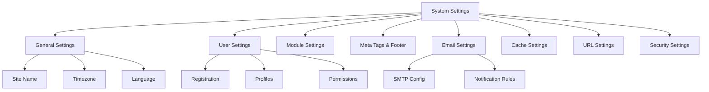

# XOOPS Nastavení systému

Tato příručka pokrývá kompletní nastavení systému dostupná na panelu správce XOOPS, uspořádané podle kategorií.

## Architektura nastavení systému



## Přístup k nastavení systému

### Umístění

**Panel správce > Systém > Předvolby**

Nebo přejděte přímo:

```
http://your-domain.com/xoops/admin/index.php?fct=preferences
```

### Požadavky na oprávnění

- Pouze správci (webmasteři) mají přístup k nastavení systému
- Změny ovlivňují celý web
- Většina změn se projeví okamžitě

## Obecná nastavení

Základní konfigurace pro vaši instalaci XOOPS.

### Základní informace

```
Site Name: [Your Site Name]
Default Description: [Brief description of your site]
Site Slogan: [Catchy slogan]
Admin Email: admin@your-domain.com
Webmaster Name: Administrator Name
Webmaster Email: admin@your-domain.com
```

### Nastavení vzhledu

```
Default Theme: [Select theme]
Default Language: English (or preferred language)
Items Per Page: 15 (typically 10-25)
Words in Snippet: 25 (for search results)
Theme Upload Permission: Disabled (security)
```

### Místní nastavení

```
Default Timezone: [Your timezone]
Date Format: %Y-%m-%d (YYYY-MM-DD format)
Time Format: %H:%M:%S (HH:MM:SS format)
Daylight Saving Time: [Auto/Manual/None]
```

**Tabulka formátu časového pásma:**

| Region | Časové pásmo | UTC Offset |
|---|---|---|
| Východ USA | America/New_York | -5 / -4 |
| Střed USA | America/Chicago | -6 / -5 |
| US Mountain | America/Denver | -7 / -6 |
| Tichomoří USA | America/Los_Angeles | -8 / -7 |
| UK/London | Europe/London | 0 / +1 |
| France/Germany | Europe/Paris | +1 / +2 |
| Japonsko | Asia/Tokyo | +9 |
| Čína | Asia/Shanghai | +8 |
| Australia/Sydney | Australia/Sydney | +10 / +11 |

### Konfigurace vyhledávání

```
Enable Search: Yes
Search Admin Pages: Yes/No
Search Archives: Yes
Default Search Type: All / Pages only
Words Excluded from Search: [Comma-separated list]
```

**Obvyklá vyloučená slova:** the, a, an, and, or, but, in, on, at, by, to, from

## Uživatelská nastavení

Kontrolujte chování uživatelského účtu a proces registrace.

### Registrace uživatele

```
Allow User Registration: Yes/No
Registration Type:
  ☐ Auto-activate (Instant access)
  ☐ Admin approval (Admin must approve)
  ☐ Email verification (User must verify email)

Notification to Users: Yes/No
User Email Verification: Required/Optional
```

### Konfigurace nového uživatele

```
Auto-login New Users: Yes/No
Assign Default User Group: Yes
Default User Group: [Select group]
Create User Avatar: Yes/No
Initial User Avatar: [Select default]
```

### Nastavení uživatelského profilu

```
Allow User Profiles: Yes
Show Member List: Yes
Show User Statistics: Yes
Show Last Online Time: Yes
Allow User Avatar: Yes
Avatar Max File Size: 100KB
Avatar Dimensions: 100x100 pixels
```

### Nastavení uživatelského e-mailu

```
Allow Users to Hide Email: Yes
Show Email on Profile: Yes
Notification Email Interval: Immediately/Daily/Weekly/Never
```

### Sledování aktivity uživatele

```
Track User Activity: Yes
Log User Logins: Yes
Log Failed Logins: Yes
Track IP Address: Yes
Clear Activity Logs Older Than: 90 days
```

### Limity účtu

```
Allow Duplicate Email: No
Minimum Username Length: 3 characters
Maximum Username Length: 15 characters
Minimum Password Length: 6 characters
Require Special Characters: Yes
Require Numbers: Yes
Password Expiration: 90 days (or Never)
Accounts Inactive Days to Delete: 365 days
```

## Nastavení modulu

Nakonfigurujte chování jednotlivých modulů.

### Společné možnosti modulu

Pro každý nainstalovaný modul můžete nastavit:

```
Module Status: Active/Inactive
Display in Menu: Yes/No
Module Weight: [1-999](higher = lower in display)
Homepage Default: This module shows when visiting /
Admin Access: [Allowed user groups]
User Access: [Allowed user groups]
```

### Nastavení systémového modulu

```
Show Homepage as: Portal / Module / Static Page
Default Homepage Module: [Select module]
Show Footer Menu: Yes
Footer Color: [Color selector]
Show System Stats: Yes
Show Memory Usage: Yes
```

### Konfigurace na modul

Každý modul může mít nastavení specifická pro modul:

**Příklad – modul stránky:**
```
Enable Comments: Yes/No
Moderate Comments: Yes/No
Comments Per Page: 10
Enable Ratings: Yes
Allow Anonymous Ratings: Yes
```

**Příklad – Uživatelský modul:**
```
Avatar Upload Folder: ./uploads/
Maximum Upload Size: 100KB
Allow File Upload: Yes
Allowed File Types: jpg, gif, png
```

Přístup k nastavení specifickým pro modul:
- **Správce > Moduly > [Název modulu] > Předvolby**

## Meta tagy a nastavení SEO

Nakonfigurujte meta tagy pro optimalizaci pro vyhledávače.

### Globální meta tagy

```
Meta Keywords: xoops, cms, content management system
Meta Description: A powerful content management system for building dynamic websites
Meta Author: Your Name
Meta Copyright: Copyright 2025, Your Company
Meta Robots: index, follow
Meta Revisit: 30 days
```

### Doporučené postupy pro metaznačky

| Štítek | Účel | Doporučení |
|---|---|---|
| Klíčová slova | Hledané výrazy | 5–10 relevantních klíčových slov, oddělených čárkami |
| Popis | Hledat výpis | 150–160 znaků |
| Autor | Tvůrce stránky | Vaše jméno nebo společnost |
| Copyright | Právní | Vaše upozornění na autorská práva |
| Roboti | Pokyny pro procházení | index, sledovat (povolit indexování) |

### Nastavení zápatí

```
Show Footer: Yes
Footer Color: Dark/Light
Footer Background: [Color code]
Footer Text: [HTML allowed]
Additional Footer Links: [URL and text pairs]
```

**Ukázka zápatí HTML:**
```html
<p>Copyright &copy; 2025 Your Company. All rights reserved.</p>
<p><a href="/privacy">Privacy Policy</a> | <a href="/terms">Terms of Use</a></p>
```

### Sociální metaznačky (otevřený graf)

```
Enable Open Graph: Yes
Facebook App ID: [App ID]
Twitter Card Type: summary / summary_large_image / player
Default Share Image: [Image URL]
```

## Nastavení e-mailu

Nakonfigurujte doručování e-mailů a systém upozornění.

### Způsob doručení e-mailu

```
Use SMTP: Yes/No

If SMTP:
  SMTP Host: smtp.gmail.com
  SMTP Port: 587 (TLS) or 465 (SSL)
  SMTP Security: TLS / SSL / None
  SMTP Username: [email@example.com]
  SMTP Password: [password]
  SMTP Authentication: Yes/No
  SMTP Timeout: 10 seconds

If PHP mail():
  Sendmail Path: /usr/sbin/sendmail -t -i
```

### Konfigurace e-mailu

```
From Address: noreply@your-domain.com
From Name: Your Site Name
Reply-To Address: support@your-domain.com
BCC Admin Emails: Yes/No
```

### Nastavení oznámení

```
Send Welcome Email: Yes/No
Welcome Email Subject: Welcome to [Site Name]
Welcome Email Body: [Custom message]

Send Password Reset Email: Yes/No
Include Random Password: Yes/No
Token Expiration: 24 hours
```

### Upozornění pro administrátory

```
Notify Admin on Registration: Yes
Notify Admin on Comments: Yes
Notify Admin on Submissions: Yes
Notify Admin on Errors: Yes
```

### Upozornění pro uživatele

```
Notify User on Registration: Yes
Notify User on Comments: Yes
Notify User on Private Messages: Yes
Allow Users to Disable Notifications: Yes
Default Notification Frequency: Immediately
```

### Šablony e-mailů

Přizpůsobte e-maily s upozorněním v panelu administrátora:

**Cesta:** Systém > Šablony e-mailu

Dostupné šablony:
- Registrace uživatele
- Resetování hesla
- Upozornění na komentáře
- Soukromá zpráva
- Systémová upozornění
- E-maily specifické pro modul

## Nastavení mezipaměti

Optimalizujte výkon pomocí mezipaměti.

### Konfigurace mezipaměti

```
Enable Caching: Yes/No
Cache Type:
  ☐ File Cache
  ☐ APCu (Alternative PHP Cache)
  ☐ Memcache (Distributed caching)
  ☐ Redis (Advanced caching)

Cache Lifetime: 3600 seconds (1 hour)
```

### Možnosti mezipaměti podle typu

**Souborová mezipaměť:**
```
Cache Directory: /var/www/html/xoops/cache/
Clear Interval: Daily
Maximum Cache Files: 1000
```

**APCu Cache:**
```
Memory Allocation: 128MB
Fragmentation Level: Low
```

**Memcache/Redis:**
```
Server Host: localhost
Server Port: 11211 (Memcache) / 6379 (Redis)
Persistent Connection: Yes
```

### Co se ukládá do mezipaměti

```
Cache Module Lists: Yes
Cache Configuration Data: Yes
Cache Template Data: Yes
Cache User Session Data: Yes
Cache Search Results: Yes
Cache Database Queries: Yes
Cache RSS Feeds: Yes
Cache Images: Yes
```

## Nastavení URL

Nakonfigurujte přepisování a formátování URL.

### Přátelské nastavení URL

```
Enable Friendly URLs: Yes/No
Friendly URL Type:
  ☐ Path Info: /page/about
  ☐ Query String: /index.php?p=about

Trailing Slash: Include / Omit
URL Case: Lower case / Case sensitive
```

### Pravidla přepisu URL

```
.htaccess Rules: [Display current]
Nginx Rules: [Display current if Nginx]
IIS Rules: [Display current if IIS]
```

## Nastavení zabezpečení

Řízení konfigurace související se zabezpečením.

### Zabezpečení heslem

```
Password Policy:
  ☐ Require uppercase letters
  ☐ Require lowercase letters
  ☐ Require numbers
  ☐ Require special characters

Minimum Password Length: 8 characters
Password Expiration: 90 days
Password History: Remember last 5 passwords
Force Password Change: On next login
```

### Zabezpečení přihlášení

```
Lock Account After Failed Attempts: 5 attempts
Lock Duration: 15 minutes
Log All Login Attempts: Yes
Log Failed Logins: Yes
Admin Login Alert: Send email on admin login
Two-Factor Authentication: Disabled/Enabled
```

### Zabezpečení nahrávání souborů

```
Allow File Uploads: Yes/No
Maximum File Size: 128MB
Allowed File Types: jpg, gif, png, pdf, zip, doc, docx
Scan Uploads for Malware: Yes (if available)
Quarantine Suspicious Files: Yes
```

### Zabezpečení relace

```
Session Management: Database/Files
Session Timeout: 1800 seconds (30 min)
Session Cookie Lifetime: 0 (until browser closes)
Secure Cookie: Yes (HTTPS only)
HTTP Only Cookie: Yes (prevent JavaScript access)
```

### Nastavení CORS

```
Allow Cross-Origin Requests: No
Allowed Origins: [List domains]
Allow Credentials: No
Allowed Methods: GET, POST
```

## Pokročilá nastavení

Další možnosti konfigurace pro pokročilé uživatele.

### Režim ladění

```
Debug Mode: Disabled/Enabled
Log Level: Error / Warning / Info / Debug
Debug Log File: /var/log/xoops_debug.log
Display Errors: Disabled (production)
```

### Ladění výkonu

```
Optimize Database Queries: Yes
Use Query Cache: Yes
Compress Output: Yes
Minify CSS/JavaScript: Yes
Lazy Load Images: Yes
```

### Nastavení obsahu

```
Allow HTML in Posts: Yes/No
Allowed HTML Tags: [Configure]
Strip Harmful Code: Yes
Allow Embed: Yes/No
Content Moderation: Automatic/Manual
Spam Detection: Yes
```

## Nastavení Export/Import

### Nastavení zálohování

Exportovat aktuální nastavení:

**Panel správce > Systém > Nástroje > Exportovat nastavení**

```bash
# Settings exported as JSON file
# Download and store securely
```

### Obnovit nastavení

Importovat dříve exportovaná nastavení:**Panel správce > Systém > Nástroje > Nastavení importu**

```bash
# Upload JSON file
# Verify changes before confirming
```

## Hierarchie konfigurace

Hierarchie nastavení XOOPS (shora dolů – první zápas vyhrává):

```
1. mainfile.php (Constants)
2. Module-specific config
3. Admin System Settings
4. Theme configuration
5. User preferences (for user-specific settings)
```

## Zálohovací skript nastavení

Vytvořte zálohu aktuálního nastavení:

```php
<?php
// Backup script: /var/www/html/xoops/backup-settings.php
require_once __DIR__ . '/mainfile.php';

$config_handler = xoops_getHandler('config');
$configs = $config_handler->getConfigs();

$backup = [
    'exported_date' => date('Y-m-d H:i:s'),
    'xoops_version' => XOOPS_VERSION,
    'php_version' => PHP_VERSION,
    'settings' => []
];

foreach ($configs as $config) {
    $backup['settings'][$config->getVar('conf_name')] = [
        'value' => $config->getVar('conf_value'),
        'description' => $config->getVar('conf_desc'),
        'type' => $config->getVar('conf_type'),
    ];
}

// Save to JSON file
file_put_contents(
    '/backups/xoops_settings_' . date('YmdHis') . '.json',
    json_encode($backup, JSON_PRETTY_PRINT)
);

echo "Settings backed up successfully!";
?>
```

## Společné změny nastavení

### Změňte název webu

1. Správce > Systém > Předvolby > Obecná nastavení
2. Upravte "Název webu"
3. Klikněte na "Uložit"

### Registrace Enable/Disable

1. Správce > Systém > Předvolby > Uživatelská nastavení
2. Přepněte „Povolit registraci uživatele“
3. Vyberte typ registrace
4. Klikněte na "Uložit"

### Změnit výchozí motiv

1. Správce > Systém > Předvolby > Obecná nastavení
2. Vyberte „Výchozí motiv“
3. Klikněte na "Uložit"
4. Aby se změny projevily, vymažte mezipaměť

### Aktualizujte kontaktní e-mail

1. Správce > Systém > Předvolby > Obecná nastavení
2. Upravte "E-mail správce"
3. Upravte "E-mail správce webu"
4. Klikněte na "Uložit"

## Kontrolní seznam pro ověření

Po konfiguraci nastavení systému ověřte:

- [ ] Název webu se zobrazuje správně
- [ ] Časové pásmo zobrazuje správný čas
- [ ] E-mailová upozornění se odesílají správně
- [ ] Registrace uživatele funguje podle konfigurace
- [ ] Domovská stránka zobrazuje vybrané výchozí nastavení
- [ ] Funkce vyhledávání funguje
- [ ] Mezipaměť zkracuje dobu načítání stránky
- [ ] Přátelské adresy URL fungují (pokud jsou povoleny)
- [ ] Meta tagy se zobrazují ve zdroji stránky
- [ ] Přijata oznámení správce
- [ ] Nastavení zabezpečení vynuceno

## Nastavení odstraňování problémů

### Nastavení se neukládají

**Řešení:**
```bash
# Check file permissions on config directory
chmod 755 /var/www/html/xoops/var/

# Verify database writable
# Try saving again in admin panel
```

### Změny se neprojeví

**Řešení:**
```bash
# Clear cache
rm -rf /var/www/html/xoops/cache/*
rm -rf /var/www/html/xoops/templates_c/*

# If still not working, restart web server
systemctl restart apache2
```

### E-mail se neodesílá

**Řešení:**
1. Ověřte přihlašovací údaje SMTP v nastavení e-mailu
2. Otestujte pomocí tlačítka „Odeslat zkušební e-mail“.
3. Zkontrolujte protokoly chyb
4. Zkuste místo SMTP použít PHP mail()

## Další kroky

Po konfiguraci nastavení systému:

1. Nakonfigurujte nastavení zabezpečení
2. Optimalizujte výkon
3. Prozkoumejte funkce panelu administrátora
4. Nastavte správu uživatelů

---

**Značky:** #system-settings #configuration #preferences #admin-panel

**Související články:**
- ../../06-Publisher-Module/User-Guide/Basic-Configuration
- Konfigurace zabezpečení
- Optimalizace výkonu
- ../First-Steps/Admin-Panel-Overview