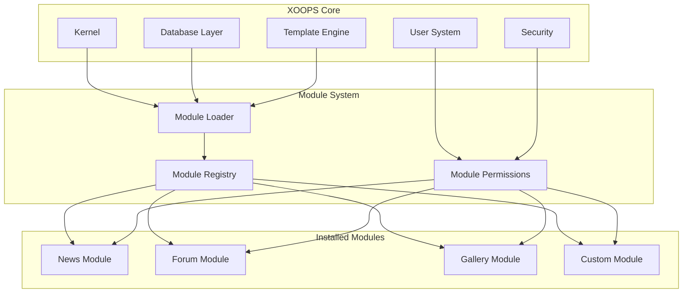
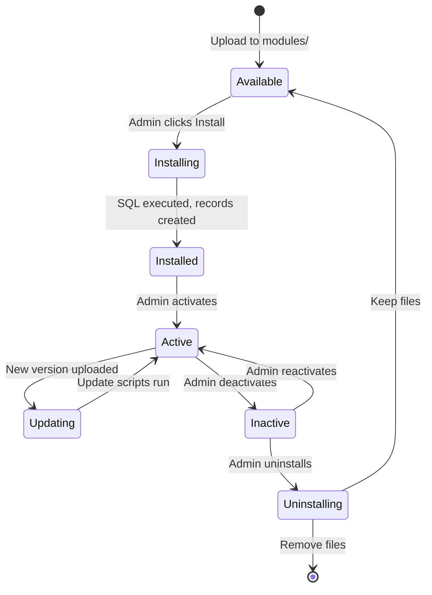

# ADR-001: Modulární architektura

> Architecture Decision Record pro základní filozofii modulárního designu XOOPS.

---

## Stav

**Přijato** – Základní rozhodnutí od počátku XOOPS

---

## Souvislosti

XOOPS (eXtensible Object-Oriented Portal System) potřeboval architekturu, která by:

1. Umožněte vývojářům třetích stran rozšířit funkčnost
2. Umožněte správcům webu přizpůsobit bez kódování
3. Podporujte nezávislý vývoj a aktualizace
4. Poskytněte izolaci mezi různými funkcemi
5. Škálujte od jednoduchých blogů po složité portály

Krajina CMS z počátku 21. století nabízela monolitické systémy, které bylo obtížné přizpůsobit a rozšířit.

---

## Diagram rozhodnutí



---

## Rozhodnutí

Implementujeme **modulární architekturu**, kde:

### 1. Jádro poskytuje infrastrukturu
- Abstrakce databáze
- Autentizace a oprávnění uživatele
- Vykreslování šablony (Smarty)
- Bezpečnostní nástroje
- Generování formuláře
- Společné inženýrské sítě

### 2. Moduly jsou samostatné
Každý modul:
- Má vlastní adresářovou strukturu
- Obsahuje vlastní třídy, šablony, SQL
- Definuje vlastní konfiguraci
- Může být installed/uninstalled nezávisle
- Má sledování verzí

### 3. Standardní struktura modulu
```
modules/modulename/
├── admin/                  # Admin interface
│   ├── index.php
│   └── menu.php
├── class/                  # PHP classes
├── include/                # Include files
├── language/               # Translations
├── sql/                    # Database schema
├── templates/              # Smarty templates
├── blocks/                 # Block definitions
├── xoops_version.php       # Module manifest
├── index.php               # Entry point
└── header.php              # Module bootstrap
```

### 4. Manifest modulu (xoops_version.php)
```php
<?php
$modversion['name']        = 'Module Name';
$modversion['version']     = '1.0.0';
$modversion['description'] = 'Module description';
$modversion['dirname']     = basename(__DIR__);
$modversion['hasMain']     = 1;
$modversion['hasAdmin']    = 1;
$modversion['sqlfile']['mysql'] = 'sql/mysql.sql';
$modversion['tables']      = ['modulename_table1'];
$modversion['templates']   = [...];
$modversion['config']      = [...];
$modversion['blocks']      = [...];
```

### 5. Komunikace modulu
- Prostřednictvím základních API (handlery, události)
- Databázové vztahy
- Předpětí háčků
- Sdílené služby

---

## Životní cyklus modulu



---

## Následky

### Pozitivní

1. **Rozšiřitelnost**: Tisíce modulů vytvořených komunitou
2. **Nezávislost**: Moduly lze vyvíjet samostatně
3. **Flexibilita**: Stránky mohou kombinovat funkce
4. **Udržovatelnost**: Aktualizace neovlivňují ostatní moduly
5. **Tržiště**: Vznikl modulový ekosystém
6. **Křivka učení**: Vývojáři se naučí jeden vzor

### Negativní

1. **Režie**: Každý modul má zaváděcí cenu
2. **Duplikace**: Běžný kód se může opakovat
3. **Integrace**: Funkce napříč moduly vyžadují pečlivý návrh
4. **Verze**: Potřebná správa kompatibility modulů
5. **Rozdíl v kvalitě**: Kvalita modulů třetích stran se liší

### Neutrální

1. **Databáze**: Každý modul spravuje své vlastní tabulky
2. **Šablony**: Téma musí obsahovat různé moduly
3. **Aktualizace**: Jádro a moduly se aktualizují nezávisle

---

## Zvažovány alternativy

### 1. Monolitická architektura
**Zamítnuto** - Příliš tuhé, obtížně přizpůsobitelné

### 2. Architektura pluginů (ve stylu WordPress)
**Částečně přijato** – Bloky a předběžné načtení poskytují v modulech háčky podobné pluginům

### 3. Architektura komponent (styl Joomla)
**Zamítnuto** – Složitější, méně přívětivé pro vývojáře

### 4. Mikroslužby
**Nelze použít** – Příliš složité pro éru sdíleného hostování

---

## Související rozhodnutí

- ADR-002: Objektově orientovaný přístup k databázi
- ADR-003: Smarty šablonový modul
- ADR-005: Systém oprávnění

---

## Reference

- Historie projektu XOOPS
- Vzory aplikační architektury PHP
- Srovnávací studie CMS (2001-2005)

---

#xoops #architecture #adr #modules #design-decision