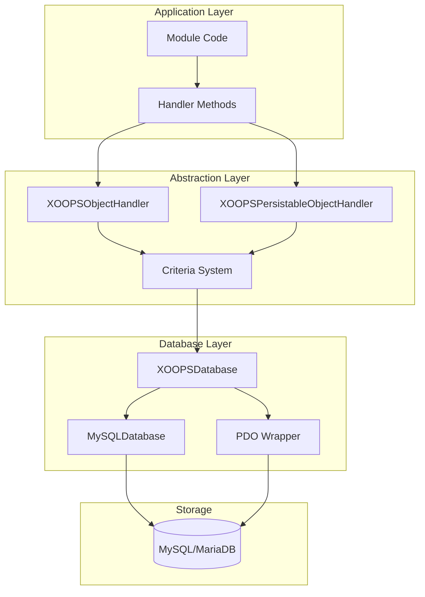
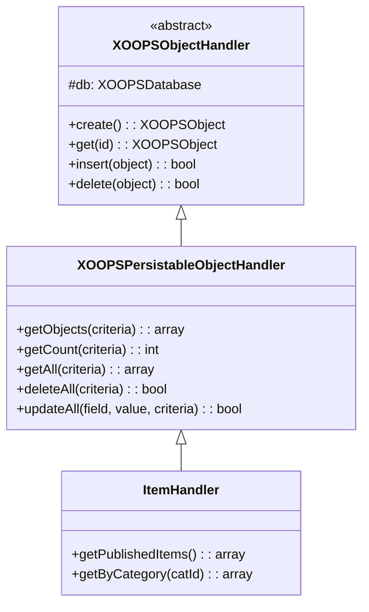
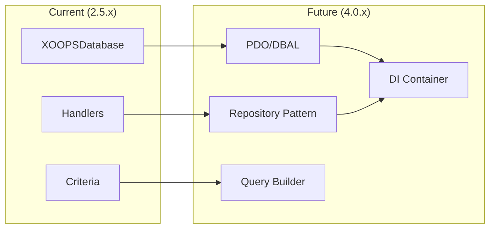

# ADR-002: Abstrakce databáze

> Záznam rozhodnutí o architektuře pro vzor objektově orientovaného přístupu k databázi XOOPS.

---

## Stav

**Přijato** – Vzor jádra od XOOPS 2.0

---

## Souvislosti

XOOPS potřeboval strategii interakce s databází, která by:

1. Syntaxe SQL specifická pro databázi
2. Zajistěte konzistentní operace CRUD napříč všemi moduly
3. Povolte automatickou dezinfekci a únik dat
4. Podporujte budoucí změny databázového stroje
5. Zjednodušte vývojářům běžné operace

Alternativy byly:
- Nezpracované SQL v celé kódové základně
- Plná ORM (doktrína, výmluvná)
- Vlastní lehká abstrakce

---

## Diagram rozhodnutí



---

## Rozhodnutí

Implementujeme **Vzor manipulátoru** s:

### 1. XOOPSObject – datový kontejner

Každá datová entita rozšiřuje XOOPSObject:

```php
class Item extends XOOPSObject
{
    public function __construct()
    {
        $this->initVar('id', XOBJ_DTYPE_INT, null, false);
        $this->initVar('title', XOBJ_DTYPE_TXTBOX, '', true, 255);
        $this->initVar('content', XOBJ_DTYPE_TXTAREA, '', false);
        $this->initVar('status', XOBJ_DTYPE_INT, 0, false);
    }
}
```

### 2. Handler - Operations Manager

Každý objekt má odpovídající handler:

```php
class ItemHandler extends XOOPSPersistableObjectHandler
{
    public function __construct($db)
    {
        parent::__construct($db, 'mymodule_items', Item::class, 'id', 'title');
    }

    // CRUD methods inherited:
    // - create(), get(), insert(), delete()
    // - getObjects(), getCount(), getAll()
}
```

### 3. Kritéria – Tvůrce dotazů

Podmínky objektově orientovaného dotazu:

```php
$criteria = new CriteriaCompo();
$criteria->add(new Criteria('status', 1));
$criteria->add(new Criteria('created', time() - 86400, '>='));
$criteria->setSort('created');
$criteria->setOrder('DESC');
$criteria->setLimit(10);

$items = $handler->getObjects($criteria);
```

---

## Konstanty datového typu

```php
// Variable types with automatic sanitization
XOBJ_DTYPE_INT       // Integer
XOBJ_DTYPE_TXTBOX    // Single-line text (escaped)
XOBJ_DTYPE_TXTAREA   // Multi-line text (escaped)
XOBJ_DTYPE_EMAIL     // Email validation
XOBJ_DTYPE_URL       // URL validation
XOBJ_DTYPE_ARRAY     // Serialized array
XOBJ_DTYPE_OTHER     // No processing
XOBJ_DTYPE_FLOAT     // Floating point
```

---

## Dědičnost manipulátoru



---

## Následky

### Pozitivní

1. **Konzistence**: Všechny moduly používají stejné vzory
2. **Zabezpečení**: Automatický únik zabraňuje vstřikování SQL
3. **Jednoduchost**: Běžné operace vyžadují minimální kód
4. **Udržovatelnost**: Změny v databázové vrstvě neovlivňují moduly
5. **Testovatelnost**: Obslužné rutiny lze pro testování zesměšňovat

### Negativní

1. **Výkon**: Extra režie abstrakce
2. **Složitost**: Křivka učení pro nové vývojáře
3. **Omezení**: Komplexní dotazy mohou vyžadovat nezpracovaný SQL
4. **N+1 Problém**: Žádné vestavěné dychtivé načítání

### Zmírnění

- **Výkon**: Ukládání často používaných objektů do mezipaměti
- **Složité dotazy**: V případě potřeby povolte nezpracované SQL
- **N+1**: Použijte getAll() se správnými kritérii

---

## Evolution to XOOPS 4.0



Plány XOOPS 4.0:
- Doktrína DBAL pro abstrakci databáze
- Vzor úložiště nahrazující handlery
- Tvůrce dotazů pro složité dotazy
- Plná integrace kontejneru PSR-11

---

## Příklady kódu

### Základní CRUD

```php
$helper = Helper::getInstance();
$handler = $helper->getHandler('Item');

// Create
$item = $handler->create();
$item->setVar('title', 'New Item');
$handler->insert($item);

// Read
$item = $handler->get($id);
$title = $item->getVar('title');

// Update
$item->setVar('title', 'Updated Title');
$handler->insert($item);

// Delete
$handler->delete($item);
```

### Komplexní dotaz

```php
$criteria = new CriteriaCompo();
$criteria->add(new Criteria('status', 'published'));
$criteria->add(new Criteria('category_id', '(1,2,3)', 'IN'));
$criteria->add(new Criteria('created', strtotime('-30 days'), '>='));
$criteria->setSort('views');
$criteria->setOrder('DESC');
$criteria->setLimit(10);
$criteria->setStart(0);

$items = $handler->getObjects($criteria);
$total = $handler->getCount($criteria);
```

---

## Související rozhodnutí

- ADR-001: Modulární architektura
- ADR-003: Smarty šablonový modul

---

## Reference

- Martin Fowler - Vzory podnikové aplikační architektury
- Domain-Driven Design koncepty
- Vzory Active Record vs Data Mapper

---

#xoops #architecture #adr #database #handler #design-decision