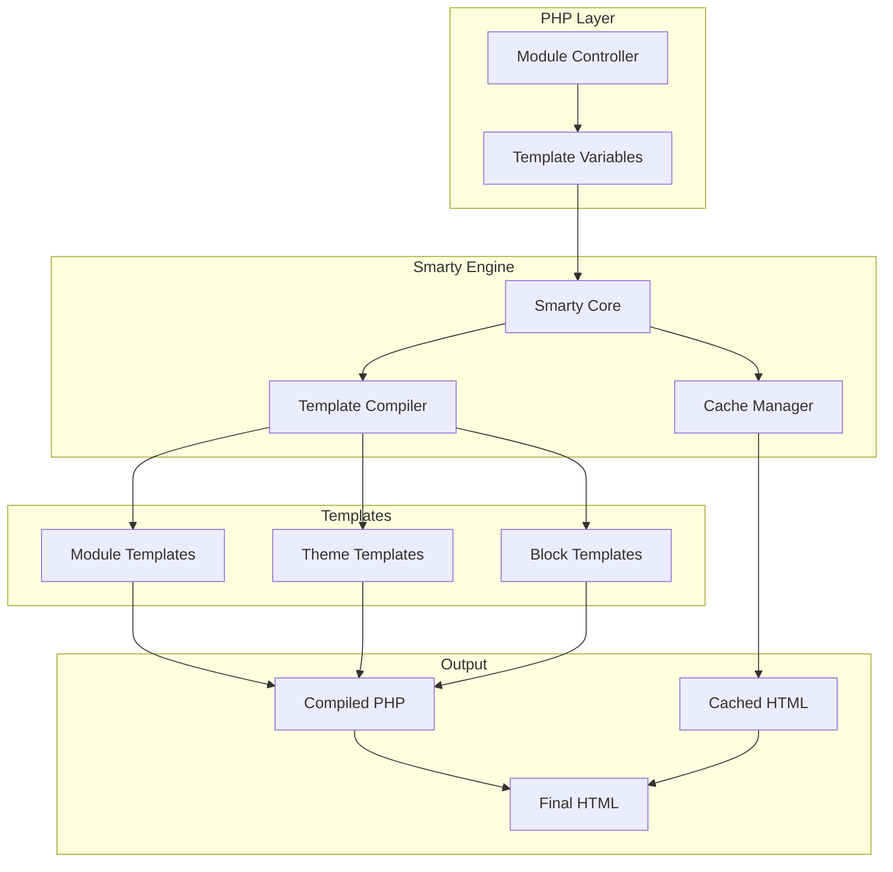
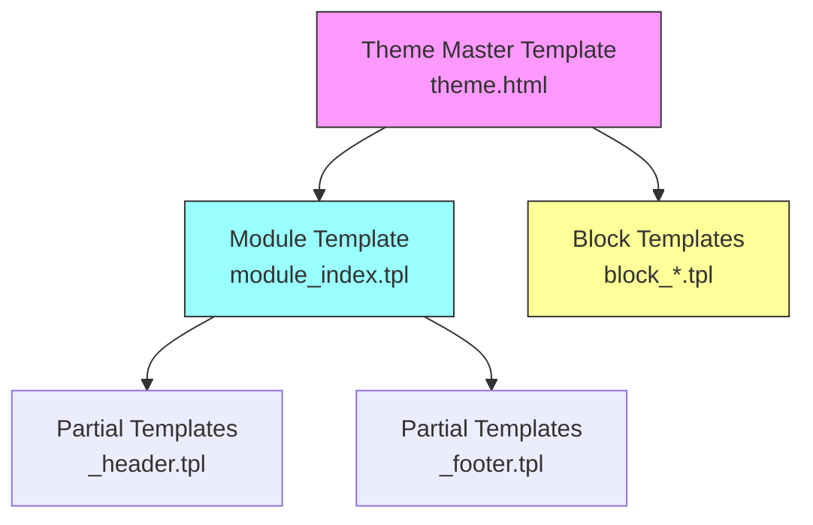
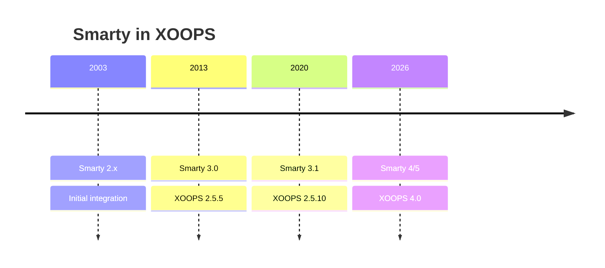

# ADR-003: Modul šablony (Smarty)

> Záznam rozhodnutí o architektuře pro přijetí Smarty šablonového enginu XOOPS.

---

## Stav

**Přijato** – Základní rozhodnutí od XOOPS 2.0

**Vyvíjející se** – Migrace na Smarty 4/5 plánována pro XOOPS 4.0

---

## Souvislosti

XOOPS potřeboval řešení šablon, které by:

1. Oddělte prezentaci od obchodní logiky
2. Umožněte návrhářům motivů pracovat bez znalostí PHP
3. Podpora dědičnosti šablon a jejich součástí
4. Poskytněte mezipaměť pro výkon
5. Povolte uživatelsky přizpůsobitelné šablony
6. Podpora internacionalizace

---

## Diagram rozhodnutí



---

## Rozhodnutí

Jako šablonový modul použijeme **Smarty**, protože:

### 1. Rozdělení obav

```php
// PHP (Controller) - Business logic
$items = $itemHandler->getPublishedItems();
$xoopsTpl->assign('items', $items);

// Smarty (View) - Presentation
// templates/items.tpl
```

```smarty
{* Smarty template - No PHP logic *}
<{foreach item=item from=$items}>
    <article>
        <h2><{$item.title}></h2>
        <p><{$item.summary}></p>
    </article>
<{/foreach}>
```

### 2. XOOPS Oddělovače

XOOPS používá `<{` a `}>` místo standardního `{` `}`:

```smarty
{* Standard Smarty *}
{$variable}

{* XOOPS Smarty - Avoids JavaScript conflicts *}
<{$variable}>
```

### 3. Hierarchie šablon



### 4. Ukládání šablon

- **Databáze**: Přizpůsobené šablony uložené pro možnost vrácení
- **Systém souborů**: Původní šablony v adresářích modulů
- **Cache**: Kompilované šablony pro výkon

---

## Konfigurace Smarty

```php
// XOOPS Smarty initialization
$xoopsTpl = new XOOPSTpl();

// Custom delimiters
$xoopsTpl->left_delim = '<{';
$xoopsTpl->right_delim = '}>';

// Caching
$xoopsTpl->caching = XOOPS_TEMPLATE_CACHE;
$xoopsTpl->cache_lifetime = 3600;

// Security
$xoopsTpl->security_policy = new Smarty_Security($xoopsTpl);
$xoopsTpl->security_policy->php_functions = [];
$xoopsTpl->security_policy->php_modifiers = ['escape', 'count'];
```

---

## Použité funkce šablony

### Proměnné

```smarty
{* Simple variable *}
<{$title}>

{* Object property *}
<{$item.title}>

{* With modifier *}
<{$content|truncate:200:'...'}>

{* Escaped output *}
<{$userInput|escape:'html'}>
```

### Řídicí struktury

```smarty
{* Conditional *}
<{if $isAdmin}>
    <a href="admin.php">Admin</a>
<{elseif $isUser}>
    <a href="profile.php">Profile</a>
<{else}>
    <a href="login.php">Login</a>
<{/if}>

{* Loop *}
<{foreach item=item from=$items name=itemloop}>
    <{$smarty.foreach.itemloop.index}>: <{$item.title}>
<{/foreach}>
```

### Zahrnuje

```smarty
{* Include another template *}
<{include file="db:mymodule_header.tpl"}>

{* Include with variables *}
<{include file="db:mymodule_item.tpl" item=$currentItem}>

{* Include from theme *}
<{include file="file:$theme_path/partials/sidebar.tpl"}>
```

---

## Následky

### Pozitivní

1. **Příjemné pro návrháře**: Syntaxe podobná HTML
2. **Ukládání do mezipaměti**: Vestavěné ukládání do mezipaměti šablony
3. **Zabezpečení**: Izolace kódu PHP
4. **Flexibilita**: Modifikátory, funkce, pluginy
5. **Přizpůsobení**: Uživatelé mohou upravovat šablony
6. **Komunita**: Velký ekosystém Smarty

### Negativní

1. **Křivka učení**: Syntaxe specifická pro Smarty
2. **Režie**: Je vyžadován krok kompilace
3. **Ladění**: Chyby šablony mohou být záhadné
4. **Problémy s verzemi**: Přerušení změn mezi verzemi

### Zmírnění

- **Učení**: Komplexní dokumentace
- **Výkon**: Agresivní ukládání do mezipaměti
- **Ladění**: Debug konzole, vymazání chybových zpráv
- **Verze**: Vrstva kompatibility v XOOPS

---

## Historie verzí



---

## Migrace: Smarty 3 na 4/5

### Prolomení změn

```smarty
{* Smarty 3 - Deprecated *}
<{php}>echo date('Y');<{/php}>

{* Smarty 4+ - Use modifiers or assign from PHP *}
<{$current_year}>

{* Smarty 3 - {section} deprecated *}
<{section name=i loop=$items}>
    <{$items[i].title}>
<{/section}>

{* Smarty 4+ - Use {foreach} *}
<{foreach $items as $item}>
    <{$item.title}>
<{/foreach}>
```

### Vrstva kompatibility

XOOPS poskytuje vrstvu kompatibility pro hladké přechody:

```php
// XOOPSTpl extends Smarty with compatibility methods
class XOOPSTpl extends Smarty
{
    public function assign($tpl_var, $value = null)
    {
        // Handles both Smarty 3 and 4 syntax
        return parent::assign($tpl_var, $value);
    }
}
```

---

## Zvažovány alternativy

### 1. Větvička
**Pros**: Moderní, Symfony ekosystém
**Nevýhody**: Jiná syntaxe, úsilí o migraci
**Rozhodnutí**: Možná budoucí volba pro XOOPS 3.x

### 2. Čepel (Laravel)
**Pros**: Čistá syntaxe, populární
**Nevýhody**: Specifické pro Laravel
**Rozhodnutí**: Nevhodné pro samostatné použití

### 3. Nativní šablony PHP
**Pros**: Bez křivky učení, rychle
**Nevýhody**: Bezpečnostní rizika, žádné oddělení
**Rozhodnutí**: Zamítnuto z důvodu údržby

---

## Související rozhodnutí

- ADR-001: Modulární architektura
- ADR-002: Abstrakce databáze

---

## Reference

- Smarty Dokumentace: https://www.smarty.net/docs/en/
- Průvodce systémem šablon XOOPS
- Vzor MVC ve webových aplikacích

---

#xoops #architektura #adr #smarty #šablony #design-rozhodnutí