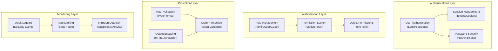

# ADR-004: Architektura bezpečnostního systému

> Komplexní bezpečnostní architektura pro XOOPS CMS chránící před moderními hrozbami.

---

## Stav

**Přijato** – Základní vrstva zabezpečení od XOOPS 2.5

---

## Souvislosti

### Prohlášení o problému

XOOPS potřebuje robustní bezpečnostní systém, který:

1. **Chrání před běžnými webovými chybami** (OWASP Top 10)
2. **Poskytuje podrobnou kontrolu oprávnění** napříč moduly
3. **Umožňuje bezpečné ověření uživatele** s moderními standardy
4. **Zabraňuje úniku dat** a neoprávněnému přístupu
5. **Podporuje víceúrovňové řízení přístupu** (admin, moderátor, uživatel, host)
6. **Bezproblémová integrace se všemi moduly**

### Aktuální hrozby

Mezi moderní webové útoky patří:

- **SQL Injection** - Škodlivý SQL v uživatelském vstupu
- **XSS (Cross-Site Scripting)** - Vloženo JavaScript na stránky
- **CSRF (falšování požadavků napříč stránkami)** - Neoprávněné odeslání formuláře
- **Autentizační bypass** - Slabá obsluha session/password
- **Vynechání autorizace** - Eskalace oprávnění
- **Vystavení dat** - Citlivá data v adresách URL, protokolech nebo mezipaměti

### XOOPS Bezpečnostní požadavky

1. Autentizace uživatele a správa relací
2. Řízení přístupu na základě rolí (RBAC)
3. Systém oprávnění pro moduly a objekty
4. Ověření vstupu a escapování výstupu
5. Ochrana proti běžným útokům
6. Audit logování bezpečnostních událostí
7. Bezpečná manipulace s hesly
8. Ochrana tokenu CSRF

---

## Rozhodnutí

### Základní bezpečnostní architektura



---

## Bezpečnostní komponenty

### 1. Autentizační systém

**Proces přihlášení uživatele:**

```php
<?php
// 1. Validate credentials
$user = $userHandler->findByLogin($username);
if (!$user || !password_verify($password, $user->getVar('pass'))) {
    throw new AuthenticationException('Invalid credentials');
}

// 2. Check if account is active
if (!$user->getVar('uactive')) {
    throw new AuthenticationException('Account inactive');
}

// 3. Create secure session
session_regenerate_id(true);
$_SESSION['uid'] = $user->getVar('uid');
$_SESSION['token'] = bin2hex(random_bytes(32));
$_SESSION['created'] = time();

// 4. Log the login
$this->auditLog('USER_LOGIN', $user->getVar('uid'));
```

**Zabezpečení heslem:**

```php
<?php
// Use password_hash (not MD5 or SHA1)
$hashed = password_hash($password, PASSWORD_BCRYPT, [
    'cost' => 12, // High cost = slow brute force
]);

// Verify password
if (!password_verify($inputPassword, $hashed)) {
    throw new Exception('Invalid password');
}

// Rehash if algorithm or cost changed
if (password_needs_rehash($hashed, PASSWORD_BCRYPT, ['cost' => 12])) {
    $newHash = password_hash($password, PASSWORD_BCRYPT, ['cost' => 12]);
    $user->setVar('pass', $newHash);
    $userHandler->insert($user);
}
```

### 2. Správa relace

**Zabezpečené zpracování relace:**

```php
<?php
// Session configuration
ini_set('session.cookie_httponly', true);  // No JS access
ini_set('session.cookie_secure', true);     // HTTPS only
ini_set('session.cookie_samesite', 'Strict'); // CSRF protection
ini_set('session.gc_maxlifetime', 3600);   // 1 hour timeout
ini_set('session.sid_length', 64);         // 64-char session ID

// Validate session
function validateSession() {
    // Check timeout
    if (time() - $_SESSION['created'] > 3600) {
        session_destroy();
        throw new SessionExpiredException();
    }

    // Validate user agent (prevent session hijacking)
    if ($_SESSION['user_agent'] !== $_SERVER['HTTP_USER_AGENT']) {
        throw new SessionInvalidException();
    }

    // Validate IP (optional, can be too strict)
    if (!in_array($_SERVER['REMOTE_ADDR'], $_SESSION['ips'])) {
        $_SESSION['ips'][] = $_SERVER['REMOTE_ADDR'];
    }
}
```

### 3. Autorizace (RBAC)

**Řízení přístupu na základě rolí:**

```php
<?php
class XOOPSUser {
    public function hasPermission(string $permissionName): bool
    {
        // Get user groups
        $groups = $this->getGroups();

        // Check if any group has permission
        foreach ($groups as $groupId) {
            if ($this->checkGroupPermission($groupId, $permissionName)) {
                return true;
            }
        }

        return false;
    }

    /**
     * User groups and their permissions
     * Admin: Full access
     * Moderator: Content management
     * User: Create own content
     * Guest: Read-only access
     */
    private function checkGroupPermission(int $groupId, string $permission): bool
    {
        $permissions = [
            1 => ['admin_access'],                 // Admin group
            2 => ['moderate_content', 'edit_own'], // Moderator group
            3 => ['create_content', 'edit_own'],   // User group
            4 => [],                               // Guest group (no permissions)
        ];

        return in_array($permission, $permissions[$groupId] ?? []);
    }
}
```

### 4. Ověření vstupu

**Zabraňte chybám vstřikování a typu SQL:**

```php
<?php
// Always use prepared statements
$sql = 'SELECT * FROM users WHERE id = ?';
$result = $db->query($sql, [$userId]); // ✅ Safe

// Input validation
function validateUserInput(array $data): array
{
    return [
        'email' => filter_var($data['email'] ?? '', FILTER_VALIDATE_EMAIL),
        'age' => filter_var($data['age'] ?? 0, FILTER_VALIDATE_INT),
        'website' => filter_var($data['website'] ?? '', FILTER_VALIDATE_URL),
        'title' => substr(trim($data['title'] ?? ''), 0, 255),
    ];
}

// XOOPS Safe Input class
$safe = \XMF\Request::getHtmlRequest('var_name', '');
$int = \XMF\Request::getInt('page', 1);
```

### 5. Výstup Escape

**Zabraňte útokům XSS:**

```php
<?php
// In PHP templates
echo htmlspecialchars($userInput, ENT_QUOTES, 'UTF-8');

// In Smarty templates (automatic escaping)
<{$user_input}>  {* Escaped by default *}
<{$html|escape:false}>  {* Only when needed *}

// JavaScript context
<script>
var message = "<{$userMessage|escape:'javascript'}>";
</script>

// URL context
<a href="<{$url|escape:'url'}>">Link</a>
```

### 6. Ochrana CSRF

**Zabránění padělání žádostí napříč weby:**

```php
<?php
// Generate CSRF token
session_start();
if (empty($_SESSION['csrf_token'])) {
    $_SESSION['csrf_token'] = bin2hex(random_bytes(32));
}

// In forms
<form method="POST">
    <input type="hidden" name="csrf_token" value="<{$csrf_token}>">
    <button type="submit">Submit</button>
</form>

// Validate token
if ($_SERVER['REQUEST_METHOD'] === 'POST') {
    if (hash_equals($_SESSION['csrf_token'], $_POST['csrf_token'] ?? '')) {
        // Process form
    } else {
        throw new InvalidTokenException('CSRF token invalid');
    }
}
```

---

## Následky

### Pozitivní účinky

1. **Komplexní ochrana** – Pokrývá hlavní třídy zranitelnosti
2. **Vrstvené zabezpečení** – Více vrstev obrany
3. **Flexibilní RBAC** – Jemná kontrola oprávnění
4. **Audit Trail** – Sledujte bezpečnostní události
5. **Odvětvový standard** – V souladu s doporučeními OWASP
6. **Integrace modulů** – Moduly snadno používají bezpečnostní API

### Negativní účinky

1. **Složitost** – Je potřeba více kódu a konfigurace
2. **Výkon** – Hašování a ověřování zvyšují režii
3. **Uživatelská zkušenost** – Zabezpečení někdy nepohodlné
4. **Údržba** – Vyžaduje průběžné aktualizace zabezpečení
5. **Vyžadováno školení** – Vývojáři musí dodržovat postupy

### Rizika a zmírnění

| Riziko | Závažnost | Zmírnění |
|------|----------|-----------|
| Vývojář ignoruje zabezpečení | Vysoká | Kontrola kódu, bezpečnostní školení |
| Objevená nová zranitelnost | Střední | Pravidelné bezpečnostní audity, aktualizace |
| Dopad na výkon | Nízká | Optimalizujte horké cesty, ukládání do mezipaměti |
| Příliš složitá oprávnění | Střední | Přehledná dokumentace, příklady |

---

## Nejlepší bezpečnostní postupy

### Pro vývojáře modulů

```php
<?php
// ✅ DO: Use prepared statements
$result = $db->prepare('SELECT * FROM table WHERE id = ?')->execute([$id]);

// ❌ DON'T: Concatenate queries
$result = $db->query("SELECT * FROM table WHERE id = $id");

// ✅ DO: Escape output
echo htmlspecialchars($user_input, ENT_QUOTES, 'UTF-8');

// ❌ DON'T: Output raw user data
echo $user_input;

// ✅ DO: Check permissions
if (!$user->hasPermission('edit_content')) {
    throw new PermissionException();
}

// ❌ DON'T: Trust user roles directly
if ($_POST['is_admin']) {
    // Make user admin - SECURITY HOLE!
}

// ✅ DO: Validate input types
$page = (int)$_GET['page'];

// ❌ DON'T: Use untrusted values directly
$sql .= " LIMIT " . $_GET['limit'];
```

---

## Zvažovány alternativy

### OAuth/OpenID Připojit

**Proč nezvolit hned na začátku:** Příliš složité pro prostředí sdíleného hostování, ale dobré pro budoucí integraci s externími systémy ověřování.

### Dvoufaktorová autentizace (2FA)

**Stav:** Přijímáno jako rozšíření, nikoli základní požadavek, viz ADR-006

### Soubory cookie relace pouze HTTP

**Stav:** Implementováno – brání JavaScript v přístupu k datům relace

---

## Související rozhodnutí

- ADR-001: Modulární architektura - Moduly implementují zabezpečení
- ADR-005: Systém povolení modulu
- ADR-006: Dvoufaktorová autentizace (budoucí)

---

## Reference

### Bezpečnostní standardy

- [OWASP Top 10](https://owasp.org/www-project-top-ten/)
- [NIST Rámec kybernetické bezpečnosti](https://www.nist.gov/cyberframework)
- [CWE Top 25](https://cwe.mitre.org/top25/)

### Zabezpečení PHP

- [PHP Bezpečnostní příručka](https://www.php.net/manual/en/security.php)
- [password_hash() Documentation](https://www.php.net/manual/en/function.password-hash.php)
- [Zabezpečení relace](https://www.php.net/manual/en/session.security.php)

### Nástroje- [OWASP ZAP](https://www.zaproxy.org/) - Testování zabezpečení
- [Snyk](https://snyk.io/) - Skenování zranitelnosti
- [SonarQube](https://www.sonarqube.org/) - Kvalita kódu

---

## Kontrolní seznam implementace

- [ ] Systém ověřování uživatelů
- [ ] Správa relací
- [ ] Hašování hesel (bcrypt)
- [ ] Řízení přístupu na základě rolí
- [ ] Oprávnění modulu
- [ ] Rámec ověřování vstupu
- [ ] Výstup escapování (PHP + Smarty)
- [ ] Ochrana tokenů CSRF
- [ ] Protokolování bezpečnostního auditu
- [ ] Omezení sazby
- [ ] Záhlaví zabezpečení

---

## Historie verzí

| Verze | Datum | Změny |
|---------|------|---------|
| 1.0.0 | 2024-01-28 | Počáteční dokument |

---

#xoops #adr #zabezpečení #architektura #autentizace #autorizace #rbac