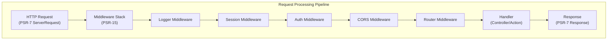

# ADR-005: Vzor middlewaru PSR-15 pro XOOPS 4.0

> Přijměte PSR-15 HTTP serverové obslužné nástroje (middleware) pro vylepšené zpracování požadavků.

:::pozor[XOOPS 4.0 Návrh — není k dispozici ve verzi 2.5.x]
Tento ADR popisuje **navrhovanou architekturu pro XOOPS 4.0**. Middleware PSR-15 **není k dispozici v XOOPS 2.5.x**. Současné moduly 2.5.x používají vzor řadiče stránky s bootstrapem `mainfile.php`. Aktuální životní cyklus požadavku naleznete v části Architektura XOOPS.
:::

---

## Stav

**Navrhováno** – Probíhá testování pro vydání XOOPS 4.0

---

## Souvislosti

### Aktuální přístup

XOOPS 2.5 používá monolitický přístup ke zpracování požadavků:

```php
// Current: Sequential processing
require_once 'mainfile.php';
// → Kernel initialization
// → User authentication
// → Module loading
// → Page rendering

// All in one flow, mixed concerns
```

### Problémy s aktuálním přístupem

1. **Smíšené obavy** – autentizace, protokolování, směrování, to vše se prolíná
2. **Obtížné na testování** – Obtížné na testování jednotlivých kroků zpracování požadavků
3. **Hard to Extend** - Moduly lze připojit pouze přes preload/events
4. **Špatná separace** – Logika zpracování požadavků rozptýlená po celé kódové základně
5. **Nesložitelné** – Nelze snadno řetězit nebo měnit pořadí kroků zpracování

### Co je middleware PSR-15?

PSR-15 definuje standardní rozhraní pro middleware HTTP:

```php
<?php
interface RequestHandlerInterface {
    public function handle(ServerRequestInterface $request): ResponseInterface;
}

interface MiddlewareInterface {
    public function process(
        ServerRequestInterface $request,
        RequestHandlerInterface $handler
    ): ResponseInterface;
}
```

**Řetěz středního vybavení:**

```
Request
  ↓
[Logger] → logs request
  ↓
[Auth] → validates user session
  ↓
[CORS] → checks cross-origin
  ↓
[Router] → dispatches to handler
  ↓
[Handler] → generates response
  ↓
Response
```

---

## Rozhodnutí

### Přijměte zásobník middlewaru PSR-15 pro XOOPS 4.0

Implementujte kanál pro zpracování požadavků založený na middlewaru podle standardu PSR-15.

### Přehled architektury



### Základní komponenty middlewaru

#### 1. Aplikační middleware (Core Layer)

```php
<?php
declare(strict_types=1);

namespace XOOPSCore;

use Psr\Http\Message\ResponseInterface;
use Psr\Http\Message\ServerRequestInterface;
use Psr\Http\Server\MiddlewareInterface;
use Psr\Http\Server\RequestHandlerInterface;

class SessionMiddleware implements MiddlewareInterface
{
    public function process(
        ServerRequestInterface $request,
        RequestHandlerInterface $handler
    ): ResponseInterface {
        // 1. Retrieve session (or start new)
        $sessionId = $request->getCookieParams()['PHPSESSID'] ?? null;
        $session = $this->sessionManager->load($sessionId);

        // 2. Attach session to request
        $request = $request->withAttribute('session', $session);

        // 3. Pass to next middleware
        $response = $handler->handle($request);

        // 4. Set session cookie if needed
        if ($session->isModified()) {
            $response = $response->withAddedHeader(
                'Set-Cookie',
                'PHPSESSID=' . $session->getId() . '; HttpOnly; SameSite=Strict'
            );
        }

        return $response;
    }
}
```

#### 2. Autentizační middleware

```php
<?php
class AuthMiddleware implements MiddlewareInterface
{
    public function process(
        ServerRequestInterface $request,
        RequestHandlerInterface $handler
    ): ResponseInterface {
        // Get session from previous middleware
        $session = $request->getAttribute('session');

        // Authenticate user from session
        $user = $this->authenticate($session);

        // Attach user to request
        $request = $request->withAttribute('user', $user);

        return $handler->handle($request);
    }

    private function authenticate(?Session $session): User
    {
        if ($session && $session->has('uid')) {
            return $this->userRepository->findById($session->get('uid'));
        }

        return new AnonymousUser();
    }
}
```

#### 3. Autorizační middleware

```php
<?php
class AuthorizationMiddleware implements MiddlewareInterface
{
    public function __construct(private AuthorizationChecker $checker)
    {
    }

    public function process(
        ServerRequestInterface $request,
        RequestHandlerInterface $handler
    ): ResponseInterface {
        $user = $request->getAttribute('user');
        $route = $request->getAttribute('route');

        // Check if user has permission for this route
        if (!$this->checker->isGranted($user, $route)) {
            return new JsonResponse(
                ['error' => 'Unauthorized'],
                403
            );
        }

        return $handler->handle($request);
    }
}
```

#### 4. Modul Middleware

```php
<?php
// Modules can provide their own middleware
class PublisherAccessMiddleware implements MiddlewareInterface
{
    public function process(
        ServerRequestInterface $request,
        RequestHandlerInterface $handler
    ): ResponseInterface {
        $user = $request->getAttribute('user');

        // Module-specific access control
        if (!$user->hasPermission('publisher_view')) {
            return new HtmlResponse('Access denied', 403);
        }

        return $handler->handle($request);
    }
}
```

### Příklad implementace

```php
<?php
// bootstrap.php - Application setup

use Psr\Http\Message\ServerRequestInterface;
use Psr\Http\Server\RequestHandlerInterface;
use XOOPS\Core\Middleware\{
    LoggerMiddleware,
    SessionMiddleware,
    AuthMiddleware,
    CorsMiddleware,
    ErrorHandlingMiddleware
};

// Create middleware pipeline
$middlewareStack = [
    // 1. Error handling (outermost)
    new ErrorHandlingMiddleware(),

    // 2. Logging
    new LoggerMiddleware($logger),

    // 3. CORS handling
    new CorsMiddleware($corsConfig),

    // 4. Session management
    new SessionMiddleware($sessionManager),

    // 5. Authentication
    new AuthMiddleware($userRepository),

    // 6. Authorization
    new AuthorizationMiddleware($authChecker),

    // 7. Routing and dispatching
    new RoutingMiddleware($router),

    // 8. Module middleware (dynamic)
    ...$this->loadModuleMiddleware(),
];

// Process request through middleware stack
$request = ServerRequestFactory::fromGlobals();
$dispatcher = new MiddlewareDispatcher($middlewareStack);
$response = $dispatcher->dispatch($request);

// Send response
http_response_code($response->getStatusCode());
foreach ($response->getHeaders() as $name => $values) {
    foreach ($values as $value) {
        header("$name: $value", false);
    }
}
echo $response->getBody();
```

### Integrace modulů

Moduly mohou poskytovat middleware:

```php
<?php
// Publisher module - xoops_version.php

$modversion['middleware'] = [
    'PublisherAccessMiddleware' => true,      // Auto-load
    'PublisherLogMiddleware' => true,
];

// Or custom:
$modversion['middleware_factory'] = function() {
    return [
        new PublisherCacheMiddleware(),
        new PublisherPermissionMiddleware(),
    ];
};
```

---

## Následky

### Pozitivní účinky

1. **Oddělení zájmů** – Každý middleware má jednu odpovědnost
2. **Testovatelnost** – Jednoduché testování jednotlivých komponent middlewaru
3. **Složitelnost** – Middleware lze míchat a přeskupovat
4. **V souladu se standardy** – Používá standardy PSR-15 a PSR-7
5. **Rozšiřitelnost** – Moduly mohou snadno přidávat vlastní middleware
6. **Ladění** – Zrušte tok požadavků potrubím
7. **Výkon** – Dokáže optimalizovat konkrétní vrstvy middlewaru
8. **Interoperabilita** – Může používat middleware PSR-15 třetí strany

### Negativní účinky

1. **Křivka učení** – Vývojáři musí rozumět PSR-15
2. **Režie výkonu** – Více volání funkcí v kanálu
3. **Složitost** – Více pohyblivých částí než monolitický přístup
4. **Úsilí o migraci** – Vyžaduje refaktorování stávajícího kódu
5. **Závislosti** – Vyžaduje knihovnu PSR-7 HTTP

### Rizika a zmírnění

| Riziko | Závažnost | Zmírnění |
|------|----------|-----------|
| Komplexní middleware řetězce | Střední | Přehledná dokumentace, příklady |
| Snížení výkonu | Střední | Benchmark, optimalizace horkých cest |
| Zneužití vývojáře | Střední | Přezkoumání kódu, průvodce osvědčenými postupy |
| Migrace prolomila změny | Vysoká | Doba odpisu, pomocníci |
| Problémy s objednáním middlewaru | Střední | Vymazat graf závislosti |

---

## Plán implementace

### Fáze 1: Nadace (2. čtvrtletí 2026)

- [ ] Implementujte obálku zpráv PSR-7 HTTP
- [ ] Vytvořit MiddlewareDispatcher
- [ ] Implementujte základní middleware (relace, auth)
- [ ] Aktualizujte jádro pro použití middlewaru

### Fáze 2: Integrace (3. čtvrtletí 2026)

- [ ] Migrujte stávající funkce na middleware
- [ ] Přidat podporu middlewaru modulu
- [ ] Vytvářejte nástroje pro testování middlewaru
- [ ] Napište komplexní dokumentaci

### Fáze 3: Migrace (4. čtvrtletí 2026)

- [ ] Poskytněte vrstvu kompatibility pro starý kód
- [ ] Aktualizace modulů nápovědy na nový middleware
- [ ] Optimalizace výkonu
- [ ] Bezpečnostní audit

### Fáze 4: Vydání (1. čtvrtletí 2027)

- [ ] Vydání XOOPS 4.0 s middlewarem
- [ ] Zastarat starý systém preload/hook
- [ ] Zpětná vazba a aktualizace komunity

---

## Kritéria úspěchu- [ ] Všechny základní funkce byly migrovány na middleware
- [ ] 90%+ testovací pokrytí pro middleware
- [ ] Dokumentace doplněná příklady
- [ ] Výkon do 10 % oproti předchozí verzi
- [ ] Moduly úspěšně využívají nový middlewarový systém
- [ ] Míra přijetí v komunitě >80 %

---

## Doporučené postupy pro middleware

### Dělejte

- Zaměřte se na middleware (jediná odpovědnost)
- Použijte neměnnost (vytvořte nový request/response)
- Zvládejte chyby elegantně
- Závislosti dokumentů
- Přidejte tipy na typ
- Napište testy pro middleware
- Použijte standardní rozhraní PSR-15

### Ne

- Neupravujte sdílené objekty request/response
- Nepřistupujte přímo k globálům
- Nevytvářejte závislosti na pořadí middlewaru
- Nechytejte všechny výjimky
- Nesměšujte obchodní logiku s middlewarem
- Nenuťte middleware příliš mnoho

---

## Příklady

### Vlastní middleware

```php
<?php
// Example: Rate limiting middleware

use Psr\Http\Message\ResponseInterface;
use Psr\Http\Message\ServerRequestInterface;
use Psr\Http\Server\MiddlewareInterface;
use Psr\Http\Server\RequestHandlerInterface;

class RateLimitMiddleware implements MiddlewareInterface
{
    public function __construct(
        private RateLimiter $limiter,
        private int $limit = 100,
        private int $window = 3600
    ) {
    }

    public function process(
        ServerRequestInterface $request,
        RequestHandlerInterface $handler
    ): ResponseInterface {
        $user = $request->getAttribute('user');
        $identifier = $user->getId() ?? $request->getClientIp();

        // Check rate limit
        $remaining = $this->limiter->check($identifier, $this->limit, $this->window);

        if ($remaining < 0) {
            return new JsonResponse(
                ['error' => 'Rate limit exceeded'],
                429
            );
        }

        // Add rate limit headers
        $response = $handler->handle($request);
        return $response
            ->withAddedHeader('X-RateLimit-Limit', (string)$this->limit)
            ->withAddedHeader('X-RateLimit-Remaining', (string)$remaining);
    }
}
```

---

## Související rozhodnutí

- ADR-001: Modulární architektura - základ
- ADR-004: Bezpečnostní systém - Používá middleware pro ověřování
- ADR-006: Dvoufaktorové ověření - Může být middleware

---

## Reference

### Normy PSR

- [PSR-7: Rozhraní zpráv HTTP](https://www.php-fig.org/psr/psr-7/)
- [PSR-15: HTTP Serverové obslužné programy](https://www.php-fig.org/psr/psr-15/)

### Middleware Frameworks

- [Slim Framework](https://www.slimframework.com/) - Příklady middlewaru
- [Zend Expressive](https://docs.zendframework.com/zend-expressive/) - Rámec PSR-15
- [Guzzle](https://docs.guzzlephp.org/) - HTTP klientský middleware

### Nástroje

- [RelayPHP](https://relayphp.com/) - Knihovna middlewaru
- [PSR-15 Middleware](https://github.com/middlewares) - Kolekce middlewaru

---

## Historie verzí

| Verze | Datum | Změny |
|---------|------|---------|
| 1.0.0 | 2024-01-28 | Původní návrh |

---

#xoops #adr #psr-15 #middleware #architecture #psr-7