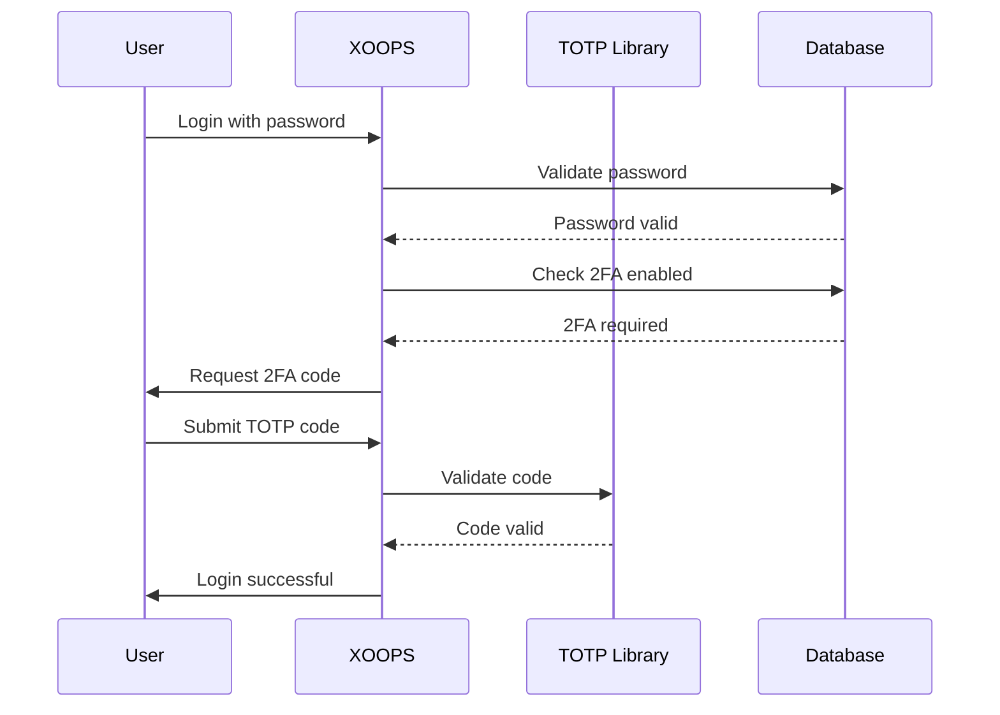

## Stav

Navrženo

## Souvislosti

XOOPS vyžaduje vylepšené zabezpečení pro ověřování uživatelů. Dvoufaktorová autentizace (2FA) poskytuje další vrstvu zabezpečení nad rámec hesel a chrání účty, i když jsou hesla prozrazena.

Klíčové aspekty:
- Zpětná kompatibilita se stávající autentizací
- Podpora více metod 2FA
- Uživatelská zkušenost během nastavování a přihlašování
- Mechanismy obnovy ztracených zařízení
- Integrace se stávajícím systémem povolení

## Rozhodnutí

Implementujeme TOTP (Time-based One-Time Password) jako primární metodu 2FA s podporou záložních kódů.

### Implementační přístup



### Schéma databáze

```sql
CREATE TABLE `{PREFIX}_users_2fa` (
    `user_id` INT(11) NOT NULL,
    `secret` VARCHAR(32) NOT NULL,
    `enabled` TINYINT(1) DEFAULT 0,
    `backup_codes` TEXT,
    `last_used` INT(11),
    `created` INT(11) NOT NULL,
    PRIMARY KEY (`user_id`),
    FOREIGN KEY (`user_id`) REFERENCES `{PREFIX}_users`(`uid`)
);
```

### Servisní rozhraní

```php
interface TwoFactorAuthInterface
{
    public function enable(int $userId): TwoFactorSetup;
    public function disable(int $userId): void;
    public function verify(int $userId, string $code): bool;
    public function generateBackupCodes(int $userId): array;
    public function isEnabled(int $userId): bool;
}
```

### Integrace middlewaru

```php
class TwoFactorMiddleware implements MiddlewareInterface
{
    public function process(
        ServerRequestInterface $request,
        RequestHandlerInterface $handler
    ): ResponseInterface {
        $session = $request->getAttribute('session');

        if ($session->has('pending_2fa_user_id')) {
            // User needs to complete 2FA
            if ($this->isVerificationRequest($request)) {
                return $handler->handle($request);
            }
            return new RedirectResponse('/2fa/verify');
        }

        return $handler->handle($request);
    }
}
```

## Následky

### Pozitivní

- Výrazně vylepšené zabezpečení účtu
- Kompatibilita s průmyslovým standardem TOTP (Google Authenticator, Authy atd.)
- Záložní kódy zabraňují uzamčení účtu
- Volitelné pro uživatele - nevynucuje si přijetí
- Middleware PSR-15 umožňuje čistou integraci

### Negativní

- Další krok přihlášení ovlivňuje uživatelskou zkušenost
- Uživatelé musí spravovat ověřovací aplikace
- Ztracená zařízení vyžadují proces obnovy
- Další úložiště databáze a dotazy
- Vyžaduje závislost na kryptografické knihovně

### Cesta migrace

1. Přidejte databázovou tabulku pro data 2FA
2. Implementujte službu TOTP se závislostí na knihovně
3. Přidejte middleware do řetězce ověřování
4. Vytvořte uživatelské rozhraní pro nastavení a ověření
5. Možnost správce vyžadovat 2FA pro konkrétní skupiny

## Zvažovány alternativy

### ZXQPH000016 na bázi QXZ OTP

Odmítnuto z důvodu:
- SIM zranitelnosti při výměně
- Náklady na bránu SMS
- Složitost ověřování telefonního čísla
- Obavy o soukromí

### Hardwarové bezpečnostní klíče (WebAuthn)

Odloženo pro budoucí ADR:
- Složitější implementace
- Historicky omezená podpora prohlížeče
- Vyšší uživatelské náklady
- Může být přidán vedle TOTP později

### E-mailový OTP

Odmítnuto z důvodu:
- Kompromis e-mailového účtu maří účel
- Zpoždění doručení má vliv na UX
- Problémy s filtrem spamu

## Reference

- [RFC 6238 - TOTP](https://tools.ietf.org/html/rfc6238)
– [Formát klíče Google Authenticator](https://github.com/google/google-authenticator/wiki/Key-Uri-Format)
- ../../02-Core-Concepts/Security/Security-Best-Practices - Bezpečnostní pokyny
- ../../02-Core-Concepts/Users-Permissions/Authentication - Dokumentace k systému ověřování