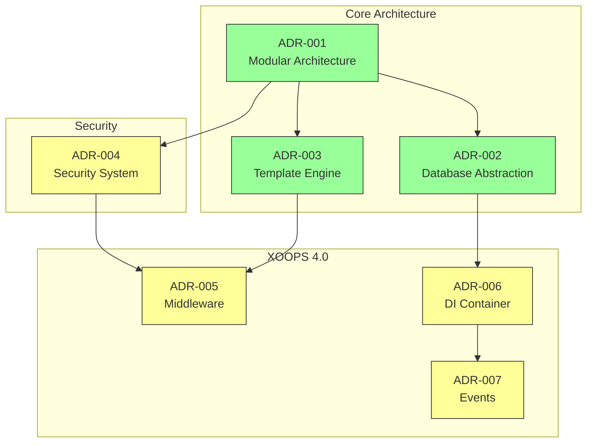
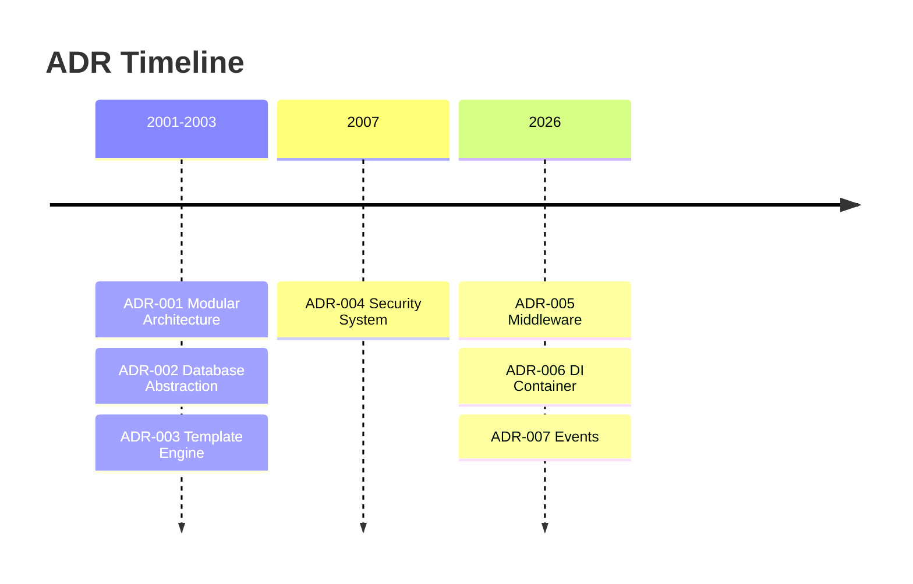

# 📋 Index rozhodovacích záznamů o architektuře

> Komplexní rejstřík architektonických rozhodnutí, která formovala XOOPS CMS.

---

## Co jsou ADR?

Architecture Decision Records (ADR) dokumentují významná architektonická rozhodnutí učiněná během vývoje XOOPS. Zachycují kontext, rozhodnutí a důsledky každé volby a poskytují hodnotný historický kontext pro správce a přispěvatele.

---

## Legenda stavu ADR

| Stav | Význam |
|--------|---------|
| **Navrhováno** | V diskuzi, dosud nepřijato |
| **Přijato** | Rozhodnutí bylo přijato |
| **Zastaralé** | Již nedoporučujeme |
| **Nahrazeno** | Nahrazeno jiným ADR |

---

## Aktuální ADR

### Základní rozhodnutí

| ADR | Název | Stav | Dopad |
|-----|-------|--------|--------|
| ADR-001 | Modulární architektura | Přijato | Jádro |
| ADR-002 | Objektově orientovaný přístup k databázi | Přijato | Jádro |
| ADR-003 | Motor šablony Smarty | Přijato | Jádro |

### Plánované ADR (XOOPS 4.0)

| ADR | Název | Stav | Dopad |
|-----|-------|--------|--------|
| ADR-004 | Návrh bezpečnostního systému | Navrhovaný | Zabezpečení |
| ADR-005 | PSR-15 Middleware | Navrhovaný | Architektura |
| ADR-006 | Závislá vstřikovací nádoba | Navrhovaný | Architektura |
| ADR-007 | Redesign systému událostí | Navrhovaný | Architektura |

---

## ADR Vztahy



---

## Časová osa



---

## Vytváření nových ADR

Při navrhování nového architektonického rozhodnutí:

1. Zkopírujte šablonu ADR
2. Vyplňte všechny sekce
3. Odeslat jako žádost o stažení
4. Diskutujte o problémech GitHub
5. Aktualizujte stav po rozhodnutí

### Struktura šablony ADR

```markdown
# ADR-XXX: Title

## Status
Proposed | Accepted | Deprecated | Superseded

## Context
What is the issue motivating this decision?

## Decision
What is the change that we're proposing?

## Consequences
What becomes easier or harder as a result?

## Alternatives Considered
What other options were evaluated?
```

---

## 🔗 Související dokumentace

- Základní koncepty
- Přispívající směrnice
- Plán XOOPS 4.0

---

#xoops #adr #architektura #index #rozhodnutí