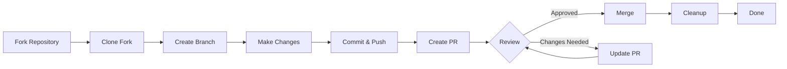

> Tato příručka vás provede celým procesem přispívání do XOOPS, od počátečního nastavení až po žádost o sloučenou aktualizaci.

---

## Předpoklady

Než začnete přispívat, ujistěte se, že máte:

- **Git** nainstalován a nakonfigurován
- **Účet GitHub** (zdarma)
- **PHP 7.4+** pro vývoj XOOPS
- **Composer** pro správu závislostí
- Základní znalost pracovních postupů Git
- Znalost kodexu chování

---

## Krok 1: Fork the Repository

### Na webovém rozhraní GitHub

1. Přejděte do úložiště (např. `XOOPS/XOOPSCore27`)
2. Klikněte na tlačítko **Fork** v pravém horním rohu
3. Vyberte, kde se má větvit (váš osobní účet)
4. Počkejte, až se vidlice dokončí

### Proč Fork?

- Získáte svou vlastní kopii, na které můžete pracovat
- Správci nemusí spravovat mnoho poboček
- Máte plnou kontrolu nad svou vidlicí
- Požadavky na stažení odkazují na vaši vidlici a upstream repo

---

## Krok 2: Lokálně naklonujte vidlici

```bash
# Clone your fork (replace YOUR_USERNAME)
git clone https://github.com/YOUR_USERNAME/XOOPSCore27.git
cd XOOPSCore27

# Add upstream remote to track original repository
git remote add upstream https://github.com/XOOPS/XOOPSCore27.git

# Verify remotes are set correctly
git remote -v
# origin    https://github.com/YOUR_USERNAME/XOOPSCore27.git (fetch)
# origin    https://github.com/YOUR_USERNAME/XOOPSCore27.git (push)
# upstream  https://github.com/XOOPS/XOOPSCore27.git (fetch)
# upstream  https://github.com/XOOPS/XOOPSCore27.git (nofetch)
```

---

## Krok 3: Nastavení vývojového prostředí

### Instalovat závislosti

```bash
# Install Composer dependencies
composer install

# Install development dependencies
composer install --dev

# For module development
cd modules/mymodule
composer install
```

### Nakonfigurujte Git

```bash
# Set your Git identity
git config user.name "Your Name"
git config user.email "your.email@example.com"

# Optional: Set global Git config
git config --global user.name "Your Name"
git config --global user.email "your.email@example.com"
```

### Spusťte testy

```bash
# Make sure tests pass in clean state
./vendor/bin/phpunit

# Run specific test suite
./vendor/bin/phpunit --testsuite unit
```

---

## Krok 4: Vytvořte větev funkcí

### Konvence pojmenování poboček

Postupujte podle tohoto vzoru: `<type>/<description>`

**Typy:**
- `feature/` - Nová funkce
- `fix/` - Oprava chyby
- `docs/` - Pouze dokumentace
- `refactor/` - Refaktorování kódu
- `test/` - Testovací doplňky
- `chore/` - Údržba, nářadí

**Příklady:**
```bash
# Feature branch
git checkout -b feature/add-two-factor-auth

# Bug fix branch
git checkout -b fix/prevent-xss-in-forms

# Documentation branch
git checkout -b docs/update-api-guide

# Always branch from upstream/main (or develop)
git checkout -b feature/my-feature upstream/main
```

### Udržujte pobočku aktuální

```bash
# Before you start work, sync with upstream
git fetch upstream
git merge upstream/main

# Later, if upstream has changed
git fetch upstream
git rebase upstream/main
```

---

## Krok 5: Proveďte změny

### Vývojové postupy

1. **Napište kód** podle standardů PHP
2. **Napište testy** pro nové funkce
3. V případě potřeby **Aktualizujte dokumentaci**
4. **Spusťte linters** a formátovače kódu

### Kontroly kvality kódu

```bash
# Run all tests
./vendor/bin/phpunit

# Run with coverage
./vendor/bin/phpunit --coverage-html coverage/

# Run PHP CS Fixer
./vendor/bin/php-cs-fixer fix --dry-run

# Run PHPStan static analysis
./vendor/bin/phpstan analyse class/ src/
```

### Proveďte dobré změny

```bash
# Check what you changed
git status
git diff

# Stage specific files
git add class/MyClass.php
git add tests/MyClassTest.php

# Or stage all changes
git add .

# Commit with descriptive message
git commit -m "feat(auth): add two-factor authentication support"
```

---

## Krok 6: Udržujte větev v synchronizaci

Při práci na vaší funkci může hlavní větev pokročit:

```bash
# Fetch latest changes from upstream
git fetch upstream

# Option A: Rebase (preferred for clean history)
git rebase upstream/main

# Option B: Merge (simpler but adds merge commits)
git merge upstream/main

# If conflicts occur, resolve them then:
git add .
git rebase --continue  # or git merge --continue
```

---

## Krok 7: Zatlačte na vidličku

```bash
# Push your branch to your fork
git push origin feature/my-feature

# On subsequent pushes
git push

# If you rebased, you might need force push (use carefully!)
git push --force-with-lease origin feature/my-feature
```

---

## Krok 8: Vytvořte požadavek na stažení

### Na webovém rozhraní GitHub

1. Přejděte na svou vidlici na GitHub
2. Zobrazí se upozornění na vytvoření PR z vaší pobočky
3. Klikněte na **"Porovnat a stáhnout požadavek"**
4. Nebo ručně klikněte na **"New pull request"** a vyberte svou pobočku

### Název a popis PR

**Formát titulu:**
```
<type>(<scope>): <subject>
```

Příklady:
```
feat(auth): add two-factor authentication
fix(forms): prevent XSS in text input
docs: update installation guide
refactor(core): improve performance
```

**Šablona popisu:**

```markdown
## Description
Brief explanation of what this PR does.

## Changes
- Changed X from A to B
- Added feature Y
- Fixed bug Z

## Type of Change
- [ ] New feature (adds new functionality)
- [ ] Bug fix (fixes an issue)
- [ ] Breaking change (API/behavior change)
- [ ] Documentation update

## Testing
- [ ] Added tests for new functionality
- [ ] All existing tests pass
- [ ] Manual testing performed

## Screenshots (if applicable)
Include before/after screenshots for UI changes.

## Related Issues
Closes #123
Related to #456

## Checklist
- [ ] Code follows style guidelines
- [ ] Self-reviewed own code
- [ ] Commented complex code
- [ ] Updated documentation
- [ ] No new warnings generated
- [ ] Tests pass locally
```

### Kontrolní seznam kontroly PR

Před odesláním se ujistěte:

- [ ] Kód se řídí standardy PHP
- [ ] Testy jsou zahrnuty a vyhovují
- [ ] Aktualizace dokumentace (v případě potřeby)
- [ ] Žádné konflikty při sloučení
- [ ] Závazné zprávy jsou jasné
- [ ] Odkazuje se na související problémy
- [ ] Popis PR je podrobný
- [ ] Žádný ladicí kód nebo protokoly konzoly

---

## Krok 9: Odpovězte na zpětnou vazbu

### Během kontroly kódu

1. **Pozorně si přečtěte komentáře** – Pochopte zpětnou vazbu
2. **Ptejte se** – Pokud vám to není jasné, požádejte o vysvětlení
3. **Diskutujte o alternativách** – Uctivě debatujte o přístupech
4. **Proveďte požadované změny** - Aktualizujte svou pobočku
5. **Vynutit-push aktualizované commity** - Při přepisování historie

```bash
# Make changes
git add .
git commit --amend  # Modify last commit
git push --force-with-lease origin feature/my-feature

# Or add new commits
git commit -m "Address feedback on PR review"
git push origin feature/my-feature
```

### Očekávejte opakování

- Většina PR vyžaduje více kol přezkumu
- Buďte trpěliví a konstruktivní
- Zpětnou vazbu vnímat jako příležitost k učení
- Správci mohou navrhnout refaktory

---

## Krok 10: Sloučení a vyčištění

### Po schválení

Jakmile správci schválí a sloučí:

1. **Automatické sloučení GitHub** nebo sloučení kliknutí správce
2. **Vaše pobočka je smazána** (obvykle automaticky)
3. **Změny jsou v upstreamu**

### Místní čištění

```bash
# Switch to main branch
git checkout main

# Update main with merged changes
git fetch upstream
git merge upstream/main

# Delete local feature branch
git branch -d feature/my-feature

# Delete from your fork (if not auto-deleted)
git push origin --delete feature/my-feature
```

---

## Diagram pracovního postupu



---

## Běžné scénáře

### Synchronizace před spuštěním

```bash
# Always start fresh
git fetch upstream
git checkout -b feature/new-thing upstream/main
```

### Přidávání dalších závazků

```bash
# Just push again
git add .
git commit -m "feat: additional changes"
git push origin feature/new-thing
```

### Oprava chyb

```bash
# Last commit has wrong message
git commit --amend -m "Correct message"
git push --force-with-lease

# Revert to previous state (careful!)
git reset --soft HEAD~1  # Keep changes
git reset --hard HEAD~1  # Discard changes
```

### Řešení konfliktů při sloučení

```bash
# Rebase and resolve conflicts
git fetch upstream
git rebase upstream/main

# Edit conflicted files to resolve
# Then continue
git add .
git rebase --continue
git push --force-with-lease
```

---

## Nejlepší postupy

### Dělejte

- Udržujte pobočky zaměřené na jednotlivé problémy
- Dělejte malé, logické závazky
- Napište popisné zprávy o odevzdání
- Aktualizujte svou pobočku často
- Před zatlačením otestujte
- Změny dokumentů
- Reagujte na zpětnou vazbu

### Ne- Pracujte přímo na větvi main/master
- Smíchejte nesouvisející změny v jednom PR
- Potvrdit vygenerované soubory nebo node_modules
- Vynutit push po zveřejnění PR (použijte --force-with-lease)
- Ignorujte zpětnou vazbu při kontrole kódu
- Vytvářejte obrovské PR (rozdělte se na menší)
- Zadávejte citlivá data (klíče API, hesla)

---

## Tipy pro úspěch

### Komunikujte

- Před zahájením práce se ptejte na otázky
- Požádejte o radu ohledně komplexních změn
- Diskutujte o přístupu v popisu PR
- Rychle reagovat na zpětnou vazbu

### Dodržujte standardy

- Projděte si normy PHP
- Zkontrolujte pokyny pro hlášení problémů
- Přečtěte si Přehled přispívání
- Postupujte podle pokynů k žádosti o vytažení

### Naučte se Codebase

- Přečtěte si existující vzory kódu
- Studujte podobné implementace
- Pochopit architekturu
- Zkontrolujte základní koncepty

---

## Související dokumentace

- Kodex chování
- Vytáhněte pokyny k žádosti
- Hlášení problémů
- Standardy kódování PHP
- Přispívající přehled

---

#xoops #git #github #contributing #workflow #pull-request