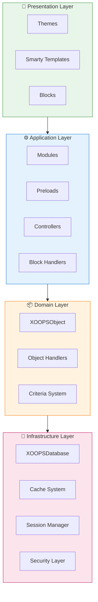
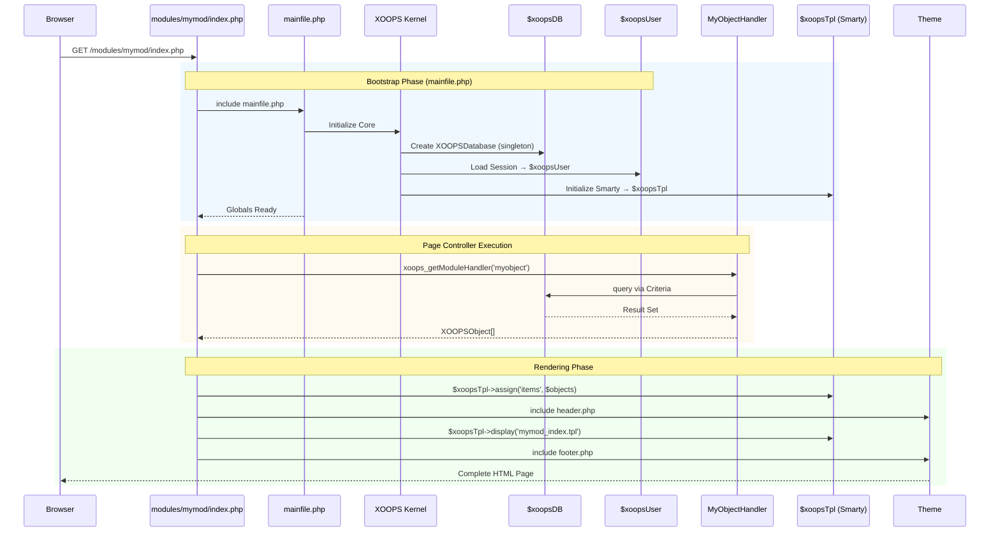

:::poznámka[O tomto dokumentu]
Tato stránka popisuje **koncepční architekturu** XOOPS, která platí pro aktuální (2.5.x) i budoucí (4.0.x) verze. Některé diagramy ukazují vrstvenou vizi návrhu.

**Podrobnosti o konkrétní verzi:**
- **XOOPS 2.5.x Dnes:** Používá `mainfile.php`, globals (`$xoopsDB`, `$xoopsUser`), předběžné načtení a vzor manipulátoru
- **XOOPS 4.0 Cíl:** PSR-15 middleware, DI kontejner, router – viz [Celový plán](../../07-XOOPS-4.0/XOOPS-4.0-Roadmap.md)
:::

Tento dokument poskytuje komplexní přehled architektury systému XOOPS a vysvětluje, jak různé komponenty spolupracují na vytvoření flexibilního a rozšiřitelného systému správy obsahu.

## Přehled

XOOPS sleduje modulární architekturu, která rozděluje zájmy do odlišných vrstev. Systém je postaven na několika základních principech:

- **Modularita**: Funkčnost je uspořádána do nezávislých, instalovatelných modulů
- **Rozšiřitelnost**: Systém lze rozšířit bez úpravy kódu jádra
- **Abstrakce**: Databázové a prezentační vrstvy jsou abstrahovány od obchodní logiky
- **Zabezpečení**: Vestavěné bezpečnostní mechanismy chrání před běžnými zranitelnostmi

## Systémové vrstvy



### 1. Prezentační vrstva

Prezentační vrstva se stará o vykreslování uživatelského rozhraní pomocí šablonového enginu Smarty.

**Klíčové komponenty:**
- **Motivy**: Vizuální styl a rozvržení
- **Smarty Templates**: Dynamické vykreslování obsahu
- **Blocks**: Opakovaně použitelné widgety obsahu

### 2. Aplikační vrstva

Aplikační vrstva obsahuje obchodní logiku, řadiče a funkčnost modulů.

**Klíčové komponenty:**
- **Moduly**: Samostatné balíčky funkcí
- **Handlers**: Třídy manipulace s daty
- **Preloads**: Posluchače událostí a háčky

### 3. Doménová vrstva

Vrstva domény obsahuje základní obchodní objekty a pravidla.

**Klíčové komponenty:**
- **XOOPSObject**: Základní třída pro všechny objekty domény
- **Handlers**: Operace CRUD pro objekty domény

### 4. Vrstva infrastruktury

Vrstva infrastruktury poskytuje základní služby, jako je přístup k databázi a ukládání do mezipaměti.

## Žádost o životní cyklus

Pochopení životního cyklu požadavku je zásadní pro efektivní vývoj XOOPS.

### Tok řadiče stránky XOOPS 2.5.x

Aktuální XOOPS 2.5.x používá vzor **Page Controller**, kde každý soubor PHP zpracovává svůj vlastní požadavek. Globals (`$xoopsDB`, `$xoopsUser`, `$xoopsTpl` atd.) jsou inicializovány během bootstrapu a jsou dostupné po celou dobu provádění.



### Klíčové globální hodnoty v 2.5.x

| Globální | Typ | Inicializováno | Účel |
|--------|------|-------------|---------|
| `$xoopsDB` | `XOOPSDatabase` | Bootstrap | Připojení k databázi (singleton) |
| `$xoopsUser` | `XOOPSUser\|null` | Načtení relace | Aktuálně přihlášený uživatel |
| `$xoopsTpl` | `XOOPSTpl` | Šablona init | Smarty šablonový engine |
| `$xoopsModule` | `XOOPSModule` | Zatížení modulu | Aktuální kontext modulu |
| `$xoopsConfig` | `array` | Načtení konfigurace | Konfigurace systému |

:::note[XOOPS 4.0 srovnání]
V XOOPS 4.0 je vzor řadiče stránky nahrazen **PSR-15 Middleware Pipeline** a dispečinkem založeným na směrovači. Globální hodnoty jsou nahrazeny injekcí závislosti. Záruky kompatibility během migrace naleznete v [Smlouva o hybridním režimu](../../07-XOOPS-4.0/Specifications/Hybrid-Mode-Contract.md).
:::

### 1. Fáze bootstrapu

```php
// mainfile.php is the entry point
include_once XOOPS_ROOT_PATH . '/mainfile.php';

// Core initialization
$xoops = XOOPS::getInstance();
$xoops->boot();
```

**Kroky:**
1. Načíst konfiguraci (`mainfile.php`)
2. Inicializujte autoloader
3. Nastavte zpracování chyb
4. Navažte připojení k databázi
5. Načtěte uživatelskou relaci
6. Inicializujte modul šablony Smarty

### 2. Fáze směrování

```php
// Request routing to appropriate module
$module = $GLOBALS['xoopsModule'];
$controller = $module->getController();
$controller->dispatch($request);
```

**Kroky:**
1. Požadavek na analýzu URL
2. Identifikujte cílový modul
3. Načtěte konfiguraci modulu
4. Zkontrolujte oprávnění
5. Nasměrujte k příslušnému psovodu

### 3. Fáze provádění

```php
// Controller execution
$data = $handler->getObjects($criteria);
$xoopsTpl->assign('items', $data);
```

**Kroky:**
1. Proveďte logiku ovladače
2. Interakce s datovou vrstvou
3. Zpracovat obchodní pravidla
4. Připravte data zobrazení

### 4. Fáze vykreslování

```php
// Template rendering
include XOOPS_ROOT_PATH . '/header.php';
$xoopsTpl->display('db:module_template.tpl');
include XOOPS_ROOT_PATH . '/footer.php';
```

**Kroky:**
1. Použijte rozložení motivu
2. Šablona modulu vykreslení
3. Procesní bloky
4. Odezva výstupu

## Základní komponenty

### XOOPSObjectZákladní třída pro všechny datové objekty v XOOPS.

```php
<?php
class MyModuleItem extends XOOPSObject
{
    public function __construct()
    {
        $this->initVar('id', XOBJ_DTYPE_INT, null, false);
        $this->initVar('title', XOBJ_DTYPE_TXTBOX, '', true, 255);
        $this->initVar('content', XOBJ_DTYPE_TXTAREA, '', false);
        $this->initVar('created', XOBJ_DTYPE_INT, time(), false);
    }
}
```

**Klíčové metody:**
- `initVar()` - Definujte vlastnosti objektu
- `getVar()` - Načtení hodnot vlastností
- `setVar()` - Nastavte hodnoty vlastností
- `assignVars()` - Hromadné přiřazení z pole

### XOOPSPersitableObjectHandler

Zvládá operace CRUD pro instance XOOPSObject.

```php
<?php
class MyModuleItemHandler extends XOOPSPersistableObjectHandler
{
    public function __construct(\XOOPSDatabase $db)
    {
        parent::__construct($db, 'mymodule_items', 'MyModuleItem', 'id', 'title');
    }

    public function getActiveItems($limit = 10)
    {
        $criteria = new CriteriaCompo();
        $criteria->add(new Criteria('status', 1));
        $criteria->setSort('created');
        $criteria->setOrder('DESC');
        $criteria->setLimit($limit);

        return $this->getObjects($criteria);
    }
}
```

**Klíčové metody:**
- `create()` - Vytvořte novou instanci objektu
- `get()` - Načtení objektu podle ID
- `insert()` - Uložení objektu do databáze
- `delete()` - Odebrat objekt z databáze
- `getObjects()` - Načtení více objektů
- `getCount()` - Počítání odpovídajících objektů

### Struktura modulu

Každý modul XOOPS má standardní adresářovou strukturu:

```
modules/mymodule/
├── class/                  # PHP classes
│   ├── MyModuleItem.php
│   └── MyModuleItemHandler.php
├── include/                # Include files
│   ├── common.php
│   └── functions.php
├── templates/              # Smarty templates
│   ├── mymodule_index.tpl
│   └── mymodule_item.tpl
├── admin/                  # Admin area
│   ├── index.php
│   └── menu.php
├── language/               # Translations
│   └── english/
│       ├── main.php
│       └── modinfo.php
├── sql/                    # Database schema
│   └── mysql.sql
├── xoops_version.php       # Module info
├── index.php               # Module entry
└── header.php              # Module header
```

## Závislý vstřikovací kontejner

Moderní vývoj XOOPS může využít vkládání závislostí pro lepší testovatelnost.

### Základní implementace kontejneru

```php
<?php
class XOOPSDependencyContainer
{
    private array $services = [];

    public function register(string $name, callable $factory): void
    {
        $this->services[$name] = $factory;
    }

    public function resolve(string $name): mixed
    {
        if (!isset($this->services[$name])) {
            throw new \InvalidArgumentException("Service not found: $name");
        }

        $factory = $this->services[$name];

        if (is_callable($factory)) {
            return $factory($this);
        }

        return $factory;
    }

    public function has(string $name): bool
    {
        return isset($this->services[$name]);
    }
}
```

### Kompatibilní kontejner PSR-11

```php
<?php
namespace XMF\Di;

use Psr\Container\ContainerInterface;

class BasicContainer implements ContainerInterface
{
    protected array $definitions = [];

    public function set(string $id, mixed $value): void
    {
        $this->definitions[$id] = $value;
    }

    public function get(string $id): mixed
    {
        if (!$this->has($id)) {
            throw new \InvalidArgumentException("Service not found: $id");
        }

        $entry = $this->definitions[$id];

        if (is_callable($entry)) {
            return $entry($this);
        }

        return $entry;
    }

    public function has(string $id): bool
    {
        return isset($this->definitions[$id]);
    }
}
```

### Příklad použití

```php
<?php
// Service registration
$container = new XOOPSDependencyContainer();

$container->register('database', function () {
    return XOOPSDatabaseFactory::getDatabaseConnection();
});

$container->register('userHandler', function ($c) {
    return new XOOPSUserHandler($c->resolve('database'));
});

// Service resolution
$userHandler = $container->resolve('userHandler');
$user = $userHandler->get($userId);
```

## Body rozšíření

XOOPS poskytuje několik mechanismů rozšíření:

### 1. Předpětí

Předběžné načtení umožňuje modulům připojit se k hlavním událostem.

```php
<?php
// modules/mymodule/preloads/core.php
class MymoduleCorePreload extends XOOPSPreloadItem
{
    public static function eventCoreHeaderEnd($args)
    {
        // Execute when header processing ends
    }

    public static function eventCoreFooterStart($args)
    {
        // Execute when footer processing starts
    }
}
```

### 2. Pluginy

Pluginy rozšiřují specifické funkce v rámci modulů.

```php
<?php
// modules/mymodule/plugins/notify.php
class MymoduleNotifyPlugin
{
    public function onItemCreate($item)
    {
        // Send notification when item is created
    }
}
```

### 3. Filtry

Filtry upravují data při průchodu systémem.

```php
<?php
// Content filter example
$myts = MyTextSanitizer::getInstance();
$content = $myts->displayTarea($rawContent, 1, 1, 1);
```

## Nejlepší postupy

### Organizace kódu

1. **Použijte jmenné prostory** pro nový kód: 
   
```php
   namespace XOOPSModules\MyModule;

   class Item extends \XOOPSObject
   {
       // Implementation
   }
   
```

2. **Následujte automatické načítání PSR-4**:
   
```json
   {
       "autoload": {
           "psr-4": {
               "XOOPSModules\\MyModule\\": "class/"
           }
       }
   }
   
```

3. **Samostatné obavy**:
   - Doménová logika v `class/`
   - Prezentace v `templates/`
   - Ovladače v kořenovém adresáři modulu

### Výkon

1. **Používejte ukládání do mezipaměti** pro drahé operace
2. **Léné zatížení** zdrojů, pokud je to možné
3. **Minimalizujte databázové dotazy** pomocí dávkování kritérií
4. **Optimalizujte šablony** tím, že se vyhnete složité logice

### Zabezpečení

1. **Ověřte všechny vstupy** pomocí `XMF\Request`
2. **Escape výstup** v šablonách
3. **Použijte připravené příkazy** pro databázové dotazy
4. **Zkontrolujte oprávnění** před citlivými operacemi

## Související dokumentace

- [Design-Patterns](Design-Patterns.md) - Návrhové vzory použité v XOOPS
- [Databázová vrstva](../Database/Database-Layer.md) - Podrobnosti abstrakce databáze
- [Základy Smarty](../Templates/Smarty-Basics.md) - Šablona dokumentace systému
- [Bezpečnostní doporučené postupy](../Security/Security-Best-Practices.md) - Bezpečnostní pokyny

---

#xoops #architektura #core #design #system-design