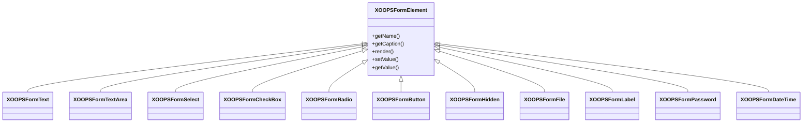

## Přehled

XOOPS poskytuje komplexní sadu formulářových prvků prostřednictvím své hierarchie tříd `XOOPSFormElement`. Tyto prvky zajišťují vykreslování, ověřování a zpracování dat pro webové formuláře.

## Hierarchie prvků formuláře



## Prvky pro zadávání textu

### XOOPSFormText

Jednořádkový textový vstup:

```php
use XOOPSFormText;

$element = new XOOPSFormText(
    caption: 'Username',
    name: 'username',
    size: 30,
    maxlength: 50,
    value: $currentValue
);
```

### XOOPSFormPassword

Zadání hesla s maskováním:

```php
use XOOPSFormPassword;

$element = new XOOPSFormPassword(
    caption: 'Password',
    name: 'password',
    size: 30,
    maxlength: 100
);
```

### XOOPSFormTextArea

Víceřádkový textový vstup:

```php
use XOOPSFormTextArea;

$element = new XOOPSFormTextArea(
    caption: 'Description',
    name: 'description',
    value: $currentValue,
    rows: 5,
    cols: 50
);
```

## Prvky výběru

### XOOPSFormSelect

Vyberte rozbalovací nabídku:

```php
use XOOPSFormSelect;

$element = new XOOPSFormSelect(
    caption: 'Category',
    name: 'category_id',
    value: $selected,
    size: 1,
    multiple: false
);

$element->addOption(1, 'Category 1');
$element->addOption(2, 'Category 2');
$element->addOptionArray([
    3 => 'Category 3',
    4 => 'Category 4'
]);
```

### XOOPSFormCheckBox

Vstup zaškrtávacího políčka:

```php
use XOOPSFormCheckBox;

$element = new XOOPSFormCheckBox(
    caption: 'Features',
    name: 'features',
    value: $selected
);

$element->addOption('comments', 'Enable Comments');
$element->addOption('ratings', 'Enable Ratings');
```

### XOOPSFormRadio

Skupina přepínacích tlačítek:

```php
use XOOPSFormRadio;

$element = new XOOPSFormRadio(
    caption: 'Status',
    name: 'status',
    value: $currentValue
);

$element->addOption('draft', 'Draft');
$element->addOption('published', 'Published');
$element->addOption('archived', 'Archived');
```

## Nahrání souboru

### XOOPSFormFile

Vstup pro nahrání souboru:

```php
use XOOPSFormFile;

$element = new XOOPSFormFile(
    caption: 'Upload Image',
    name: 'image'
);

$element->setMaxFileSize(2 * 1024 * 1024); // 2MB
```

## Datum a čas

### XOOPSFormDateTime

Date/time sběrač:

```php
use XOOPSFormDateTime;

$element = new XOOPSFormDateTime(
    caption: 'Publish Date',
    name: 'publish_date',
    size: 15,
    value: time()
);
```

## Speciální prvky

### XOOPSFormHidden

Skryté pole:

```php
use XOOPSFormHidden;

$element = new XOOPSFormHidden('article_id', $articleId);
```

### XOOPSFormLabel

Štítek pouze pro zobrazení:

```php
use XOOPSFormLabel;

$element = new XOOPSFormLabel(
    caption: 'Created By',
    value: $authorName
);
```

### XOOPSFormButton

Tlačítka formuláře:

```php
use XOOPSFormButton;

// Submit button
$submit = new XOOPSFormButton('', 'submit', 'Save', 'submit');

// Reset button
$reset = new XOOPSFormButton('', 'reset', 'Reset', 'reset');
```

## Přizpůsobení prvku

### Přidání tříd CSS

```php
$element->setExtra('class="form-control custom-class"');
```

### Přidání vlastních atributů

```php
$element->setExtra('data-validate="required" placeholder="Enter text..."');
```

### Popis nastavení

```php
$element->setDescription('Enter a unique username (3-20 characters)');
```

## Související dokumentace

- Přehled formulářů
- Ověření formuláře
- Vlastní renderery