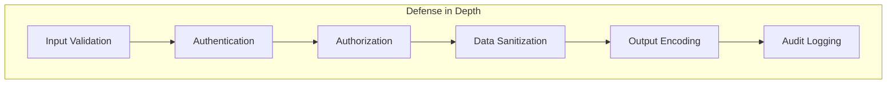

## Přehled

Tento dokument popisuje osvědčené bezpečnostní postupy pro vývoj XOOPS, které zahrnují ověřování vstupu, kódování výstupu, ověřování, autorizaci a ochranu proti běžným webovým zranitelnostem.

## Zásady zabezpečení



## Ověření vstupu

### Požádejte o dezinfekci

```php
use XOOPS\Core\Request;

// Always use typed getters
$id = Request::getInt('id', 0, 'GET');
$name = Request::getString('name', '', 'POST');
$email = Request::getEmail('email', '', 'POST');
$url = Request::getUrl('website', '', 'POST');

// Never use raw $_GET/$_POST/$_REQUEST
// Bad: $id = $_GET['id'];
// Good: $id = Request::getInt('id', 0, 'GET');
```

### Pravidla ověřování

```php
// Validate before use
if ($id <= 0) {
    throw new InvalidArgumentException('Invalid ID');
}

if (!preg_match('/^[a-zA-Z0-9_]{3,50}$/', $username)) {
    throw new InvalidArgumentException('Invalid username format');
}

// Use whitelist validation for enums
$allowedStatuses = ['draft', 'published', 'archived'];
if (!in_array($status, $allowedStatuses, true)) {
    throw new InvalidArgumentException('Invalid status');
}
```

## SQL Prevence vstřikování

### Použijte parametrizované dotazy

```php
// GOOD: Parameterized query
$sql = "SELECT * FROM {$xoopsDB->prefix('users')} WHERE uid = ?";
$result = $xoopsDB->query($sql, [$userId]);

// BAD: String concatenation (vulnerable!)
// $sql = "SELECT * FROM users WHERE uid = " . $userId;
```

### Použití objektů kritérií

```php
use Criteria;
use CriteriaCompo;

$criteria = new CriteriaCompo();
$criteria->add(new Criteria('status', 'published'));
$criteria->add(new Criteria('uid', $userId, '='));
$criteria->add(new Criteria('created', time() - 86400, '>'));

$articles = $articleHandler->getObjects($criteria);
```

## XSS Prevence

### Výstupní kódování

```php
use XOOPS\Core\Text\Sanitizer;

// HTML context
$safeName = htmlspecialchars($userName, ENT_QUOTES, 'UTF-8');

// In templates (auto-escaped)
{$userName|escape}

// For rich content
$sanitizer = Sanitizer::getInstance();
$safeContent = $sanitizer->sanitizeForDisplay($content);
```

### Zásady zabezpečení obsahu

```php
// Set CSP headers
header("Content-Security-Policy: default-src 'self'; script-src 'self'; style-src 'self' 'unsafe-inline'");
```

## Ochrana CSRF

### Implementace tokenu

```php
// Generate token
use XOOPS\Core\Security;

$token = Security::createToken();

// In form
echo '<input type="hidden" name="XOOPS_TOKEN_REQUEST" value="' . $token . '">';

// Verify on submission
if (!Security::checkToken()) {
    die('Security token mismatch');
}
```

### Pomocí XOOPSFormu

```php
// Automatically adds CSRF token
$form = new XOOPSThemeForm('Edit Article', 'articleform', 'save.php');
$form->addElement(new XOOPSFormHiddenToken());
```

## Autentizace

### Zpracování hesel

```php
// Hash passwords (PHP 5.5+)
$hashedPassword = password_hash($plainPassword, PASSWORD_ARGON2ID);

// Verify passwords
if (password_verify($plainPassword, $storedHash)) {
    // Password correct
}

// Check if rehash needed
if (password_needs_rehash($storedHash, PASSWORD_ARGON2ID)) {
    $newHash = password_hash($plainPassword, PASSWORD_ARGON2ID);
    // Update stored hash
}
```

### Zabezpečení relace

```php
// Regenerate session ID after login
session_regenerate_id(true);

// Set secure session cookie options
ini_set('session.cookie_httponly', 1);
ini_set('session.cookie_secure', 1);
ini_set('session.cookie_samesite', 'Lax');
```

## Autorizace

### Kontroly oprávnění

```php
// Check module admin
if (!$xoopsUser || !$xoopsUser->isAdmin($xoopsModule->mid())) {
    redirect_header('index.php', 3, 'Access denied');
}

// Check group permissions
$grouppermHandler = xoops_getHandler('groupperm');
$groups = $xoopsUser ? $xoopsUser->getGroups() : [XOOPS_GROUP_ANONYMOUS];

if (!$grouppermHandler->checkRight('view_item', $itemId, $groups, $moduleId)) {
    throw new AccessDeniedException('Permission denied');
}
```

### Přístup na základě rolí

```php
class PermissionChecker
{
    public function canEdit(Article $article, ?XOOPSUser $user): bool
    {
        if (!$user) {
            return false;
        }

        // Admin can edit anything
        if ($user->isAdmin()) {
            return true;
        }

        // Author can edit their own
        if ($article->getAuthorId() === $user->uid()) {
            return true;
        }

        // Check editor permission
        return $this->hasPermission($user, 'article_edit');
    }
}
```

## Zabezpečení nahrávání souborů

```php
class SecureUploader
{
    private array $allowedMimeTypes = [
        'image/jpeg',
        'image/png',
        'image/gif'
    ];

    private array $allowedExtensions = ['jpg', 'jpeg', 'png', 'gif'];

    public function validate(array $file): bool
    {
        // Check file size
        if ($file['size'] > 2 * 1024 * 1024) {
            throw new FileTooLargeException();
        }

        // Verify MIME type
        $finfo = new finfo(FILEINFO_MIME_TYPE);
        $mimeType = $finfo->file($file['tmp_name']);

        if (!in_array($mimeType, $this->allowedMimeTypes, true)) {
            throw new InvalidFileTypeException();
        }

        // Check extension
        $extension = strtolower(pathinfo($file['name'], PATHINFO_EXTENSION));
        if (!in_array($extension, $this->allowedExtensions, true)) {
            throw new InvalidFileTypeException();
        }

        // Generate safe filename
        return true;
    }

    public function generateSafeFilename(string $original): string
    {
        $extension = strtolower(pathinfo($original, PATHINFO_EXTENSION));
        return bin2hex(random_bytes(16)) . '.' . $extension;
    }
}
```

## Protokolování auditu

```php
class SecurityLogger
{
    public function logAuthAttempt(string $username, bool $success, string $ip): void
    {
        $data = [
            'username' => $username,
            'success' => $success,
            'ip' => $ip,
            'user_agent' => $_SERVER['HTTP_USER_AGENT'] ?? '',
            'timestamp' => time()
        ];

        // Log to database or file
        $this->log('auth', $data);
    }

    public function logSensitiveAction(int $userId, string $action, array $context): void
    {
        $data = [
            'user_id' => $userId,
            'action' => $action,
            'context' => json_encode($context),
            'ip' => $_SERVER['REMOTE_ADDR'],
            'timestamp' => time()
        ];

        $this->log('audit', $data);
    }
}
```

## Bezpečnostní záhlaví

```php
// Recommended security headers
header('X-Content-Type-Options: nosniff');
header('X-Frame-Options: SAMEORIGIN');
header('X-XSS-Protection: 1; mode=block');
header('Referrer-Policy: strict-origin-when-cross-origin');
header('Permissions-Policy: geolocation=(), microphone=(), camera=()');

// HSTS (only for HTTPS sites)
if (isset($_SERVER['HTTPS']) && $_SERVER['HTTPS'] === 'on') {
    header('Strict-Transport-Security: max-age=31536000; includeSubDomains');
}
```

## Omezení sazby

```php
class RateLimiter
{
    public function check(string $key, int $maxAttempts, int $windowSeconds): bool
    {
        $cacheKey = 'rate_limit:' . $key;
        $attempts = (int) $this->cache->get($cacheKey, 0);

        if ($attempts >= $maxAttempts) {
            return false; // Rate limited
        }

        $this->cache->increment($cacheKey, 1, $windowSeconds);
        return true;
    }
}

// Usage
$limiter = new RateLimiter();
if (!$limiter->check('login:' . $ip, 5, 300)) {
    throw new TooManyRequestsException('Too many login attempts');
}
```

## Kontrolní seznam zabezpečení

- [ ] Všechny uživatelské vstupy byly ověřeny a dezinfikovány
- [ ] Parametrizované dotazy pro všechny databázové operace
- [ ] Výstupní kódování pro veškerý obsah vytvářený uživateli
- [ ] Tokeny CSRF na všech formulářích měnících stav
- [ ] Bezpečné hašování hesel (Argon2id)
- [ ] Zabezpečení relace nakonfigurováno
- [ ] Ověření nahrání souboru
- [ ] Nastavení záhlaví zabezpečení
- [ ] Bylo zavedeno omezení sazeb
- [ ] Protokolování auditu povoleno
- [ ] Chybové zprávy neunikají citlivé informace

## Související dokumentace

- Autentizační systém
- Systém povolení
- Ověření vstupu