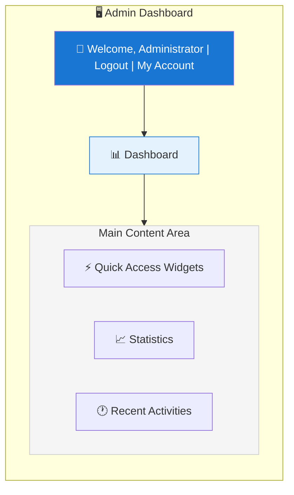
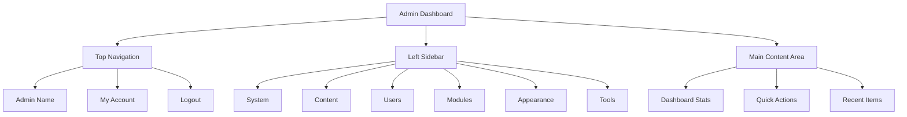

# XOOPS Přehled panelu administrátora

Kompletní průvodce navigací a používáním řídicího panelu správce XOOPS.

## Přístup k panelu administrátora

### Přihlášení správce

Otevřete prohlížeč a přejděte na:

```
http://your-domain.com/xoops/admin/
```

Nebo pokud je XOOPS v rootu:

```
http://your-domain.com/admin/
```

Zadejte přihlašovací údaje správce:

```
Username: [Your admin username]
Password: [Your admin password]
```

### Po přihlášení

Zobrazí se hlavní panel správce:



## Rozvržení panelu administrátora



## Komponenty palubní desky

### Horní lišta

Horní lišta obsahuje základní ovládací prvky:

| Prvek | Účel |
|---|---|
| **logo správce** | Kliknutím se vrátíte na hlavní panel |
| **Uvítací zpráva** | Zobrazuje jméno přihlášeného administrátora |
| **Můj účet** | Upravit profil a heslo správce |
| **Nápověda** | Přístupová dokumentace |
| **Odhlásit** | Odhlaste se z administrátorského panelu |

### Levý postranní navigační panel

Hlavní menu uspořádané podle funkcí:

```
├── System
│   ├── Dashboard
│   ├── Preferences
│   ├── Admin Users
│   ├── Groups
│   ├── Permissions
│   ├── Modules
│   └── Tools
├── Content
│   ├── Pages
│   ├── Categories
│   ├── Comments
│   └── Media Manager
├── Users
│   ├── Users
│   ├── User Requests
│   ├── Online Users
│   └── User Groups
├── Modules
│   ├── Modules
│   ├── Module Settings
│   └── Module Updates
├── Appearance
│   ├── Themes
│   ├── Templates
│   ├── Blocks
│   └── Images
└── Tools
    ├── Maintenance
    ├── Email
    ├── Statistics
    ├── Logs
    └── Backups
```

### Oblast hlavního obsahu

Zobrazuje informace a ovládací prvky pro vybranou sekci:

- Formuláře pro konfiguraci
- Datové tabulky se seznamy
- Grafy a statistiky
- Tlačítka rychlé akce
- Text nápovědy a popisky

### Widgety řídicího panelu

Rychlý přístup ke klíčovým informacím:

- **Informace o systému:** Verze PHP, Verze MySQL, Verze XOOPS
- **Rychlá statistika:** Počet uživatelů, celkový počet příspěvků, nainstalované moduly
- **Nedávná aktivita:** Nejnovější přihlášení, změny obsahu, chyby
- **Stav serveru:** CPU, paměť, využití disku
- **Oznámení:** Systémová upozornění, čekající aktualizace

## Základní funkce správce

### Správa systému

**Umístění:** Systém > [Různé možnosti]

#### Předvolby

Nakonfigurujte základní nastavení systému:

```
System > Preferences > [Settings Category]
```

Kategorie:
- Obecná nastavení (název webu, časové pásmo)
- Uživatelské nastavení (registrace, profily)
- Nastavení e-mailu (konfigurace SMTP)
- Nastavení mezipaměti (možnosti ukládání do mezipaměti)
- Nastavení URL (přátelské adresy URL)
- Meta Tagy (nastavení SEO)

Viz Základní konfigurace a nastavení systému.

#### Administrátoři

Správa administrátorských účtů:

```
System > Admin Users
```

Funkce:
- Přidat nové správce
- Upravit profily administrátorů
- Změňte hesla správce
- Smazat účty správce
- Nastavte oprávnění správce

### Správa obsahu

**Umístění:** Obsah > [Různé možnosti]

#### Pages/Articles

Správa obsahu webu:

```
Content > Pages (or your module)
```

Funkce:
- Vytvořte nové stránky
- Upravit stávající obsah
- Odstraňte stránky
- Publish/unpublish
- Nastavte kategorie
- Správa revizí

#### Kategorie

Uspořádat obsah:

```
Content > Categories
```

Funkce:
- Vytvořte hierarchii kategorií
- Upravit kategorie
- Odstranit kategorie
- Přiřadit ke stránkám

#### Komentáře

Moderovat komentáře uživatelů:

```
Content > Comments
```

Funkce:
- Zobrazit všechny komentáře
- Schvalovat komentáře
- Upravit komentáře
- Smazat spam
- Blokovat komentátory

### Správa uživatelů

**Umístění:** Uživatelé > [Různé možnosti]

#### Uživatelé

Spravovat uživatelské účty:

```
Users > Users
```

Funkce:
- Zobrazit všechny uživatele
- Vytvořte nové uživatele
- Upravit uživatelské profily
- Smazat účty
- Resetovat hesla
- Změna stavu uživatele
- Přiřadit do skupin

#### Online uživatelé

Sledujte aktivní uživatele:

```
Users > Online Users
```

pořady:
- Aktuálně online uživatelé
- Čas poslední aktivity
- IP adresa
– Umístění uživatele (pokud je nakonfigurováno)

#### Skupiny uživatelů

Správa uživatelských rolí a oprávnění:

```
Users > Groups
```

Funkce:
- Vytvořte vlastní skupiny
- Nastavte oprávnění skupiny
- Přiřaďte uživatele do skupin
- Odstraňte skupiny

### Správa modulů

**Umístění:** Moduly > [Různé možnosti]

#### Moduly

Instalace a konfigurace modulů:

```
Modules > Modules
```

Funkce:
- Zobrazit nainstalované moduly
- Moduly Enable/disable
- Aktualizace modulů
- Konfigurace nastavení modulu
- Nainstalujte nové moduly
- Zobrazit podrobnosti modulu

#### Zkontrolujte aktualizace

```
Modules > Modules > Check for Updates
```

Zobrazuje:
- Dostupné aktualizace modulů
- Seznam změn
- Možnosti stahování a instalace

### Správa vzhledu

**Umístění:** Vzhled > [Různé možnosti]

#### Motivy

Spravovat témata webu:

```
Appearance > Themes
```

Funkce:
- Zobrazit nainstalovaná témata
- Nastavit výchozí motiv
- Nahrajte nová témata
- Odstraňte témata
- Náhled tématu
- Konfigurace motivu

#### Bloky

Správa bloků obsahu:

```
Appearance > Blocks
```

Funkce:
- Vytvářejte vlastní bloky
- Upravit obsah bloku
- Uspořádejte bloky na stránce
- Nastavte viditelnost bloku
- Odstraňte bloky
- Konfigurace ukládání do mezipaměti bloků

#### Šablony

Správa šablon (pokročilé):

```
Appearance > Templates
```

Pro pokročilé uživatele a vývojáře.

### Systémové nástroje

**Umístění:** Systém > Nástroje

#### Režim údržbyZabránit přístupu uživatele během údržby:

```
System > Maintenance Mode
```

Konfigurace:
- Údržba Enable/disable
- Vlastní zpráva o údržbě
- Povolené IP adresy (pro testování)

#### Správa databáze

```
System > Database
```

Funkce:
- Zkontrolujte konzistenci databáze
- Spusťte aktualizace databáze
- Opravárenské stoly
- Optimalizace databáze
- Export struktury databáze

#### Protokoly aktivit

```
System > Logs
```

Monitor:
- Aktivita uživatele
- Administrativní úkony
- Systémové události
- Protokoly chyb

## Rychlé akce

Běžné úlohy přístupné z řídicího panelu:

```
Quick Links:
├── Create New Page
├── Add New User
├── Create Content Block
├── Upload Image
├── Send Mass Email
├── Update All Modules
└── Clear Cache
```

## Klávesové zkratky panelu administrátora

Rychlá navigace:

| Zkratka | Akce |
|---|---|
| `Ctrl+H` | Přejít na pomoc |
| `Ctrl+D` | Přejít na řídicí panel |
| `Ctrl+Q` | Rychlé hledání |
| `Ctrl+L` | Odhlášení |

## Správa uživatelských účtů

### Můj účet

Přístup ke svému administrátorskému profilu:

1. Klikněte na "Můj účet" vpravo nahoře
2. Upravte informace o profilu:
   - E-mailová adresa
   - Skutečné jméno
   - Informace o uživateli
   - Avatar

### Změňte heslo

Změňte heslo správce:

1. Přejděte na **Můj účet**
2. Klikněte na "Změnit heslo"
3. Zadejte aktuální heslo
4. Zadejte nové heslo (dvakrát)
5. Klikněte na "Uložit"

**Bezpečnostní tipy:**
- Používejte silná hesla (16+ znaků)
- Zahrňte velká, malá písmena, čísla, symboly
- Změňte heslo každých 90 dní
- Nikdy nesdílejte přihlašovací údaje správce

### Odhlášení

Odhlásit se z administrátorského panelu:

1. Klikněte na "Odhlásit" vpravo nahoře
2. Budete přesměrováni na přihlašovací stránku

## Statistiky panelu administrátora

### Statistiky řídicího panelu

Rychlý přehled metrik webu:

| Metrické | Hodnota |
|--------|-------|
| Uživatelé online | 12 |
| Celkový počet uživatelů | 256 |
| Celkem příspěvků | 1,234 |
| Celkový počet komentářů | 5,678 |
| Moduly celkem | 8 |

### Stav systému

Informace o serveru a výkonu:

| Komponenta | Version/Value |
|-----------|---------------|
| Verze XOOPS | 2.5.11 |
| Verze PHP | 8.2.x |
| Verze MySQL | 8.0.x |
| Zatížení serveru | 0,45, 0,42 |
| Uptime | 45 dní |

### Nedávná aktivita

Časová osa nedávných událostí:

```
12:45 - Admin login
12:30 - New user registered
12:15 - Page published
12:00 - Comment posted
11:45 - Module updated
```

## Systém oznámení

### Upozornění pro administrátory

Přijímat oznámení pro:

- Registrace nových uživatelů
- Komentáře čekající na moderování
- Neúspěšné pokusy o přihlášení
- Systémové chyby
- Dostupné aktualizace modulu
- Problémy s databází
- Upozornění na místo na disku

Konfigurace upozornění:

**Systém > Předvolby > Nastavení e-mailu**

```
Notify Admin on Registration: Yes
Notify Admin on Comments: Yes
Notify Admin on Errors: Yes
Alert Email: admin@your-domain.com
```

## Běžné úkoly správce

### Vytvořit novou stránku

1. Přejděte na **Obsah > Stránky** (nebo příslušný modul)
2. Klikněte na "Přidat novou stránku"
3. Vyplňte:
   - Název
   - Obsah
   - Popis
   - Kategorie
   - Metadata
4. Klikněte na "Publikovat"

### Správa uživatelů

1. Přejděte na **Uživatelé > Uživatelé**
2. Zobrazit seznam uživatelů pomocí:
   - Uživatelské jméno
   - E-mail
   - Datum registrace
   - Poslední přihlášení
   - Stav

3. Kliknutím na uživatelské jméno:
   - Upravit profil
   - Změňte heslo
   - Upravit skupiny
   - uživatel Block/unblock

### Konfigurace modulu

1. Přejděte na **Moduly > Moduly**
2. Najděte modul v seznamu
3. Klikněte na název modulu
4. Klikněte na "Předvolby" nebo "Nastavení"
5. Nakonfigurujte možnosti modulu
6. Uložte změny

### Vytvořit nový blok

1. Přejděte na **Vzhled > Bloky**
2. Klikněte na "Přidat nový blok"
3. Zadejte:
   - Název bloku
   - Obsah bloku (povoleno HTML)
   - Pozice na stránce
   - Viditelnost (všechny stránky nebo konkrétní)
   - Modul (pokud existuje)
4. Klikněte na "Odeslat"

## Nápověda panelu administrátora

### Vestavěná dokumentace

Přístup k nápovědě z panelu administrátora:

1. Klikněte na tlačítko "Nápověda" v horní liště
2. Kontextová nápověda pro aktuální stránku
3. Odkazy na dokumentaci
4. Často kladené otázky

### Externí zdroje

- Oficiální stránky XOOPS: https://xoops.org/
- Komunitní fórum: https://xoops.org/modules/newbb/
- Úložiště modulů: https://xoops.org/modules/repository/
- Bugs/Issues: https://github.com/XOOPS/XOOPSCore/issues

## Přizpůsobení panelu administrátora

### Admin Téma

Vyberte téma administrátorského rozhraní:

**Systém > Předvolby > Obecná nastavení**

```
Admin Theme: [Select theme]
```

Dostupné motivy:
- Výchozí (světlý)
- Tmavý režim
- Vlastní témata

### Přizpůsobení řídicího panelu

Vyberte, které widgety se zobrazí:

**Hlavní panel > Přizpůsobit**

Vyberte:
- Systémové informace
- Statistiky
- Nedávná aktivita
- Rychlé odkazy
- Vlastní widgety

## Oprávnění panelu administrátora

Různé úrovně správce mají různá oprávnění:

| Role | Schopnosti |
|---|---|
| **Webmaster** | Plný přístup ke všem funkcím správce |
| **Admin** | Omezené funkce správce |
| **Moderátor** | Pouze moderování obsahu |
| **Editor** | Tvorba a úprava obsahu |

Spravovat oprávnění:**Systém > Oprávnění**

## Doporučené postupy zabezpečení pro panel administrátora

1. **Silné heslo:** Použijte heslo dlouhé 16 znaků
2. **Pravidelné změny:** Měňte heslo každých 90 dní
3. **Sledování přístupu:** Pravidelně kontrolujte protokoly „Admin Users“.
4. **Omezit přístup:** Pro zvýšení bezpečnosti přejmenujte složku admin
5. **Použijte HTTPS:** Vždy přistupovat k administraci přes HTTPS
6. **Seznam povolených IP adres:** Omezte přístup správce na konkrétní IP adresy
7. **Pravidelné odhlášení:** Po dokončení se odhlaste
8. **Zabezpečení prohlížeče:** Pravidelně vymazávejte mezipaměť prohlížeče

Viz Konfigurace zabezpečení.

## Panel pro odstraňování problémů

### Nelze získat přístup k panelu administrátora

**Řešení:**
1. Ověřte přihlašovací údaje
2. Vymažte mezipaměť prohlížeče a soubory cookie
3. Zkuste jiný prohlížeč
4. Zkontrolujte, zda je správná cesta ke složce admin
5. Ověřte oprávnění k souboru ve složce admin
6. Zkontrolujte připojení k databázi v mainfile.php

### Prázdná stránka správce

**Řešení:**
```bash
# Check PHP errors
tail -f /var/log/apache2/error.log

# Enable debug mode temporarily
sed -i "s/define('XOOPS_DEBUG', 0)/define('XOOPS_DEBUG', 1)/" /var/www/html/xoops/mainfile.php

# Check file permissions
ls -la /var/www/html/xoops/admin/
```

### Pomalý panel administrátora

**Řešení:**
1. Vymažte mezipaměť: **Systém > Nástroje > Vymazat mezipaměť**
2. Optimalizace databáze: **Systém > Databáze > Optimalizovat**
3. Zkontrolujte prostředky serveru: `htop`
4. Zkontrolujte pomalé dotazy v MySQL

### Modul se nezobrazuje

**Řešení:**
1. Ověřte nainstalovaný modul: **Moduly > Moduly**
2. Zkontrolujte aktivaci modulu
3. Ověřte přidělená oprávnění
4. Zkontrolujte, zda existují soubory modulu
5. Prohlédněte si protokoly chyb

## Další kroky

Po seznámení se s administrátorským panelem:

1. Vytvořte svou první stránku
2. Nastavte skupiny uživatelů
3. Nainstalujte další moduly
4. Nakonfigurujte základní nastavení
5. Implementujte zabezpečení

---

**Značky:** #admin-panel #dashboard #navigation #getting-started

**Související články:**
- ../Configuration/Basic-Configuration
- ../Configuration/System-Settings
- Vytvoření vaší první stránky
- Správa uživatelů
- Instalační moduly