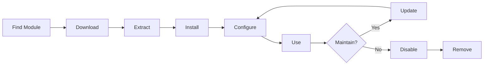

# Instalace a správa modulů XOOPS

Naučte se, jak rozšířit funkčnost XOOPS instalací a konfigurací modulů.

## Pochopení modulů XOOPS

### Co jsou moduly?

Moduly jsou rozšíření, která přidávají funkce k XOOPS:

| Typ | Účel | Příklady |
|---|---|---|
| **Obsah** | Správa konkrétních typů obsahu | Novinky, blog, vstupenky |
| **Společenství** | Interakce uživatele | Fórum, komentáře, recenze |
| **elektronický obchod** | Prodej výrobků | Obchod, košík, platby |
| **Média** | Rukojeť files/images | Galerie, soubory ke stažení, videa |
| **Nástroj** | Nástroje a pomocníci | E-mail, zálohování, analytika |

### Základní vs. volitelné moduly

| Modul | Typ | V ceně | Odnímatelné |
|---|---|---|---|
| **Systém** | Jádro | Ano | Ne |
| **Uživatel** | Jádro | Ano | Ne |
| **Profil** | Doporučeno | Ano | Ano |
| **PM (soukromá zpráva)** | Doporučeno | Ano | Ano |
| **WF-Kanál** | Volitelné | Často | Ano |
| **Novinky** | Volitelné | Ne | Ano |
| **Fórum** | Volitelné | Ne | Ano |

## Životní cyklus modulu



## Hledání modulů

### Úložiště modulů XOOPS

Oficiální úložiště modulů XOOPS:

**Navštivte:** https://xoops.org/modules/repository/

```
Directory > Modules > [Browse Categories]
```

Procházet podle kategorie:
- Správa obsahu
- Společenství
- elektronický obchod
- Multimédia
- Vývoj
- Správa stránek

### Hodnotící moduly

Před instalací zkontrolujte:

| Kritéria | Co hledat |
|---|---|
| **Kompatibilita** | Funguje s vaší verzí XOOPS |
| **Hodnocení** | Dobré uživatelské recenze a hodnocení |
| **Aktualizace** | Nedávno udržované |
| **Stažení** | Oblíbené a široce používané |
| **Požadavky** | Kompatibilní s vaším serverem |
| **Licence** | GPL nebo podobný open source |
| **Podpora** | Aktivní vývojář a komunita |

### Přečtěte si informace o modulu

Každý výpis modulu zobrazuje:

```
Module Name: [Name]
Version: [X.X.X]
Requires: XOOPS [Version]
Author: [Name]
Last Update: [Date]
Downloads: [Number]
Rating: [Stars]
Description: [Brief description]
Compatibility: PHP [Version], MySQL [Version]
```

## Instalace modulů

### Metoda 1: Instalace panelu správce

**Krok 1: Sekce přístupových modulů**

1. Přihlaste se do administračního panelu
2. Přejděte na **Moduly > Moduly**
3. Klikněte na **„Instalovat nový modul“** nebo **„Procházet moduly“**

**Krok 2: Nahrajte modul**

Možnost A – Přímé nahrání:
1. Klikněte na **"Vybrat soubor"**
2. Vyberte z počítače soubor .zip modulu
3. Klikněte na **Nahrát**

Možnost B – Nahrání URL:
1. Vložte modul URL
2. Klikněte na **Stáhnout a nainstalovat**

**Krok 3: Zkontrolujte informace o modulu**

```
Module Name: [Name shown]
Version: [Version]
Author: [Author info]
Description: [Full description]
Requirements: [PHP/MySQL versions]
```

Zkontrolujte a klikněte na **"Pokračovat v instalaci"**

**Krok 4: Vyberte typ instalace**

```
☐ Fresh Install (New installation)
☐ Update (Upgrade existing)
☐ Delete Then Install (Replace existing)
```

Vyberte vhodnou možnost.

**Krok 5: Potvrďte instalaci**

Zkontrolujte konečné potvrzení: 
```
Module will be installed to: /modules/modulename/
Database: xoops_db
Proceed? [Yes] [No]
```

Klikněte na **"Ano"** pro potvrzení.

**Krok 6: Instalace dokončena**

```
Installation successful!

Module: [Module Name]
Version: [Version]
Tables created: [Number]
Files installed: [Number]

[Go to Module Settings]  [Return to Modules]
```

### Metoda 2: Ruční instalace (pokročilá)

Pro ruční instalaci nebo odstraňování problémů:

**Krok 1: Stáhnout modul**

1. Stáhněte si modul .zip z úložiště
2. Extrahujte do `/var/www/html/xoops/modules/modulename/`

```bash
# Extract module
unzip module_name.zip
cp -r module_name /var/www/html/xoops/modules/

# Set permissions
chmod -R 755 /var/www/html/xoops/modules/module_name
```

**Krok 2: Spusťte instalační skript**

```
Visit: http://your-domain.com/xoops/modules/module_name/admin/index.php?op=install
```

Nebo přes admin panel (Systém > Moduly > Aktualizovat DB).

**Krok 3: Ověřte instalaci**

1. Přejděte na **Moduly > Moduly** v admin
2. Vyhledejte svůj modul v seznamu
3. Ověřte, že se zobrazuje jako „Aktivní“

## Konfigurace modulu

### Nastavení přístupového modulu

1. Přejděte na **Moduly > Moduly**
2. Najděte svůj modul
3. Klikněte na název modulu
4. Klikněte na **„Předvolby“** nebo **„Nastavení“**

### Společná nastavení modulu

Většina modulů nabízí:

```
Module Status: [Enabled/Disabled]
Display in Menu: [Yes/No]
Module Weight: [1-999](display order)
Visible To Groups: [Checkboxes for user groups]
```

### Možnosti specifické pro modul

Každý modul má jedinečné nastavení. Příklady:

**Zpravodajský modul:**
```
Items Per Page: 10
Show Author: Yes
Allow Comments: Yes
Moderation Required: Yes
```

**Modul fóra:**
```
Topics Per Page: 20
Posts Per Page: 15
Maximum Attachment Size: 5MB
Enable Signatures: Yes
```

**Modul galerie:**
```
Images Per Page: 12
Thumbnail Size: 150x150
Maximum Upload: 10MB
Watermark: Yes/No
```

Konkrétní možnosti naleznete v dokumentaci modulu.

### Uložit konfiguraci

Po úpravě nastavení:

1. Klikněte na **„Odeslat“** nebo **„Uložit“**
2. Zobrazí se potvrzení:
   
```
   Settings saved successfully!
   
```

## Správa bloků modulů

Mnoho modulů vytváří „bloky“ – oblasti obsahu podobné widgetům.

### Zobrazit bloky modulů

1. Přejděte na **Vzhled > Bloky**
2. Hledejte bloky z vašeho modulu
3. Většina modulů zobrazuje „[Název modulu] – [Popis bloku]“

### Konfigurace bloků

1. Klikněte na název bloku
2. Upravte:
   - Název bloku
   - Viditelnost (všechny stránky nebo konkrétní)
   - Pozice na stránce (vlevo, uprostřed, vpravo)
   - Skupiny uživatelů, kteří vidí
3. Klikněte na **"Odeslat"**

### Blok zobrazení na domovské stránce1. Přejděte na **Vzhled > Bloky**
2. Najděte požadovaný blok
3. Klikněte na **"Upravit"**
4. Nastavte:
   - **Viditelné pro:** Vyberte skupiny
   - **Pozice:** Vyberte sloupec (left/center/right)
   - **Stránky:** Domovská stránka nebo všechny stránky
5. Klikněte na **"Odeslat"**

## Příklady instalace konkrétních modulů

### Instalace modulu zpráv

**Ideální pro:** Blogové příspěvky, oznámení

1. Stáhněte si modul Novinky z úložiště
2. Nahrajte přes **Moduly > Moduly > Instalovat**
3. Nakonfigurujte v **Moduly > Zprávy > Předvolby**:
   - Příběhy na stránku: 10
   - Povolit komentáře: Ano
   - Schválit před zveřejněním: Ano
4. Vytvořte bloky pro nejnovější zprávy
5. Začněte publikovat příběhy!

### Instalace modulu fóra

**Ideální pro:** Komunitní diskuzi

1. Stáhněte si modul Fórum
2. Nainstalujte přes administrační panel
3. Vytvořte kategorie fóra v modulu
4. Konfigurace nastavení:
   - Topics/page: 20
   - Posts/page: 15
   - Povolit moderování: Ano
5. Přidělte oprávnění skupinám uživatelů
6. Vytvořte bloky pro nejnovější témata

### Instalace modulu galerie

**Ideální pro:** Prezentaci obrázků

1. Stáhněte si modul Galerie
2. Nainstalujte a nakonfigurujte
3. Vytvořte fotoalba
4. Nahrajte obrázky
5. Nastavte oprávnění pro viewing/uploading
6. Zobrazení galerie na webu

## Aktualizace modulů

### Zkontrolujte aktualizace

```
Admin Panel > Modules > Modules > Check for Updates
```

Toto ukazuje:
- Dostupné aktualizace modulů
- Aktuální vs. nová verze
- Poznámky Changelog/release

### Aktualizujte modul

1. Přejděte na **Moduly > Moduly**
2. Klikněte na modul s dostupnou aktualizací
3. Klikněte na tlačítko **"Aktualizovat"**
4. Vyberte **„Aktualizovat“ z Typ instalace**
5. Postupujte podle průvodce instalací
6. Modul aktualizován!

### Důležité poznámky k aktualizaci

Před aktualizací:

- [ ] Záložní databáze
- [ ] Záložní soubory modulu
- [ ] Prohlédněte si changelog
- [ ] Nejprve otestujte na pracovním serveru
- [ ] Poznamenejte si jakékoli vlastní úpravy

Po aktualizaci:
- [ ] Ověřte funkčnost
- [ ] Zkontrolujte nastavení modulu
- [ ] Recenze pro warnings/errors
- [ ] Vymazat mezipaměť

## Oprávnění modulu

### Přiřadit přístup ke skupině uživatelů

Určete, které skupiny uživatelů mohou přistupovat k modulům:

**Umístění:** Systém > Oprávnění

Pro každý modul nakonfigurujte:

```
Module: [Module Name]

Admin Access: [Select groups]
User Access: [Select groups]
Read Permission: [Groups allowed to view]
Write Permission: [Groups allowed to post]
Delete Permission: [Administrators only]
```

### Běžné úrovně oprávnění

```
Public Content (News, Pages):
├── Admin Access: Webmaster
├── User Access: All logged-in users
└── Read Permission: Everyone

Community Features (Forum, Comments):
├── Admin Access: Webmaster, Moderators
├── User Access: All logged-in users
└── Write Permission: All logged-in users

Admin Tools:
├── Admin Access: Webmaster only
└── User Access: Disabled
```

## Deaktivace a odebrání modulů

### Zakázat modul (zachovat soubory)

Ponechat modul, ale skrýt před webem:

1. Přejděte na **Moduly > Moduly**
2. Najděte modul
3. Klepněte na název modulu
4. Klikněte na **"Zakázat"** nebo nastavte stav na Neaktivní
5. Modul skrytý, ale data zachována

Kdykoli znovu povolit:
1. Klikněte na modul
2. Klikněte na **"Povolit"**

### Odstranit modul úplně

Smazat modul a jeho data:

1. Přejděte na **Moduly > Moduly**
2. Najděte modul
3. Klikněte na **„Odinstalovat“** nebo **„Odstranit“**
4. Potvrďte: "Smazat modul a všechna data?"
5. Potvrďte kliknutím na **"Ano"**

**Upozornění:** Odinstalace smaže všechna data modulu!

### Po odinstalaci znovu nainstalovat

Pokud modul odinstalujete:
- Soubory modulu byly smazány
- Databázové tabulky byly odstraněny
- Všechna data ztracena
- Pro opětovné použití je nutné přeinstalovat
- Lze obnovit ze zálohy

## Odstraňování problémů s instalací modulu

### Modul se po instalaci nezobrazuje

**Příznak:** Modul je uveden, ale není viditelný na webu

**Řešení:**
```
1. Check module is "Active" (Modules > Modules)
2. Enable module blocks (Appearance > Blocks)
3. Verify user permissions (System > Permissions)
4. Clear cache (System > Tools > Clear Cache)
5. Check .htaccess doesn't block module
```

### Chyba instalace: "Tabulka již existuje"

**Příznak:** Chyba během instalace modulu

**Řešení:**
```
1. Module partially installed before
2. Try "Delete then Install" option
3. Or uninstall first, then install fresh
4. Check database for existing tables:
   mysql> SHOW TABLES LIKE 'xoops_module%';
```

### Chybějící závislosti modulu

**Příznak:** Modul nelze nainstalovat – vyžaduje jiný modul

**Řešení:**
```
1. Note required modules from error message
2. Install required modules first
3. Then install the module
4. Install in correct order
```

### Prázdná stránka při přístupu k modulu

**Příznak:** Modul se načte, ale nic neukazuje

**Řešení:**
```
1. Enable debug mode in mainfile.php:
   define('XOOPS_DEBUG', 1);

2. Check PHP error log:
   tail -f /var/log/php_errors.log

3. Verify file permissions:
   chmod -R 755 /var/www/html/xoops/modules/modulename

4. Check database connection in module config

5. Disable module and reinstall
```

### Stránky s přerušeními modulů

**Příznak:** Instalace modulu přeruší web

**Řešení:**
```
1. Disable the problematic module immediately:
   Admin > Modules > [Module] > Disable

2. Clear cache:
   rm -rf /var/www/html/xoops/cache/*
   rm -rf /var/www/html/xoops/templates_c/*

3. Restore from backup if needed

4. Check error logs for root cause

5. Contact module developer
```

## Bezpečnostní aspekty modulu

### Instalujte pouze z důvěryhodných zdrojů

```
✓ Official XOOPS Repository
✓ GitHub official XOOPS modules
✓ Trusted module developers
✗ Unknown websites
✗ Unverified sources
```

### Zkontrolujte oprávnění modulu

Po instalaci:

1. Zkontrolujte kód modulu, zda nevykazuje podezřelou aktivitu
2. Zkontrolujte databázové tabulky, zda neobsahují anomálie
3. Sledujte změny souborů
4. Udržujte moduly aktualizované
5. Vyjměte nepoužité moduly

### Nejlepší postup pro oprávnění

```
Module directory: 755 (readable, not writable by web server)
Module files: 644 (readable only)
Module data: Protected by database
```

## Zdroje pro vývoj modulu

### Vývoj modulů učení

- Oficiální dokumentace: https://xoops.org/
- Úložiště GitHub: https://github.com/XOOPS/
- Komunitní fórum: https://xoops.org/modules/newbb/
- Příručka pro vývojáře: K dispozici ve složce docs

## Nejlepší postupy pro moduly1. **Instalujte po jednom:** Sledujte konflikty
2. **Otestujte po instalaci:** Ověřte funkčnost
3. **Document Custom Config:** Poznamenejte si svá nastavení
4. **Keep Updated:** Nainstalujte aktualizace modulů okamžitě
5. **Odstranit nepoužívané:** Odstranění modulů není potřeba
6. **Zálohovat před:** Před instalací vždy zálohujte
7. **Přečtěte si dokumentaci:** Zkontrolujte pokyny k modulu
8. **Připojit se ke komunitě:** V případě potřeby požádejte o pomoc

## Kontrolní seznam pro instalaci modulu

Pro každou instalaci modulu:

- [ ] Zkoumejte a čtěte recenze
- [ ] Ověřte kompatibilitu verze XOOPS
- [ ] Zálohování databáze a souborů
- [ ] Stáhněte si nejnovější verzi
- [ ] Instalovat přes admin panel
- [ ] Konfigurace nastavení
- [ ] Bloky Create/position
- [ ] Nastavte uživatelská oprávnění
- [ ] Test funkčnosti
- [ ] Konfigurace dokumentu
- [ ] Plán aktualizací

## Další kroky

Po instalaci modulů:

1. Vytvořte obsah pro moduly
2. Nastavte skupiny uživatelů
3. Prozkoumejte funkce správce
4. Optimalizujte výkon
5. Podle potřeby nainstalujte další moduly

---

**Značky:** #moduly #instalace #rozšíření #správa

**Související články:**
- Admin-Panel-Přehled
- Správa uživatelů
- Vytvoření vaší první stránky
- ../Configuration/System-Settings