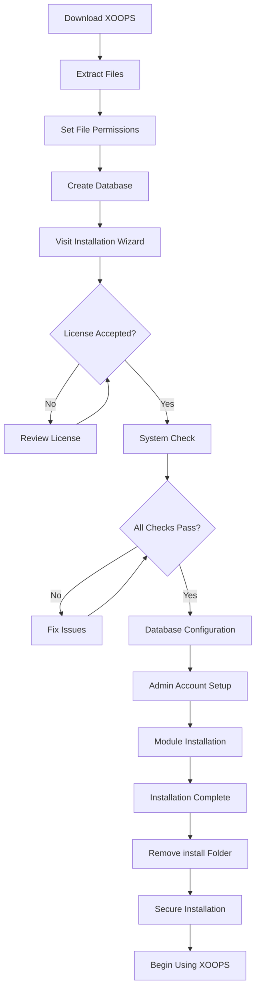

# Kompletní průvodce instalací XOOPS

Tato příručka poskytuje komplexní návod pro instalaci XOOPS od začátku pomocí instalačního průvodce.

## Předpoklady

Před zahájením instalace se ujistěte, že máte:

- Přístup k vašemu webovému serveru přes FTP nebo SSH
- Administrátorský přístup k vašemu databázovému serveru
- Registrovaný název domény
- Požadavky serveru ověřeny
- Dostupné nástroje pro zálohování

## Proces instalace



## Instalace krok za krokem

### Krok 1: Stáhněte si XOOPS

Stáhněte si nejnovější verzi z [https://xoops.org/](https://xoops.org/):

```bash
# Using wget
wget https://xoops.org/download/xoops-2.5.8.zip

# Using curl
curl -O https://xoops.org/download/xoops-2.5.8.zip
```

### Krok 2: Extrahujte soubory

Extrahujte archiv XOOPS do svého webového kořenového adresáře:

```bash
# Navigate to web root
cd /var/www/html

# Extract XOOPS
unzip xoops-2.5.8.zip

# Rename folder (optional, but recommended)
mv xoops-2.5.8 xoops
cd xoops
```

### Krok 3: Nastavte oprávnění k souboru

Nastavte správná oprávnění pro adresáře XOOPS:

```bash
# Make directories writable (755 for dirs, 644 for files)
find . -type d -exec chmod 755 {} \;
find . -type f -exec chmod 644 {} \;

# Make specific directories writable by web server
chmod 777 uploads/
chmod 777 templates_c/
chmod 777 var/
chmod 777 cache/

# Secure mainfile.php after installation
chmod 644 mainfile.php
```

### Krok 4: Vytvořte databázi

Vytvořte novou databázi pro XOOPS pomocí MySQL:

```sql
-- Create database
CREATE DATABASE xoops_db CHARACTER SET utf8mb4 COLLATE utf8mb4_unicode_ci;

-- Create user
CREATE USER 'xoops_user'@'localhost' IDENTIFIED BY 'secure_password_here';

-- Grant privileges
GRANT ALL PRIVILEGES ON xoops_db.* TO 'xoops_user'@'localhost';
FLUSH PRIVILEGES;
```

Nebo pomocí phpMyAdmin:

1. Přihlaste se do phpMyAdmin
2. Klikněte na záložku "Databáze".
3. Zadejte název databáze: `xoops_db`
4. Vyberte řazení "utf8mb4_unicode_ci".
5. Klikněte na "Vytvořit"
6. Vytvořte uživatele se stejným jménem jako databáze
7. Udělte všechna privilegia

### Krok 5: Spusťte Průvodce instalací

Otevřete prohlížeč a přejděte na:

```
http://your-domain.com/xoops/install/
```

#### Fáze kontroly systému

Průvodce zkontroluje konfiguraci serveru:

- Verze PHP >= 5.6.0
- MySQL/MariaDB k dispozici
- Požadovaná rozšíření PHP (GD, PDO atd.)
- Oprávnění k adresáři
- Databázová konektivita

**Pokud kontroly selžou:**

Řešení najdete v části #Common-Installation-Issues.

#### Konfigurace databáze

Zadejte přihlašovací údaje k databázi:

```
Database Host: localhost
Database Name: xoops_db
Database User: xoops_user
Database Password: [your_secure_password]
Table Prefix: xoops_
```

**Důležité poznámky:**
- Pokud se hostitel vaší databáze liší od hostitele localhost (např. vzdálený server), zadejte správný název hostitele
- Předpona tabulky pomáhá při spuštění více instancí XOOPS v jedné databázi
- Používejte silné heslo se smíšenými velkými a malými písmeny, čísly a symboly

#### Nastavení účtu správce

Vytvořte si účet správce:

```
Admin Username: admin (or choose custom)
Admin Email: admin@your-domain.com
Admin Password: [strong_unique_password]
Confirm Password: [repeat_password]
```

**Doporučené postupy:**
- Použijte jedinečné uživatelské jméno, ne "admin"
- Použijte heslo s více než 16 znaky
- Uložte přihlašovací údaje v zabezpečeném správci hesel
- Nikdy nesdílejte přihlašovací údaje správce

#### Instalace modulu

Vyberte výchozí moduly k instalaci:

- **Systémový modul** (vyžadováno) - Funkčnost jádra XOOPS
- **User Module** (vyžadováno) - Správa uživatelů
- **Profilový modul** (doporučeno) - Uživatelské profily
- **Modul PM (soukromá zpráva)** (doporučeno) - Interní zasílání zpráv
- **WF-Channel Module** (volitelně) - Správa obsahu

Vyberte všechny doporučené moduly pro kompletní instalaci.

### Krok 6: Dokončete instalaci

Po všech krocích se zobrazí potvrzovací obrazovka:

```
Installation Complete!

Your XOOPS installation is ready to use.
Admin Panel: http://your-domain.com/xoops/admin/
User Panel: http://your-domain.com/xoops/
```

### Krok 7: Zabezpečte svou instalaci

#### Odebrat instalační složku

```bash
# Remove the install directory (CRITICAL for security)
rm -rf /var/www/html/xoops/install/

# Or rename it
mv /var/www/html/xoops/install/ /var/www/html/xoops/install.bak
```

**WARNING:** Nikdy nenechávejte instalační složku přístupnou v produkci!

#### Zabezpečené mainfile.php

```bash
# Make mainfile.php read-only
chmod 644 /var/www/html/xoops/mainfile.php

# Set ownership
chown www-data:www-data /var/www/html/xoops/mainfile.php
```

#### Nastavte správná oprávnění souboru

```bash
# Recommended production permissions
find . -type f -name "*.php" -exec chmod 644 {} \;
find . -type d -exec chmod 755 {} \;

# Writable directories for web server
chmod 777 uploads/ var/ cache/ templates_c/
```

#### Povolit HTTPS/SSL

Nakonfigurujte SSL na vašem webovém serveru (nginx nebo Apache).

**Pro Apache:**
```apache
<VirtualHost *:443>
    ServerName your-domain.com
    DocumentRoot /var/www/html/xoops

    SSLEngine on
    SSLCertificateFile /etc/ssl/certs/your-cert.crt
    SSLCertificateKeyFile /etc/ssl/private/your-key.key

    # Force HTTPS redirect
    <IfModule mod_rewrite.c>
        RewriteEngine On
        RewriteCond %{HTTPS} off
        RewriteRule ^(.*)$ https://%{HTTP_HOST}%{REQUEST_URI} [L,R=301]
    </IfModule>
</VirtualHost>
```

## Konfigurace po instalaci

### 1. Otevřete panel administrátora

Přejděte na: 
```
http://your-domain.com/xoops/admin/
```

Přihlaste se pomocí přihlašovacích údajů správce.

### 2. Nakonfigurujte základní nastavení

Nakonfigurujte následující:

- Název a popis webu
- E-mailová adresa správce
- Časové pásmo a formát data
- Optimalizace pro vyhledávače

### 3. Testovací instalace

- [ ] Navštivte domovskou stránku
- [ ] Zkontrolujte zatížení modulů
- [ ] Ověřte, že registrace uživatele funguje
- [ ] Otestujte funkce panelu administrátora
- [ ] Potvrďte, že SSL/HTTPS funguje

### 4. Naplánujte zálohování

Nastavte automatické zálohování:

```bash
# Create backup script (backup.sh)
#!/bin/bash
DATE=$(date +%Y%m%d_%H%M%S)
BACKUP_DIR="/backups/xoops"
XOOPS_DIR="/var/www/html/xoops"

# Backup database
mysqldump -u xoops_user -p[password] xoops_db > $BACKUP_DIR/db_$DATE.sql

# Backup files
tar -czf $BACKUP_DIR/files_$DATE.tar.gz $XOOPS_DIR

echo "Backup completed: $DATE"
```

Plán s cron:
```bash
# Daily backup at 2 AM
0 2 * * * /usr/local/bin/backup.sh
```

## Běžné problémy s instalací

### Problém: Chyby odepřeno oprávnění

**Příznak:** „Oprávnění odepřeno“ při nahrávání nebo vytváření souborů

**Řešení:**
```bash
# Check web server user
ps aux | grep apache  # For Apache
ps aux | grep nginx   # For Nginx

# Fix permissions (replace www-data with your web server user)
chown -R www-data:www-data /var/www/html/xoops
chmod -R 755 /var/www/html/xoops
chmod 777 uploads/ var/ cache/ templates_c/
```

### Problém: Připojení k databázi se nezdařilo

**Příznak:** "Nelze se připojit k databázovému serveru"

**Řešení:**
1. Ověřte přihlašovací údaje databáze v průvodci instalací
2. Zkontrolujte, zda MySQL/MariaDB běží: 
   
```bash
   service mysql status  # or mariadb
   
```
3. Ověřte existenci databáze:
   
```sql
   SHOW DATABASES;
   
```
4. Otestujte připojení z příkazového řádku: 
   
```bash
   mysql -h localhost -u xoops_user -p xoops_db
   
```

### Problém: Prázdná bílá obrazovka

**Příznak:** Při návštěvě XOOPS se zobrazí prázdná stránka**Řešení:**
1. Zkontrolujte protokoly chyb PHP: 
   
```bash
   tail -f /var/log/apache2/error.log
   
```
2. Povolte režim ladění v mainfile.php:
   
```php
   define('XOOPS_DEBUG', 1);
   
```
3. Zkontrolujte oprávnění k souborům mainfile.php a konfigurační soubory
4. Ověřte, zda je nainstalováno rozšíření PHP-MySQL

### Problém: Nelze zapisovat do adresáře pro nahrávání

**Příznak:** Funkce nahrávání selže, „Nelze zapisovat do nahraných souborů/“

**Řešení:**
```bash
# Check current permissions
ls -la uploads/

# Fix permissions
chmod 777 uploads/
chown www-data:www-data uploads/

# For specific files
chmod 644 uploads/*
```

### Problém: Chybí rozšíření PHP

**Příznak:** Kontrola systému se nezdaří s chybějícími příponami (GD, MySQL atd.)

**Řešení (Ubuntu/Debian):**
```bash
# Install PHP GD library
apt-get install php-gd

# Install PHP MySQL support
apt-get install php-mysql

# Restart web server
systemctl restart apache2  # or nginx
```

**Řešení (CentOS/RHEL):**
```bash
# Install PHP GD library
yum install php-gd

# Install PHP MySQL support
yum install php-mysql

# Restart web server
systemctl restart httpd
```

### Problém: Pomalý proces instalace

**Příznak:** Časový limit průvodce instalací vyprší nebo běží velmi pomalu

**Řešení:**
1. Zvyšte časový limit PHP v php.ini:
   
```ini
   max_execution_time = 300  # 5 minutes
   
```
2. Zvýšit MySQL max_allowed_packet:
   
```sql
   SET GLOBAL max_allowed_packet = 256M;
   
```
3. Zkontrolujte prostředky serveru:
   
```bash
   free -h  # Check RAM
   df -h    # Check disk space
   
```

### Problém: Panel administrátora není přístupný

**Příznak:** Po instalaci nelze získat přístup k panelu administrátora

**Řešení:**
1. Ověřte, že v databázi existuje uživatel admin:
   
```sql
   SELECT * FROM xoops_users WHERE uid = 1;
   
```
2. Vymažte mezipaměť prohlížeče a soubory cookie
3. Zkontrolujte, zda do složky relací lze zapisovat: 
   
```bash
   chmod 777 var/
   
```
4. Ověřte, zda pravidla htaccess neblokují přístup správce

## Kontrolní seznam pro ověření

Po instalaci ověřte:

- [x] Domovská stránka XOOPS se načte správně
- [x] Admin panel je přístupný na /xoops/admin/
- [x] SSL/HTTPS funguje
- [x] Instalační složka je odstraněna nebo není přístupná
- [x] Oprávnění k souboru jsou bezpečná (644 pro soubory, 755 pro adresáře)
- [x] Jsou naplánovány zálohy databáze
- [x] Moduly se načítají bez chyb
- [x] Systém registrace uživatelů funguje
- [x] Funkce nahrávání souborů funguje
- [x] E-mailová upozornění se odesílají správně

## Další kroky

Po dokončení instalace:

1. Přečtěte si Průvodce základní konfigurací
2. Zabezpečte instalaci
3. Prozkoumejte panel správce
4. Nainstalujte další moduly
5. Nastavte skupiny uživatelů a oprávnění

---

**Štítky:** #instalace #nastavení #začínáme #řešení problémů

**Související články:**
- Požadavky na server
- Upgrade-XOOPS
- ../Configuration/Security-Configuration