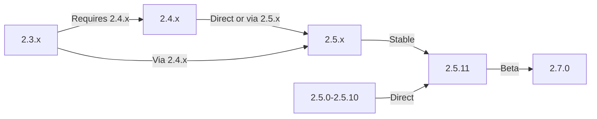

Tato příručka se zabývá upgradem XOOPS ze starších verzí na nejnovější verzi při zachování vašich dat a přizpůsobení.

> **Informace o verzi**
> - **Stabilní:** XOOPS 2.5.11
> - **Beta:** XOOPS 2.7.0 (testování)
> - **Budoucnost:** XOOPS 4.0 (ve vývoji – viz plán)

## Kontrolní seznam před upgradem

Před zahájením upgradu ověřte:

- [ ] Aktuální verze XOOPS zdokumentována
- [ ] Zjištěna cílová verze XOOPS
- [ ] Úplná záloha systému byla dokončena
- [ ] Záloha databáze ověřena
- [ ] Zaznamenán seznam nainstalovaných modulů
- [ ] Vlastní úpravy zdokumentovány
- [ ] K dispozici testovací prostředí
- [ ] Cesta upgradu zkontrolována (některé verze přeskakují přechodná vydání)
- [ ] Prostředky serveru ověřeny (dostatek místa na disku, paměti)
- [ ] Režim údržby povolen

## Průvodce upgradem

Různé cesty upgradu v závislosti na aktuální verzi:



**Důležité:** Nikdy nepřeskakujte hlavní verze. Při upgradu z 2.3.x nejprve upgradujte na 2.4.x a poté na 2.5.x.

## Krok 1: Dokončete zálohování systému

### Záloha databáze

K zálohování databáze použijte mysqldump:

```bash
# Full database backup
mysqldump -u xoops_user -p xoops_db > /backups/xoops_db_backup_$(date +%Y%m%d_%H%M%S).sql

# Compressed backup
mysqldump -u xoops_user -p xoops_db | gzip > /backups/xoops_db_backup_$(date +%Y%m%d_%H%M%S).sql.gz
```

Nebo pomocí phpMyAdmin:

1. Vyberte svou databázi XOOPS
2. Klikněte na kartu "Exportovat".
3. Zvolte formát „SQL“.
4. Vyberte „Uložit jako soubor“
5. Klikněte na „Přejít“

Ověřte záložní soubor:

```bash
# Check backup size
ls -lh /backups/xoops_db_backup*.sql

# Verify backup integrity (uncompressed)
head -20 /backups/xoops_db_backup_*.sql

# Verify compressed backup
zcat /backups/xoops_db_backup_*.sql.gz | head -20
```

### Záloha systému souborů

Zálohujte všechny soubory XOOPS:

```bash
# Compressed file backup
tar -czf /backups/xoops_files_$(date +%Y%m%d_%H%M%S).tar.gz /var/www/html/xoops

# Uncompressed (faster, requires more disk space)
tar -cf /backups/xoops_files_$(date +%Y%m%d_%H%M%S).tar /var/www/html/xoops

# Show backup progress
tar -czf /backups/xoops_files_$(date +%Y%m%d_%H%M%S).tar.gz --verbose /var/www/html/xoops | tail
```

Ukládejte zálohy bezpečně:

```bash
# Secure backup storage
chmod 600 /backups/xoops_*
ls -lah /backups/

# Optional: Copy to remote storage
scp /backups/xoops_* user@backup-server:/secure/backups/
```

### Test obnovení zálohy

**CRITICAL:** Vždy otestujte funkčnost zálohování:

```bash
# Verify tar archive contents
tar -tzf /backups/xoops_files_*.tar.gz | head -20

# Extract to test location
mkdir /tmp/restore_test
cd /tmp/restore_test
tar -xzf /backups/xoops_files_*.tar.gz

# Verify key files exist
ls -la xoops/mainfile.php
ls -la xoops/install/
```

## Krok 2: Povolte režim údržby

Zabránit uživatelům v přístupu k webu během upgradu:

### Možnost 1: XOOPS Admin Panel

1. Přihlaste se do administračního panelu
2. Přejděte do nabídky Systém > Údržba
3. Povolte „Režim údržby webu“
4. Nastavte zprávu údržby
5. Uložit

### Možnost 2: Režim ruční údržby

Vytvořte soubor údržby v kořenovém adresáři webu:

```html
<!-- /var/www/html/maintenance.html -->
<!DOCTYPE html>
<html>
<head>
    <title>Under Maintenance</title>
    <style>
        body { font-family: Arial; text-align: center; padding: 50px; }
        h1 { color: #333; }
        p { color: #666; margin: 20px 0; }
    </style>
</head>
<body>
    <h1>Site Under Maintenance</h1>
    <p>We're currently upgrading our site.</p>
    <p>Expected time: approximately 30 minutes.</p>
    <p>Thank you for your patience!</p>
</body>
</html>
```

Nakonfigurujte Apache tak, aby zobrazoval stránku údržby:

```apache
# In .htaccess or vhost config
ErrorDocument 503 /maintenance.html

# Redirect all traffic to maintenance page
<IfModule mod_rewrite.c>
    RewriteEngine On
    RewriteCond %{REMOTE_ADDR} !^192\.168\.1\.100$  # Your IP
    RewriteRule ^(.*)$ - [R=503,L]
</IfModule>
```

## Krok 3: Stáhněte si novou verzi

Stáhněte si XOOPS z oficiálních stránek:

```bash
# Download latest version
cd /tmp
wget https://xoops.org/download/xoops-2.5.8.zip

# Verify checksum (if provided)
sha256sum xoops-2.5.8.zip
# Compare with official SHA256 hash

# Extract to temporary location
unzip xoops-2.5.8.zip
cd xoops-2.5.8
```

## Krok 4: Příprava souboru před upgradem

### Identifikujte vlastní úpravy

Zkontrolujte přizpůsobené základní soubory:

```bash
# Look for modified files (files with newer mtime)
find /var/www/html/xoops -type f -newer /var/www/html/xoops/install.php

# Check for custom themes
ls /var/www/html/xoops/themes/
# Note any custom themes

# Check for custom modules
ls /var/www/html/xoops/modules/
# Note any custom modules created by you
```

### Aktuální stav dokumentu

Vytvořte zprávu o upgradu:

```bash
cat > /tmp/upgrade_report.txt << EOF
=== XOOPS Upgrade Report ===
Date: $(date)
Current Version: 2.5.6
Target Version: 2.5.8

=== Installed Modules ===
$(ls /var/www/html/xoops/modules/)

=== Custom Modifications ===
[Document any custom theme or module modifications]

=== Themes ===
$(ls /var/www/html/xoops/themes/)

=== Plugin Status ===
[List any custom code modifications]

EOF
```

## Krok 5: Sloučení nových souborů s aktuální instalací

### Strategie: Zachování vlastních souborů

Nahradit základní soubory XOOPS, ale zachovat:
- `mainfile.php` (konfigurace vaší databáze)
- Vlastní motivy v `themes/`
- Vlastní moduly v `modules/`
- Uživatel nahrává v `uploads/`
- Údaje o místě v `var/`

### Proces ručního sloučení

```bash
# Set variables
XOOPS_OLD="/var/www/html/xoops"
XOOPS_NEW="/tmp/xoops-2.5.8"
BACKUP="/backups/pre-upgrade"

# Create pre-upgrade backup in place
mkdir -p $BACKUP
cp -r $XOOPS_OLD/* $BACKUP/

# Copy new files (but preserve sensitive files)
# Copy everything except protected directories
rsync -av --exclude='mainfile.php' \
    --exclude='modules/custom*' \
    --exclude='themes/custom*' \
    --exclude='uploads' \
    --exclude='var' \
    --exclude='cache' \
    --exclude='templates_c' \
    $XOOPS_NEW/ $XOOPS_OLD/

# Verify critical files preserved
ls -la $XOOPS_OLD/mainfile.php
```

### Používání upgrade.php (pokud je k dispozici)

Některé verze XOOPS obsahují skript pro automatickou aktualizaci:

```bash
# Copy new files with installer
cp -r /tmp/xoops-2.5.8/* /var/www/html/xoops/

# Run upgrade wizard
# Visit: http://your-domain.com/xoops/upgrade/
```

### Oprávnění k souboru po sloučení

Obnovte správná oprávnění:

```bash
# Set ownership
chown -R www-data:www-data /var/www/html/xoops

# Set directory permissions
find /var/www/html/xoops -type d -exec chmod 755 {} \;

# Set file permissions
find /var/www/html/xoops -type f -exec chmod 644 {} \;

# Make writable directories
chmod 777 /var/www/html/xoops/cache
chmod 777 /var/www/html/xoops/templates_c
chmod 777 /var/www/html/xoops/uploads
chmod 777 /var/www/html/xoops/var

# Secure mainfile.php
chmod 644 /var/www/html/xoops/mainfile.php
```

## Krok 6: Migrace databáze

### Kontrola změn databáze

Zkontrolujte poznámky k vydání XOOPS pro změny struktury databáze:

```bash
# Extract and review SQL migration files
find /tmp/xoops-2.5.8 -name "*.sql" -type f
# Document all .sql files found
```

### Spusťte aktualizace databáze

### Možnost 1: Automatická aktualizace (pokud je k dispozici)

Použít panel administrátora:

1. Přihlaste se do admin
2. Přejděte na **Systém > Databáze**
3. Klikněte na „Zkontrolovat aktualizace“
4. Zkontrolujte nevyřízené změny
5. Klikněte na „Použít aktualizace“

### Možnost 2: Ruční aktualizace databáze

Proveďte migraci souborů SQL:

```bash
# Connect to database
mysql -u xoops_user -p xoops_db

# View pending changes (varies by version)
SELECT * FROM xoops_config WHERE conf_name LIKE '%version%';

# Run migration scripts manually if needed
SOURCE /tmp/xoops-2.5.8/migrate_2.5.6_to_2.5.8.sql;
```

### Ověření databáze

Po aktualizaci ověřte integritu databáze:

```sql
-- Check database consistency
REPAIR TABLE xoops_users;
OPTIMIZE TABLE xoops_users;

-- Verify key tables exist
SHOW TABLES LIKE 'xoops_%';

-- Check row counts (should increase or stay same)
SELECT COUNT(*) FROM xoops_users;
SELECT COUNT(*) FROM xoops_posts;
```

## Krok 7: Ověřte upgrade

### Kontrola domovské stránky

Navštivte svou domovskou stránku XOOPS:

```
http://your-domain.com/xoops/
```

Očekáváno: Stránka se načte bez chyb, zobrazí se správně

### Kontrola panelu administrátora

Přístup správce:

```
http://your-domain.com/xoops/admin/
```

Ověřte:
- [ ] Načte se panel správce
- [ ] Navigace funguje
- [ ] Ovládací panel se zobrazuje správně
- [ ] V protokolech nejsou žádné chyby databáze

### Ověření modulu

Zkontrolujte nainstalované moduly:

1. Přejděte na **Moduly > Moduly** v admin
2. Zkontrolujte, zda jsou všechny moduly stále nainstalovány
3. Zkontrolujte případné chybové zprávy
4. Povolte všechny moduly, které byly zakázány

### Kontrola souboru protokolu

Zkontrolujte systémové protokoly, zda neobsahují chyby:

```bash
# Check web server error log
tail -50 /var/log/apache2/error.log

# Check PHP error log
tail -50 /var/log/php_errors.log

# Check XOOPS system log (if available)
# In admin panel: System > Logs
```

### Testujte základní funkce

- [ ] Uživatel login/logout funguje
- [ ] Registrace uživatelů funguje
- [ ] Funkce nahrávání souborů
- [ ] Odeslání upozornění e-mailem
- [ ] Funkce vyhledávání funguje
- [ ] Funkční funkce správce
- [ ] Funkčnost modulu nedotčena

## Krok 8: Vyčištění po upgradu

### Odstraňte dočasné soubory

```bash
# Remove extraction directory
rm -rf /tmp/xoops-2.5.8

# Clear template cache (safe to delete)
rm -rf /var/www/html/xoops/templates_c/*

# Clear site cache
rm -rf /var/www/html/xoops/cache/*
```

### Odebrat režim údržbyZnovu povolte normální přístup k webu:

```apache
# Remove maintenance mode redirect from .htaccess
# Or delete maintenance.html file
rm /var/www/html/maintenance.html
```

### Aktualizace dokumentace

Aktualizujte své poznámky k upgradu:

```bash
# Document successful upgrade
cat >> /tmp/upgrade_report.txt << EOF

=== Upgrade Results ===
Status: SUCCESS
Upgrade Date: $(date)
New Version: 2.5.8
Duration: [time in minutes]

Post-Upgrade Tests:
- [x] Homepage loads
- [x] Admin panel accessible
- [x] Modules functional
- [x] User registration works
- [x] Database optimized

EOF
```

## Odstraňování problémů s upgrady

### Problém: Prázdná bílá obrazovka po upgradu

**Příznak:** Domovská stránka nic nezobrazuje

**Řešení:**
```bash
# Check PHP errors
tail -f /var/log/apache2/error.log

# Enable debug mode temporarily
echo "define('XOOPS_DEBUG', 1);" >> /var/www/html/xoops/mainfile.php

# Check file permissions
ls -la /var/www/html/xoops/mainfile.php

# Restore from backup if needed
cp /backups/xoops_files_*.tar.gz /tmp/
cd /tmp && tar -xzf xoops_files_*.tar.gz
```

### Problém: Chyba připojení k databázi

**Příznak:** Zpráva „Nelze se připojit k databázi“.

**Řešení:**
```bash
# Verify database credentials in mainfile.php
grep -i "database\|host\|user" /var/www/html/xoops/mainfile.php

# Test connection
mysql -h localhost -u xoops_user -p xoops_db -e "SELECT 1"

# Check MySQL status
systemctl status mysql

# Verify database still exists
mysql -u xoops_user -p -e "SHOW DATABASES" | grep xoops
```

### Problém: Panel administrátora není přístupný

**Příznak:** Nelze získat přístup /xoops/admin/

**Řešení:**
```bash
# Check .htaccess rules
cat /var/www/html/xoops/.htaccess

# Verify admin files exist
ls -la /var/www/html/xoops/admin/

# Check mod_rewrite enabled
apache2ctl -M | grep rewrite

# Restart web server
systemctl restart apache2
```

### Problém: Moduly se nenačítají

**Příznak:** Moduly vykazují chyby nebo jsou deaktivovány

**Řešení:**
```bash
# Verify module files exist
ls /var/www/html/xoops/modules/

# Check module permissions
ls -la /var/www/html/xoops/modules/*/

# Check module configuration in database
mysql -u xoops_user -p xoops_db -e "SELECT * FROM xoops_modules WHERE module_status = 0"

# Reactivate modules in admin panel
# System > Modules > Click module > Update Status
```

### Problém: Chyby odepřeno oprávnění

**Příznak:** „Oprávnění odepřeno“ při nahrávání nebo ukládání

**Řešení:**
```bash
# Check file ownership
ls -la /var/www/html/xoops/ | head -20

# Fix ownership
chown -R www-data:www-data /var/www/html/xoops

# Fix directory permissions
find /var/www/html/xoops -type d -exec chmod 755 {} \;

# Make cache/uploads writable
chmod 777 /var/www/html/xoops/cache
chmod 777 /var/www/html/xoops/templates_c
chmod 777 /var/www/html/xoops/uploads
chmod 777 /var/www/html/xoops/var
```

### Problém: Pomalé načítání stránky

**Příznak:** Stránky se po upgradu načítají velmi pomalu

**Řešení:**
```bash
# Clear all caches
rm -rf /var/www/html/xoops/cache/*
rm -rf /var/www/html/xoops/templates_c/*

# Optimize database
mysql -u xoops_user -p xoops_db << EOF
OPTIMIZE TABLE xoops_users;
OPTIMIZE TABLE xoops_posts;
OPTIMIZE TABLE xoops_config;
ANALYZE TABLE xoops_users;
EOF

# Check PHP error log for warnings
grep -i "deprecated\|warning" /var/log/php_errors.log | tail -20

# Increase PHP memory/execution time temporarily
# Edit php.ini:
memory_limit = 256M
max_execution_time = 300
```

## Postup vrácení zpět

Pokud upgrade kriticky selže, obnovte ze zálohy:

### Obnovit databázi

```bash
# Restore from backup
mysql -u xoops_user -p xoops_db < /backups/xoops_db_backup_YYYYMMDD_HHMMSS.sql

# Or from compressed backup
gunzip < /backups/xoops_db_backup_YYYYMMDD_HHMMSS.sql.gz | mysql -u xoops_user -p xoops_db

# Verify restoration
mysql -u xoops_user -p xoops_db -e "SELECT COUNT(*) FROM xoops_users"
```

### Obnovení systému souborů

```bash
# Stop web server
systemctl stop apache2

# Remove current installation
rm -rf /var/www/html/xoops/*

# Extract backup
cd /var/www/html
tar -xzf /backups/xoops_files_YYYYMMDD_HHMMSS.tar.gz

# Fix permissions
chown -R www-data:www-data xoops/
find xoops -type d -exec chmod 755 {} \;
find xoops -type f -exec chmod 644 {} \;
chmod 777 xoops/cache xoops/templates_c xoops/uploads xoops/var

# Start web server
systemctl start apache2

# Verify restoration
# Visit http://your-domain.com/xoops/
```

## Kontrolní seznam pro ověření upgradu

Po dokončení upgradu ověřte:

- [ ] Verze XOOPS aktualizována (zkontrolujte správce > Informace o systému)
- [ ] Domovská stránka se načte bez chyb
- [ ] Všechny moduly funkční
- [ ] Přihlášení uživatele funguje
- [ ] Přístupný panel správce
- [ ] Nahrávání souborů funguje
- [ ] E-mailová upozornění funkční
- [ ] Integrita databáze ověřena
- [ ] Oprávnění souboru jsou správná
- [ ] Režim údržby byl odstraněn
- [ ] Zálohy zajištěné a otestované
- [ ] Výkon přijatelný
- [ ] SSL/HTTPS funkční
- [ ] V protokolech nejsou žádné chybové zprávy

## Další kroky

Po úspěšném upgradu:

1. Aktualizujte všechny vlastní moduly na nejnovější verze
2. Prohlédněte si poznámky k verzi, zda neobsahují zastaralé funkce
3. Zvažte optimalizaci výkonu
4. Aktualizujte nastavení zabezpečení
5. Důkladně otestujte všechny funkce
6. Udržujte záložní soubory v bezpečí

---

**Značky:** #upgrade #maintenance #backup #database-migration

**Související články:**
- ../../06-Publisher-Module/User-Guide/Installation
- Požadavky na server
- ../Configuration/Basic-Configuration
- ../Configuration/Security-Configuration