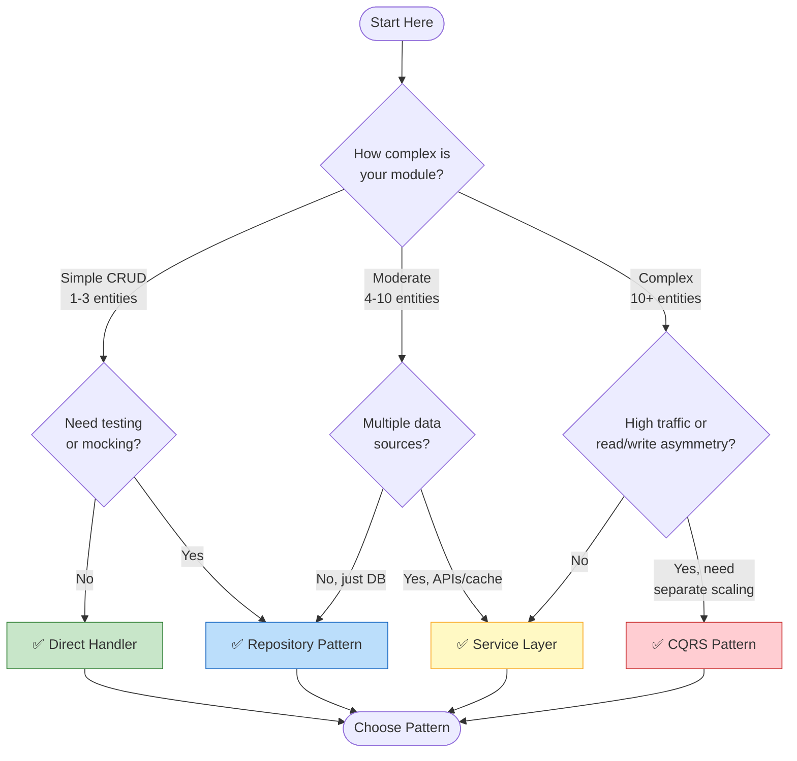
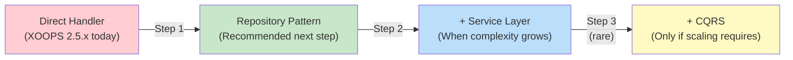

<span class="version-badge version-25x">2.5.x ✅</span> <span class="version-badge version-40x">4.0.x ✅</span>

> **Který vzor mám použít?** Tento rozhodovací strom vám pomůže vybrat mezi přímými obslužnými rutinami, vzorem úložiště, vrstvou služeb a CQRS.

---

## Strom rychlého rozhodování



---

## Porovnání vzorů

| Kritéria | Přímý manipulátor | Úložiště | Servisní vrstva | CQRS |
|----------|---------------|------------|---------------|------|
| **Složitost** | ⭐ | ⭐⭐ | ⭐⭐⭐ | ⭐⭐⭐⭐⭐ |
| **Testovatelnost** | ❌ Těžké | ✅ Dobré | ✅ Skvělé | ✅ Skvělé |
| **Flexibilita** | ❌ Nízká | ✅ Střední | ✅ Vysoká | ✅ Velmi vysoká |
| **XOOPS 2.5.x** | ✅ Nativní | ✅ Funguje | ✅ Funguje | ⚠️ Komplex |
| **XOOPS 4.0** | ⚠️ Zastaráno | ✅ Doporučeno | ✅ Doporučeno | ✅Pro vodní kámen |
| **Velikost týmu** | 1 vývoj | 1-3 vývojáři | 2-5 vývojářů | 5+ vývojářů |
| **Údržba** | ❌ Vyšší | ✅ Střední | ✅ Nižší | ⚠️ Vyžaduje odbornost |

---

## Kdy použít každý vzor

### ✅ Direct Handler (`XOOPSPersistableObjectHandler`)

**Nejlepší pro:** Jednoduché moduly, rychlé prototypy, učení XOOPS

```php
// Simple and direct - good for small modules
$handler = xoops_getModuleHandler('article', 'news');
$articles = $handler->getObjects(new Criteria('status', 1));
```

**Vyberte, když:**
- Vytvoření jednoduchého modulu s 1-3 databázovými tabulkami
- Vytvoření rychlého prototypu
- Jste jediný vývojář a nepotřebujete testy
- Modul se výrazně nezvětší

**Omezení:**
- Těžký test na jednotku (globální závislost)
- Těsná vazba na databázovou vrstvu XOOPS
- Obchodní logika má tendenci unikat do řídicích jednotek

---

### ✅ Vzor úložiště

**Nejlepší pro:** Většinu modulů, týmy, které chtějí testovatelnost

```php
// Abstraction allows mocking for tests
interface ArticleRepositoryInterface {
    public function findPublished(): array;
    public function save(Article $article): void;
}

class XOOPSArticleRepository implements ArticleRepositoryInterface {
    private $handler;

    public function __construct() {
        $this->handler = xoops_getModuleHandler('article', 'news');
    }

    public function findPublished(): array {
        return $this->handler->getObjects(new Criteria('status', 1));
    }
}
```

**Vyberte, když:**
- Chcete psát testy jednotek
- Zdroje dat můžete později změnit (DB → API)
- Práce s 2+ vývojáři
- Stavební moduly pro distribuci

**Cesta upgradu:** Toto je doporučený vzor pro přípravu XOOPS 4.0.

---

### ✅ Vrstva služeb

**Nejlepší pro:** Moduly se složitou obchodní logikou

```php
// Service coordinates multiple repositories and contains business rules
class ArticlePublicationService {
    public function __construct(
        private ArticleRepositoryInterface $articles,
        private NotificationServiceInterface $notifications,
        private CacheInterface $cache
    ) {}

    public function publish(int $articleId): void {
        $article = $this->articles->find($articleId);
        $article->setStatus('published');
        $article->setPublishedAt(new DateTime());

        $this->articles->save($article);
        $this->notifications->notifySubscribers($article);
        $this->cache->invalidate("article:{$articleId}");
    }
}
```

**Vyberte, když:**
- Operace zahrnují více zdrojů dat
- Obchodní pravidla jsou složitá
- Potřebujete správu transakcí
- Více částí aplikace dělá totéž

**Cesta upgradu:** V kombinaci s úložištěm získáte robustní architekturu.

---

### ⚠️ CQRS (Oddělení odpovědnosti za příkazový dotaz)

**Nejlepší pro:** Vysoce výkonné moduly s asymetrií read/write

```php
// Commands modify state
class PublishArticleCommand {
    public function __construct(
        public readonly int $articleId,
        public readonly int $publisherId
    ) {}
}

// Queries read state (can use denormalized read models)
class GetPublishedArticlesQuery {
    public function __construct(
        public readonly int $limit = 10
    ) {}
}
```

**Vyberte, když:**
- Čte výrazně převyšuje počet zápisů (100:1 nebo více)
- Potřebujete jiné měřítko pro čtení a zápis
- Komplexní požadavky reporting/analytics
- Zdroj událostí by pro vaši doménu byl přínosem

**Upozornění:** CQRS přidává značnou složitost. Většina modulů XOOPS to nepotřebuje.

---

## Doporučená cesta upgradu



### Krok 1: Zabalit obslužné rutiny do úložišť (2–4 hodiny)

1. Vytvořte rozhraní pro potřeby přístupu k datům
2. Implementujte jej pomocí stávajícího handleru
3. Místo přímého volání `xoops_getModuleHandler()` vložte úložiště

### Krok 2: V případě potřeby přidejte vrstvu služby (1–2 dny)

1. Když se v kontrolérech objeví obchodní logika, extrahujte do služby
2. Služba používá úložiště, nikoli přímo handlery
3. Řadiče ztenčují (trasa → služba → odezva)

### Krok 3: Zvažte CQRS pouze pokud (vzácné)

1. Máte miliony přečtení denně
2. Modely čtení a zápisu se výrazně liší
3. Potřebujete zdroj událostí pro auditní záznamy
4. Máte tým zkušený s CQRS

---

## Rychlá referenční karta

| Otázka | Odpověď |
|----------|--------|
| **"Potřebuji data save/load"** | Přímý manipulátor |
| **"Chci psát testy"** | Vzor úložiště |
| **"Mám složitá obchodní pravidla"** | Servisní vrstva |
| **"Potřebuji změnit měřítko čtení samostatně"** | CQRS |
| **"Připravuji se na XOOPS 4.0"** | Úložiště + vrstva služeb |

---

## Související dokumentace

- [Průvodce vzorem úložiště](Patterns/Repository-Pattern.md)
- [Průvodce vzorem servisní vrstvy](Patterns/Service-Layer-Pattern.md)
- [CQRS Vzorový průvodce](../07-XOOPS-4.0/Implementation-Guides/CQRS-Pattern-Guide.md) *(pokročilé)*
- [Smlouva o hybridním režimu](../07-XOOPS-4.0/Specifications/Hybrid-Mode-Contract.md)

---

#patterns #data-access #decision-tree #best-practices #xoops