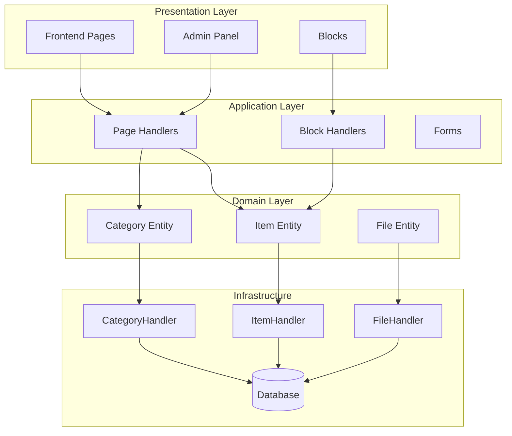
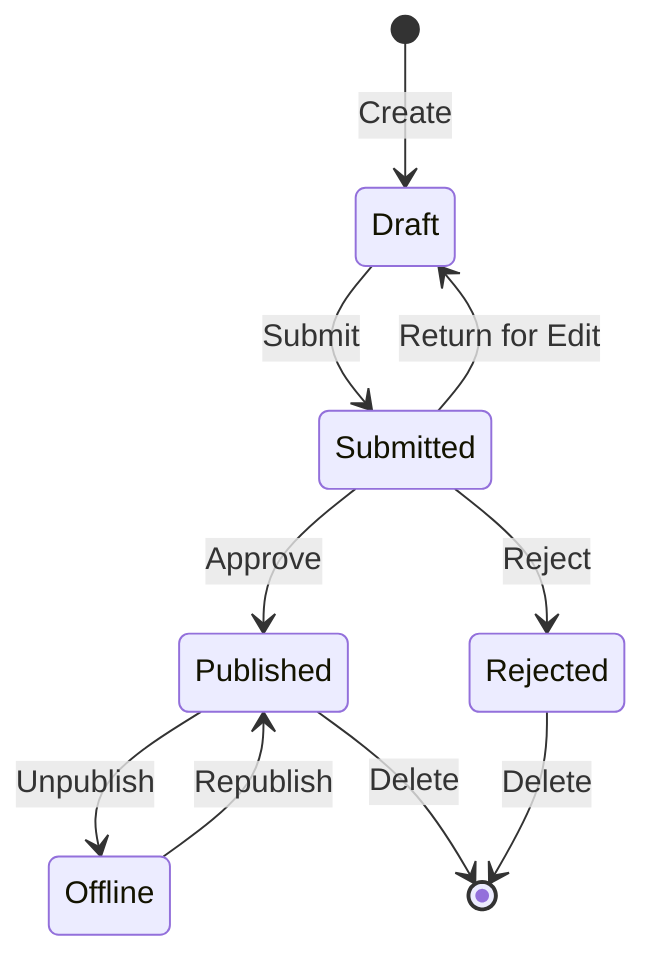

## Přehled

Tento dokument poskytuje technickou analýzu architektury modulu Publisher, vzorů a podrobností o implementaci. Použijte to jako referenci pro pochopení toho, jak je strukturován modul XOOPS v produkční kvalitě.

## Přehled architektury



## Struktura adresáře

```
publisher/
├── admin/
│   ├── index.php           # Admin dashboard
│   ├── item.php            # Article management
│   ├── category.php        # Category management
│   ├── permission.php      # Permissions
│   ├── file.php            # File manager
│   └── menu.php            # Admin menu
├── assets/
│   ├── css/
│   ├── js/
│   └── images/
├── class/
│   ├── Category.php        # Category entity
│   ├── CategoryHandler.php # Category data access
│   ├── Item.php            # Article entity
│   ├── ItemHandler.php     # Article data access
│   ├── File.php            # File attachment
│   ├── FileHandler.php     # File data access
│   ├── Form/               # Form classes
│   ├── Common/             # Utilities
│   └── Helper.php          # Module helper
├── include/
│   ├── common.php          # Initialization
│   ├── functions.php       # Utility functions
│   ├── oninstall.php       # Install hooks
│   ├── onupdate.php        # Update hooks
│   └── search.php          # Search integration
├── language/
├── templates/
├── sql/
└── xoops_version.php
```

## Analýza entit

### Entita položky (článek).

```php
class Item extends \XOOPSObject
{
    // Fields
    public function initVar(): void
    {
        $this->initVar('itemid', XOBJ_DTYPE_INT, null, false);
        $this->initVar('categoryid', XOBJ_DTYPE_INT, 0, false);
        $this->initVar('title', XOBJ_DTYPE_TXTBOX, '', true);
        $this->initVar('subtitle', XOBJ_DTYPE_TXTBOX, '');
        $this->initVar('summary', XOBJ_DTYPE_TXTAREA, '');
        $this->initVar('body', XOBJ_DTYPE_TXTAREA, '', true);
        $this->initVar('uid', XOBJ_DTYPE_INT, 0);
        $this->initVar('status', XOBJ_DTYPE_INT, 0);
        $this->initVar('datesub', XOBJ_DTYPE_INT, time());
        // ... more fields
    }

    // Business methods
    public function isPublished(): bool
    {
        return $this->getVar('status') == _PUBLISHER_STATUS_PUBLISHED;
    }

    public function canEdit(int $userId): bool
    {
        return $this->getVar('uid') == $userId
            || $this->isAdmin($userId);
    }
}
```

### Vzor manipulátoru

```php
class ItemHandler extends \XOOPSPersistableObjectHandler
{
    public function __construct(\XOOPSDatabase $db)
    {
        parent::__construct(
            $db,
            'publisher_items',
            Item::class,
            'itemid',
            'title'
        );
    }

    public function getPublishedItems(int $limit = 10): array
    {
        $criteria = new \CriteriaCompo();
        $criteria->add(new \Criteria('status', _PUBLISHER_STATUS_PUBLISHED));
        $criteria->setSort('datesub');
        $criteria->setOrder('DESC');
        $criteria->setLimit($limit);

        return $this->getObjects($criteria);
    }
}
```

## Systém povolení

### Typy oprávnění

| Povolení | Popis |
|------------|-------------|
| `publisher_view` | Zobrazit category/articles |
| `publisher_submit` | Odeslat nové články |
| `publisher_approve` | Automaticky schvalovat příspěvky |
| `publisher_moderate` | Recenze čekajících článků |
| `publisher_global` | Globální oprávnění modulu |

### Kontrola oprávnění

```php
class PermissionHandler
{
    public function isGranted(string $permission, int $categoryId): bool
    {
        $userId = $GLOBALS['xoopsUser']?->uid() ?? 0;
        $groups = $this->getUserGroups($userId);

        return $this->grouppermHandler->checkRight(
            $permission,
            $categoryId,
            $groups,
            $this->helper->getModule()->mid()
        );
    }
}
```

## Stavy pracovního postupu



## Struktura šablony

### Šablony rozhraní

| Šablona | Účel |
|----------|---------|
| `publisher_index.tpl` | Domovská stránka modulu |
| `publisher_item.tpl` | Jediný článek |
| `publisher_category.tpl` | Seznam kategorií |
| `publisher_submit.tpl` | Přihlašovací formulář |
| `publisher_search.tpl` | Výsledky hledání |

### Šablony bloků

| Šablona | Účel |
|----------|---------|
| `publisher_block_latest.tpl` | Nejnovější články |
| `publisher_block_spotlight.tpl` | Doporučený článek |
| `publisher_block_category.tpl` | Nabídka kategorií |

## Použité vzory klíčů

1. **Vzor manipulátoru** – Zapouzdření přístupu k datům
2. **Value Object** - Stavové konstanty
3. **Metoda šablony** - Generování formuláře
4. **Strategie** – Různé režimy zobrazení
5. **Pozorovatel** – Upozornění na události

## Lekce pro vývoj modulů

1. Použijte XOOPSPersitableObjectHandler pro CRUD
2. Implementujte podrobná oprávnění
3. Oddělte prezentaci od logiky
4. Použijte kritéria pro dotazy
5. Podpora více stavů obsahu
6. Integrace s oznamovacím systémem XOOPS

## Související dokumentace

- Vytváření článků - Správa článků
- Management-Categories - Systém kategorií
- Permissions-Setup - Konfigurace oprávnění
- Developer-Guide/Hooks-and-Events - Prodlužovací body