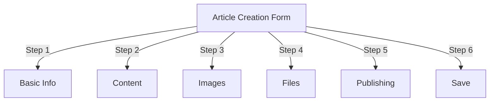
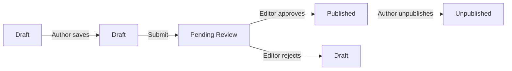
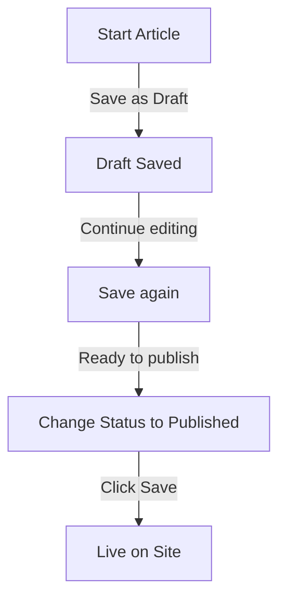

# Vytváření článků v Publisheru

> Podrobný průvodce vytvářením, úpravami, formátováním a publikováním článků v modulu Publisher.

---

## Přístup ke správě článků

### Navigace v panelu administrátora

```
Admin Panel
└── Modules
    └── Publisher
        └── Articles
            ├── Create New
            ├── Edit
            ├── Delete
            └── Publish
```

### Nejrychlejší cesta

1. Přihlaste se jako **Administrátor**
2. Klikněte na **Moduly** v administrační liště
3. Najděte **Vydavatele**
4. Klikněte na odkaz **Admin**
5. V levé nabídce klikněte na **Články**
6. Klikněte na tlačítko **Přidat článek**

---

## Formulář pro vytvoření článku

### Základní informace

Při vytváření nového článku vyplňte následující sekce:



---

## Krok 1: Základní informace

### Povinná pole

#### Název článku

```
Field: Title
Type: Text input (required)
Max length: 255 characters
Example: "Top 5 Tips for Better Photography"
```

**Pokyny:**
- Popisné a konkrétní
- Zahrnout klíčová slova pro SEO
- Vyhněte se ALL CAPS
- Udržujte méně než 60 znaků pro nejlepší zobrazení

#### Vyberte kategorii

```
Field: Category
Type: Dropdown (required)
Options: List of created categories
Example: Photography > Tutorials
```

**Tipy:**
- Nadřazené a podkategorie k dispozici
- Vyberte nejrelevantnější kategorii
- Pouze jedna kategorie na článek
- Lze později změnit

#### Podnadpis článku (volitelné)

```
Field: Subtitle
Type: Text input (optional)
Max length: 255 characters
Example: "Learn photography fundamentals in 5 easy steps"
```

**Použít pro:**
- Souhrnný nadpis
- Text upoutávky
- Rozšířený název

### Popis článku

#### Krátký popis

```
Field: Short Description
Type: Textarea (optional)
Max length: 500 characters
```

**Účel:**
- Text náhledu článku
- Zobrazí se v seznamu kategorií
- Používá se ve výsledcích vyhledávání
- Meta description pro SEO

**Příklad:**
```
"Discover essential photography techniques that will transform your photos
from ordinary to extraordinary. This comprehensive guide covers composition,
lighting, and exposure settings."
```

#### Celý obsah

```
Field: Article Body
Type: WYSIWYG Editor (required)
Max length: Unlimited
Format: HTML
```

Hlavní oblast obsahu článku s úpravou formátovaného textu.

---

## Krok 2: Formátování obsahu

### Použití editoru WYSIWYG

#### Formátování textu

```
Bold:           Ctrl+B or click [B] button
Italic:         Ctrl+I or click [I] button
Underline:      Ctrl+U or click [U] button
Strikethrough:  Alt+Shift+D or click [S] button
Subscript:      Ctrl+, (comma)
Superscript:    Ctrl+. (period)
```

#### Struktura nadpisu

Vytvořte správnou hierarchii dokumentů:

```html
<h1>Article Title</h1>      <!-- Use once at top -->
<h2>Main Section</h2>        <!-- For major sections -->
<h3>Subsection</h3>          <!-- For subtopics -->
<h4>Sub-subsection</h4>      <!-- For details -->
```

**V editoru:**
– Klikněte na rozbalovací nabídku **Formát**
- Vyberte úroveň nadpisu (H1-H6)
- Zadejte svůj nadpis

#### Seznamy

**Neuspořádaný seznam (odrážky):**

```markdown
• Point one
• Point two
• Point three
```

Kroky v editoru:
1. Klikněte na tlačítko [≡] Seznam odrážek
2. Napište každý bod
3. Stiskněte Enter pro další položku
4. Stiskněte dvakrát Backspace pro ukončení seznamu

**Objednaný seznam (číslovaný):**

```markdown
1. First step
2. Second step
3. Third step
```

Kroky v editoru:
1. Klikněte na tlačítko [1.] Číslovaný seznam
2. Zadejte každou položku
3. Stiskněte Enter pro další
4. Stiskněte dvakrát Backspace pro ukončení

**Vnořené seznamy:**

```markdown
1. Main point
   a. Sub-point
   b. Sub-point
2. Next point
```

kroky:
1. Vytvořte první seznam
2. Stiskněte Tab pro odsazení
3. Vytvořte vnořené položky
4. Stisknutím Shift+Tab odsazení posunete

#### Odkazy

**Přidat hypertextový odkaz:**

1. Vyberte text, který chcete propojit
2. Klikněte na tlačítko **[🔗] Odkaz**
3. Zadejte URL: `https://example.com`
4. Volitelné: Přidejte title/target
5. Klikněte na **Vložit odkaz**

**Odstranit odkaz:**

1. Klikněte do odkazovaného textu
2. Klikněte na tlačítko **[🔗] Odebrat odkaz**

#### Kód a uvozovky

**Blockquote:**

```
"This is an important quote from an expert"
- Attribution
```

kroky:
1. Zadejte text citátu
2. Klikněte na tlačítko **[❝] Blockquote**
3. Text je odsazený a stylizovaný

**Blok kódu:**

```python
def hello_world():
    print("Hello, World!")
```

kroky:
1. Klikněte na **Formátovat → Kód**
2. Vložte kód
3. Vyberte jazyk (volitelné)
4. Kód se zobrazí se zvýrazněnou syntaxí

---

## Krok 3: Přidání obrázků

### Doporučený obrázek (hrdinský obrázek)

```
Field: Featured Image / Main Image
Type: Image upload
Format: JPG, PNG, GIF, WebP
Max size: 5 MB
Recommended: 600x400 px
```

**Nahrát:**

1. Klikněte na tlačítko **Nahrát obrázek**
2. Vyberte obrázek z počítače
3. Crop/resize v případě potřeby
4. Klikněte na **Použít tento obrázek**

**Umístění obrázku:**
- Zobrazí se v horní části článku
- Používá se ve výpisech kategorií
- Zobrazeno v archivu
- Používá se pro sociální sdílení

### Vložené obrázky

Vložit obrázky do textu článku:

1. Umístěte kurzor v editoru na místo, kam má obrázek přejít
2. Klikněte na tlačítko **[🖼️] Obrázek** na panelu nástrojů
3. Vyberte možnost nahrávání:
   - Nahrajte nový obrázek
   - Vyberte z galerie
   - Zadejte obrázek URL
4. Konfigurace:
   
```
   Image Size:
   - Width: 300-600 px
   - Height: Auto (maintains ratio)
   - Alignment: Left/Center/Right
   
```
5. Klikněte na **Vložit obrázek**

**Obtékání textu kolem obrázku:**

V editoru po vložení:

```html
<!-- Image floats left, text wraps around -->

```

### Galerie obrázků

Vytvořte galerii více obrázků:

1. Klikněte na tlačítko **Galerie** (je-li k dispozici)
2. Nahrajte více obrázků:
   - Jedno kliknutí: Přidat jedno
   - Drag & drop: Přidat více
3. Uspořádejte pořadí přetažením
4. Nastavte popisky pro každý obrázek
5. Klikněte na **Vytvořit galerii**

---

## Krok 4: Připojení souborů

### Přidat přílohy souborů

```
Field: File Attachments
Type: File upload (multiple allowed)
Supported: PDF, DOC, XLS, ZIP, etc.
Max per file: 10 MB
Max per article: 5 files
```

**Připojit:**

1. Klikněte na tlačítko **Přidat soubor**
2. Vyberte soubor z počítače
3. Volitelné: Přidejte popis souboru
4. Klikněte na **Připojit soubor**
5. Opakujte pro více souborů

**Příklady souborů:**
- Vodítka PDF
- Excelové tabulky
- Word dokumenty
- Archivy ZIP
- Zdrojový kód

### Správa připojených souborů

**Upravit soubor:**

1. Klepněte na název souboru
2. Upravit popis
3. Klikněte na **Uložit**

**Smazat soubor:**

1. Najděte soubor v seznamu
2. Klikněte na ikonu **[×] Smazat**
3. Potvrďte smazání

---

## Krok 5: Publikování a stav### Stav článku

```
Field: Status
Type: Dropdown
Options:
  - Draft: Not published, only author sees
  - Pending: Waiting for approval
  - Published: Live on site
  - Archived: Old content
  - Unpublished: Was published, now hidden
```

**Stav Workflow:**



### Možnosti publikování

#### Okamžitě publikovat

```
Status: Published
Start Date: Today (auto-filled)
End Date: (leave blank for no expiration)
```

#### Plán na později

```
Status: Scheduled
Start Date: Future date/time
Example: February 15, 2024 at 9:00 AM
```

Článek bude automaticky publikován v určený čas.

#### Nastavit vypršení platnosti

```
Enable Expiration: Yes
Expiration Date: Future date
Action: Archive/Hide/Delete
Example: April 1, 2024 (article auto-archives)
```

### Možnosti viditelnosti

```yaml
Show Article:
  - Display on front page: Yes/No
  - Show in category: Yes/No
  - Include in search: Yes/No
  - Include in recent articles: Yes/No

Featured Article:
  - Mark as featured: Yes/No
  - Featured section position: (number)
```

---

## Krok 6: SEO & Metadata

### Nastavení SEO

```
Field: SEO Settings (Expand section)
```

#### Popis metadat

```
Field: Meta Description
Type: Text (160 characters recommended)
Used by: Search engines, social media

Example:
"Learn photography fundamentals in 5 easy steps.
Discover composition, lighting, and exposure techniques."
```

#### Klíčová slova metadat

```
Field: Meta Keywords
Type: Comma-separated list
Max: 5-10 keywords

Example: Photography, Tutorial, Composition, Lighting, Exposure
```

#### URL Slimák

```
Field: URL Slug (auto-generated from title)
Type: Text
Format: lowercase, hyphens, no spaces

Auto: "top-5-tips-for-better-photography"
Edit: Change before publishing
```

#### Otevřete značky Graph

Automaticky vygenerováno z informací o článku:
- Název
- Popis
- Doporučený obrázek
- Článek URL
- Datum zveřejnění

Používá Facebook, LinkedIn, WhatsApp atd.

---

## Krok 7: Komentáře a interakce

### Nastavení komentářů

```yaml
Allow Comments:
  - Enable: Yes/No
  - Default: Inherit from preferences
  - Override: Specific to this article

Moderate Comments:
  - Require approval: Yes/No
  - Default: Inherit from preferences
```

### Nastavení hodnocení

```yaml
Allow Ratings:
  - Enable: Yes/No
  - Scale: 5 stars (default)
  - Show average: Yes/No
  - Show count: Yes/No
```

---

## Krok 8: Pokročilé možnosti

### Autor a vedlejší

```
Field: Author
Type: Dropdown
Default: Current user
Options: All users with author permission

Display:
  - Show author name: Yes/No
  - Show author bio: Yes/No
  - Show author avatar: Yes/No
```

### Upravit zámek

```
Field: Edit Lock
Purpose: Prevent accidental changes

Lock Article:
  - Locked: Yes/No
  - Lock reason: "Final version"
  - Unlock date: (optional)
```

### Historie revizí

Automaticky uložené verze článku:

```
View Revisions:
  - Click "Revision History"
  - Shows all saved versions
  - Compare versions
  - Restore previous version
```

---

## Ukládání a publikování

### Uložit pracovní postup



### Uložit článek

**Automatické ukládání:**
- Spouští se každých 60 sekund
- Automaticky se uloží jako koncept
- Zobrazuje "Naposledy uloženo: před 2 minutami"

**Manuální uložení:**
– Chcete-li pokračovat v úpravách, klikněte na **Uložit a pokračovat**
- Kliknutím na **Uložit a zobrazit** zobrazíte publikovanou verzi
- Kliknutím na **Uložit** uložíte a zavřete

### Publikovat článek

1. Nastavte **Stav**: Publikováno
2. Nastavte **Datum zahájení**: Nyní (nebo budoucí datum)
3. Klikněte na **Uložit** nebo **Publikovat**
4. Zobrazí se potvrzovací zpráva
5. Článek je aktivní (nebo naplánovaný)

---

## Úprava stávajících článků

### Přístup k editoru článků

1. Přejděte na **Správce → Vydavatel → Články**
2. Najděte článek v seznamu
3. Klikněte na **Upravit** icon/button
4. Proveďte změny
5. Klikněte na **Uložit**

### Hromadná úprava

Upravit více článků najednou:

```
1. Go to Articles list
2. Select articles (checkboxes)
3. Choose "Bulk Edit" from dropdown
4. Change selected field
5. Click "Update All"

Available for:
  - Status
  - Category
  - Featured (Yes/No)
  - Author
```

### Náhled článku

Před zveřejněním:

1. Klikněte na tlačítko **Náhled**
2. Zobrazit, jak uvidí čtenáři
3. Zkontrolujte formátování
4. Testujte odkazy
5. Vraťte se do editoru a upravte

---

## Správa článků

### Zobrazit všechny články

**Zobrazení seznamu článků:**

```
Admin → Publisher → Articles

Columns:
  - Title
  - Category
  - Author
  - Status
  - Created date
  - Modified date
  - Actions (Edit, Delete, Preview)

Sorting:
  - By title (A-Z)
  - By date (newest/oldest)
  - By status (Published/Draft)
  - By category
```

### Filtrovat články

```
Filter Options:
  - By category
  - By status
  - By author
  - By date range
  - Search by title

Example: Show all "Draft" articles by "John" in "News" category
```

### Smazat článek

**Měkké smazání (doporučeno):**

1. Změna **Stav**: Nepublikováno
2. Klikněte na **Uložit**
3. Článek skrytý, ale nesmazaný
4. Lze obnovit později

**Pevné smazání:**

1. Vyberte článek ze seznamu
2. Klikněte na tlačítko **Odstranit**
3. Potvrďte smazání
4. Článek trvale odstraněn

---

## Doporučené postupy pro obsah

### Psaní kvalitních článků

```
Structure:
  ✓ Compelling title
  ✓ Clear subtitle/description
  ✓ Engaging opening paragraph
  ✓ Logical sections with headers
  ✓ Supporting visuals
  ✓ Conclusion/summary
  ✓ Call-to-action

Length:
  - Blog posts: 500-2000 words
  - News: 300-800 words
  - Guides: 2000-5000 words
  - Minimum: 300 words
```

### Optimalizace SEO

```
Title Optimization:
  ✓ Include primary keyword
  ✓ Keep under 60 characters
  ✓ Put keyword near beginning
  ✓ Be descriptive and specific

Content Optimization:
  ✓ Use headings (H1, H2, H3)
  ✓ Include keyword in heading
  ✓ Use bold for important terms
  ✓ Add descriptive links
  ✓ Include images with alt text

Meta Description:
  ✓ Include primary keyword
  ✓ 155-160 characters
  ✓ Action-oriented
  ✓ Unique per article
```

### Tipy pro formátování

```
Readability:
  ✓ Short paragraphs (2-4 sentences)
  ✓ Bullet points for lists
  ✓ Subheadings every 300 words
  ✓ Generous whitespace
  ✓ Line breaks between sections

Visual Appeal:
  ✓ Featured image at top
  ✓ Inline images in content
  ✓ Alt text on all images
  ✓ Code blocks for technical
  ✓ Blockquotes for emphasis
```

---

## Klávesové zkratky

### Zkratky editoru

```
Bold:               Ctrl+B
Italic:             Ctrl+I
Underline:          Ctrl+U
Link:               Ctrl+K
Save Draft:         Ctrl+S
```

### Textové zkratky

```
-- →  (dash to em dash)
... → … (three dots to ellipsis)
(c) → © (copyright)
(r) → ® (registered)
(tm) → ™ (trademark)
```

---

## Běžné úkoly

### Kopírovat článek

1. Otevřete článek
2. Klikněte na tlačítko **Duplikovat** nebo **Klonovat**
3. Článek zkopírován jako koncept
4. Upravte název a obsah
5. Publikovat

### Článek plánu

1. Vytvořte článek
2. Nastavte **Datum zahájení**: Budoucí date/time
3. Nastavte **Stav**: Publikováno
4. Klikněte na **Uložit**
5. Článek se publikuje automaticky

### Dávkové publikování

1. Vytvářejte články jako koncepty
2. Nastavte data publikování
3. Články auto-publikovat v naplánovaných časech
4. Monitorujte z pohledu "Naplánováno".

### Přesun mezi kategoriemi

1. Upravit článek
2. Změňte rozevírací nabídku **Kategorie**
3. Klikněte na **Uložit**
4. Článek se objeví v nové kategorii

---

## Odstraňování problémů

### Problém: Nelze uložit článek

**Řešení:**
```
1. Check form for required fields
2. Verify category is selected
3. Check PHP memory limit
4. Try saving as draft first
5. Clear browser cache
```

### Problém: Obrázky se nezobrazují

**Řešení:**
```
1. Verify image upload succeeded
2. Check image file format (JPG, PNG)
3. Verify image path in database
4. Check upload directory permissions
5. Try re-uploading image
```

### Problém: Panel nástrojů editoru se nezobrazuje

**Řešení:**
```
1. Clear browser cache
2. Try different browser
3. Disable browser extensions
4. Check JavaScript console for errors
5. Verify editor plugin installed
```

### Problém: Článek se nepublikuje

**Řešení:**
```
1. Verify Status = "Published"
2. Check Start Date is today or earlier
3. Verify permissions allow publishing
4. Check category is published
5. Clear module cache
```

---

## Související příručky

- Průvodce konfigurací
- Category Management
- Nastavení oprávnění
- Vlastní šablony

---

## Další kroky

- Vytvořte svůj první článek
- Nastavte kategorie
- Konfigurace oprávnění
- Přizpůsobení šablony recenzí

---

#vydavatel #články #obsah #tvorba #formátování #úpravy #xoops