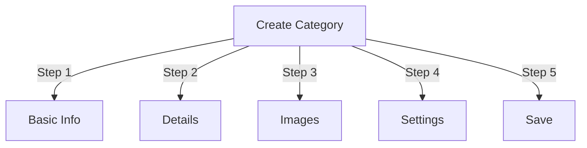

# Správa kategorií v Publisheru

> Kompletní průvodce vytvářením, organizováním hierarchií a správou kategorií v modulu Vydavatel.

---

## Základy kategorie

### Co jsou kategorie?

Kategorie organizují články do logických skupin:

```
Example Structure:

  News (Main Category)
    ├── Technology
    ├── Sports
    └── Entertainment

  Tutorials (Main Category)
    ├── Photography
    │   ├── Basics
    │   └── Advanced
    └── Writing
        └── Blogging
```

### Výhody dobré struktury kategorií

```
✓ Better user navigation
✓ Organized content
✓ Improved SEO
✓ Easier content management
✓ Better editorial workflow
```

---

## Správa kategorií přístupu

### Navigace v panelu administrátora

```
Admin Panel
└── Modules
    └── Publisher
        └── Categories
            ├── Create New
            ├── Edit
            ├── Delete
            ├── Permissions
            └── Organize
```

### Rychlý přístup

1. Přihlaste se jako **Administrátor**
2. Přejděte na **Správce → Moduly**
3. Klikněte na **Vydavatel → Správce**
4. V levé nabídce klikněte na **Kategorie**

---

## Vytváření kategorií

### Formulář pro vytvoření kategorie



### Krok 1: Základní informace

#### Název kategorie

```
Field: Category Name
Type: Text input (required)
Max length: 100 characters
Uniqueness: Should be unique
Example: "Photography"
```

**Pokyny:**
- Důsledně popisné a jednotné nebo množné číslo
- Správně velká písmena
- Vyhněte se speciálním znakům
- Držte se přiměřeně krátké

#### Popis kategorie

```
Field: Description
Type: Textarea (optional)
Max length: 500 characters
Used in: Category listing pages, category blocks
```

**Účel:**
- Vysvětluje obsah kategorie
- Zobrazuje se nad články kategorie
- Pomáhá uživatelům pochopit rozsah
- Používá se pro meta popis SEO

**Příklad:**
```
"Photography tips, tutorials, and inspiration for
all skill levels. From composition basics to advanced
lighting techniques, master your craft."
```

### Krok 2: Nadřazená kategorie

#### Vytvořte hierarchii

```
Field: Parent Category
Type: Dropdown
Options: None (root), or existing categories
```

**Příklady hierarchie:**

```
Flat Structure:
  News
  Tutorials
  Reviews

Nested Structure:
  News
    Technology
    Business
    Sports
  Tutorials
    Photography
      Basics
      Advanced
    Writing
```

**Vytvořit podkategorii:**

1. Klikněte na rozevírací nabídku **Nadřazená kategorie**
2. Vyberte nadřazený prvek (např. „Zprávy“)
3. Vyplňte název kategorie
4. Uložit
5. Nová kategorie se objeví jako dítě

### Krok 3: Kategorie Obrázek

#### Nahrát obrázek kategorie

```
Field: Category Image
Type: Image upload (optional)
Format: JPG, PNG, GIF, WebP
Max size: 5 MB
Recommended: 300x200 px (or your theme size)
```

**Nahrát:**

1. Klikněte na tlačítko **Nahrát obrázek**
2. Vyberte obrázek z počítače
3. Crop/resize v případě potřeby
4. Klikněte na **Použít tento obrázek**

**Kde se používá:**
- Stránka se seznamem kategorií
- Záhlaví bloku kategorie
- Drobečková navigace (některá témata)
- Sdílení na sociálních sítích

### Krok 4: Nastavení kategorií

#### Nastavení zobrazení

```yaml
Status:
  - Enabled: Yes/No
  - Hidden: Yes/No (hidden from menus, still accessible)

Display Options:
  - Show description: Yes/No
  - Show image: Yes/No
  - Show article count: Yes/No
  - Show subcategories: Yes/No

Layout:
  - Items per page: 10-50
  - Display order: Date/Title/Author
  - Display direction: Ascending/Descending
```

#### Oprávnění kategorií

```yaml
Who Can View:
  - Anonymous: Yes/No
  - Registered: Yes/No
  - Specific groups: Configure per group

Who Can Submit:
  - Registered: Yes/No
  - Specific groups: Configure per group
  - Author must have: "submit articles" permission
```

### Krok 5: Nastavení SEO

#### Meta tagy

```
Field: Meta Description
Type: Text (160 characters)
Purpose: Search engine description

Field: Meta Keywords
Type: Comma-separated list
Example: photography, tutorials, tips, techniques
```

#### Konfigurace URL

```
Field: URL Slug
Type: Text
Auto-generated from category name
Example: "photography" from "Photography"
Can be customized before saving
```

### Uložit kategorii

1. Vyplňte všechna povinná pole:
   - Název kategorie ✓
   - Popis (doporučeno)
2. Volitelné: Nahrajte obrázek, nastavte SEO
3. Klikněte na **Uložit kategorii**
4. Zobrazí se potvrzovací zpráva
5. Kategorie je nyní k dispozici

---

## Hierarchie kategorií

### Vytvořit vnořenou strukturu

```
Step-by-step example: Create News → Technology subcategory

1. Go to Categories admin
2. Click "Add Category"
3. Name: "News"
4. Parent: (leave blank - this is root)
5. Save
6. Click "Add Category" again
7. Name: "Technology"
8. Parent: "News" (select from dropdown)
9. Save
```

### Zobrazit strom hierarchie

```
Categories view shows tree structure:

📁 News
  📄 Technology
  📄 Sports
  📄 Entertainment
📁 Tutorials
  📄 Photography
    📄 Basics
    📄 Advanced
  📄 Writing
```

Klikněte na rozbalovací šipky na podkategorie show/hide.

### Reorganizujte kategorie

#### Přesunout kategorii

1. Přejděte na seznam kategorií
2. Klikněte na **Upravit** v kategorii
3. Změňte **nadřazenou kategorii**
4. Klikněte na **Uložit**
5. Kategorie přesunuta na novou pozici

#### Změnit pořadí kategorií

Pokud je k dispozici, použijte přetažení:

1. Přejděte na seznam kategorií
2. Klikněte a přetáhněte kategorii
3. Vraťte se do nové polohy
4. Objednávka se automaticky uloží

#### Smazat kategorii

**Možnost 1: Soft Delete (Skrýt)**

1. Upravit kategorii
2. Nastavte **Stav**: Zakázáno
3. Klikněte na **Uložit**
4. Kategorie je skryta, ale nebyla odstraněna

**Možnost 2: Tvrdé odstranění**

1. Přejděte na seznam kategorií
2. Klikněte na **Odstranit** v kategorii
3. Vyberte akci pro články:
   
```
   ☐ Move articles to parent category
   ☐ Move articles to root (News)
   ☐ Delete all articles in category
   
```
4. Potvrďte smazání

---

## Kategorie Operace

### Upravit kategorii

1. Přejděte na **Správce → Vydavatel → Kategorie**
2. Klikněte na **Upravit** v kategorii
3. Upravte pole:
   - Jméno
   - Popis
   - Nadřazená kategorie
   - Obrázek
   - Nastavení
4. Klikněte na **Uložit**

### Upravit oprávnění kategorie

1. Přejděte do kategorie
2. Klikněte na **Oprávnění** na kategorii (nebo klikněte na kategorii a poté klikněte na Oprávnění)
3. Konfigurace skupin:

```
For each group:
  ☐ View articles in this category
  ☐ Submit articles to this category
  ☐ Edit own articles
  ☐ Edit all articles
  ☐ Approve/Moderate articles
  ☐ Manage category
```

4. Klikněte na **Uložit oprávnění**

### Nastavit obrázek kategorie

**Nahrát nový obrázek:**

1. Upravit kategorii
2. Klikněte na **Změnit obrázek**
3. Nahrajte nebo vyberte obrázek
4. Crop/resize
5. Klikněte na **Použít obrázek**
6. Klikněte na **Uložit kategorii**

**Odebrat obrázek:**

1. Upravit kategorii
2. Klikněte na **Odebrat obrázek** (je-li k dispozici)
3. Klikněte na **Uložit kategorii**

---

## Kategorie oprávnění

### Matice oprávnění

```
                 Anonymous  Registered  Editor  Admin
View category        ✓         ✓         ✓       ✓
Submit article       ✗         ✓         ✓       ✓
Edit own article     ✗         ✓         ✓       ✓
Edit all articles    ✗         ✗         ✓       ✓
Moderate articles    ✗         ✗         ✓       ✓
Manage category      ✗         ✗         ✗       ✓
```

### Nastavení oprávnění na úrovni kategorie

#### Řízení přístupu podle kategorií

1. Přejděte na seznam **Kategorie**
2. Vyberte kategorii
3. Klikněte na **Oprávnění**
4. Pro každou skupinu vyberte oprávnění:

```
Example: News category
  Anonymous:   View only
  Registered:  Submit articles
  Editors:     Approve articles
  Admins:      Full control
```

5. Klikněte na **Uložit**

#### Oprávnění na úrovni pole

Určete, která pole formuláře mohou uživatelé see/edit:

```
Example: Limit field visibility for Registered users

Registered users can see/edit:
  ✓ Title
  ✓ Description
  ✓ Content
  ✗ Author (auto-set to current user)
  ✗ Scheduled date (only editors)
  ✗ Featured (only admins)
```

**Konfigurovat v:**
- Oprávnění kategorií
- Hledejte sekci Viditelnost pole

---

## Nejlepší postupy pro kategorie

### Struktura kategorií

```
✓ Keep hierarchy 2-3 levels deep
✗ Don't create too many top-level categories
✗ Don't create categories with one article

✓ Use consistent naming (plural or singular)
✗ Don't use vague names ("Stuff", "Other")

✓ Create categories for articles that exist
✗ Don't create empty categories in advance
```

### Pokyny pro pojmenování

```
Good names:
  "Photography"
  "Web Development"
  "Travel Tips"
  "Business News"

Avoid:
  "Articles" (too vague)
  "Content" (redundant)
  "News&Updates" (inconsistent)
  "PHOTOGRAPHY STUFF" (formatting)
```

### Organizační tipy

```
By Topic:
  News
    Technology
    Sports
    Entertainment

By Type:
  Tutorials
    Video
    Text
    Interactive

By Audience:
  For Beginners
  For Experts
  Case Studies

Geographic:
  North America
    United States
    Canada
  Europe
```

---

## Bloky kategorií

### Blok kategorie vydavateleZobrazit seznam kategorií na vašem webu:

1. Přejděte na **Správce → Bloky**
2. Najděte **Vydavatele – kategorie**
3. Klikněte na **Upravit**
4. Nakonfigurujte:

```
Block Title: "News Categories"
Show subcategories: Yes/No
Show article count: Yes/No
Height: (pixels or auto)
```

5. Klikněte na **Uložit**

### Kategorie článků Blok

Zobrazit nejnovější články z konkrétní kategorie:

1. Přejděte na **Správce → Bloky**
2. Najděte **Vydavatel – články kategorie**
3. Klikněte na **Upravit**
4. Vyberte:

```
Category: News (or specific category)
Number of articles: 5
Show images: Yes/No
Show description: Yes/No
```

5. Klikněte na **Uložit**

---

## Analýza kategorií

### Zobrazit statistiku kategorií

Od správce kategorií:

```
Each category shows:
  - Total articles: 45
  - Published: 42
  - Draft: 2
  - Pending approval: 1
  - Total views: 5,234
  - Latest article: 2 hours ago
```

### Zobrazit provoz kategorie

Pokud je povolena analytika:

1. Klikněte na název kategorie
2. Klikněte na kartu **Statistika**
3. Zobrazit:
   - Zobrazení stránky
   - Populární články
   - Dopravní trendy
   - Použité vyhledávací termíny

---

## Šablony kategorií

### Přizpůsobení zobrazení kategorií

Pokud používáte vlastní šablony, každá kategorie může přepsat:

```
publisher_category.tpl
  ├── Category header
  ├── Category description
  ├── Category image
  ├── Article listing
  └── Pagination
```

**Přizpůsobení:**

1. Zkopírujte soubor šablony
2. Upravte HTML/CSS
3. Přiřadit do kategorie v admin
4. Kategorie používá vlastní šablonu

---

## Běžné úkoly

### Vytvořte hierarchii zpráv

```
Admin → Publisher → Categories
1. Create "News" (parent)
2. Create "Technology" (parent: News)
3. Create "Sports" (parent: News)
4. Create "Entertainment" (parent: News)
```

### Přesouvání článků mezi kategoriemi

1. Přejděte na správce **Články**
2. Vyberte články (zaškrtávací políčka)
3. Z rozbalovací nabídky hromadných akcí vyberte **"Změnit kategorii"**
4. Vyberte novou kategorii
5. Klikněte na **Aktualizovat vše**

### Skrýt kategorii bez smazání

1. Upravit kategorii
2. Nastavte **Stav**: Disabled/Hidden
3. Uložit
4. Kategorie se nezobrazuje v nabídkách (stále přístupná přes URL)

### Vytvořit kategorii pro koncepty

```
Best Practice:

Create "In Review" category
  ├── Purpose: Articles awaiting approval
  ├── Permissions: Hidden from public
  ├── Only admins/editors can see
  ├── Move articles here until approved
  └── Move to "News" when published
```

---

## Kategorie Import/Export

### Exportní kategorie

Pokud je k dispozici:

1. Přejděte na správce **Kategorie**
2. Klikněte na **Exportovat**
3. Vyberte formát: CSV/JSON/XML
4. Stáhněte soubor
5. Záloha uložena

### Importovat kategorie

Pokud je k dispozici:

1. Připravte soubor s kategoriemi
2. Přejděte na správce **Kategorie**
3. Klikněte na **Importovat**
4. Nahrajte soubor
5. Zvolte strategii aktualizace:
   - Vytvořit pouze nové
   - Aktualizovat stávající
   - Vyměňte všechny
6. Klikněte na **Importovat**

---

## Kategorie odstraňování problémů

### Problém: Nezobrazují se podkategorie

**Řešení:**
```
1. Verify parent category status is "Enabled"
2. Check permissions allow viewing
3. Verify subcategories have status "Enabled"
4. Clear cache: Admin → Tools → Clear Cache
5. Check theme shows subcategories
```

### Problém: Nelze smazat kategorii

**Řešení:**
```
1. Category must have no articles
2. Move or delete articles first:
   Admin → Articles
   Select articles in category
   Change category to another
3. Then delete empty category
4. Or choose "move articles" option when deleting
```

### Problém: Nezobrazuje se obrázek kategorie

**Řešení:**
```
1. Verify image uploaded successfully
2. Check image file format (JPG, PNG)
3. Verify upload directory permissions
4. Check theme displays category images
5. Try re-uploading image
6. Clear browser cache
```

### Problém: Oprávnění nevstupují v platnost

**Řešení:**
```
1. Check group permissions in Category
2. Check global Publisher permissions
3. Check user belongs to configured group
4. Clear session cache
5. Log out and log back in
6. Check permission modules installed
```

---

## Kategorie Kontrolní seznam osvědčených postupů

Před nasazením kategorií:

- [ ] Hierarchie je hluboká 2-3 úrovně
- [ ] Každá kategorie má 5+ článků
- [ ] Názvy kategorií jsou konzistentní
- [ ] Oprávnění jsou vhodná
- [ ] Obrázky kategorií jsou optimalizovány
- [ ] Popisy jsou kompletní
- [ ] Vyplněna metadata SEO
- [ ] URL jsou přátelské
- [ ] Kategorie testované na front-endu
- [ ] Aktualizace dokumentace

---

## Související příručky

- Tvorba článku
- Správa oprávnění
- Konfigurace modulu
- Průvodce instalací

---

## Další kroky

- Vytvářejte články v kategoriích
- Konfigurace oprávnění
- Přizpůsobte pomocí vlastních šablon

---

#vydavatel #kategorie #organizace #hierarchie #management #xoops