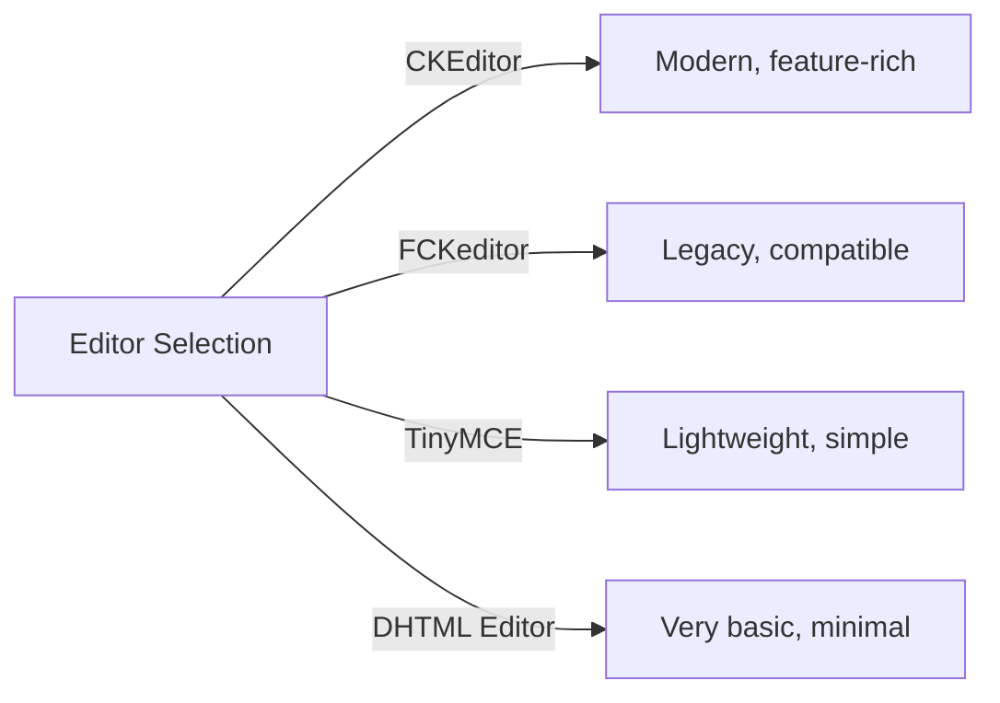
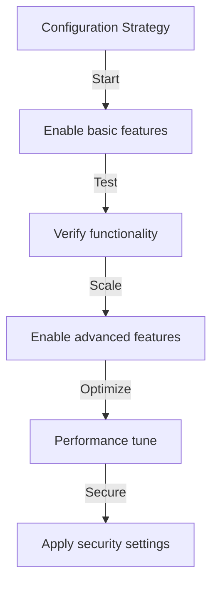

# Základní konfigurace vydavatele

> Nakonfigurujte nastavení, předvolby a obecné možnosti modulu Publisher pro vaši instalaci XOOPS.

---

## Přístup ke konfiguraci

### Navigace v panelu administrátora

```
XOOPS Admin Panel
└── Modules
    └── Publisher
        ├── Preferences
        ├── Settings
        └── Configuration
```

1. Přihlaste se jako **Administrátor**
2. Přejděte na **Panel pro správu → Moduly**
3. Najděte modul **Vydavatel**
4. Klikněte na odkaz **Předvolby** nebo **Správce**

---

## Obecná nastavení

### Konfigurace přístupu

```
Admin Panel → Modules → Publisher
```

Kliknutím na **ikonu ozubeného kola** nebo **Nastavení** zobrazíte tyto možnosti:

#### Možnosti zobrazení

| Nastavení | Možnosti | Výchozí | Popis |
|---------|---------|---------|-------------|
| **Položky na stránku** | 5-50 | 10 | Články zobrazené v seznamech |
| **Zobrazit drobenku** | Yes/No | Ano | Zobrazení navigační trasy |
| **Použijte stránkování** | Yes/No | Ano | Stránky dlouhé seznamy |
| **Datum zobrazení** | Yes/No | Ano | Zobrazit datum článku |
| **Zobrazit kategorii** | Yes/No | Ano | Zobrazit kategorii článku |
| **Zobrazit autora** | Yes/No | Ano | Zobrazit autora článku |
| **Zobrazit zobrazení** | Yes/No | Ano | Zobrazit počet zobrazení článku |

**Příklad konfigurace:**

```yaml
Items Per Page: 15
Show Breadcrumb: Yes
Use Paging: Yes
Show Date: Yes
Show Category: Yes
Show Author: Yes
Show Views: Yes
```

#### Možnosti autora

| Nastavení | Výchozí | Popis |
|---------|---------|-------------|
| **Zobrazit jméno autora** | Ano | Zobrazit skutečné jméno nebo uživatelské jméno |
| **Použijte uživatelské jméno** | Ne | Zobrazit uživatelské jméno místo jména |
| **Zobrazit e-mail autora** | Ne | Zobrazit kontaktní e-mail autora |
| **Zobrazit avatar autora** | Ano | Zobrazit avatar uživatele |

---

## Konfigurace editoru

### Vyberte editor WYSIWYG

Publisher podporuje více editorů:

#### Dostupné editory



### Editor CK (doporučeno)

**Nejlepší pro:** Většinu uživatelů, moderní prohlížeče, plné funkce

1. Přejděte na **Předvolby**
2. Nastavte **Editor**: CKEditor
3. Konfigurace možností:

```
Editor: CKEditor 4.x
Toolbar: Full
Height: 400px
Width: 100%
Remove plugins: []
Add plugins: [mathjax, codesnippet]
```

### FCKeditor

**Nejlepší pro:** Kompatibilitu, starší systémy

```
Editor: FCKeditor
Toolbar: Default
Custom config: (optional)
```

### TinyMCE

**Nejlepší pro:** Minimální půdorys, základní úpravy

```
Editor: TinyMCE
Plugins: [paste, table, link, image]
Toolbar: minimal
```

---

## Nastavení souborů a nahrávání

### Konfigurace adresářů pro nahrávání

```
Admin → Publisher → Preferences → Upload Settings
```

#### Nastavení typu souboru

```yaml
Allowed File Types:
  Images:
    - jpg
    - jpeg
    - gif
    - png
    - webp
  Documents:
    - pdf
    - doc
    - docx
    - xls
    - xlsx
    - ppt
    - pptx
  Archives:
    - zip
    - rar
    - 7z
  Media:
    - mp3
    - mp4
    - webm
    - mov
```

#### Limity velikosti souboru

| Typ souboru | Maximální velikost | Poznámky |
|-----------|----------|-------|
| **Obrázky** | 5 MB | Za obrázkový soubor |
| **Dokumenty** | 10 MB | PDF, soubory Office |
| **Média** | 50 MB | Soubory Video/audio |
| **Všechny soubory** | 100 MB | Celkem za nahrání |

**Konfigurace:**

```
Max Image Upload Size: 5 MB
Max Document Upload Size: 10 MB
Max Media Upload Size: 50 MB
Total Upload Size: 100 MB
Max Files per Article: 5
```

### Změna velikosti obrázku

Vydavatel automaticky mění velikost obrázků, aby byly konzistentní:

```yaml
Thumbnail Size:
  Width: 150
  Height: 150
  Mode: Crop/Resize

Category Image Size:
  Width: 300
  Height: 200
  Mode: Resize

Article Featured Image:
  Width: 600
  Height: 400
  Mode: Resize
```

---

## Nastavení komentářů a interakcí

### Konfigurace komentářů

```
Preferences → Comments Section
```

#### Možnosti komentáře

```yaml
Allow Comments:
  - Enabled: Yes/No
  - Default: Yes
  - Per-article override: Yes

Comment Moderation:
  - Moderate comments: Yes/No
  - Moderate guest comments only: Yes/No
  - Spam filter: Enabled
  - Max comments per day: (unlimited)

Comment Display:
  - Display format: Threaded/Flat
  - Comments per page: 10
  - Date format: Full date/Time ago
  - Show comment count: Yes/No
```

### Konfigurace hodnocení

```yaml
Allow Ratings:
  - Enabled: Yes/No
  - Default: Yes
  - Per-article override: Yes

Rating Options:
  - Rating scale: 5 stars (default)
  - Allow user to rate own: No
  - Show average rating: Yes
  - Show rating count: Yes
```

---

## Nastavení SEO & URL

### Optimalizace pro vyhledávače

```
Preferences → SEO Settings
```

#### Konfigurace URL

```yaml
SEO URLs:
  - Enabled: No (set to Yes for SEO URLs)
  - URL rewriting: None/Apache mod_rewrite/IIS rewrite

URL Format:
  - Category: /category/news
  - Article: /article/welcome-to-site
  - Archive: /archive/2024/01

Meta Description:
  - Auto-generate: Yes
  - Max length: 160 characters

Meta Keywords:
  - Auto-generate: Yes
  - From: Article tags, title
```

### Povolit adresy URL SEO (pokročilé)

**Předpoklady:**
- Apache s povoleným `mod_rewrite`
- Podpora `.htaccess` povolena

**Konfigurační kroky:**

1. Přejděte na **Předvolby → Nastavení SEO**
2. Nastavte **SEO URL**: Ano
3. Nastavte **URL Rewriting**: Apache mod_rewrite
4. Ověřte, zda ve složce Publisher existuje soubor `.htaccess`

**. Konfigurace htaccess:**

```apache
<IfModule mod_rewrite.c>
    RewriteEngine On
    RewriteBase /modules/publisher/

    # Category rewrites
    RewriteRule ^category/([0-9]+)-(.*)\.html$ index.php?op=showcategory&categoryid=$1 [L,QSA]

    # Article rewrites
    RewriteRule ^article/([0-9]+)-(.*)\.html$ index.php?op=showitem&itemid=$1 [L,QSA]

    # Archive rewrites
    RewriteRule ^archive/([0-9]+)/([0-9]+)/$ index.php?op=archive&year=$1&month=$2 [L,QSA]
</IfModule>
```

---

## Mezipaměť a výkon

### Konfigurace ukládání do mezipaměti

```
Preferences → Cache Settings
```

```yaml
Enable Caching:
  - Enabled: Yes
  - Cache type: File (or Memcache)

Cache Lifetime:
  - Category lists: 3600 seconds (1 hour)
  - Article lists: 1800 seconds (30 minutes)
  - Single article: 7200 seconds (2 hours)
  - Recent articles block: 900 seconds (15 minutes)

Cache Clear:
  - Manual clear: Available in admin
  - Auto-clear on article save: Yes
  - Clear on category change: Yes
```

### Vymazat mezipaměť

**Manuální vymazání mezipaměti:**

1. Přejděte na **Správce → Vydavatel → Nástroje**
2. Klikněte na **Vymazat mezipaměť**
3. Vyberte typy mezipaměti, které chcete vymazat:
   - [ ] Mezipaměť kategorií
   - [ ] Mezipaměť článků
   - [ ] Blokovat mezipaměť
   - [ ] Veškerá mezipaměť
4. Klikněte na **Vymazat vybrané**

**Příkazový řádek:**

```bash
# Clear all Publisher cache
php /path/to/xoops/admin/cache_manage.php publisher

# Or directly delete cache files
rm -rf /path/to/xoops/var/cache/publisher/*
```

---

## Oznámení a pracovní postup

### E-mailová upozornění

```
Preferences → Notifications
```

```yaml
Notify Admin on New Article:
  - Enabled: Yes
  - Recipient: Admin email
  - Include summary: Yes

Notify Moderators:
  - Enabled: Yes
  - On new submission: Yes
  - On pending articles: Yes

Notify Author:
  - On approval: Yes
  - On rejection: Yes
  - On comment: No (optional)
```

### Pracovní postup odeslání

```yaml
Require Approval:
  - Enabled: Yes
  - Editor approval: Yes
  - Admin approval: No

Draft Save:
  - Auto-save interval: 60 seconds
  - Save local versions: Yes
  - Revision history: Last 5 versions
```

---

## Nastavení obsahu

### Výchozí nastavení publikování

```
Preferences → Content Settings
```

```yaml
Default Article Status:
  - Draft/Published: Draft
  - Featured by default: No
  - Auto-publish time: None

Default Visibility:
  - Public/Private: Public
  - Show on front page: Yes
  - Show in categories: Yes

Scheduled Publishing:
  - Enabled: Yes
  - Allow per-article: Yes

Content Expiration:
  - Enabled: No
  - Auto-archive old: No
  - Archive after days: (unlimited)
```

### Možnosti obsahu WYSIWYG

```yaml
Allow HTML:
  - In articles: Yes
  - In comments: No

Allow Embedded Media:
  - Videos (iframe): Yes
  - Images: Yes
  - Plugins: No

Content Filtering:
  - Strip tags: No
  - XSS filter: Yes (recommended)
```

---

## Nastavení vyhledávače

### Konfigurace integrace vyhledávání

```
Preferences → Search Settings
```

```yaml
Enable Article Indexing:
  - Include in site search: Yes
  - Index type: Full text/Title only

Search Options:
  - Search in titles: Yes
  - Search in content: Yes
  - Search in comments: Yes

Meta Tags:
  - Auto generate: Yes
  - OG tags (social): Yes
  - Twitter cards: Yes
```

---

## Pokročilá nastavení

### Režim ladění (pouze pro vývoj)

```
Preferences → Advanced
```

```yaml
Debug Mode:
  - Enabled: No (only for development!)

Development Features:
  - Show SQL queries: No
  - Log errors: Yes
  - Error email: admin@example.com
```

### Optimalizace databáze

```
Admin → Tools → Optimize Database
```

```bash
# Manual optimization
mysql> OPTIMIZE TABLE publisher_items;
mysql> OPTIMIZE TABLE publisher_categories;
mysql> OPTIMIZE TABLE publisher_comments;
```

---

## Přizpůsobení modulu

### Šablony motivů

```
Preferences → Display → Templates
```

Vyberte sadu šablon:
- Výchozí
- Klasika
- Moderní
- Temný
- Vlastní

Každá šablona ovládá:
- Rozvržení článku
- Seznam kategorií
- Zobrazení archivu
- Zobrazení komentáře

---

## Tipy pro konfiguraci### Nejlepší postupy



1. **Start Simple** – Nejprve povolte základní funkce
2. **Otestujte každou změnu** – Než budete pokračovat, ověřte
3. **Povolit ukládání do mezipaměti** – Zlepšuje výkon
4. **Nejdříve záloha** – Exportujte nastavení před velkými změnami
5. **Monitorování protokolů** – Pravidelně kontrolujte protokoly chyb

### Optimalizace výkonu

```yaml
For Better Performance:
  - Enable caching: Yes
  - Cache lifetime: 3600 seconds
  - Limit items per page: 10-15
  - Compress images: Yes
  - Minify CSS/JS: Yes (if available)
```

### Posílení zabezpečení

```yaml
For Better Security:
  - Moderate comments: Yes
  - Disable HTML in comments: Yes
  - XSS filtering: Yes
  - File type whitelist: Strict
  - Max upload size: Reasonable limit
```

---

## Nastavení Export/Import

### Konfigurace zálohování

```
Admin → Tools → Export Settings
```

**Pro zálohování aktuální konfigurace:**

1. Klikněte na **Exportovat konfiguraci**
2. Uložte stažený soubor `.cfg`
3. Skladujte na bezpečném místě

**Pro obnovení:**

1. Klikněte na **Importovat konfiguraci**
2. Vyberte soubor `.cfg`
3. Klikněte na **Obnovit**

---

## Související konfigurační příručky

- Category Management
- Tvorba článku
- Konfigurace oprávnění
- Průvodce instalací

---

## Konfigurace odstraňování problémů

### Nastavení se neuloží

**Řešení:**
1. Zkontrolujte oprávnění k adresáři na `/var/config/`
2. Ověřte přístup pro zápis PHP
3. Zkontrolujte protokol chyb PHP
4. Vymažte mezipaměť prohlížeče a zkuste to znovu

### Editor se nezobrazuje

**Řešení:**
1. Ověřte, zda je nainstalován plugin editoru
2. Zkontrolujte konfiguraci editoru XOOPS
3. Zkuste jinou možnost editoru
4. Zkontrolujte konzolu prohlížeče, zda neobsahuje chyby JavaScript

### Problémy s výkonem

**Řešení:**
1. Povolte ukládání do mezipaměti
2. Snižte počet položek na stránku
3. Komprimujte obrázky
4. Zkontrolujte optimalizaci databáze
5. Prohlédněte si protokol pomalých dotazů

---

## Další kroky

- Konfigurace oprávnění skupiny
- Vytvořte svůj první článek
- Nastavte kategorie
- Zkontrolujte vlastní šablony

---

#vydavatel #konfigurace #předvolby #nastavení #xoops