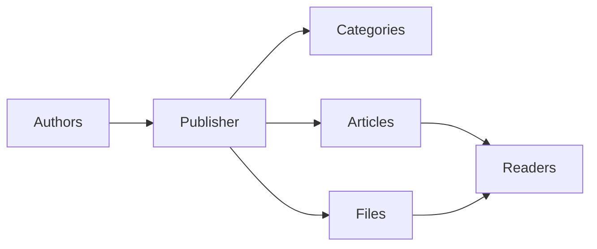
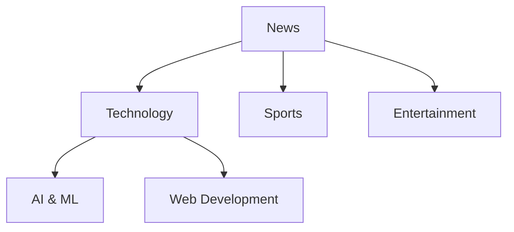
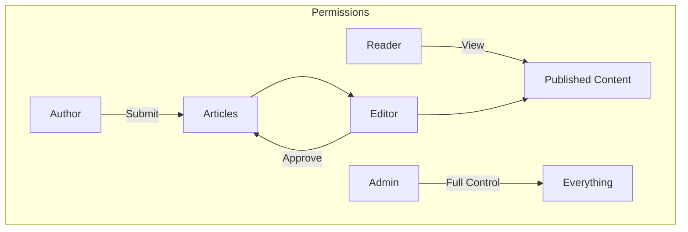
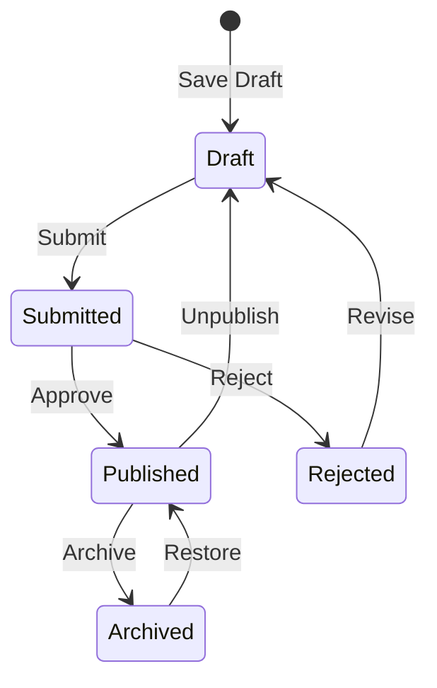

# Začínáme s Publisherem

> Podrobný průvodce nastavením a používáním modulu Publisher news/blog.

---

## Co je Publisher?

Publisher je přední modul pro správu obsahu pro XOOPS, určený pro:

- **Zpravodajské stránky** - Publikujte články s kategoriemi
- **Blogy** - Osobní blogování nebo blogování s více autory``
- **Dokumentace** - Organizované znalostní báze
- **Obsahové portály** - Smíšený mediální obsah



---

## Rychlé nastavení

### Krok 1: Nainstalujte Publisher

1. Stáhnout z [GitHub](https://github.com/XOOPSModules25x/publisher)
2. Nahrajte do `modules/publisher/`
3. Přejděte na Správce → Moduly → Instalovat

### Krok 2: Vytvořte kategorie



1. Správce → Vydavatel → Kategorie
2. Klikněte na "Přidat kategorii"
3. Vyplňte:
   - **Name**: Název kategorie
   - **Popis**: Co tato kategorie obsahuje
   - **Obrázek**: Obrázek volitelné kategorie
4. Nastavte oprávnění (kdo může submit/view)
5. Uložit

### Krok 3: Nakonfigurujte nastavení

1. Správce → Vydavatel → Předvolby
2. Klíčová nastavení pro konfiguraci:

| Nastavení | Doporučeno | Popis |
|---------|-------------|-------------|
| Položky na stránku | 10-20 | Články o indexu |
| Redaktor | TinyMCE/CKEditor | RTF editor |
| Povolit hodnocení | Ano | Názor čtenáře |
| Povolit komentáře | Ano | Diskuze |
| Automatické schválení | Ne | Redakční kontrola |

### Krok 4: Vytvořte svůj první článek

1. Hlavní menu → Vydavatel → Odeslat článek
2. Vyplňte formulář:
   - **Název**: Titulek článku
   - **Kategorie**: Kam patří
   - **Shrnutí**: Krátký popis
   - **Body**: Celý obsah článku
3. Přidejte volitelné prvky:
   - Doporučený obrázek
   - Souborové přílohy
   - Nastavení SEO
4. Odešlete ke kontrole nebo publikujte

---

## Uživatelské role



### Čtenář
- Zobrazit publikované články
- Hodnotit a komentovat
- Hledat obsah

### Autor
- Odeslat nové články
- Upravit vlastní články
- Připojte soubory

### Editor
- Odeslání Approve/reject
- Upravte jakýkoli článek
- Správa kategorií

### Administrátor
- Plné ovládání modulu
- Konfigurace nastavení
- Spravovat oprávnění

---

## Psaní článků

### Editor článků

```
┌─────────────────────────────────────────────────────┐
│ Title: [Your Article Title                        ] │
├─────────────────────────────────────────────────────┤
│ Category: [Select Category          ▼]              │
├─────────────────────────────────────────────────────┤
│ Summary:                                            │
│ ┌─────────────────────────────────────────────────┐ │
│ │ Brief description shown in listings...          │ │
│ └─────────────────────────────────────────────────┘ │
├─────────────────────────────────────────────────────┤
│ Body:                                               │
│ ┌─────────────────────────────────────────────────┐ │
│ │ [B] [I] [U] [Link] [Image] [Code]               │ │
│ ├─────────────────────────────────────────────────┤ │
│ │                                                  │ │
│ │ Full article content goes here...               │ │
│ │                                                  │ │
│ └─────────────────────────────────────────────────┘ │
├─────────────────────────────────────────────────────┤
│ [Submit] [Preview] [Save Draft]                     │
└─────────────────────────────────────────────────────┘
```

### Nejlepší postupy

1. **Poutavé názvy** – Jasné a poutavé nadpisy
2. **Dobré souhrny** – Přimějte čtenáře ke kliknutí
3. **Strukturovaný obsah** – Používejte nadpisy, seznamy, obrázky
4. **Správná kategorizace** – Pomozte čtenářům najít obsah
5. **SEO optimalizace** – Klíčová slova v názvu a obsahu

---

## Správa obsahu

### Tok stavu článku



### Popisy stavu

| Stav | Popis |
|--------|-------------|
| Návrh | Nedokončená výroba |
| Předloženo | Čeká na recenzi |
| Zveřejněno | Živě na místě |
| Platnost vypršela | Datum vypršení platnosti |
| Zamítnuto | Potřebuje revizi |
| Archivováno | Odebráno z nabídky |

---

## Navigace

### Přístup k vydavateli

- **Hlavní nabídka** → Vydavatel
- **Přímé URL**: `yoursite.com/modules/publisher/`

### Klíčové stránky

| Strana | URL | Účel |
|------|-----|---------|
| Index | `/modules/publisher/` | Seznam článků |
| Kategorie | `/modules/publisher/category.php?id=X` | Kategorie článků |
| Článek | `/modules/publisher/item.php?itemid=X` | Jediný článek |
| Odeslat | `/modules/publisher/submit.php` | Nový článek |
| Hledat | `/modules/publisher/search.php` | Najít články |

---

## Bloky

Vydavatel nabízí pro váš web několik bloků:

### Nedávné články
Zobrazuje nejnovější publikované články

### Nabídka kategorií
Navigace podle kategorií

### Oblíbené články
Nejsledovanější obsah

### Náhodný článek
Ukažte náhodný obsah

### Zaostřeno
Doporučené články

---

## Související dokumentace

- Vytváření a úpravy článků
- Správa kategorií
- Rozšíření vydavatele

---

#xoops #vydavatel #uživatelská příručka #začínáme #cms