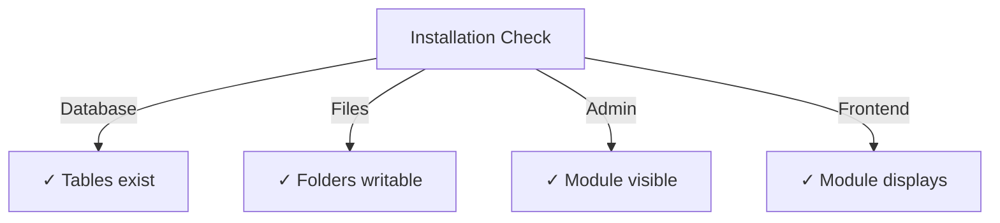

# Průvodce instalací vydavatele

> Kompletní pokyny pro instalaci a konfiguraci modulu Publisher pro XOOPS CMS.

---

## Systémové požadavky

### Minimální požadavky

| Požadavek | Verze | Poznámky |
|-------------|---------|-------|
| XOOPS | 2.5.10 a více | Platforma Core CMS |
| PHP | 7,1+ | Doporučeno PHP 8.x |
| MySQL | 5,7+ | Databázový server |
| Webový server | Apache/Nginx | S podporou přepisování |

### Rozšíření PHP

```
- PDO (PHP Data Objects)
- pdo_mysql or mysqli
- mb_string (multibyte strings)
- curl (for external content)
- json
- gd (image processing)
```

### Místo na disku

- **Soubory modulu**: ~5 MB
- **Adresář mezipaměti**: doporučeno 50+ MB
- **Adresář pro nahrávání**: Podle potřeby pro obsah

---

## Kontrolní seznam před instalací

Před instalací Publisheru ověřte:

- [ ] Jádro XOOPS je nainstalováno a spuštěno
- [ ] Účet správce má oprávnění ke správě modulů
- [ ] Vytvořena záloha databáze
- [ ] Oprávnění k souboru umožňují zápis do adresáře `/modules/`
- [ ] Limit paměti PHP je alespoň 128 MB
- [ ] Limity velikosti nahrávaných souborů jsou vhodné (min. 10 MB)

---

## Kroky instalace

### Krok 1: Stáhněte si Publisher

#### Možnost A: Od GitHub (doporučeno)

```bash
# Navigate to modules directory
cd /path/to/xoops/htdocs/modules/

# Clone the repository
git clone https://github.com/XOOPSModules25x/publisher.git

# Verify download
ls -la publisher/
```

#### Možnost B: Manuální stažení

1. Navštivte [GitHub Publisher Releases](https://github.com/XOOPSModules25x/publisher/releases)
2. Stáhněte si nejnovější soubor `.zip`
3. Extrahujte do `modules/publisher/`

### Krok 2: Nastavte oprávnění k souboru

```bash
# Set proper ownership
chown -R www-data:www-data /path/to/xoops/htdocs/modules/publisher

# Set directory permissions (755)
find publisher -type d -exec chmod 755 {} \;

# Set file permissions (644)
find publisher -type f -exec chmod 644 {} \;

# Make scripts executable
chmod 755 publisher/admin/index.php
chmod 755 publisher/index.php
```

### Krok 3: Instalace přes XOOPS Admin

1. Přihlaste se do **XOOPS Admin Panel** jako správce
2. Přejděte na **Systém → Moduly**
3. Klikněte na **Instalovat modul**
4. V seznamu vyhledejte **Vydavatel**
5. Klikněte na tlačítko **Instalovat**
6. Počkejte na dokončení instalace (zobrazí vytvořené databázové tabulky)

```
Installation Progress:
✓ Tables created
✓ Configuration initialized
✓ Permissions set
✓ Cache cleared
Installation Complete!
```

---

## Počáteční nastavení

### Krok 1: Přístup ke správci vydavatele

1. Přejděte na **Panel pro správu → Moduly**
2. Najděte modul **Vydavatel**
3. Klikněte na odkaz **Admin**
4. Nyní jste v Administraci vydavatele

### Krok 2: Nakonfigurujte předvolby modulu

1. Klikněte na **Předvolby** v nabídce vlevo
2. Nakonfigurujte základní nastavení:

```
General Settings:
- Editor: Select your WYSIWYG editor
- Items per page: 10
- Show breadcrumb: Yes
- Allow comments: Yes
- Allow ratings: Yes

SEO Settings:
- SEO URLs: No (enable later if needed)
- URL rewriting: None

Upload Settings:
- Max upload size: 5 MB
- Allowed file types: jpg, png, gif, pdf, doc, docx
```

3. Klikněte na **Uložit nastavení**

### Krok 3: Vytvořte první kategorii

1. Klikněte na **Kategorie** v nabídce vlevo
2. Klikněte na **Přidat kategorii**
3. Vyplňte formulář:

```
Category Name: News
Description: Latest news and updates
Image: (optional) Upload category image
Parent Category: (leave blank for top-level)
Status: Enabled
```

4. Klikněte na **Uložit kategorii**

### Krok 4: Ověřte instalaci

Zkontrolujte tyto indikátory:



#### Kontrola databáze

```bash
mysql -u xoops_user -p xoops_database
mysql> SHOW TABLES LIKE 'publisher%';

# Should show tables:
# - publisher_categories
# - publisher_items
# - publisher_comments
# - publisher_files
```

#### Předběžná kontrola

1. Navštivte svou domovskou stránku XOOPS
2. Hledejte blok **Vydavatel** nebo **Zprávy**
3. Měl by zobrazovat poslední články

---

## Konfigurace po instalaci

### Výběr editoru

Publisher podporuje několik editorů WYSIWYG:

| Redaktor | Pros | Nevýhody |
|--------|------|------|
| FCKeditor | Bohatý na funkce | Starší, větší |
| Editor CK | Moderní standard | Složitost konfigurace |
| TinyMCE | Lehký | Omezené funkce |
| Editor DHTML | Základní | Velmi základní |

**Chcete-li změnit editor:**

1. Přejděte na **Předvolby**
2. Přejděte na nastavení **Editor**
3. Vyberte z rozevírací nabídky
4. Uložte a otestujte

### Nastavení adresáře pro nahrávání

```bash
# Create upload directories
mkdir -p /path/to/xoops/uploads/publisher/
mkdir -p /path/to/xoops/uploads/publisher/categories/
mkdir -p /path/to/xoops/uploads/publisher/images/
mkdir -p /path/to/xoops/uploads/publisher/files/

# Set permissions
chmod 755 /path/to/xoops/uploads/publisher/
chmod 755 /path/to/xoops/uploads/publisher/*
```

### Konfigurace velikostí obrázků

V Předvolbách nastavte velikosti miniatur:

```
Category image size: 300 x 200 px
Article image size: 600 x 400 px
Thumbnail size: 150 x 100 px
```

---

## Kroky po instalaci

### 1. Nastavte oprávnění skupiny

1. Přejděte na **Oprávnění** v nabídce správce
2. Nakonfigurujte přístup pro skupiny:
   - Anonymní: Pouze zobrazení
   - Registrovaní uživatelé: Odesílejte články
   - Redakce: články Approve/edit
   - Správci: Plný přístup

### 2. Nakonfigurujte viditelnost modulu

1. Přejděte na **Blocks** ve správci XOOPS
2. Najděte bloky vydavatelů:
   - Vydavatel - Nejnovější články
   - Vydavatel - Kategorie
   - Vydavatel - Archiv
3. Nakonfigurujte viditelnost bloku na stránku

### 3. Import testovacího obsahu (volitelné)

Pro testování importujte ukázkové články:

1. Přejděte na **Správce vydavatele → Import**
2. Vyberte **Ukázkový obsah**
3. Klikněte na **Importovat**

### 4. Povolte adresy URL SEO (volitelné)

Pro adresy URL vhodné pro vyhledávání:

1. Přejděte na **Předvolby**
2. Nastavte **SEO URL**: Ano
3. Povolte přepis **.htaccess**
4. Ověřte, že ve složce Publisher existuje soubor `.htaccess`

```apache
# .htaccess example
<IfModule mod_rewrite.c>
    RewriteEngine On
    RewriteBase /modules/publisher/
    RewriteRule ^category/([0-9]+)-(.*)\.html$ index.php?op=showcategory&categoryid=$1 [L]
    RewriteRule ^article/([0-9]+)-(.*)\.html$ index.php?op=showitem&itemid=$1 [L]
</IfModule>
```

---

## Odstraňování problémů s instalací

### Problém: Modul se nezobrazuje v admin

**Řešení:**
```bash
# Check file permissions
ls -la /path/to/xoops/modules/publisher/

# Check xoops_version.php exists
ls /path/to/xoops/modules/publisher/xoops_version.php

# Verify PHP syntax
php -l /path/to/xoops/modules/publisher/xoops_version.php
```

### Problém: Databázové tabulky nebyly vytvořeny**Řešení:**
1. Zkontrolujte, zda má uživatel MySQL oprávnění CREATE TABLE
2. Zkontrolujte protokol chyb databáze: 
   
```bash
   mysql> SHOW WARNINGS;
   
```
3. Ruční import SQL:
   
```bash
   mysql -u user -p database < modules/publisher/sql/mysql.sql
   
```

### Problém: Odeslání souboru se nezdařilo

**Řešení:**
```bash
# Check directory exists and is writable
stat /path/to/xoops/uploads/publisher/

# Fix permissions
chmod 777 /path/to/xoops/uploads/publisher/

# Verify PHP settings
php -i | grep upload_max_filesize
```

### Problém: Chyby „Stránka nenalezena“.

**Řešení:**
1. Zkontrolujte, zda je přítomen soubor `.htaccess`
2. Ověřte, že je Apache `mod_rewrite` povolen: 
   
```bash
   a2enmod rewrite
   systemctl restart apache2
   
```
3. Zkontrolujte `AllowOverride All` v konfiguraci Apache

---

## Upgrade z předchozích verzí

### Od vydavatele 1.x do 2.x

1. **Záložní aktuální instalace:**
   
```bash
   cp -r modules/publisher/ modules/publisher-backup/
   mysqldump -u user -p database > publisher-backup.sql
   
```

2. **Stáhnout Publisher 2.x**

3. **Přepsat soubory:**
   
```bash
   rm -rf modules/publisher/
   unzip publisher-2.0.zip -d modules/
   
```

4. **Spustit aktualizaci:**
   - Přejděte na **Správce → Vydavatel → Aktualizovat**
   - Klikněte na **Aktualizovat databázi**
   - Počkejte na dokončení

5. **Ověřit:**
   - Zkontrolujte, zda se všechny články zobrazují správně
   - Ověřte, zda jsou oprávnění neporušená
   - Nahrání testovacích souborů

---

## Bezpečnostní aspekty

### Oprávnění k souboru

```
- Core files: 644 (readable by web server)
- Directories: 755 (browseable by web server)
- Upload directories: 755 or 777
- Config files: 600 (not readable by web)
```

### Zakázat přímý přístup k citlivým souborům

Vytvořte `.htaccess` v adresářích pro nahrávání:

```apache
<FilesMatch "\.(php|phtml|php3|php4|php5|phtml)$">
    Deny from all
</FilesMatch>
```

### Zabezpečení databáze

```bash
# Use strong password
ALTER USER 'publisher_user'@'localhost' IDENTIFIED BY 'strong_password_here';

# Grant minimal permissions
GRANT SELECT, INSERT, UPDATE, DELETE ON publisher_db.* TO 'publisher_user'@'localhost';
FLUSH PRIVILEGES;
```

---

## Kontrolní seznam pro ověření

Po instalaci ověřte:

- [ ] Modul se objeví v seznamu administrátorských modulů
- [ ] Má přístup do sekce Správce vydavatelů
- [ ] Může vytvářet kategorie
- [ ] Může vytvářet články
- [ ] Články se zobrazují na front-endu
- [ ] Nahrávání souborů funguje
- [ ] Snímky se zobrazují správně
- [ ] Oprávnění jsou aplikována správně
- [ ] Byly vytvořeny databázové tabulky
- [ ] Adresář mezipaměti je zapisovatelný

---

## Další kroky

Po úspěšné instalaci:

1. Přečtěte si Průvodce základní konfigurací
2. Vytvořte svůj první článek
3. Nastavte oprávnění skupiny
4. Zkontrolujte Správa kategorií

---

## Podpora a zdroje

- **Problémy GitHub**: [Problémy vydavatele](https://github.com/XOOPSModules25x/publisher/issues)
- **Fórum XOOPS**: [Podpora komunity](https://www.xoops.org/modules/newbb/)
- **GitHub Wiki**: [Nápověda k instalaci](https://github.com/XOOPSModules25x/publisher/wiki)

---

#vydavatel #instalace #nastaveni #xoops #modul #konfigurace