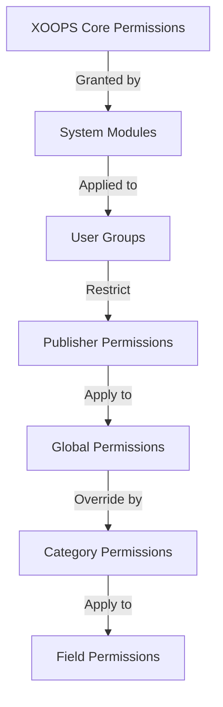

# Nastavení oprávnění vydavatele

> Kompletní průvodce konfigurací skupinových oprávnění, řízení přístupu a správy uživatelského přístupu v aplikaci Publisher.

---

## Základy oprávnění

### Co jsou oprávnění?

Oprávnění řídí, co mohou různé skupiny uživatelů v aplikaci Publisher dělat:

```
Who can:
  - View articles
  - Submit articles
  - Edit articles
  - Approve articles
  - Manage categories
  - Configure settings
```

### Úrovně oprávnění

```
Anonymous
  └── View published articles only

Registered Users
  ├── View articles
  ├── Submit articles (pending approval)
  └── Edit own articles

Editors/Moderators
  ├── All registered permissions
  ├── Approve articles
  ├── Edit all articles
  └── Manage some categories

Administrators
  └── Full access to everything
```

---

## Správa přístupových oprávnění

### Přejděte na Oprávnění

```
Admin Panel
└── Modules
    └── Publisher
        ├── Permissions
        ├── Category Permissions
        └── Group Management
```

### Rychlý přístup

1. Přihlaste se jako **Administrátor**
2. Přejděte na **Správce → Moduly**
3. Klikněte na **Vydavatel → Správce**
4. V levé nabídce klikněte na **Oprávnění**

---

## Globální oprávnění

### Oprávnění na úrovni modulu

Řízení přístupu k modulu a funkcím vydavatele:

```
Permissions configuration view:
┌─────────────────────────────────────┐
│ Permission             │ Anon │ Reg │ Editor │ Admin │
├────────────────────────┼──────┼─────┼────────┼───────┤
│ View articles          │  ✓   │  ✓  │   ✓    │  ✓   │
│ Submit articles        │  ✗   │  ✓  │   ✓    │  ✓   │
│ Edit own articles      │  ✗   │  ✓  │   ✓    │  ✓   │
│ Edit all articles      │  ✗   │  ✗  │   ✓    │  ✓   │
│ Approve articles       │  ✗   │  ✗  │   ✓    │  ✓   │
│ Manage categories      │  ✗   │  ✗  │   ✗    │  ✓   │
│ Access admin panel     │  ✗   │  ✗  │   ✓    │  ✓   │
└─────────────────────────────────────┘
```

### Popisy oprávnění

| Povolení | Uživatelé | Efekt |
|------------|-------|--------|
| **Zobrazit články** | Všechny skupiny | Můžete vidět publikované články na front-endu |
| **Odeslat články** | Registrován+ | Může vytvářet nové články (čeká na schválení) |
| **Editovat vlastní články** | Registrován+ | Mohou edit/delete své vlastní články |
| **Upravit všechny články** | Redakce+ | Může upravovat články libovolného uživatele |
| **Smazat vlastní články** | Registrován+ | Může mazat své vlastní nepublikované články |
| **Smazat všechny články** | Redakce+ | Může smazat jakýkoli článek |
| **Schvalovat články** | Redakce+ | Může publikovat čekající články |
| **Spravovat kategorie** | Správci | Vytvářejte, upravujte, mažte kategorie |
| **Přístup pro správce** | Redakce+ | Přístup k administrátorskému rozhraní |

---

## Konfigurace globálních oprávnění

### Krok 1: Přístup k nastavení oprávnění

1. Přejděte na **Správce → Moduly**
2. Najděte **Vydavatele**
3. Klikněte na **Oprávnění** (nebo na odkaz Správce a poté na Oprávnění)
4. Vidíte matici oprávnění

### Krok 2: Nastavte oprávnění skupiny

Pro každou skupinu nakonfigurujte, co mohou dělat:

#### Anonymní uživatelé

```yaml
Anonymous Group Permissions:
  View articles: ✓ YES
  Submit articles: ✗ NO
  Edit articles: ✗ NO
  Delete articles: ✗ NO
  Approve articles: ✗ NO
  Manage categories: ✗ NO
  Admin access: ✗ NO

Result: Anonymous users can only view published content
```

#### Registrovaní uživatelé

```yaml
Registered Group Permissions:
  View articles: ✓ YES
  Submit articles: ✓ YES (with approval required)
  Edit own articles: ✓ YES
  Edit all articles: ✗ NO
  Delete own articles: ✓ YES (drafts only)
  Delete all articles: ✗ NO
  Approve articles: ✗ NO
  Manage categories: ✗ NO
  Admin access: ✗ NO

Result: Registered users can contribute content after approval
```

#### Skupina editorů

```yaml
Editors Group Permissions:
  View articles: ✓ YES
  Submit articles: ✓ YES
  Edit own articles: ✓ YES
  Edit all articles: ✓ YES
  Delete own articles: ✓ YES
  Delete all articles: ✓ YES
  Approve articles: ✓ YES
  Manage categories: ✓ LIMITED
  Admin access: ✓ YES
  Configure settings: ✗ NO

Result: Editors manage content but not settings
```

#### Administrátoři

```yaml
Admins Group Permissions:
  ✓ FULL ACCESS to all features

  - All editor permissions
  - Manage all categories
  - Configure all settings
  - Manage permissions
  - Install/uninstall
```

### Krok 3: Uložte oprávnění

1. Nakonfigurujte oprávnění každé skupiny
2. Zaškrtněte políčka pro povolené akce
3. Zrušte zaškrtnutí políček pro odepřené akce
4. Klikněte na **Uložit oprávnění**
5. Zobrazí se potvrzovací zpráva

---

## Oprávnění na úrovni kategorie

### Nastavit přístup ke kategoriím

Kontrolujte, kdo může view/submit do konkrétních kategorií:

```
Admin → Publisher → Categories
→ Select category → Permissions
```

### Matice oprávnění kategorie

```
                 Anonymous  Registered  Editor  Admin
View category        ✓         ✓         ✓       ✓
Submit to category   ✗         ✓         ✓       ✓
Edit own in category ✗         ✓         ✓       ✓
Edit all in category ✗         ✗         ✓       ✓
Approve in category  ✗         ✗         ✓       ✓
Manage category      ✗         ✗         ✗       ✓
```

### Konfigurace oprávnění kategorií

1. Přejděte na správce **Kategorie**
2. Najděte kategorii
3. Klikněte na tlačítko **Oprávnění**
4. Pro každou skupinu vyberte:
   - [ ] Zobrazit tuto kategorii
   - [ ] Odeslat články
   - [ ] Upravit vlastní články
   - [ ] Upravit všechny články
   - [ ] Schvalovat články
   - [ ] Spravovat kategorii
5. Klikněte na **Uložit**

### Příklady oprávnění kategorie

#### Kategorie veřejné zprávy

```
Anonymous: View only
Registered: View + Submit (pending approval)
Editors: Approve + Edit
Admins: Full control
```

#### Kategorie interních aktualizací

```
Anonymous: No access
Registered: View only
Editors: Submit + Approve
Admins: Full control
```

#### Kategorie blogu pro hosty

```
Anonymous: View only
Registered: Submit (pending approval)
Editors: Approve
Admins: Full control
```

---

## Oprávnění na úrovni pole

### Viditelnost pole kontrolního formuláře

Omezení, která pole formuláře mohou uživatelé see/edit:

```
Admin → Publisher → Permissions → Fields
```

### Možnosti pole

```yaml
Visible Fields for Registered Users:
  ✓ Title
  ✓ Description
  ✓ Content (body)
  ✓ Featured image
  ✓ Category
  ✓ Tags
  ✗ Author (auto-set)
  ✗ Publication date (editors only)
  ✗ Scheduled date (editors only)
  ✗ Featured flag (editors only)
  ✗ Permissions (admins only)
```

### Příklady

#### Omezené podání pro registrované

Registrovaní uživatelé vidí méně možností:

```
Available fields:
  - Title ✓
  - Description ✓
  - Content ✓
  - Featured image ✓
  - Category ✓

Hidden fields:
  - Author (auto-current user)
  - Publication date (editors decide)
  - Scheduled date (admins only)
  - Featured status (editors choose)
```

#### Úplný formulář pro redaktory

Editoři vidí všechny možnosti:

```
Available fields:
  - All basic fields
  - All metadata
  - Author selection ✓
  - Publication date/time ✓
  - Scheduled date ✓
  - Featured status ✓
  - Expiration date ✓
  - Permissions ✓
```

---

## Konfigurace skupiny uživatelů

### Vytvořit vlastní skupinu

1. Přejděte na **Správce → Uživatelé → Skupiny**
2. Klikněte na **Vytvořit skupinu**
3. Zadejte podrobnosti o skupině:

```
Group Name: "Community Bloggers"
Group Description: "Users who contribute blog content"
Type: Regular group
```

4. Klikněte na **Uložit skupinu**
5. Vraťte se zpět do Oprávnění vydavatele
6. Nastavte oprávnění pro novou skupinu

### Příklady skupin

```
Suggested Groups for Publisher:

Group: Contributors
  - Regular members who submit articles
  - Can edit own articles
  - Cannot approve articles

Group: Reviewers
  - Can see submitted articles
  - Can approve/reject articles
  - Cannot delete others' articles

Group: Editors
  - Can edit any article
  - Can approve articles
  - Can moderate comments
  - Can manage some categories

Group: Publishers
  - Can edit any article
  - Can publish directly (no approval)
  - Can manage all categories
  - Can configure settings
```

---

## Hierarchie oprávnění

### Tok oprávnění



### Dědičnost oprávnění

```
Base: Global module permissions
  ↓
Category: Overrides for specific categories
  ↓
Field: Further restricts available fields
  ↓
User: Has permission if ALL levels allow
```

**Příklad:**

```
User wants to edit article:
1. User group must have "edit articles" permission (global)
2. Category must allow editing (category level)
3. Field restrictions must allow (if applicable)
4. User must be author OR editor (for own vs all)

If ANY level denies → Permission denied
```

---

## Oprávnění k pracovnímu postupu schválení

### Konfigurace schvalování odeslání

Kontrolujte, zda články vyžadují schválení:

```
Admin → Publisher → Preferences → Workflow
```

#### Možnosti schválení

```yaml
Submission Workflow:
  Require Approval: Yes

  For Registered Users:
    - New articles: Draft (pending approval)
    - Editors must approve
    - User can edit while pending
    - After approval: User can still edit

  For Editors:
    - New articles: Publish directly (optional)
    - Skip approval queue
    - Or always require approval
```

#### Konfigurace podle skupiny

1. Přejděte na Předvolby
2. Najděte „Pracovní postup odeslání“
3. Pro každou skupinu nastavte:

```
Group: Registered Users
  Require approval: ✓ YES
  Default status: Draft
  Can modify while pending: ✓ YES

Group: Editors
  Require approval: ✗ NO
  Default status: Published
  Can modify published: ✓ YES
```

4. Klikněte na **Uložit**

---

## Umírněné články

### Schvalujte čekající články

Pro uživatele s oprávněním „schvalovat články“:

1. Přejděte na **Správce → Vydavatel → Články**
2. Filtrujte podle **Stav**: Nevyřízeno
3. Klikněte na článek pro recenzi
4. Zkontrolujte kvalitu obsahu
5. Nastavte **Stav**: Publikováno
6. Volitelné: Přidejte redakční poznámky
7. Klikněte na **Uložit**

### Odmítnout články

Pokud článek nesplňuje normy:

1. Otevřete článek
2. Nastavte **Stav**: Koncept
3. Přidejte důvod zamítnutí (v komentáři nebo e-mailu)
4. Klikněte na **Uložit**
5. Pošlete autorovi zprávu s vysvětlením odmítnutí### Moderovat komentáře

Pokud moderujete komentáře:

1. Přejděte na **Správce → Vydavatel → Komentáře**
2. Filtrujte podle **Stav**: Nevyřízeno
3. Zkontrolujte komentář
4. Možnosti:
   - Schválit: Klikněte na **Schválit**
   - Odmítnout: Klikněte na **Smazat**
   - Upravit: Klikněte na **Upravit**, opravit, uložit
5. Klikněte na **Uložit**

---

## Správa uživatelského přístupu

### Zobrazit skupiny uživatelů

Podívejte se, kteří uživatelé patří do skupin:

```
Admin → Users → User Groups

For each user:
  - Primary group (one)
  - Secondary groups (multiple)

Permissions apply from all groups (union)
```

### Přidat uživatele do skupiny

1. Přejděte na **Správce → Uživatelé**
2. Najděte uživatele
3. Klikněte na **Upravit**
4. V části **Skupiny** zaškrtněte skupiny, které chcete přidat
5. Klikněte na **Uložit**

### Změnit uživatelská oprávnění

Pro jednotlivé uživatele (pokud je podporováno):

1. Přejděte do Správce uživatelů
2. Najděte uživatele
3. Klikněte na **Upravit**
4. Hledejte přepsání jednotlivých oprávnění
5. Nakonfigurujte podle potřeby
6. Klikněte na **Uložit**

---

## Běžné scénáře oprávnění

### Scénář 1: Otevřete blog

Povolit komukoli odeslat:

```
Anonymous: View
Registered: Submit, edit own, delete own
Editors: Approve, edit all, delete all
Admins: Full control

Result: Open community blog
```

### Scénář 2: Moderovaný zpravodajský web

Přísný schvalovací proces:

```
Anonymous: View only
Registered: Cannot submit
Editors: Submit, approve others
Admins: Full control

Result: Only approved professionals publish
```

### Scénář 3: Blog zaměstnanců

Zaměstnanci mohou přispět:

```
Create group: "Staff"
Anonymous: View
Registered: View only (non-staff)
Staff: Submit, edit own, publish directly
Admins: Full control

Result: Staff-authored blog
```

### Scénář 4: Více kategorií s různými editory

Různé editory pro různé kategorie:

```
News category:
  Editors group A: Full control

Reviews category:
  Editors group B: Full control

Tutorials category:
  Editors group C: Full control

Result: Decentralized editorial control
```

---

## Testování oprávnění

### Ověřte, že oprávnění fungují

1. Vytvořte testovacího uživatele v každé skupině
2. Přihlaste se jako každý testovací uživatel
3. Zkuste:
   - Zobrazit články
   - Odeslat článek (měl by vytvořit koncept, pokud je to povoleno)
   - Upravit článek (vlastní a ostatní)
   - Smazat článek
   - Přístup k panelu administrátora
   - Přístupové kategorie

4. Ověřte, že výsledky odpovídají očekávaným oprávněním

### Běžné testovací případy

```
Test Case 1: Anonymous user
  [ ] Can view published articles: ✓
  [ ] Cannot submit articles: ✓
  [ ] Cannot access admin: ✓

Test Case 2: Registered user
  [ ] Can submit articles: ✓
  [ ] Articles go to Draft: ✓
  [ ] Can edit own article: ✓
  [ ] Cannot edit others: ✓
  [ ] Cannot access admin: ✓

Test Case 3: Editor
  [ ] Can approve articles: ✓
  [ ] Can edit any article: ✓
  [ ] Can access admin: ✓
  [ ] Cannot delete all: ✓ (or ✓ if allowed)

Test Case 4: Admin
  [ ] Can do everything: ✓
```

---

## Oprávnění pro odstraňování problémů

### Problém: Uživatel nemůže odesílat články

**Kontrola:**
```
1. User group has "submit articles" permission
   Admin → Publisher → Permissions

2. User belongs to allowed group
   Admin → Users → Edit user → Groups

3. Category allows submission from user's group
   Admin → Publisher → Categories → Permissions

4. User is registered (not anonymous)
```

**Řešení:**
```bash
1. Verify registered user group has submission permission
2. Add user to appropriate group
3. Check category permissions
4. Clear user session cache
```

### Problém: Editor nemůže schvalovat články

**Kontrola:**
```
1. Editor group has "approve articles" permission
2. Articles exist with "Pending" status
3. Editor is in correct group
4. Category allows approval from editor's group
```

**Řešení:**
```bash
1. Go to Permissions, check "approve articles" is checked for editor group
2. Create test article, set to Draft
3. Try to approve as editor
4. Check error messages in system log
```

### Problém: Vidí články, ale nemá přístup ke kategorii

**Kontrola:**
```
1. Category is not disabled/hidden
2. Category permissions allow viewing
3. User's group is permitted to view category
4. Category is published
```

**Řešení:**
```bash
1. Go to Categories, check category status is "Enabled"
2. Check category permissions are set
3. Add user's group to category view permission
```

### Problém: Oprávnění se změnila, ale neprojevila se

**Řešení:**
```bash
1. Clear cache: Admin → Tools → Clear Cache
2. Clear session: Logout and login again
3. Check system log for errors
4. Verify permissions actually saved
5. Try different browser/incognito window
```

---

## Zálohování a export oprávnění

### Exportní oprávnění

Některé systémy umožňují export:

1. Přejděte na **Správce → Vydavatel → Nástroje**
2. Klikněte na **Exportovat oprávnění**
3. Uložte soubor `.xml` nebo `.json`
4. Uchovávejte jako zálohu

### Oprávnění k importu

Obnovit ze zálohy:

1. Přejděte na **Správce → Vydavatel → Nástroje**
2. Klikněte na **Importovat oprávnění**
3. Vyberte záložní soubor
4. Zkontrolujte změny
5. Klikněte na **Importovat**

---

## Nejlepší postupy

### Kontrolní seznam konfigurace oprávnění

- [ ] Rozhodněte o skupinách uživatelů
- [ ] Přiřaďte skupinám jasná jména
- [ ] Nastavte základní oprávnění pro každou skupinu
- [ ] Otestujte každou úroveň oprávnění
- [ ] Struktura oprávnění dokumentu
- [ ] Vytvořit pracovní postup schválení
- [ ] Vyškolte redaktory na moderování
- [ ] Sledovat využití oprávnění
- [ ] Čtvrtletně kontrolovat oprávnění
- [ ] Nastavení oprávnění k zálohování

### Nejlepší bezpečnostní postupy

```
✓ Principle of Least Privilege
  - Grant minimum necessary permissions

✓ Role-Based Access
  - Use groups for roles (editor, moderator, etc)

✓ Audit Permissions
  - Review who has what access

✓ Separate Duties
  - Submitter, approver, publisher are different

✓ Regular Review
  - Check permissions quarterly
  - Remove access when users leave
  - Update for new requirements
```

---

## Související příručky

- Vytváření článků
- Správa kategorií
- Základní konfigurace
- Instalace

---

## Další kroky

- Nastavte oprávnění pro svůj pracovní postup
- Vytvářejte články se správnými oprávněními
- Konfigurace kategorií s oprávněními
- Školit uživatele o vytváření článků

---

#vydavatel #oprávnění #skupiny #kontrola přístupu #zabezpečení #moderování #xoops