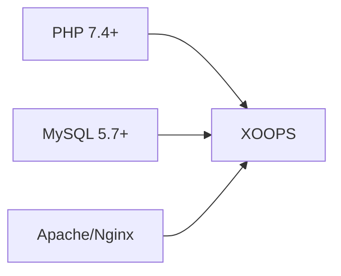
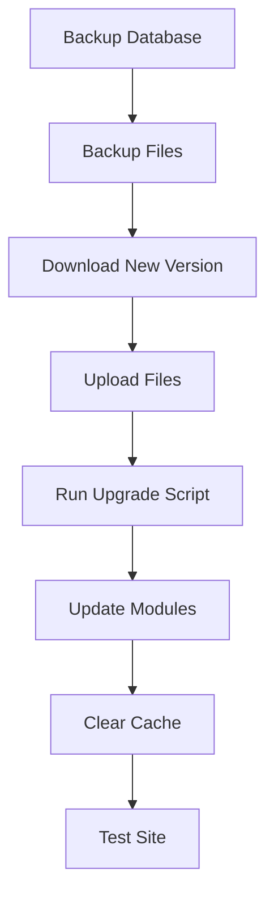

> Běžné otázky a odpovědi týkající se instalace XOOPS.

---

## Předinstalace

### Otázka: Jaké jsou minimální požadavky na server?

**A:** XOOPS 2.5.x vyžaduje:
- PHP 7.4 nebo vyšší (doporučeno PHP 8.x)
- MySQL 5.7+ nebo MariaDB 10.3+
- Apache s mod_rewrite nebo Nginx
- Limit paměti alespoň 64 MB PHP (doporučeno 128 MB+)



### Otázka: Mohu nainstalovat XOOPS na sdílený hosting?

**A:** Ano, XOOPS funguje dobře na většině sdílených hostingů, které splňují požadavky. Zkontrolujte, zda váš hostitel poskytuje:
- PHP s požadovanými rozšířeními (mysqli, gd, curl, json, mbstring)
- Přístup k databázi MySQL
- Možnost nahrávání souborů
- podpora .htaccess (pro Apache)

### Otázka: Která rozšíření PHP jsou vyžadována?

**A:** Požadovaná rozšíření:
- `mysqli` - Připojení k databázi
- `gd` - Zpracování obrazu
- `json` - JSON manipulace
- `mbstring` - Podpora vícebajtových řetězců

Doporučeno:
- `curl` - Externí volání API
- `zip` - Instalace modulu
- `intl` - Internacionalizace

---

## Proces instalace

### Otázka: Průvodce instalací zobrazí prázdnou stránku

**A:** Toto je obvykle chyba PHP. Zkuste:

1. Dočasně povolte zobrazení chyb: 
```php
// Add to htdocs/install/index.php at the top
error_reporting(E_ALL);
ini_set('display_errors', 1);
```

2. Zkontrolujte protokol chyb PHP
3. Ověřte kompatibilitu verze PHP
4. Ujistěte se, že jsou načtena všechna požadovaná rozšíření

### Otázka: Zobrazuje se mi "Nelze zapisovat do mainfile.php"

**A:** Před instalací nastavte oprávnění k zápisu:

```bash
chmod 666 mainfile.php
# After installation, secure it:
chmod 444 mainfile.php
```

### Q: Databázové tabulky se nevytvářejí

**A:** Zkontrolujte:

1. Uživatel MySQL má oprávnění CREATE TABLE:
```sql
GRANT ALL PRIVILEGES ON xoopsdb.* TO 'xoopsuser'@'localhost';
FLUSH PRIVILEGES;
```

2. Databáze existuje:
```sql
CREATE DATABASE xoopsdb CHARACTER SET utf8mb4 COLLATE utf8mb4_unicode_ci;
```

3. Pověření v nastavení databáze shody průvodce

### Otázka: Instalace je dokončena, ale stránka zobrazuje chyby

**A:** Běžné opravy po instalaci:

1. Odeberte nebo přejmenujte instalační adresář:
```bash
mv htdocs/install htdocs/install.bak
```

2. Nastavte správná oprávnění:
```bash
chmod -R 755 htdocs/
chmod -R 777 xoops_data/
chmod 444 mainfile.php
```

3. Vymažte mezipaměť: 
```bash
rm -rf xoops_data/caches/smarty_cache/*
rm -rf xoops_data/caches/smarty_compile/*
```

---

## Konfigurace

### Q: Kde je konfigurační soubor?

**A:** Hlavní konfigurace je v `mainfile.php` v kořenovém adresáři XOOPS. Klíčová nastavení:

```php
define('XOOPS_ROOT_PATH', '/path/to/htdocs');
define('XOOPS_VAR_PATH', '/path/to/xoops_data');
define('XOOPS_URL', 'https://yoursite.com');
define('XOOPS_DB_HOST', 'localhost');
define('XOOPS_DB_USER', 'username');
define('XOOPS_DB_PASS', 'password');
define('XOOPS_DB_NAME', 'database');
define('XOOPS_DB_PREFIX', 'xoops');
```

### Otázka: Jak změním web URL?

**A:** Upravit `mainfile.php`:

```php
define('XOOPS_URL', 'https://newdomain.com');
```

Poté vymažte mezipaměť a aktualizujte všechny pevně zakódované adresy URL v databázi.

### Otázka: Jak přesunu XOOPS do jiného adresáře?

**A:**

1. Přesuňte soubory do nového umístění
2. Aktualizujte cesty v `mainfile.php`:
```php
define('XOOPS_ROOT_PATH', '/new/path/to/htdocs');
define('XOOPS_VAR_PATH', '/new/path/to/xoops_data');
```
3. V případě potřeby aktualizujte databázi
4. Vymažte všechny mezipaměti

---

## Upgrady

### Otázka: Jak upgraduji XOOPS?

**A:**



1. **Zálohujte vše** (databázi + soubory)
2. Stáhněte si novou verzi XOOPS
3. Nahrajte soubory (nepřepisujte `mainfile.php`)
4. Spusťte `htdocs/upgrade/`, pokud je k dispozici
5. Aktualizujte moduly přes admin panel
6. Vymažte všechny mezipaměti
7. Důkladně otestujte

### Otázka: Mohu při upgradu přeskočit verze?

**A:** Obecně ne. Upgradujte postupně přes hlavní verze, abyste zajistili, že migrace databází proběhne správně. Konkrétní pokyny naleznete v poznámkách k vydání.

### Otázka: Moje moduly přestaly po upgradu fungovat

**A:**

1. Zkontrolujte kompatibilitu modulu s novou verzí XOOPS
2. Aktualizujte moduly na nejnovější verze
3. Obnovte šablony: Správce → Systém → Údržba → Šablony
4. Vymažte všechny mezipaměti
5. Zkontrolujte protokoly chyb PHP, zda neobsahují konkrétní chyby

---

## Odstraňování problémů

### Q: Zapomněl jsem heslo správce

**A:** Resetovat přes databázi:

```sql
-- Generate new password hash
UPDATE xoops_users
SET pass = MD5('newpassword')
WHERE uname = 'admin';
```

Nebo použijte funkci resetování hesla, pokud je nakonfigurován e-mail.

### Otázka: Stránka je po instalaci velmi pomalá

**A:**

1. Povolte ukládání do mezipaměti v Admin → Systém → Předvolby
2. Optimalizace databáze:
```sql
OPTIMIZE TABLE xoops_session;
OPTIMIZE TABLE xoops_online;
```
3. Zkontrolujte pomalé dotazy v režimu ladění
4. Povolte PHP OpCache

### Q: Images/CSS se nenačítá

**A:**

1. Zkontrolujte oprávnění k souborům (644 pro soubory, 755 pro adresáře)
2. Ověřte správnost `XOOPS_URL` v `mainfile.php`
3. Zkontrolujte, zda v .htaccess nedochází ke konfliktům při přepisování
4. Zkontrolujte konzolu prohlížeče, zda neobsahuje chyby 404

---

## Související dokumentace

- Průvodce instalací
- Základní konfigurace
- Bílá obrazovka smrti

---

#xoops #faq #instalace #řešení problémů