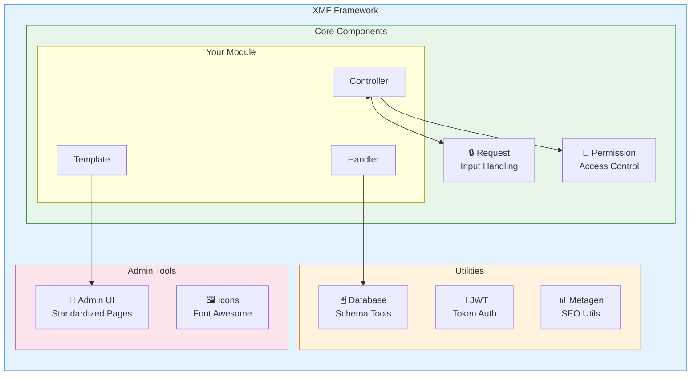
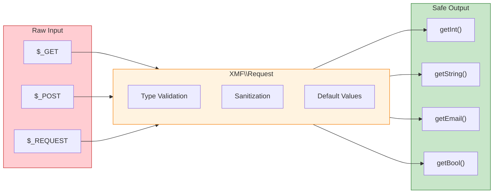

<span class="version-badge version-25x">2.5.x ✅</span> <span class="version-badge version-40x">4.0.x ✅</span>

:::tip[Most k modernímu XOOPS]
XMF funguje v **jak XOOPS 2.5.x, tak XOOPS 4.0.x**. Je to doporučený způsob, jak dnes modernizovat své moduly při přípravě na XOOPS 4.0. XMF poskytuje automatické načítání PSR-4, jmenné prostory a pomocníky, které vyhlazují přechod.
:::

**XOOPS Module Framework (XMF)** je výkonná knihovna navržená pro zjednodušení a standardizaci vývoje modulů XOOPS. XMF poskytuje moderní postupy PHP včetně jmenných prostorů, automatického načítání a komplexní sady pomocných tříd, které snižují standardní kód a zlepšují udržovatelnost.

## Co je XMF?

XMF je kolekce tříd a nástrojů, které poskytují:

- **Moderní podpora PHP** - Plná podpora jmenného prostoru s automatickým načítáním PSR-4
- **Vyřizování požadavků** - Bezpečné ověření vstupu a dezinfekce
- **Pomocníci modulů** - Zjednodušený přístup ke konfiguracím modulů a objektům
- **Systém oprávnění** - Snadno použitelná správa oprávnění
- **Databázové nástroje** - Nástroje pro migraci schémat a správu tabulek
- **Podpora JWT** - Implementace webového tokenu JSON pro bezpečné ověřování
- **Generování metadat** - SEO a nástroje pro extrakci obsahu
- **Administrátorské rozhraní** - Standardizované stránky pro správu modulů

### Přehled komponent XMF



## Klíčové vlastnosti

### Jmenné prostory a automatické načítání

Všechny třídy XMF jsou umístěny v oboru názvů `XMF`. Třídy se automaticky načtou, když se na ně odkazuje – není vyžadován žádný manuál.

```php
use XMF\Request;
use XMF\Module\Helper;

// Classes load automatically when used
$input = Request::getString('input', '');
$helper = Helper::getHelper('mymodule');
```

### Bezpečné vyřizování požadavků

[Třída požadavku](../05-XMF-Framework/Basics/XMF-Request.md) poskytuje typově bezpečný přístup k datům požadavků HTTP s vestavěnou dezinfekcí:



```php
use XMF\Request;

$id = Request::getInt('id', 0);
$name = Request::getString('name', '');
$email = Request::getEmail('email', '');
```

### Pomocný modulový systém

[Module Helper](../05-XMF-Framework/Basics/XMF-Module-Helper.md) poskytuje pohodlný přístup k funkcím souvisejícím s modulem:

```php
$helper = \XMF\Module\Helper::getHelper('mymodule');

// Access module configuration
$configValue = $helper->getConfig('setting_name', 'default');

// Get module object
$module = $helper->getModule();

// Access handlers
$handler = $helper->getHandler('items');
```

### Správa oprávnění

[Permission-Helper](../05-XMF-Framework/Recipes/Permission-Helper.md) zjednodušuje zpracování oprávnění XOOPS:

```php
$permHelper = new \XMF\Module\Helper\Permission();

// Check user permission
if ($permHelper->checkPermission('view', $itemId)) {
    // User has permission
}
```

## Struktura dokumentace

### Základy

- [Začínáme-s-XMF](../05-XMF-Framework/Basics/Getting-Started-with-XMF.md) - Instalace a základní použití
- [XMF-Request](../05-XMF-Framework/Basics/XMF-Request.md) - Zpracování požadavků a ověření vstupu
- [XMF-Module-Helper](../05-XMF-Framework/Basics/XMF-Module-Helper.md) - Použití pomocné třídy modulu

### Recepty

- [Permission-Helper](../05-XMF-Framework/Recipes/Permission-Helper.md) - Práce s oprávněními
- [Module-Admin-Pages](../05-XMF-Framework/Recipes/Module-Admin-Pages.md) - Vytváření standardizovaných rozhraní pro správu

### Reference

- [JWT](../05-XMF-Framework/Reference/JWT.md) - Implementace webového tokenu JSON
- [Databáze](../05-XMF-Framework/Reference/Database.md) - Databázové nástroje a správa schémat
- [Metagen](Reference/Metagen.md) - Metadata a nástroje SEO

## Požadavky

- XOOPS 2.5.8 nebo novější
- PHP 7.2 nebo novější (doporučeno PHP 8.x)

## Instalace

XMF je součástí XOOPS 2.5.8 a novějších verzí. Pro starší verze nebo ruční instalaci:

1. Stáhněte si balíček XMF z úložiště XOOPS
2. Extrahujte do svého adresáře XOOPS `/class/xmf/`
3. Autoloader zpracuje načítání třídy automaticky

## Příklad rychlého startu

Zde je úplný příklad ukazující běžné vzorce použití XMF:

```php
<?php
use XMF\Request;
use XMF\Module\Helper;
use XMF\Module\Helper\Permission;

// Get module helper
$helper = Helper::getHelper('mymodule');

// Get configuration values
$itemsPerPage = $helper->getConfig('items_per_page', 10);

// Handle request input
$op = Request::getCmd('op', 'list');
$id = Request::getInt('id', 0);

// Check permissions
$permHelper = new Permission();
if (!$permHelper->checkPermission('view', $id)) {
    redirect_header('index.php', 3, 'Access denied');
}

// Process based on operation
switch ($op) {
    case 'view':
        $handler = $helper->getHandler('items');
        $item = $handler->get($id);
        // ... display item
        break;
    case 'list':
    default:
        // ... list items
        break;
}
```

## Zdroje

- [XMF GitHub úložiště](https://github.com/XOOPS/XMF)
– [Web projektu XOOPS](https://xoops.org)

---

#xmf #xoops #framework #php #module-development