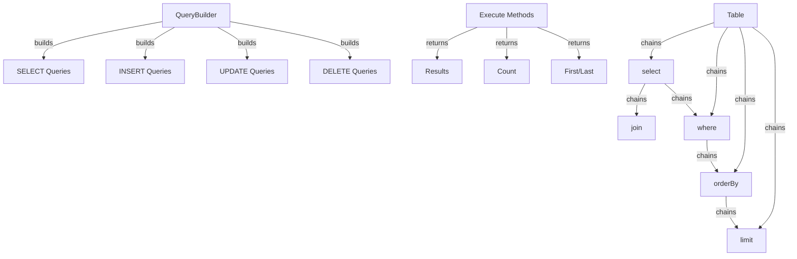

Der XOOPS Query Builder bietet eine moderne, fließende Schnittstelle zum Erstellen von SQL-Abfragen. Er hilft, SQL-Injection zu verhindern, verbessert die Lesbarkeit und bietet Datenbankabstraktion für mehrere Datenbanksysteme.

## Query Builder Architektur



## QueryBuilder Klasse

Die Haupt-QueryBuilder-Klasse mit fließender Schnittstelle.

### Klassenübersicht

```php
namespace Xoops\Database;

class QueryBuilder
{
    protected string $table = '';
    protected string $type = 'SELECT';
    protected array $selects = [];
    protected array $joins = [];
    protected array $wheres = [];
    protected array $orders = [];
    protected int $limit = 0;
    protected int $offset = 0;
    protected array $bindings = [];
}
```

### Statische Methoden

#### table

Erstellt einen neuen QueryBuilder für eine Tabelle.

```php
public static function table(string $table): QueryBuilder
```

**Parameter:**

| Parameter | Typ | Beschreibung |
|-----------|-----|-------------|
| `$table` | string | Tabellenname (mit oder ohne Präfix) |

**Rückgabewert:** `QueryBuilder` - QueryBuilder-Instanz

**Beispiel:**
```php
$query = QueryBuilder::table('users');
$query = QueryBuilder::table('xoops_users'); // Mit Präfix
```

## SELECT Abfragen

### select

Gibt Spalten an, die ausgewählt werden sollen.

```php
public function select(...$columns): self
```

**Parameter:**

| Parameter | Typ | Beschreibung |
|-----------|-----|-------------|
| `...$columns` | array | Spaltennamen oder Ausdrücke |

**Rückgabewert:** `self` - Für Methodenverkettung

**Beispiel:**
```php
// Einfache Auswahl
QueryBuilder::table('users')
    ->select('id', 'username', 'email')
    ->get();

// Auswahl mit Aliasen
QueryBuilder::table('users')
    ->select('id as user_id', 'username as name')
    ->get();

// Alle Spalten auswählen
QueryBuilder::table('users')
    ->select('*')
    ->get();

// Auswahl mit Ausdrücken
QueryBuilder::table('orders')
    ->select('id', 'COUNT(*) as total_items')
    ->groupBy('id')
    ->get();
```

### where

Fügt eine WHERE-Bedingung hinzu.

```php
public function where(string $column, string $operator = '=', mixed $value = null): self
```

**Parameter:**

| Parameter | Typ | Beschreibung |
|-----------|-----|-------------|
| `$column` | string | Spaltenname |
| `$operator` | string | Vergleichsoperator |
| `$value` | mixed | Zu vergleichender Wert |

**Rückgabewert:** `self` - Für Methodenverkettung

**Operatoren:**

| Operator | Beschreibung | Beispiel |
|----------|-------------|---------|
| `=` | Gleich | `->where('status', '=', 'active')` |
| `!=` oder `<>` | Nicht gleich | `->where('status', '!=', 'deleted')` |
| `>` | Größer als | `->where('price', '>', 100)` |
| `<` | Kleiner als | `->where('price', '<', 100)` |
| `>=` | Größer oder gleich | `->where('age', '>=', 18)` |
| `<=` | Kleiner oder gleich | `->where('age', '<=', 65)` |
| `LIKE` | Mustererkennung | `->where('name', 'LIKE', '%john%')` |
| `IN` | In Liste | `->where('status', 'IN', ['active', 'pending'])` |
| `NOT IN` | Nicht in Liste | `->where('id', 'NOT IN', [1, 2, 3])` |
| `BETWEEN` | Bereich | `->where('age', 'BETWEEN', [18, 65])` |
| `IS NULL` | Ist null | `->where('deleted_at', 'IS NULL')` |
| `IS NOT NULL` | Ist nicht null | `->where('deleted_at', 'IS NOT NULL')` |

**Beispiel:**
```php
// Einfache Bedingung
QueryBuilder::table('users')
    ->select('*')
    ->where('status', '=', 'active')
    ->get();

// Mehrere Bedingungen (UND)
QueryBuilder::table('users')
    ->select('*')
    ->where('status', '=', 'active')
    ->where('age', '>=', 18)
    ->get();

// IN-Operator
QueryBuilder::table('products')
    ->select('*')
    ->where('category_id', 'IN', [1, 2, 3])
    ->get();

// LIKE-Operator
QueryBuilder::table('users')
    ->select('*')
    ->where('email', 'LIKE', '%@example.com')
    ->get();

// NULL-Überprüfung
QueryBuilder::table('users')
    ->select('*')
    ->where('deleted_at', 'IS NULL')
    ->get();
```

### orWhere

Fügt eine ODER-Bedingung hinzu.

```php
public function orWhere(string $column, string $operator = '=', mixed $value = null): self
```

**Beispiel:**
```php
QueryBuilder::table('users')
    ->select('*')
    ->where('status', '=', 'active')
    ->orWhere('premium', '=', 1)
    ->get();
    // SELECT * FROM users WHERE status = 'active' OR premium = 1
```

### whereIn / whereNotIn

Komfortable Methoden für IN/NOT IN.

```php
public function whereIn(string $column, array $values): self
public function whereNotIn(string $column, array $values): self
```

**Beispiel:**
```php
QueryBuilder::table('posts')
    ->select('*')
    ->whereIn('status', ['published', 'scheduled'])
    ->get();

QueryBuilder::table('comments')
    ->select('*')
    ->whereNotIn('spam_score', [8, 9, 10])
    ->get();
```

### whereNull / whereNotNull

Komfortable Methoden für NULL-Überprüfungen.

```php
public function whereNull(string $column): self
public function whereNotNull(string $column): self
```

**Beispiel:**
```php
QueryBuilder::table('users')
    ->select('*')
    ->whereNotNull('verified_at')
    ->get();
```

### whereBetween

Überprüft, ob Wert zwischen zwei Werten liegt.

```php
public function whereBetween(string $column, array $values): self
```

**Beispiel:**
```php
QueryBuilder::table('products')
    ->select('*')
    ->whereBetween('price', [10, 100])
    ->get();

QueryBuilder::table('orders')
    ->select('*')
    ->whereBetween('created_at', ['2024-01-01', '2024-12-31'])
    ->get();
```

### join

Fügt einen INNER JOIN hinzu.

```php
public function join(
    string $table,
    string $first,
    string $operator = '=',
    string $second = null
): self
```

**Beispiel:**
```php
QueryBuilder::table('posts')
    ->select('posts.*', 'users.username', 'categories.name')
    ->join('users', 'posts.user_id', '=', 'users.id')
    ->join('categories', 'posts.category_id', '=', 'categories.id')
    ->where('posts.published', '=', 1)
    ->get();
```

### leftJoin / rightJoin

Alternative JOIN-Typen.

```php
public function leftJoin(
    string $table,
    string $first,
    string $operator = '=',
    string $second = null
): self

public function rightJoin(
    string $table,
    string $first,
    string $operator = '=',
    string $second = null
): self
```

**Beispiel:**
```php
QueryBuilder::table('users')
    ->select('users.*', 'COUNT(posts.id) as post_count')
    ->leftJoin('posts', 'users.id', '=', 'posts.user_id')
    ->groupBy('users.id')
    ->get();
```

### groupBy

Gruppiert Ergebnisse nach Spalte(n).

```php
public function groupBy(...$columns): self
```

**Beispiel:**
```php
QueryBuilder::table('orders')
    ->select('user_id', 'COUNT(*) as order_count', 'SUM(total) as total_spent')
    ->groupBy('user_id')
    ->get();

QueryBuilder::table('sales')
    ->select('department', 'region', 'SUM(amount) as total')
    ->groupBy('department', 'region')
    ->get();
```

### having

Fügt eine HAVING-Bedingung hinzu.

```php
public function having(string $column, string $operator = '=', mixed $value = null): self
```

**Beispiel:**
```php
QueryBuilder::table('orders')
    ->select('user_id', 'COUNT(*) as order_count')
    ->groupBy('user_id')
    ->having('order_count', '>', 5)
    ->get();
```

### orderBy

Sortiert Ergebnisse.

```php
public function orderBy(string $column, string $direction = 'ASC'): self
```

**Parameter:**

| Parameter | Typ | Beschreibung |
|-----------|-----|-------------|
| `$column` | string | Spalte zum Sortieren |
| `$direction` | string | `ASC` oder `DESC` |

**Beispiel:**
```php
// Einfache Sortierung
QueryBuilder::table('users')
    ->select('*')
    ->orderBy('created_at', 'DESC')
    ->get();

// Mehrfache Sortierungen
QueryBuilder::table('posts')
    ->select('*')
    ->orderBy('category_id', 'ASC')
    ->orderBy('created_at', 'DESC')
    ->get();

// Zufällige Sortierung
QueryBuilder::table('quotes')
    ->select('*')
    ->orderBy('RAND()')
    ->get();
```

### limit / offset

Begrenzt und versetzt Ergebnisse.

```php
public function limit(int $limit): self
public function offset(int $offset): self
```

**Beispiel:**
```php
// Einfache Begrenzung
QueryBuilder::table('posts')
    ->select('*')
    ->limit(10)
    ->get();

// Paginierung
$page = 2;
$perPage = 20;
$offset = ($page - 1) * $perPage;

QueryBuilder::table('posts')
    ->select('*')
    ->limit($perPage)
    ->offset($offset)
    ->get();
```

## Ausführungs-Methoden

### get

Führt Abfrage aus und gibt alle Ergebnisse zurück.

```php
public function get(): array
```

**Rückgabewert:** `array` - Array von Ergebniszeilen

**Beispiel:**
```php
$users = QueryBuilder::table('users')
    ->select('id', 'username', 'email')
    ->where('status', '=', 'active')
    ->orderBy('username')
    ->get();

foreach ($users as $user) {
    echo $user['username'] . ' (' . $user['email'] . ')' . "\n";
}
```

### first

Holt das erste Ergebnis.

```php
public function first(): ?array
```

**Rückgabewert:** `?array` - Erste Zeile oder null

**Beispiel:**
```php
$user = QueryBuilder::table('users')
    ->select('*')
    ->where('id', '=', 123)
    ->first();

if ($user) {
    echo 'Found: ' . $user['username'];
}
```

### last

Holt das letzte Ergebnis.

```php
public function last(): ?array
```

**Beispiel:**
```php
$latestPost = QueryBuilder::table('posts')
    ->select('*')
    ->orderBy('created_at', 'DESC')
    ->last();
```

### count

Holt die Anzahl der Ergebnisse.

```php
public function count(): int
```

**Rückgabewert:** `int` - Anzahl der Zeilen

**Beispiel:**
```php
$activeUsers = QueryBuilder::table('users')
    ->where('status', '=', 'active')
    ->count();

echo "Active users: $activeUsers";
```

### exists

Überprüft, ob Abfrage Ergebnisse zurückgibt.

```php
public function exists(): bool
```

**Rückgabewert:** `bool` - True wenn Ergebnisse existieren

**Beispiel:**
```php
if (QueryBuilder::table('users')->where('email', '=', 'test@example.com')->exists()) {
    echo 'User already exists';
}
```

### aggregate

Holt Aggregatwerte.

```php
public function aggregate(string $function, string $column): mixed
```

**Beispiel:**
```php
$maxPrice = QueryBuilder::table('products')
    ->aggregate('MAX', 'price');

$avgAge = QueryBuilder::table('users')
    ->aggregate('AVG', 'age');

$totalSales = QueryBuilder::table('orders')
    ->aggregate('SUM', 'total');
```

## INSERT Abfragen

### insert

Fügt eine Zeile ein.

```php
public function insert(array $values): bool
```

**Beispiel:**
```php
QueryBuilder::table('users')->insert([
    'username' => 'john',
    'email' => 'john@example.com',
    'password' => password_hash('secret', PASSWORD_BCRYPT),
    'created_at' => date('Y-m-d H:i:s')
]);
```

### insertMany

Fügt mehrere Zeilen ein.

```php
public function insertMany(array $rows): bool
```

**Beispiel:**
```php
QueryBuilder::table('log_entries')->insertMany([
    ['action' => 'login', 'user_id' => 1, 'timestamp' => time()],
    ['action' => 'logout', 'user_id' => 2, 'timestamp' => time()],
    ['action' => 'update', 'user_id' => 3, 'timestamp' => time()]
]);
```

## UPDATE Abfragen

### update

Aktualisiert Zeilen.

```php
public function update(array $values): int
```

**Rückgabewert:** `int` - Anzahl der betroffenen Zeilen

**Beispiel:**
```php
// Einzelnen Benutzer aktualisieren
QueryBuilder::table('users')
    ->where('id', '=', 123)
    ->update([
        'email' => 'newemail@example.com',
        'updated_at' => date('Y-m-d H:i:s')
    ]);

// Mehrere Zeilen aktualisieren
QueryBuilder::table('posts')
    ->where('status', '=', 'draft')
    ->where('created_at', '<', date('Y-m-d', strtotime('-30 days')))
    ->update([
        'status' => 'archived'
    ]);
```

### increment / decrement

Erhöht oder vermindert eine Spalte.

```php
public function increment(string $column, int $amount = 1): int
public function decrement(string $column, int $amount = 1): int
```

**Beispiel:**
```php
// Aufrufscount erhöhen
QueryBuilder::table('posts')
    ->where('id', '=', 123)
    ->increment('views');

// Lagerbestand verringern
QueryBuilder::table('products')
    ->where('id', '=', 456)
    ->decrement('stock', 5);
```

## DELETE Abfragen

### delete

Löscht Zeilen.

```php
public function delete(): int
```

**Rückgabewert:** `int` - Anzahl der gelöschten Zeilen

**Beispiel:**
```php
// Einzelnen Datensatz löschen
QueryBuilder::table('comments')
    ->where('id', '=', 789)
    ->delete();

// Mehrere Datensätze löschen
QueryBuilder::table('log_entries')
    ->where('created_at', '<', date('Y-m-d', strtotime('-30 days')))
    ->delete();
```

### truncate

Löscht alle Zeilen aus der Tabelle.

```php
public function truncate(): bool
```

**Beispiel:**
```php
// Alle Sessions leeren
QueryBuilder::table('sessions')->truncate();
```

## Erweiterte Funktionen

### Raw Expressions

```php
QueryBuilder::table('products')
    ->select('id', 'name', QueryBuilder::raw('price * quantity as total'))
    ->get();
```

### Subqueries

```php
$recentPostIds = QueryBuilder::table('posts')
    ->select('id')
    ->where('created_at', '>', date('Y-m-d', strtotime('-7 days')))
    ->toSql();

$comments = QueryBuilder::table('comments')
    ->select('*')
    ->whereIn('post_id', $recentPostIds)
    ->get();
```

### SQL erhalten

```php
public function toSql(): string
```

**Beispiel:**
```php
$sql = QueryBuilder::table('users')
    ->select('id', 'username')
    ->where('status', '=', 'active')
    ->toSql();

echo $sql;
// SELECT id, username FROM xoops_users WHERE status = ?
```

## Best Practices

1. **Verwenden Sie parametrisierte Abfragen** - QueryBuilder handhabt Parameter Binding automatisch
2. **Verketten Sie Methoden** - Nutzen Sie die fließende Schnittstelle für lesbaren Code
3. **Testen Sie SQL-Ausgabe** - Verwenden Sie `toSql()`, um generierte Abfragen zu überprüfen
4. **Verwenden Sie Indizes** - Stellen Sie sicher, dass häufig abgefragte Spalten indexiert sind
5. **Begrenzen Sie Ergebnisse** - Verwenden Sie immer `limit()` für große Datenmengen
6. **Nutzen Sie Aggregate** - Lassen Sie die Datenbank zählen/summieren statt PHP
7. **Escape-Ausgabe** - Escapen Sie immer angezeigte Daten mit `htmlspecialchars()`
8. **Indexleistung überwachen** - Überwachen Sie langsame Abfragen und optimieren Sie entsprechend

## Zugehörige Dokumentation

- XoopsDatabase - Datenbankschicht und Verbindungen
- Criteria - Älteres Criteria-basiertes Abfragesystem
- ../Core/XoopsObject - Datenpersistenz von Objekten
- ../Module/Module-System - Modul-Datenbankoperationen

---

*Siehe auch: [XOOPS Database API](https://github.com/XOOPS/XoopsCore27/tree/master/htdocs/class)*
