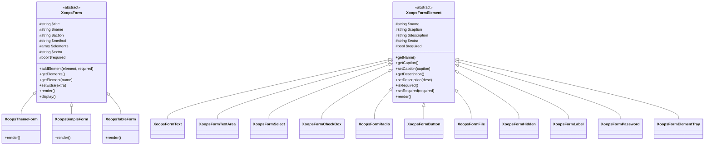

> Vollständige API-Dokumentation für das XOOPS-Formularerzeugungssystem.

---

## Klassenhierarchie



---

## XoopsForm (Abstrakte Basis)

### Konstruktor

```php
public function __construct(
    string $title,      // Formulartitel
    string $name,       // Form name Attribut
    string $action,     // Form action URL
    string $method = 'post',  // HTTP-Methode
    bool $addToken = false    // CSRF-Token hinzufügen
)
```

### Methoden

| Methode | Parameter | Rückgabewert | Beschreibung |
|--------|------------|---------|-------------|
| `addElement` | `XoopsFormElement $element, bool $required = false` | `void` | Element zum Formular hinzufügen |
| `getElements` | - | `array` | Alle Elemente abrufen |
| `getElement` | `string $name` | `XoopsFormElement|null` | Element nach Name abrufen |
| `setExtra` | `string $extra` | `void` | Extra HTML-Attribute setzen |
| `getExtra` | - | `string` | Extra-Attribute abrufen |
| `getTitle` | - | `string` | Formulartitel abrufen |
| `setTitle` | `string $title` | `void` | Formulartitel setzen |
| `getName` | - | `string` | Formularname abrufen |
| `getAction` | - | `string` | Action-URL abrufen |
| `render` | - | `string` | Formular-HTML rendern |
| `display` | - | `void` | Gerendertes Formular ausgeben |
| `insertBreak` | `string $extra = ''` | `void` | Visuellen Umbruch einfügen |
| `setRequired` | `XoopsFormElement $element` | `void` | Element als erforderlich kennzeichnen |

---

## XoopsThemeForm

Die am häufigsten verwendete Formularklasse, rendert mit Theme-bewusster Formatierung.

### Verwendung

```php
<?php
$form = new XoopsThemeForm(
    'User Registration',
    'registration_form',
    'register.php',
    'post',
    true  // CSRF-Token einschließen
);

$form->addElement(new XoopsFormText('Username', 'uname', 25, 255, ''), true);
$form->addElement(new XoopsFormPassword('Password', 'pass', 25, 255), true);
$form->addElement(new XoopsFormButton('', 'submit', _SUBMIT, 'submit'));

echo $form->render();
```

---

## Formularelemente

### XoopsFormText

Einzeiliger Texteingabe.

```php
$text = new XoopsFormText(
    string $caption,    // Label-Text
    string $name,       // Input-Name
    int $size,          // Anzeigebreite
    int $maxlength,     // Max Zeichen
    mixed $value = ''   // Standardwert
);

// Methoden
$text->getValue();
$text->setValue($value);
$text->getSize();
$text->getMaxlength();
```

### XoopsFormTextArea

Mehrzeilige Texteingabe.

```php
$textarea = new XoopsFormTextArea(
    string $caption,
    string $name,
    mixed $value = '',
    int $rows = 5,
    int $cols = 50
);

// Methoden
$textarea->getRows();
$textarea->getCols();
```

### XoopsFormSelect

Dropdown oder Multi-Select.

```php
$select = new XoopsFormSelect(
    string $caption,
    string $name,
    mixed $value = null,
    int $size = 1,        // 1 = dropdown, >1 = listbox
    bool $multiple = false
);

// Methoden
$select->addOption(mixed $value, string $name = '');
$select->addOptionArray(array $options);
$select->getOptions();
$select->getValue();
$select->isMultiple();
```

### XoopsFormCheckBox

Checkbox oder Checkbox-Gruppe.

```php
$checkbox = new XoopsFormCheckBox(
    string $caption,
    string $name,
    mixed $value = null,
    string $delimeter = '&nbsp;'
);

// Methoden
$checkbox->addOption(mixed $value, string $name = '');
$checkbox->addOptionArray(array $options);
$checkbox->getValue();
```

### XoopsFormRadio

Radiobutton-Gruppe.

```php
$radio = new XoopsFormRadio(
    string $caption,
    string $name,
    mixed $value = null,
    string $delimeter = '&nbsp;'
);

// Methoden
$radio->addOption(mixed $value, string $name = '');
$radio->addOptionArray(array $options);
```

### XoopsFormButton

Submit, Reset oder benutzerdefinierter Button.

```php
$button = new XoopsFormButton(
    string $caption,
    string $name,
    string $value = '',
    string $type = 'button'  // 'submit', 'reset', 'button'
);
```

### XoopsFormFile

Datei-Upload-Eingabe.

```php
$file = new XoopsFormFile(
    string $caption,
    string $name,
    int $maxFileSize = 0
);

// Methoden
$file->getMaxFileSize();
$file->setMaxFileSize(int $size);
```

### XoopsFormHidden

Verstecktes Eingabefeld.

```php
$hidden = new XoopsFormHidden(
    string $name,
    mixed $value
);
```

### XoopsFormHiddenToken

CSRF-Schutz-Token.

```php
$token = new XoopsFormHiddenToken(
    string $name = 'XOOPS_TOKEN_REQUEST'
);
```

### XoopsFormLabel

Nur-Anzeige-Label (keine Eingabe).

```php
$label = new XoopsFormLabel(
    string $caption,
    string $value
);
```

### XoopsFormPassword

Passwort-Eingabefeld.

```php
$password = new XoopsFormPassword(
    string $caption,
    string $name,
    int $size,
    int $maxlength,
    mixed $value = ''
);
```

### XoopsFormElementTray

Gruppiert mehrere Elemente zusammen.

```php
$tray = new XoopsFormElementTray(
    string $caption,
    string $delimeter = '&nbsp;'
);

// Methoden
$tray->addElement(XoopsFormElement $element, bool $required = false);
$tray->getElements();
```

---

## Zugehörige Dokumentation

- XoopsObject API
- Forms Guide
- CSRF Protection

---

#xoops #api #forms #xoopsform #reference
