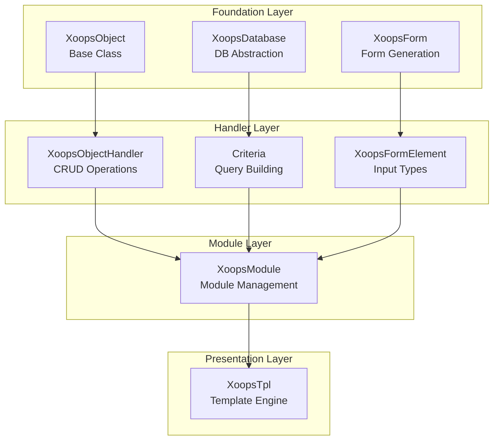

Willkommen zur umfassenden XOOPS API-Referenz-Dokumentation. Dieser Abschnitt bietet detaillierte Dokumentation für alle Core-Klassen, Methoden und Systeme, die das XOOPS-CMS ausmachen.

## Übersicht

Die XOOPS API ist in mehrere große Subsysteme organisiert, die jeweils für einen spezifischen Aspekt der CMS-Funktionalität verantwortlich sind. Das Verständnis dieser APIs ist für die Entwicklung von Modulen, Themen und Erweiterungen für XOOPS wichtig.

## API-Abschnitte

### Core-Klassen

Die Grundlagen-Klassen, auf denen alle anderen XOOPS-Komponenten aufbauen.

| Dokumentation | Beschreibung |
|--------------|-------------|
| XoopsObject | Basis-Klasse für alle Datenobjekte in XOOPS |
| XoopsObjectHandler | Handler-Muster für CRUD-Operationen |

### Datenbankschicht

Datenbankabstraktion und Abfragebau-Utilities.

| Dokumentation | Beschreibung |
|--------------|-------------|
| XoopsDatabase | Datenbankabstraktionsschicht |
| Criteria System | Abfragekriterien und Bedingungen |
| QueryBuilder | Moderner fließender Abfragebau |

### Formular-System

HTML-Formularerzeugung und Validierung.

| Dokumentation | Beschreibung |
|--------------|-------------|
| XoopsForm | Formularcontainer und Rendering |
| Formularelemente | Alle verfügbaren Formulelement-Typen |

### Kernel-Klassen

Core-Systemkomponenten und Services.

| Dokumentation | Beschreibung |
|--------------|-------------|
| Kernel-Klassen | System-Kernel und Core-Komponenten |

### Modul-System

Modul-Verwaltung und Lebenszyklu.

| Dokumentation | Beschreibung |
|--------------|-------------|
| Modul-System | Modul-Laden, Installation und Verwaltung |

### Template-System

Smarty-Template-Integration.

| Dokumentation | Beschreibung |
|--------------|-------------|
| Template-System | Smarty-Integration und Template-Verwaltung |

### Benutzer-System

Benutzerverwaltung und Authentifizierung.

| Dokumentation | Beschreibung |
|--------------|-------------|
| Benutzer-System | Benutzerkonten, Gruppen und Berechtigungen |

## Architektur-Übersicht

## Zugehörige Dokumentation

- Module Development Guide
- Theme Development Guide
- System Configuration
- Security Best Practices

## Versionsverlauf

| Version | Änderungen |
|---------|---------|
| 2.5.11 | Aktuelle stabile Version |
| 2.5.10 | GraphQL API-Unterstützung hinzugefügt |
| 2.5.9 | Verbessertes Criteria-System |
| 2.5.8 | PSR-4 Autoloading-Unterstützung |

---

*Diese Dokumentation ist Teil der XOOPS Knowledge Base. Für die neuesten Updates besuchen Sie das [XOOPS GitHub Repository](https://github.com/XOOPS).*
