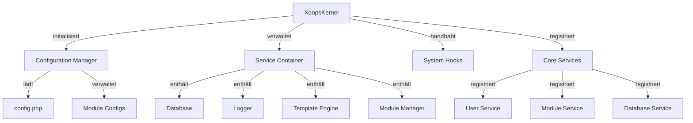

Der XOOPS Kernel bietet das fundamentale Framework für System-Bootstrapping, Konfigurationsverwaltung, System-Event-Handling und Core-Utilities. Diese Klassen bilden das Rückgrat der XOOPS-Anwendung.

## Systemarchitektur



## XoopsKernel Klasse

Die Haupt-Kernel-Klasse, die das XOOPS-System initialisiert und verwaltet.

### Klassenübersicht

```php
namespace Xoops;

class XoopsKernel
{
    private static ?XoopsKernel $instance = null;
    protected ServiceContainer $services;
    protected ConfigurationManager $config;
    protected array $modules = [];
    protected bool $isLoaded = false;
}
```

### getInstance

Ruft die Singleton-Kernel-Instanz ab.

```php
public static function getInstance(): XoopsKernel
```

**Rückgabewert:** `XoopsKernel` - Die Singleton-Kernel-Instanz

**Beispiel:**
```php
$kernel = XoopsKernel::getInstance();
```

### Boot-Prozess

Der Kernel Boot-Prozess folgt diesen Schritten:

1. **Initialization** - Fehlerhandler setzen, Konstanten definieren
2. **Configuration** - Konfigurationsdateien laden
3. **Service Registration** - Core-Services registrieren
4. **Module Detection** - Scannen und Identifizieren aktiver Module
5. **Database Initialization** - Mit Datenbank verbinden
6. **Cleanup** - Für Request-Verarbeitung vorbereiten

```php
public function boot(): void
```

**Beispiel:**
```php
$kernel = XoopsKernel::getInstance();
$kernel->boot();
```

## Best Practices

1. **Single Boot** - Rufen Sie `boot()` nur einmal während Anwendungsstart auf
2. **Use Service Container** - Registrieren und rufen Sie Services über den Kernel ab
3. **Handle Hooks Early** - Registrieren Sie Hook-Listener bevor Sie sie auslösen
4. **Log Important Events** - Verwenden Sie den Logger-Service zum Debuggen
5. **Cache Configuration** - Laden Sie Config einmal und verwenden Sie sie wieder
6. **Error Handling** - Richten Sie immer Error-Handler ein bevor Sie Requests verarbeiten

## Zugehörige Dokumentation

- ../Module/Module-System - Modul-System und Lebenszyklu
- ../Template/Template-System - Template-Engine-Integration
- ../User/User-System - Benutzer-Authentifizierung und Verwaltung
- ../Database/XoopsDatabase - Datenbankschicht

---

*Siehe auch: [XOOPS Kernel Source](https://github.com/XOOPS/XoopsCore27/tree/master/htdocs/class)*
