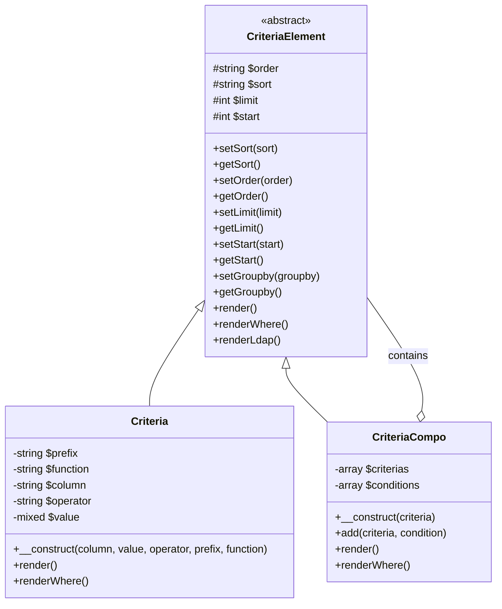

> Vollständige API-Dokumentation für das XOOPS Criteria-Abfragebau-System.

---

## Criteria-System-Architektur



---

## Criteria Klasse

### Konstruktor

```php
public function __construct(
    string $column,           // Spaltenname
    mixed $value = '',        // Zu vergleichender Wert
    string $operator = '=',   // Vergleichsoperator
    string $prefix = '',      // Tabellenpräfix
    string $function = ''     // SQL-Funktions-Wrapper
)
```

### Operatoren

| Operator | Beispiel | SQL-Ausgabe |
|----------|---------|------------|
| `=` | `new Criteria('status', 1)` | `status = 1` |
| `!=` | `new Criteria('status', 0, '!=')` | `status != 0` |
| `<>` | `new Criteria('status', 0, '<>')` | `status <> 0` |
| `<` | `new Criteria('age', 18, '<')` | `age < 18` |
| `<=` | `new Criteria('age', 18, '<=')` | `age <= 18` |
| `>` | `new Criteria('age', 18, '>')` | `age > 18` |
| `>=` | `new Criteria('age', 18, '>=')` | `age >= 18` |
| `LIKE` | `new Criteria('title', '%php%', 'LIKE')` | `title LIKE '%php%'` |
| `NOT LIKE` | `new Criteria('title', '%spam%', 'NOT LIKE')` | `title NOT LIKE '%spam%'` |
| `IN` | `new Criteria('id', '(1,2,3)', 'IN')` | `id IN (1,2,3)` |
| `NOT IN` | `new Criteria('id', '(1,2,3)', 'NOT IN')` | `id NOT IN (1,2,3)` |
| `IS NULL` | `new Criteria('deleted', null, 'IS NULL')` | `deleted IS NULL` |
| `IS NOT NULL` | `new Criteria('email', null, 'IS NOT NULL')` | `email IS NOT NULL` |
| `BETWEEN` | `new Criteria('created', '1000 AND 2000', 'BETWEEN')` | `created BETWEEN 1000 AND 2000` |

### Verwendungsbeispiele

```php
// Einfache Gleichheit
$criteria = new Criteria('status', 'published');

// Numerischer Vergleich
$criteria = new Criteria('views', 100, '>=');

// Mustererkennung
$criteria = new Criteria('title', '%XOOPS%', 'LIKE');

// Mit Tabellenpräfix
$criteria = new Criteria('uid', 1, '=', 'u');
// Rendert: u.uid = 1

// Mit SQL-Funktion
$criteria = new Criteria('title', '', '!=', '', 'LOWER');
// Rendert: LOWER(title) != ''
```

---

## CriteriaCompo Klasse

### Konstruktor & Methoden

```php
// Leere Kompo erstellen
$criteria = new CriteriaCompo();

// Oder mit initialem Kriterium
$criteria = new CriteriaCompo(new Criteria('status', 'active'));

// Kriterien hinzufügen (UND standardmäßig)
$criteria->add(new Criteria('views', 10, '>='));

// Mit ODER hinzufügen
$criteria->add(new Criteria('featured', 1), 'OR');

// Verschachtelung
$subCriteria = new CriteriaCompo();
$subCriteria->add(new Criteria('author', 1));
$subCriteria->add(new Criteria('author', 2), 'OR');
$criteria->add($subCriteria); // (author = 1 OR author = 2)
```

### Sortierung und Paginierung

```php
$criteria = new CriteriaCompo();
$criteria->add(new Criteria('status', 'published'));

// Einfache Sortierung
$criteria->setSort('created');
$criteria->setOrder('DESC');

// Mehrfache Sortier-Spalten
$criteria->setSort('category_id, created');
$criteria->setOrder('ASC, DESC');

// Paginierung
$criteria->setLimit(10);    // Elemente pro Seite
$criteria->setStart(0);     // Offset (page * limit)

// Group by
$criteria->setGroupby('category_id');
```

---

## Best Practices

1. **Verwenden Sie immer LIMIT** für große Tabellen
2. **Verwenden Sie Indizes** auf Spalten in Kriterien
3. **Vermeiden Sie führende Wildcards** in LIKE (`'%term'` ist langsam)
4. **Pre-Filter in PHP** wenn möglich für komplexe Logik
5. **Verwenden Sie COUNT sparsam** - Cache-Ergebnisse wenn möglich

---

## Zugehörige Dokumentation

- Database Layer
- XoopsObjectHandler API
- SQL Injection Prevention

---

#xoops #api #criteria #database #query #reference
