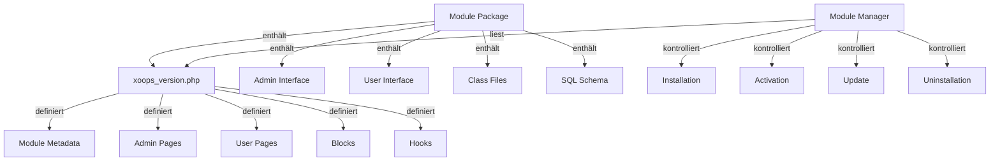

Das XOOPS Modul-System bietet ein umfassendes Framework für die Entwicklung, Installation, Verwaltung und Erweiterung der Modul-Funktionalität. Module sind selbstständige Pakete, die XOOPS mit zusätzlichen Features und Funktionen erweitern.

## Modul-Architektur



## Modul-Struktur

Standard XOOPS Modul-Verzeichnisstruktur:

```
mymodule/
├── xoops_version.php          # Modul-Manifest und Konfiguration
├── admin.php                  # Admin-Hauptseite
├── index.php                  # Benutzer-Hauptseite
├── admin/                     # Admin-Seiten-Verzeichnis
├── class/                     # Modul-Klassen
├── sql/                       # Datenbankschemas
├── include/                   # Include-Dateien
├── templates/                 # Modul-Templates
├── blocks/                    # Modul-Blöcke
├── tests/                     # Unit Tests
├── language/                  # Language-Dateien
└── docs/                      # Dokumentation
```

## XoopsModule Klasse

Die XoopsModule Klasse stellt ein installiertes XOOPS-Modul dar.

### Klassenübersicht

```php
namespace Xoops\Core\Module;

class XoopsModule extends XoopsObject
{
    protected int $moduleid = 0;
    protected string $name = '';
    protected string $dirname = '';
    protected string $version = '';
    protected string $description = '';
    protected array $config = [];
    protected array $blocks = [];
    protected array $adminPages = [];
    protected array $userPages = [];
}
```

### Eigenschaften

| Eigenschaft | Typ | Beschreibung |
|----------|-----|-------------|
| `$moduleid` | int | Eindeutige Modul-ID |
| `$name` | string | Modul-Anzeigename |
| `$dirname` | string | Modul-Verzeichnisname |
| `$version` | string | Aktuelle Modul-Version |
| `$description` | string | Modul-Beschreibung |
| `$config` | array | Modul-Konfiguration |
| `$blocks` | array | Modul-Blöcke |
| `$adminPages` | array | Admin-Panel-Seiten |
| `$userPages` | array | Benutzer-seitige Seiten |

## Module Installation Process

### xoops_module_install Funktion

Die Modul-Installationsfunktion definiert in `xoops_version.php`:

```php
function xoops_module_install_modulename($module)
{
    // $module ist eine XoopsModule-Instanz

    // Datenbanktabellen erstellen
    // Standard-Konfiguration initialisieren
    // Standard-Ordner erstellen
    // Dateiberechtigungen setzen

    return true; // Erfolg
}
```

### xoops_module_uninstall Funktion

Die Modul-Deinstallationsfunktion:

```php
function xoops_module_uninstall_modulename($module)
{
    // Datenbanktabellen löschen
    // Hochgeladene Dateien entfernen
    // Konfiguration bereinigen

    return true;
}
```

## Module Hooks

Module Hooks ermöglichen Module um mit anderen Modulen und dem System zu integrieren.

### Hook Declaration

In `xoops_version.php`:

```php
$modversion['hooks'] = [
    'system.page.footer' => [
        'function' => 'publisher_page_footer'
    ],
    'user.profile.view' => [
        'function' => 'publisher_user_articles'
    ],
];
```

## Best Practices

1. **Namespace Your Classes** - Verwenden Sie Modul-spezifische Namespaces um Konflikte zu vermeiden

2. **Use Handlers** - Verwenden Sie immer Handler-Klassen für Datenbankoperationen

3. **Internationalize Content** - Verwenden Sie Language-Konstanten für alle Benutzertexte

4. **Create Installation Scripts** - Bieten Sie SQL-Schemas für Datenbanktabellen

5. **Document Hooks** - Dokumentieren Sie deutlich welche Hooks Ihr Modul bereitstellt

6. **Version Your Module** - Erhöhen Sie Versionsnummern bei Releases

7. **Test Installation** - Testen Sie gründlich Install/Uninstall-Prozesse

8. **Handle Permissions** - Überprüfen Sie Benutzerberechtigungen bevor Sie Aktionen erlauben

## Zugehörige Dokumentation

- ../Kernel/Kernel-Classes - Kernel-Initialisierung und Core-Services
- ../Template/Template-System - Modul-Templates und Theme-Integration
- ../Database/QueryBuilder - Datenbankabfrage-Bau
- ../Core/XoopsObject - Basis-Objektklasse

---

*Siehe auch: [XOOPS Module Development Guide](https://github.com/XOOPS/XoopsCore27/wiki/Module-Development)*
