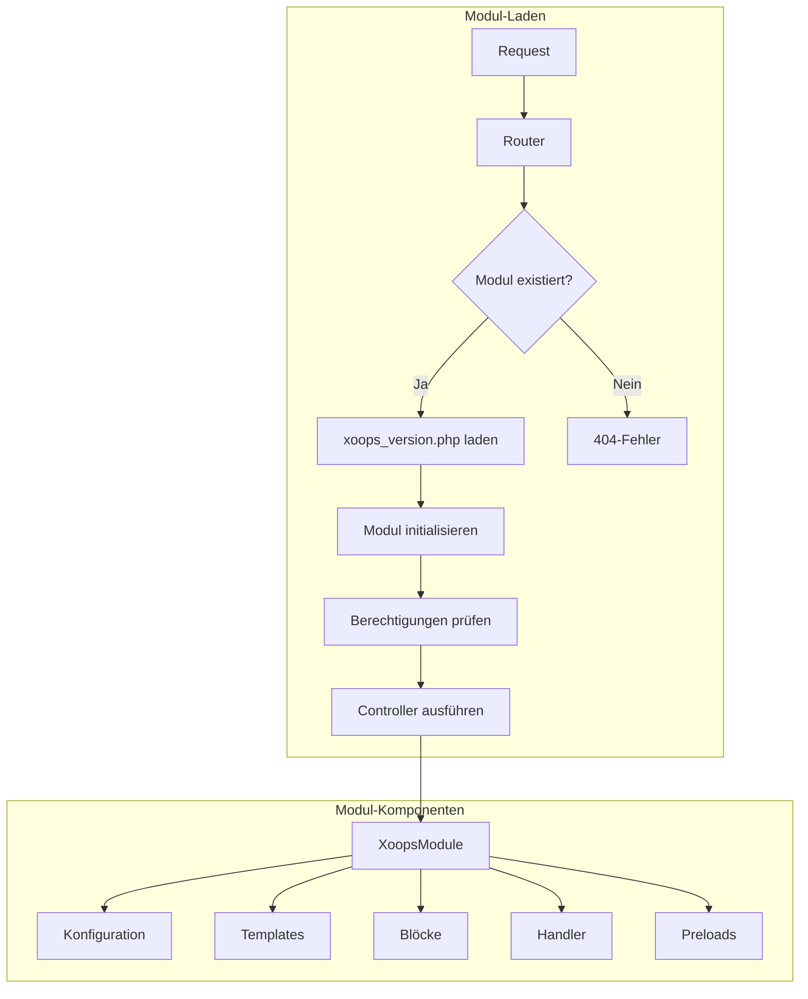
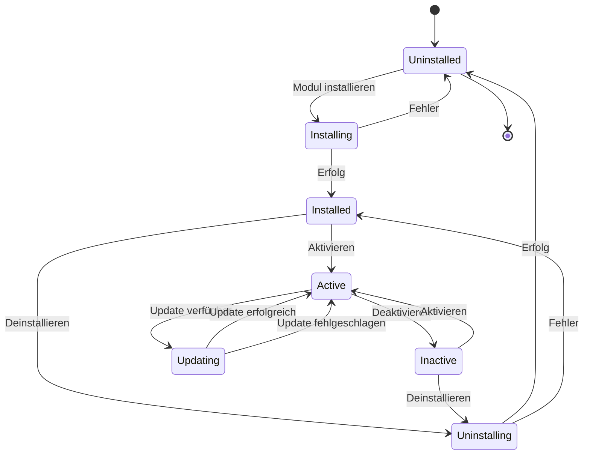
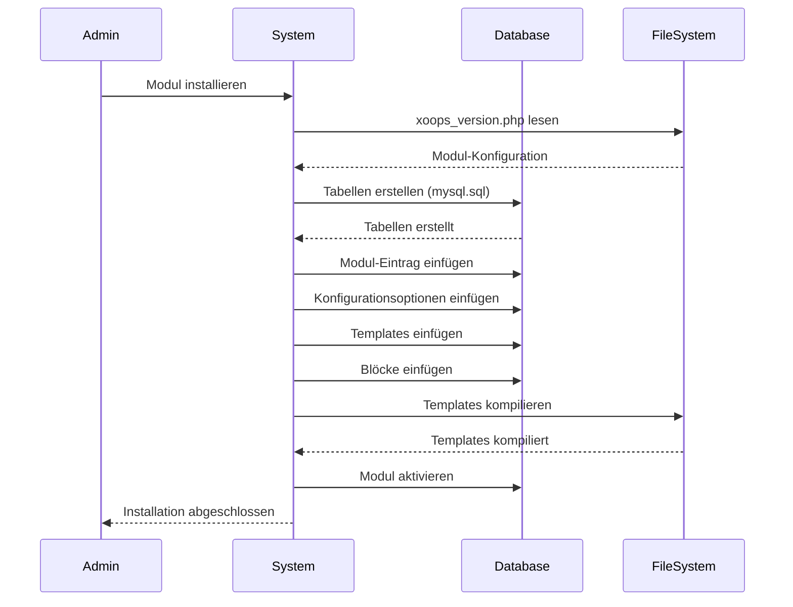

> Vollständige API-Dokumentation für das XOOPS-Modulsystem.

---

## Modul-System-Architektur



---

## XoopsModule Klasse

### Klassendefinition

```php
class XoopsModule extends XoopsObject
{
    // Eigenschaften
    public $modinfo;      // Modul-Info-Array
    public $adminmenu;    // Admin-Menü-Elemente

    // Methoden
    public function __construct();
    public function loadInfo(string $dirname, bool $verbose = true): bool;
    public function getInfo(string $name = null): mixed;
    public function setInfo(string $name, mixed $value): bool;
    public function mainLink(): string;
    public function subLink(): string;
    public function loadAdminMenu(): void;
    public function getAdminMenu(): array;
    public function loadConfig(): bool;
    public function getConfig(string $name = null): mixed;
}
```

### Eigenschaften

| Eigenschaft | Typ | Beschreibung |
|----------|------|-------------|
| `mid` | int | Modul-ID |
| `name` | string | Anzeigename |
| `version` | string | Versionsnummer |
| `dirname` | string | Verzeichnisname |
| `isactive` | int | Aktiv-Status (0/1) |
| `hasmain` | int | Hat Hauptbereich |
| `hasadmin` | int | Hat Admin-Bereich |
| `hassearch` | int | Hat Suchfunktion |
| `hasconfig` | int | Hat Konfiguration |
| `hascomments` | int | Hat Kommentare |
| `hasnotification` | int | Hat Benachrichtigungen |

### Schlüsselmethoden

```php
// Modul-Instanz abrufen
$module = $GLOBALS['xoopsModule'];

// Oder nach Verzeichnisname laden
$moduleHandler = xoops_getHandler('module');
$module = $moduleHandler->getByDirname('mymodule');

// Modul-Info abrufen
$version = $module->getVar('version');
$name = $module->getVar('name');
$dirname = $module->getVar('dirname');

// Modul-Konfiguration abrufen
$config = $module->getConfig();
$specificConfig = $module->getConfig('items_per_page');

// Prüfen ob Modul eine Funktion hat
$hasAdmin = $module->getVar('hasadmin');
$hasSearch = $module->getVar('hassearch');

// Modul-Pfad abrufen
$modulePath = XOOPS_ROOT_PATH . '/modules/' . $module->getVar('dirname');
$moduleUrl = XOOPS_URL . '/modules/' . $module->getVar('dirname');
```

---

## XoopsModuleHandler

### Klassendefinition

```php
class XoopsModuleHandler extends XoopsPersistableObjectHandler
{
    public function create(bool $isNew = true): XoopsModule;
    public function get(int $id): ?XoopsModule;
    public function getByDirname(string $dirname): ?XoopsModule;
    public function insert(XoopsObject $module, bool $force = false): bool;
    public function delete(XoopsObject $module, bool $force = false): bool;
    public function getList(?CriteriaElement $criteria = null): array;
    public function getObjects(?CriteriaElement $criteria = null): array;
}
```

### Verwendungsbeispiele

```php
// Handler abrufen
$moduleHandler = xoops_getHandler('module');

// Alle aktiven Module abrufen
$criteria = new Criteria('isactive', 1);
$activeModules = $moduleHandler->getObjects($criteria);

// Modul nach Verzeichnisname abrufen
$publisherModule = $moduleHandler->getByDirname('publisher');

// Module mit Admin abrufen
$criteria = new CriteriaCompo();
$criteria->add(new Criteria('isactive', 1));
$criteria->add(new Criteria('hasadmin', 1));
$adminModules = $moduleHandler->getObjects($criteria);

// Prüfen ob Modul installiert ist
$module = $moduleHandler->getByDirname('mymodule');
if ($module && $module->getVar('isactive')) {
    // Modul ist installiert und aktiv
}
```

---

## Modul-Lebenszyklu



---

## xoops_version.php Struktur

```php
<?php
// Modul-Metadaten
$modversion['name']        = _MI_MYMODULE_NAME;
$modversion['version']     = '1.0.0';
$modversion['description'] = _MI_MYMODULE_DESC;
$modversion['author']      = 'Your Name';
$modversion['credits']     = 'XOOPS Community';
$modversion['license']     = 'GPL 2.0+';
$modversion['license_url'] = 'https://www.gnu.org/licenses/gpl-2.0.html';
$modversion['image']       = 'assets/images/logo.png';
$modversion['dirname']     = basename(__DIR__);

// Anforderungen
$modversion['min_php']     = '7.4';
$modversion['min_xoops']   = '2.5.10';
$modversion['min_admin']   = '1.2';
$modversion['min_db']      = ['mysql' => '5.7', 'mysqli' => '5.7'];

// Funktionen
$modversion['hasMain']     = 1;
$modversion['hasAdmin']    = 1;
$modversion['hasSearch']   = 1;
$modversion['hasComments'] = 1;
$modversion['hasNotification'] = 1;

// Admin-Menü
$modversion['adminindex']  = 'admin/index.php';
$modversion['adminmenu']   = 'admin/menu.php';

// Datenbanktabellen
$modversion['sqlfile']['mysql'] = 'sql/mysql.sql';
$modversion['tables'] = [
    $modversion['dirname'] . '_items',
    $modversion['dirname'] . '_categories',
];

// Templates
$modversion['templates'] = [
    ['file' => 'mymodule_index.tpl', 'description' => 'Index template'],
    ['file' => 'mymodule_item.tpl', 'description' => 'Item template'],
];

// Blöcke
$modversion['blocks'][] = [
    'file'        => 'blocks/recent.php',
    'name'        => _MI_MYMODULE_BLOCK_RECENT,
    'description' => _MI_MYMODULE_BLOCK_RECENT_DESC,
    'show_func'   => 'mymodule_block_recent_show',
    'edit_func'   => 'mymodule_block_recent_edit',
    'options'     => '10|0',
    'template'    => 'mymodule_block_recent.tpl',
];

// Konfigurationsoptionen
$modversion['config'][] = [
    'name'        => 'items_per_page',
    'title'       => '_MI_MYMODULE_ITEMS_PER_PAGE',
    'description' => '_MI_MYMODULE_ITEMS_PER_PAGE_DESC',
    'formtype'    => 'textbox',
    'valuetype'   => 'int',
    'default'     => 10,
];

// Suche
$modversion['search'] = [
    'file' => 'include/search.inc.php',
    'func' => 'mymodule_search',
];

// Kommentare
$modversion['comments'] = [
    'itemName' => 'item_id',
    'pageName' => 'item.php',
    'callbackFile' => 'include/comment_functions.php',
    'callback' => [
        'approve' => 'mymodule_comment_approve',
        'update'  => 'mymodule_comment_update',
    ],
];

// Benachrichtigungen
$modversion['notification'] = [
    'lookup_file' => 'include/notification.inc.php',
    'lookup_func' => 'mymodule_notify_iteminfo',
    'category' => [
        [
            'name'           => 'global',
            'title'          => _MI_MYMODULE_NOTIFY_GLOBAL,
            'description'    => _MI_MYMODULE_NOTIFY_GLOBAL_DESC,
            'subscribe_from' => ['index.php'],
        ],
        [
            'name'           => 'item',
            'title'          => _MI_MYMODULE_NOTIFY_ITEM,
            'description'    => _MI_MYMODULE_NOTIFY_ITEM_DESC,
            'subscribe_from' => ['item.php'],
            'item_name'      => 'item_id',
            'allow_bookmark' => 1,
        ],
    ],
    'event' => [
        [
            'name'          => 'new_item',
            'category'      => 'global',
            'title'         => _MI_MYMODULE_NOTIFY_NEW_ITEM,
            'caption'       => _MI_MYMODULE_NOTIFY_NEW_ITEM_CAP,
            'description'   => _MI_MYMODULE_NOTIFY_NEW_ITEM_DESC,
            'mail_template' => 'notify_newitem',
            'mail_subject'  => _MI_MYMODULE_NOTIFY_NEW_ITEM_SBJ,
        ],
    ],
];
```

---

## Modul-Helper-Muster

```php
<?php
namespace XoopsModules\MyModule;

class Helper extends \Xmf\Module\Helper
{
    public function __construct()
    {
        $this->dirname = basename(dirname(__DIR__));
    }

    public static function getInstance(): self
    {
        static $instance = null;
        if ($instance === null) {
            $instance = new self();
        }
        return $instance;
    }

    public function getHandler(string $name): ?object
    {
        return $this->getHandlerByName($name);
    }

    public function getConfig(string $name = null)
    {
        return parent::getConfig($name);
    }
}

// Verwendung
$helper = Helper::getInstance();
$itemHandler = $helper->getHandler('Item');
$perPage = $helper->getConfig('items_per_page');
```

---

## Modul-Installationsablauf



---

## Zugehörige Dokumentation

- XoopsObject API
- Modul-Entwicklungsanleitung
- XOOPS-Architektur

---

#xoops #api #modul #xoopsmodule #referenz
