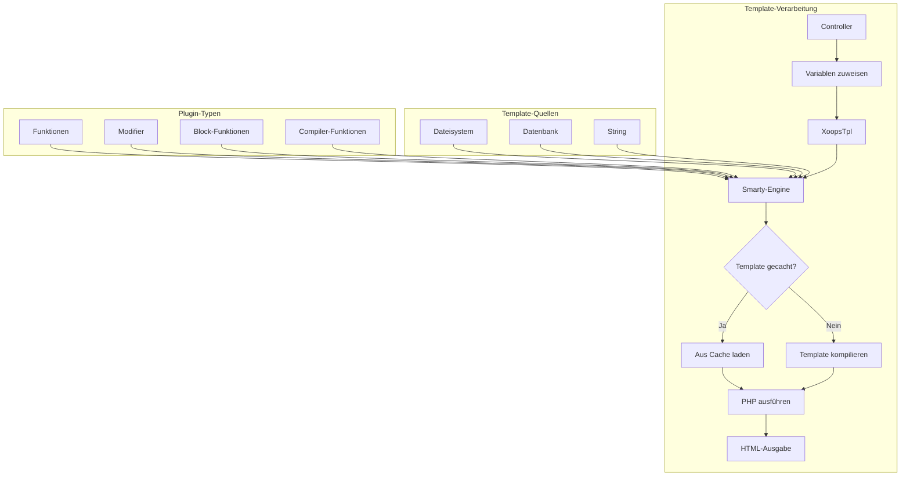
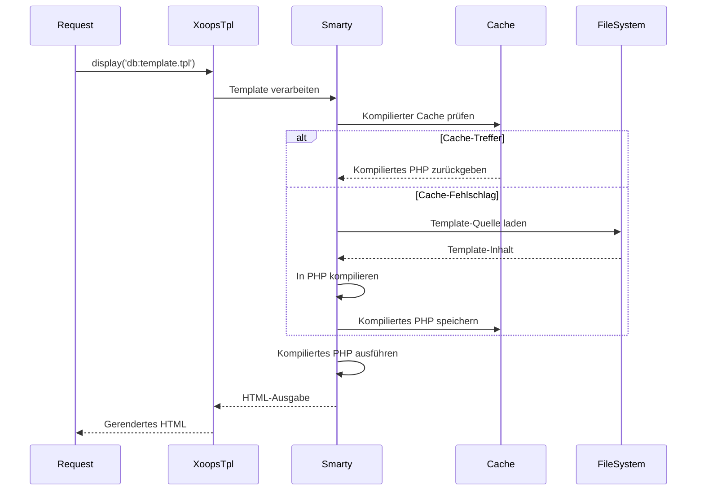
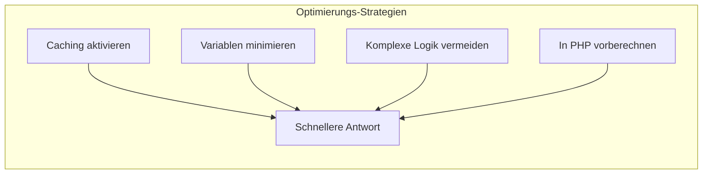

> Vollständige API-Dokumentation für Smarty-Vorlagenerstellung in XOOPS.

---

## Template-Engine-Architektur



---

## XoopsTpl Klasse

### Initialisierung

```php
// Globales Template-Objekt
global $xoopsTpl;

// Oder neue Instanz
$tpl = new XoopsTpl();

// In Modulen verfügbar
$GLOBALS['xoopsTpl']->assign('myvar', $value);
```

### Kern-Methoden

| Methode | Parameter | Beschreibung |
|--------|------------|-------------|
| `assign` | `string $name, mixed $value` | Variable zu Template zuweisen |
| `assignByRef` | `string $name, mixed &$value` | Nach Referenz zuweisen |
| `append` | `string $name, mixed $value, bool $merge = false` | Zu Array-Variable anhängen |
| `display` | `string $template` | Template rendern und ausgeben |
| `fetch` | `string $template` | Template rendern und zurückgeben |
| `clearAssign` | `string $name` | Zugewiesene Variable löschen |
| `clearAllAssign` | - | Alle Variablen löschen |
| `getTemplateVars` | `string $name = null` | Zugewiesene Variablen abrufen |
| `templateExists` | `string $template` | Prüfen ob Template existiert |
| `isCached` | `string $template` | Prüfen ob Template gecacht ist |
| `clearCache` | `string $template = null` | Template-Cache löschen |

### Variablenzuweisung

```php
// Einfache Zuweisung
$xoopsTpl->assign('title', 'My Page Title');
$xoopsTpl->assign('count', 42);
$xoopsTpl->assign('is_admin', true);

// Array-Zuweisung
$xoopsTpl->assign('items', [
    ['id' => 1, 'name' => 'Item 1'],
    ['id' => 2, 'name' => 'Item 2'],
]);

// Objekt-Zuweisung
$xoopsTpl->assign('user', $xoopsUser);

// Mehrere Zuweisungen
$xoopsTpl->assign([
    'title' => 'My Title',
    'content' => 'My Content',
    'author' => 'John Doe'
]);

// Zu Array anhängen
$xoopsTpl->append('items', ['id' => 3, 'name' => 'Item 3']);
```

### Template-Laden

```php
// Aus Datenbank (kompiliert)
$xoopsTpl->display('db:mymodule_index.tpl');

// Aus Dateisystem
$xoopsTpl->display('file:' . XOOPS_ROOT_PATH . '/modules/mymodule/templates/custom.tpl');

// Abrufen ohne Ausgabe
$html = $xoopsTpl->fetch('db:mymodule_item.tpl');

// Aus String
$template = '<h1>{$title}</h1><p>{$content}</p>';
$html = $xoopsTpl->fetch('string:' . $template);
```

---

## Smarty-Syntax-Referenz

### Variablen

```smarty
{* Einfache Variable *}
<{$title}>

{* Array-Zugriff *}
<{$item.name}>
<{$item['name']}>

{* Objekt-Eigenschaft *}
<{$user->name}>
<{$user->getVar('uname')}>

{* Konfigurationsvariable *}
<{$xoops_sitename}>

{* Konstante *}
<{$smarty.const._MD_MYMODULE_TITLE}>

{* Server-Variablen *}
<{$smarty.server.REQUEST_URI}>
<{$smarty.get.id}>
<{$smarty.post.name}>
```

### Modifier

```smarty
{* String-Modifier *}
<{$title|upper}>
<{$title|lower}>
<{$title|capitalize}>
<{$title|truncate:50:"..."}>
<{$content|strip_tags}>
<{$content|nl2br}>
<{$text|escape:'html'}>
<{$text|escape:'url'}>

{* Datum-Formatierung *}
<{$timestamp|date_format:"%Y-%m-%d"}>
<{$timestamp|date_format:"%B %e, %Y"}>

{* Nummern-Formatierung *}
<{$price|number_format:2:".":","}>

{* Standardwert *}
<{$optional|default:"N/A"}>

{* Verkettete Modifier *}
<{$title|strip_tags|truncate:50|escape}>

{* Array zählen *}
<{$items|@count}>
```

### Kontrollstrukturen

```smarty
{* If/else *}
<{if $is_admin}>
    <p>Admin-Inhalt</p>
<{elseif $is_moderator}>
    <p>Moderator-Inhalt</p>
<{else}>
    <p>Benutzer-Inhalt</p>
<{/if}>

{* Foreach-Schleife *}
<{foreach from=$items item=item key=key}>
    <li><{$key}>: <{$item.name}></li>
<{/foreach}>

{* Foreach mit Eigenschaften *}
<{foreach from=$items item=item name=itemLoop}>
    <{if $smarty.foreach.itemLoop.first}>
        <ul>
    <{/if}>

    <li class="<{if $smarty.foreach.itemLoop.iteration is odd}>odd<{else}>even<{/if}>">
        <{$smarty.foreach.itemLoop.iteration}>. <{$item.name}>
    </li>

    <{if $smarty.foreach.itemLoop.last}>
        </ul>
        <p>Insgesamt: <{$smarty.foreach.itemLoop.total}></p>
    <{/if}>
<{/foreach}>

{* For-Schleife *}
<{for $i=1 to 10}>
    <{$i}>
<{/for}>

{* While-Schleife *}
<{while $count < 10}>
    <{$count}>
    <{$count = $count + 1}>
<{/while}>
```

### Einbindungen

```smarty
{* Anderes Template einbinden *}
<{include file="db:mymodule_header.tpl"}>

{* Einbindung mit Variablen *}
<{include file="db:mymodule_item.tpl" item=$currentItem showAuthor=true}>

{* Aus Theme einbinden *}
<{include file="$theme_template_set/header.tpl"}>
```

### Kommentare

```smarty
{* Dies ist ein Smarty-Kommentar - wird nicht in die Ausgabe gerendert *}

{*
    Mehrzeiliger Kommentar
    zur Erklärung des Templates
*}
```

---

## XOOPS-spezifische Funktionen

### Block-Rendering

```smarty
{* Block nach ID rendern *}
<{xoBlock id=5}>

{* Block nach Name rendern *}
<{xoBlock name="mymodule_recent"}>

{* Alle Blöcke in Position rendern *}
<{foreach item=block from=$xoBlocks.canvas_left}>
    <div class="block">
        <h3><{$block.title}></h3>
        <{$block.content}>
    </div>
<{/foreach}>
```

### Bild- und Asset-Verarbeitung

```smarty
{* Modul-Bild *}
/modules/<{$xoops_dirname}>/assets/images/logo.png">

{* Theme-Bild *}
icon.png">

{* Upload-Verzeichnis *}
/<{$item.image}>">
```

### URL-Generierung

```smarty
{* Modul-URL *}
<a href="<{$xoops_url}>/modules/<{$xoops_dirname}>/item.php?id=<{$item.id}>">
    <{$item.title}>
</a>

{* Mit SEO-freundlicher URL (falls aktiviert) *}
<a href="<{$item.url}>"><{$item.title}></a>
```

---

## Template-Kompilierungs-Ablauf



---

## Benutzerdefinierte Smarty-Plugins

### Function Plugin

```php
// plugins/function.myfunction.php
function smarty_function_myfunction($params, $smarty)
{
    $name = $params['name'] ?? 'World';
    return "Hello, {$name}!";
}

// Verwendung im Template:
// <{myfunction name="John"}>
```

### Modifier Plugin

```php
// plugins/modifier.timeago.php
function smarty_modifier_timeago($timestamp)
{
    $diff = time() - $timestamp;

    if ($diff < 60) {
        return 'just now';
    } elseif ($diff < 3600) {
        $mins = floor($diff / 60);
        return "{$mins} minute(s) ago";
    } elseif ($diff < 86400) {
        $hours = floor($diff / 3600);
        return "{$hours} hour(s) ago";
    } else {
        $days = floor($diff / 86400);
        return "{$days} day(s) ago";
    }
}

// Verwendung im Template:
// <{$item.created|timeago}>
```

### Block Plugin

```php
// plugins/block.cache.php
function smarty_block_cache($params, $content, $smarty, &$repeat)
{
    if ($repeat) {
        // Öffnungs-Tag
        return '';
    } else {
        // Schließungs-Tag - Inhalt verarbeiten
        $ttl = $params['ttl'] ?? 3600;
        $key = md5($content);

        // Cache prüfen...
        return $content;
    }
}

// Verwendung im Template:
// <{cache ttl=3600}>
//     Teuer zu erzeugender Inhalt hier
// <{/cache}>
```

---

## Performance-Tipps



### Best Practices

1. **Template-Caching aktivieren** - In der Produktion
2. **Nur benötigte Variablen zuweisen** - Keine ganzen Objekte durchreichen
3. **Modifier sparsam einsetzen** - In PHP formatieren wenn möglich
4. **Verschachtelte Schleifen vermeiden** - Daten in PHP umstrukturieren
5. **Teure Blöcke cachen** - Block-Caching für komplexe Abfragen nutzen

---

## Zugehörige Dokumentation

- Smarty-Grundlagen
- Theme-Entwicklung
- Smarty 4-Migration

---

#xoops #api #smarty #templates #referenz
