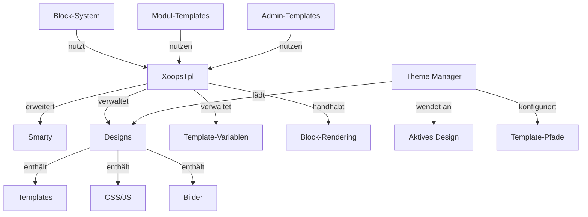

Das XOOPS Template-System basiert auf der leistungsstarken Smarty Template-Engine und bietet eine flexible und erweiterbare Möglichkeit, Präsentationslogik von Geschäftslogik zu trennen. Es verwaltet Designs, Template-Rendering, Variablenzuweisung und dynamische Inhaltsgenerierung.

## Template-Architektur



## XoopsTpl Klasse

Die hauptsächliche Template-Engine-Klasse, die Smarty erweitert.

### Klassenübersicht

```php
namespace Xoops\Core;

class XoopsTpl extends Smarty
{
    protected array $vars = [];
    protected string $currentTheme = '';
    protected array $blocks = [];
    protected bool $isAdmin = false;
}
```

### Smarty erweitern

```php
use Xoops\Core\XoopsTpl;

class XoopsTpl extends Smarty
{
    private static ?XoopsTpl $instance = null;

    private function __construct()
    {
        parent::__construct();
        $this->configureDirectories();
        $this->registerPlugins();
    }

    public static function getInstance(): XoopsTpl
    {
        if (!isset(self::$instance)) {
            self::$instance = new self();
        }
        return self::$instance;
    }
}
```

### Kern-Methoden

#### getInstance

Ruft die Singleton-Template-Instanz ab.

```php
public static function getInstance(): XoopsTpl
```

**Rückgabewert:** `XoopsTpl` - Singleton-Instanz

**Beispiel:**
```php
$xoopsTpl = XoopsTpl::getInstance();
```

#### assign

Weist eine Variable dem Template zu.

```php
public function assign(
    string|array $tplVar,
    mixed $value = null
): void
```

**Parameter:**

| Parameter | Typ | Beschreibung |
|-----------|------|-------------|
| `$tplVar` | string\|array | Variablenname oder assoziatives Array |
| `$value` | mixed | Variablenwert |

**Beispiel:**
```php
$xoopsTpl->assign('page_title', 'Welcome');
$xoopsTpl->assign('user_name', 'John Doe');

// Mehrere Zuweisungen
$xoopsTpl->assign([
    'items' => $items,
    'total_count' => count($items),
    'show_pagination' => true
]);
```

#### appendAssign

Hängt Werte an Template-Array-Variablen an.

```php
public function appendAssign(
    string $tplVar,
    mixed $value
): void
```

**Parameter:**

| Parameter | Typ | Beschreibung |
|-----------|------|-------------|
| `$tplVar` | string | Variablenname |
| `$value` | mixed | Anzuhängender Wert |

**Beispiel:**
```php
$xoopsTpl->assign('breadcrumbs', ['Home']);
$xoopsTpl->appendAssign('breadcrumbs', 'Blog');
$xoopsTpl->appendAssign('breadcrumbs', 'Posts');
// breadcrumbs = ['Home', 'Blog', 'Posts']
```

#### getAssignedVars

Ruft alle zugewiesenen Template-Variablen ab.

```php
public function getAssignedVars(): array
```

**Rückgabewert:** `array` - Zugewiesene Variablen

**Beispiel:**
```php
$vars = $xoopsTpl->getAssignedVars();
foreach ($vars as $name => $value) {
    echo "$name = " . var_export($value, true) . "\n";
}
```

#### display

Rendert ein Template und gibt es an den Browser aus.

```php
public function display(
    string $resource,
    string|array $cache_id = null,
    string $compile_id = null,
    object $parent = null
): void
```

**Parameter:**

| Parameter | Typ | Beschreibung |
|-----------|------|-------------|
| `$resource` | string | Template-Dateipfad |
| `$cache_id` | string\|array | Cache-Identifikator |
| `$compile_id` | string | Compile-Identifikator |
| `$parent` | object | Parent-Template-Objekt |

**Beispiel:**
```php
$xoopsTpl->assign('page_title', 'Home');
$xoopsTpl->display('user:index.tpl');

// Mit absolutem Pfad
$xoopsTpl->display(XOOPS_ROOT_PATH . '/templates/user/index.tpl');
```

#### fetch

Rendert ein Template und gibt es als String zurück.

```php
public function fetch(
    string $resource,
    string|array $cache_id = null,
    string $compile_id = null,
    object $parent = null
): string
```

**Rückgabewert:** `string` - Gerenderter Template-Inhalt

**Beispiel:**
```php
$xoopsTpl->assign('message', 'Hello World');
$html = $xoopsTpl->fetch('user:message.tpl');
echo $html;

// Für E-Mail-Templates verwenden
$emailContent = $xoopsTpl->fetch('mail:notification.tpl');
mail($to, $subject, $emailContent);
```

#### loadTheme

Lädt ein bestimmtes Design.

```php
public function loadTheme(string $themeName): bool
```

**Parameter:**

| Parameter | Typ | Beschreibung |
|-----------|------|-------------|
| `$themeName` | string | Design-Verzeichnisname |

**Rückgabewert:** `bool` - True bei Erfolg

**Beispiel:**
```php
if ($xoopsTpl->loadTheme('bluemoon')) {
    echo "Design erfolgreich geladen";
}
```

#### getCurrentTheme

Ruft den Namen des aktuell aktiven Designs ab.

```php
public function getCurrentTheme(): string
```

**Rückgabewert:** `string` - Design-Name

**Beispiel:**
```php
$currentTheme = $xoopsTpl->getCurrentTheme();
echo "Aktives Design: $currentTheme";
```

#### setOutputFilter

Fügt einen Ausgabe-Filter zur Verarbeitung der Template-Ausgabe hinzu.

```php
public function setOutputFilter(string $function): void
```

**Parameter:**

| Parameter | Typ | Beschreibung |
|-----------|------|-------------|
| `$function` | string | Filter-Funktionsname |

**Beispiel:**
```php
// Whitespace aus Ausgabe entfernen
$xoopsTpl->setOutputFilter('trim');

// Benutzerdefinierter Filter
function my_output_filter($output) {
    // HTML minimieren
    $output = preg_replace('/\s+/', ' ', $output);
    return trim($output);
}
$xoopsTpl->setOutputFilter('my_output_filter');
```

#### registerPlugin

Registriert ein benutzerdefinertes Smarty-Plugin.

```php
public function registerPlugin(
    string $type,
    string $name,
    callable $callback
): void
```

**Parameter:**

| Parameter | Typ | Beschreibung |
|-----------|------|-------------|
| `$type` | string | Plugin-Typ (modifier, block, function) |
| `$name` | string | Plugin-Name |
| `$callback` | callable | Callback-Funktion |

**Beispiel:**
```php
// Benutzerdefinierten Modifier registrieren
$xoopsTpl->registerPlugin('modifier', 'markdown', function($text) {
    return markdown_parse($text);
});

// Im Template verwenden: {$content|markdown}

// Block-Tag registrieren
$xoopsTpl->registerPlugin('block', 'permission', function($params, $content, $smarty, &$repeat) {
    if ($repeat) return;

    // Berechtigung prüfen
    if (has_permission($params['name'])) {
        return $content;
    }
    return '';
});

// Im Template verwenden: {permission name="admin"}...{/permission}
```

## Theme-System

### Theme-Struktur

Standardmäßige XOOPS Theme-Verzeichnisstruktur:

```
bluemoon/
├── style.css              # Hauptstylesheet
├── admin.css              # Admin-Stylesheet
├── theme.html             # Haupt-Seiten-Template
├── admin.html             # Admin-Seiten-Template
├── blocks/                # Block-Templates
│   ├── block_left.tpl
│   └── block_right.tpl
├── modules/               # Modul-Templates
│   ├── publisher/
│   │   ├── index.tpl
│   │   └── item.tpl
│   └── news/
│       └── index.tpl
├── images/                # Design-Bilder
│   ├── logo.png
│   └── banner.png
├── js/                    # Design-JavaScript
│   └── script.js
└── readme.txt             # Design-Dokumentation
```

### Theme-Manager-Klasse

```php
namespace Xoops\Core\Theme;

class ThemeManager
{
    protected array $themes = [];
    protected string $activeTheme = '';
    protected string $themeDirectory = '';

    public function getActiveTheme(): string {}
    public function setActiveTheme(string $theme): bool {}
    public function getThemeList(): array {}
    public function themeExists(string $name): bool {}
}
```

## Template-Variablen

### Standardmäßig globale Variablen

XOOPS weist automatisch mehrere globale Template-Variablen zu:

| Variable | Typ | Beschreibung |
|----------|------|-------------|
| `$xoops_url` | string | XOOPS-Installations-URL |
| `$xoops_user` | XoopsUser\|null | Aktuelles Benutzerobjekt |
| `$xoops_uname` | string | Aktueller Benutzername |
| `$xoops_isadmin` | bool | Benutzer ist Admin |
| `$xoops_banner` | string | Banner-HTML |
| `$xoops_notification` | string | Benachrichtigungs-Markup |
| `$xoops_version` | string | XOOPS-Version |

### Block-spezifische Variablen

Beim Rendering von Blöcken:

| Variable | Typ | Beschreibung |
|----------|------|-------------|
| `$block` | array | Block-Informationen |
| `$block.title` | string | Block-Titel |
| `$block.content` | string | Block-Inhalt |
| `$block.id` | int | Block-ID |
| `$block.module` | string | Modul-Name |

### Modul-Template-Variablen

Module weisen typischerweise folgende Variablen zu:

| Variable | Typ | Beschreibung |
|----------|------|-------------|
| `$module_name` | string | Modul-Anzeigename |
| `$module_dir` | string | Modul-Verzeichnis |
| `$xoops_module_header` | string | Modul CSS/JS |

## Smarty-Konfiguration

### Häufige Smarty-Modifier

| Modifier | Beschreibung | Beispiel |
|----------|-------------|---------|
| `capitalize` | Ersten Buchstaben kapitalisieren | `{$title\|capitalize}` |
| `count_characters` | Zeichenanzahl | `{$text\|count_characters}` |
| `date_format` | Zeitstempel formatieren | `{$timestamp\|date_format:'%Y-%m-%d'}` |
| `escape` | Sonderzeichen entkommen | `{$html\|escape:'html'}` |
| `nl2br` | Zeilenumbrüche zu `<br>` konvertieren | `{$text\|nl2br}` |
| `strip_tags` | HTML-Tags entfernen | `{$content\|strip_tags}` |
| `truncate` | Stringlänge begrenzen | `{$text\|truncate:100}` |
| `upper` | In Großbuchstaben konvertieren | `{$name\|upper}` |
| `lower` | In Kleinbuchstaben konvertieren | `{$name\|lower}` |

### Kontrollstrukturen

```smarty
{* If-Anweisung *}
{if $user->isAdmin()}
    <p>Admin-Inhalt</p>
{else}
    <p>Benutzer-Inhalt</p>
{/if}

{* For-Schleife *}
{foreach $items as $item}
    <div class="item">{$item.title}</div>
{/foreach}

{* For-Schleife mit Zähler *}
{foreach $items as $item name=item_loop}
    {$smarty.foreach.item_loop.iteration}: {$item.title}
{/foreach}

{* While-Schleife *}
{while $condition}
    <!-- Inhalt -->
{/while}

{* Switch-Anweisung *}
{switch $status}
    {case 'draft'}<span class="draft">Entwurf</span>{break}
    {case 'published'}<span class="published">Veröffentlicht</span>{break}
    {default}<span class="unknown">Unbekannt</span>
{/switch}
```

## Vollständiges Template-Beispiel

### PHP-Code

```php
<?php
/**
 * Modul-Artikel-Listenseite
 */

include __DIR__ . '/include/common.inc.php';

$xoopsTpl = XoopsTpl::getInstance();

// Prüfen ob Modul aktiv ist
$module = xoops_getModuleByDirname('articles');
if (!$module) {
    redirect_header(XOOPS_URL, 3, 'Modul nicht gefunden');
}

// Item-Handler abrufen
$itemHandler = xoops_getModuleHandler('item', 'articles');

// Paginierungsparameter abrufen
$page = !empty($_GET['page']) ? (int)$_GET['page'] : 1;
$perPage = $module->getConfig('items_per_page') ?: 10;
$offset = ($page - 1) * $perPage;

// Kriterien erstellen
$criteria = new CriteriaCompo();
$criteria->add(new Criteria('status', 1));
$criteria->setSort('published', 'DESC');
$criteria->setLimit($perPage);
$criteria->setStart($offset);

// Items abrufen
$items = $itemHandler->getObjects($criteria);
$total = $itemHandler->getCount(new Criteria('status', 1));

// Paginierung berechnen
$pages = ceil($total / $perPage);

// Template-Variablen zuweisen
$xoopsTpl->assign([
    'module_name' => $module->getName(),
    'items' => $items,
    'total_items' => $total,
    'current_page' => $page,
    'total_pages' => $pages,
    'items_per_page' => $perPage,
    'show_pagination' => $pages > 1
]);

// Breadcrumbs hinzufügen
$xoopsTpl->assign('xoops_breadcrumbs', [
    ['url' => XOOPS_URL, 'title' => 'Home'],
    ['url' => $module->getUrl(), 'title' => $module->getName()],
    ['title' => 'Articles']
]);

// Template anzeigen
$xoopsTpl->display($module->getPath() . '/templates/user/list.tpl');
```

### Template-Datei (list.tpl)

```smarty
<div id="articles-list">
    <h1>{$module_name|escape}</h1>

    {if $items}
        <div class="articles-container">
            {foreach $items as $item}
                <article class="article-item">
                    <header>
                        <h2>
                            <a href="{$item.url|escape}">
                                {$item.title|escape}
                            </a>
                        </h2>
                        <div class="meta">
                            <span class="author">By {$item.author|escape}</span>
                            <span class="date">
                                {$item.published|date_format:'%B %d, %Y'}
                            </span>
                        </div>
                    </header>

                    <div class="content">
                        <p>{$item.summary|truncate:150}</p>
                    </div>

                    <footer>
                        <a href="{$item.url|escape}" class="read-more">
                            Read More »
                        </a>
                    </footer>
                </article>
            {/foreach}
        </div>

        {* Paginierung *}
        {if $show_pagination}
            <nav class="pagination">
                {if $current_page > 1}
                    <a href="?page=1" class="first">« First</a>
                    <a href="?page={$current_page - 1}" class="prev">‹ Previous</a>
                {/if}

                {for $i=1 to $total_pages}
                    {if $i == $current_page}
                        <span class="current">{$i}</span>
                    {else}
                        <a href="?page={$i}">{$i}</a>
                    {/if}
                {/for}

                {if $current_page < $total_pages}
                    <a href="?page={$current_page + 1}" class="next">Next ›</a>
                    <a href="?page={$total_pages}" class="last">Last »</a>
                {/if}
            </nav>
        {/if}
    {else}
        <p class="no-items">Keine Artikel gefunden.</p>
    {/if}
</div>
```

## Benutzerdefinierte Smarty-Funktionen

### Benutzerdefinierte Block-Funktion erstellen

```php
<?php
/**
 * Benutzerdefinierte Smarty-Block-Funktion für Berechtigungsprüfung
 */

function smarty_block_permission($params, $content, $smarty, &$repeat)
{
    if ($repeat) return;

    if (!isset($params['name'])) {
        return 'Berechtigungsname erforderlich';
    }

    $permName = $params['name'];
    $user = $GLOBALS['xoopsUser'];

    // Prüfen ob Benutzer eine Berechtigung hat
    if ($user && $user->isAdmin()) {
        return $content;
    }

    if ($user && check_user_permission($user->uid(), $permName)) {
        return $content;
    }

    return '';
}
```

Registrieren und verwenden:

```php
$xoopsTpl->registerPlugin('block', 'permission', 'smarty_block_permission');
```

Template:

```smarty
{permission name="edit_articles"}
    <button>Artikel bearbeiten</button>
{/permission}
```

## Best Practices

1. **Benutzer-Inhalt entkommen** - Immer `|escape` für benutzergenerierte Inhalte verwenden
2. **Template-Pfade verwenden** - Templates relativ zum Design referenzieren
3. **Logik von Präsentation trennen** - Komplexe Logik in PHP behalten
4. **Templates cachen** - Template-Caching in der Produktion aktivieren
5. **Modifier korrekt verwenden** - Geeignete Filter für den Kontext anwenden
6. **Blöcke organisieren** - Block-Templates in dediziertem Verzeichnis platzieren
7. **Variablen dokumentieren** - Alle Template-Variablen in PHP dokumentieren

## Zugehörige Dokumentation

- ../Module/Module-System - Modul-System und Hooks
- ../Kernel/Kernel-Classes - Kernel und Konfiguration
- ../Core/XoopsObject - Basis-Objektklasse

---

*Siehe auch: [Smarty-Dokumentation](https://www.smarty.net/docs) | [XOOPS Template API](https://github.com/XOOPS/XoopsCore27/tree/master/htdocs/class)*
