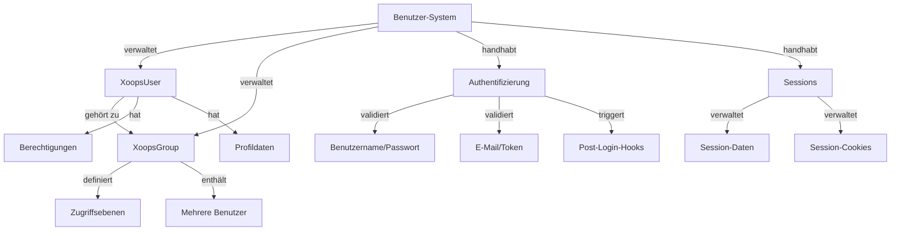

Das XOOPS Benutzer-System verwaltet Benutzerkonten, Authentifizierung, Autorisierung, Gruppenmitgliedschaft und Session-Verwaltung. Es bietet ein robustes Framework zum Sichern Ihrer Anwendung und zur Steuerung des Benutzerzugriffs.

## Benutzer-System-Architektur



## XoopsUser Klasse

Die hauptsächliche Benutzerobjekt-Klasse, die ein Benutzerkonto darstellt.

### Klassenübersicht

```php
namespace Xoops\Core\User;

class XoopsUser extends XoopsObject
{
    protected int $uid = 0;
    protected string $uname = '';
    protected string $email = '';
    protected string $pass = '';
    protected int $uregdate = 0;
    protected int $ulevel = 0;
    protected array $groups = [];
    protected array $permissions = [];
}
```

### Konstruktor

```php
public function __construct(int $uid = null)
```

Erstellt ein neues Benutzerobjekt und lädt optional aus der Datenbank nach ID.

**Parameter:**

| Parameter | Typ | Beschreibung |
|-----------|------|-------------|
| `$uid` | int | Zu ladende Benutzer-ID (optional) |

**Beispiel:**
```php
// Neuen Benutzer erstellen
$user = new XoopsUser();

// Vorhandenen Benutzer laden
$user = new XoopsUser(123);
```

### Kern-Eigenschaften

| Eigenschaft | Typ | Beschreibung |
|----------|------|-------------|
| `uid` | int | Benutzer-ID |
| `uname` | string | Benutzername |
| `email` | string | E-Mail-Adresse |
| `pass` | string | Passwort-Hash |
| `uregdate` | int | Registierungs-Zeitstempel |
| `ulevel` | int | Benutzer-Level (9=admin, 1=user) |
| `groups` | array | Gruppen-IDs |
| `permissions` | array | Berechtigungsflags |

### Kern-Methoden

#### getID / getUid

Ruft die Benutzer-ID ab.

```php
public function getID(): int
public function getUid(): int  // Alias
```

**Rückgabewert:** `int` - Benutzer-ID

**Beispiel:**
```php
$user = new XoopsUser(1);
echo $user->getID(); // 1
echo $user->getUid(); // 1
```

#### getUnameReal

Ruft den Anzeigenamen des Benutzers ab.

```php
public function getUnameReal(): string
```

**Rückgabewert:** `string` - Echter Name des Benutzers

**Beispiel:**
```php
$realName = $user->getUnameReal();
echo "Hallo, $realName";
```

#### getEmail

Ruft die E-Mail-Adresse des Benutzers ab.

```php
public function getEmail(): string
```

**Rückgabewert:** `string` - E-Mail-Adresse

**Beispiel:**
```php
$email = $user->getEmail();
mail($email, 'Welcome', 'Willkommen bei XOOPS');
```

#### getVar / setVar

Ruft eine Benutzervariable ab oder setzt sie.

```php
public function getVar(string $key, string $format = 's'): mixed
public function setVar(string $key, mixed $value, bool $notGpc = false): bool
```

**Beispiel:**
```php
// Werte abrufen
$username = $user->getVar('uname');
$email = $user->getVar('email', 's'); // Formatiert für Anzeige

// Werte setzen
$user->setVar('uname', 'newusername');
$user->setVar('email', 'user@example.com');
```

#### getGroups

Ruft die Gruppenmitgliedschaften des Benutzers ab.

```php
public function getGroups(): array
```

**Rückgabewert:** `array` - Array von Gruppen-IDs

**Beispiel:**
```php
$groups = $user->getGroups();
echo "Mitglied von " . count($groups) . " Gruppen";
```

#### isInGroup

Prüft, ob der Benutzer einer Gruppe angehört.

```php
public function isInGroup(int $groupId): bool
```

**Parameter:**

| Parameter | Typ | Beschreibung |
|-----------|------|-------------|
| `$groupId` | int | Zu prüfende Gruppen-ID |

**Rückgabewert:** `bool` - True wenn in Gruppe

**Beispiel:**
```php
if ($user->isInGroup(1)) { // 1 = Webmasters
    echo 'Benutzer ist ein Webmaster';
}
```

#### isAdmin

Prüft, ob der Benutzer ein Administrator ist.

```php
public function isAdmin(): bool
```

**Rückgabewert:** `bool` - True wenn Admin

**Beispiel:**
```php
if ($user->isAdmin()) {
    // Admin-Steuerelemente anzeigen
    echo '<a href="admin/">Admin-Panel</a>';
}
```

#### getProfile

Ruft die Profilinformationen des Benutzers ab.

```php
public function getProfile(): array
```

**Rückgabewert:** `array` - Profildaten

**Beispiel:**
```php
$profile = $user->getProfile();
echo 'Bio: ' . $profile['bio'];
```

#### isActive

Prüft, ob das Benutzerkonto aktiv ist.

```php
public function isActive(): bool
```

**Rückgabewert:** `bool` - True wenn aktiv

**Beispiel:**
```php
if ($user->isActive()) {
    // Benutzerzugriff erlauben
} else {
    // Zugriff einschränken
}
```

#### updateLastLogin

Aktualisiert den Zeitstempel der letzten Anmeldung des Benutzers.

```php
public function updateLastLogin(): bool
```

**Rückgabewert:** `bool` - True bei Erfolg

**Beispiel:**
```php
if ($user->updateLastLogin()) {
    echo 'Login aufgezeichnet';
}
```

## XoopsGroup Klasse

Verwaltet Benutzergruppen und Berechtigungen.

### Klassenübersicht

```php
namespace Xoops\Core\User;

class XoopsGroup extends XoopsObject
{
    protected int $groupid = 0;
    protected string $name = '';
    protected string $description = '';
    protected int $group_type = 0;
    protected array $users = [];
}
```

### Konstanten

| Konstante | Wert | Beschreibung |
|----------|-------|-------------|
| `TYPE_NORMAL` | 0 | Normale Benutzergruppe |
| `TYPE_ADMIN` | 1 | Administrative Gruppe |
| `TYPE_SYSTEM` | 2 | Systemgruppe |

### Methoden

#### getName

Ruft den Gruppennamen ab.

```php
public function getName(): string
```

**Rückgabewert:** `string` - Gruppenname

**Beispiel:**
```php
$group = new XoopsGroup(1);
echo $group->getName(); // "Webmasters"
```

#### getDescription

Ruft die Gruppenbeschreibung ab.

```php
public function getDescription(): string
```

**Rückgabewert:** `string` - Beschreibung

**Beispiel:**
```php
echo $group->getDescription();
```

#### getUsers

Ruft Gruppenmitglieder ab.

```php
public function getUsers(): array
```

**Rückgabewert:** `array` - Array von Benutzer-IDs

**Beispiel:**
```php
$users = $group->getUsers();
echo "Gruppe hat " . count($users) . " Mitglieder";
```

#### addUser

Fügt einen Benutzer zur Gruppe hinzu.

```php
public function addUser(int $uid): bool
```

**Parameter:**

| Parameter | Typ | Beschreibung |
|-----------|------|-------------|
| `$uid` | int | Benutzer-ID |

**Rückgabewert:** `bool` - True bei Erfolg

**Beispiel:**
```php
$group = new XoopsGroup(2); // Editors
$group->addUser(123);
$groupHandler->insert($group);
```

#### removeUser

Entfernt einen Benutzer aus der Gruppe.

```php
public function removeUser(int $uid): bool
```

**Beispiel:**
```php
$group->removeUser(123);
```

## Benutzer-Authentifizierung

### Anmeldeprozess

```php
/**
 * Benutzer-Anmeldung
 */
function xoops_user_login(string $uname, string $pass, bool $rememberMe = false): ?XoopsUser
{
    global $xoopsDB;

    // Benutzernamen bereinigen
    $uname = trim($uname);

    // Benutzer aus Datenbank abrufen
    $query = $xoopsDB->prepare(
        'SELECT * FROM ' . $xoopsDB->prefix('users') .
        ' WHERE uname = ? AND active = 1'
    );
    $query->bind_param('s', $uname);
    $query->execute();
    $result = $query->get_result();

    if ($result->num_rows === 0) {
        return null; // Benutzer nicht gefunden
    }

    $row = $result->fetch_assoc();

    // Passwort verifizieren
    if (!password_verify($pass, $row['pass'])) {
        return null; // Ungültiges Passwort
    }

    // Benutzerobjekt laden
    $user = new XoopsUser($row['uid']);

    // Letzte Anmeldung aktualisieren
    $user->updateLastLogin();

    // "Remember Me" behandeln
    if ($rememberMe) {
        // Persistentes Cookie setzen
        setcookie(
            'xoops_user_remember',
            $user->uid(),
            time() + (30 * 24 * 60 * 60), // 30 Tage
            '/',
            $_SERVER['HTTP_HOST'] ?? ''
        );
    }

    return $user;
}
```

### Passwort-Verwaltung

```php
/**
 * Passwort sicher hashen
 */
function xoops_hash_password(string $password): string
{
    return password_hash($password, PASSWORD_BCRYPT, [
        'cost' => 12
    ]);
}

/**
 * Passwort verifizieren
 */
function xoops_verify_password(string $password, string $hash): bool
{
    return password_verify($password, $hash);
}

/**
 * Prüfen ob Passwort neu gehashed werden muss
 */
function xoops_password_needs_rehash(string $hash): bool
{
    return password_needs_rehash($hash, PASSWORD_BCRYPT, [
        'cost' => 12
    ]);
}
```

## Session-Verwaltung

### Session-Klasse

```php
namespace Xoops\Core;

class SessionManager
{
    protected array $data = [];
    protected string $sessionId = '';

    public function start(): void {}
    public function get(string $key): mixed {}
    public function set(string $key, mixed $value): void {}
    public function destroy(): void {}
}
```

### Session-Methoden

#### Session starten

```php
<?php
session_start();

// Session-ID aus Sicherheitsgründen regenerieren
session_regenerate_id(true);

// Session-Timeout setzen
ini_set('session.gc_maxlifetime', 3600); // 1 Stunde

// Benutzer in Session speichern
if ($user) {
    $_SESSION['xoops_user'] = $user;
    $_SESSION['xoops_uid'] = $user->getID();
    $_SESSION['xoops_uname'] = $user->getVar('uname');
}
```

#### Session prüfen

```php
/**
 * Aktuellen Benutzer aus Session abrufen
 */
function xoops_get_current_user(): ?XoopsUser
{
    if (isset($_SESSION['xoops_user']) && $_SESSION['xoops_user'] instanceof XoopsUser) {
        return $_SESSION['xoops_user'];
    }
    return null;
}

/**
 * Prüfen ob Benutzer angemeldet ist
 */
function xoops_is_user_logged_in(): bool
{
    return isset($_SESSION['xoops_uid']) && $_SESSION['xoops_uid'] > 0;
}
```

#### Session zerstören

```php
/**
 * Benutzer-Abmeldung
 */
function xoops_user_logout()
{
    global $xoopsUser;

    // Abmeldung protokollieren
    if ($xoopsUser) {
        error_log('Benutzer ' . $xoopsUser->getVar('uname') . ' abgemeldet');
    }

    // Session-Daten löschen
    $_SESSION = [];

    // Session-Cookie löschen
    if (ini_get('session.use_cookies')) {
        $params = session_get_cookie_params();
        setcookie(
            session_name(),
            '',
            time() - 42000,
            $params['path'],
            $params['domain'],
            $params['secure'],
            $params['httponly']
        );
    }

    // Session zerstören
    session_destroy();
}
```

## Berechtigungssystem

### Berechtigungs-Konstanten

| Konstante | Wert | Beschreibung |
|----------|-------|-------------|
| `XOOPS_PERMISSION_NONE` | 0 | Keine Berechtigung |
| `XOOPS_PERMISSION_VIEW` | 1 | Inhalt anzeigen |
| `XOOPS_PERMISSION_SUBMIT` | 2 | Inhalt einreichen |
| `XOOPS_PERMISSION_EDIT` | 4 | Inhalt bearbeiten |
| `XOOPS_PERMISSION_DELETE` | 8 | Inhalt löschen |
| `XOOPS_PERMISSION_ADMIN` | 16 | Admin-Zugriff |

### Berechtigungsprüfung

```php
/**
 * Prüfen ob Benutzer Berechtigung hat
 */
function xoops_check_permission($user, $resource, $permission)
{
    if (!$user) {
        return false;
    }

    // Admins haben alle Berechtigungen
    if ($user->isAdmin()) {
        return true;
    }

    // Gruppenberechtigungen prüfen
    $groups = $user->getGroups();
    foreach ($groups as $groupId) {
        if (xoops_group_has_permission($groupId, $resource, $permission)) {
            return true;
        }
    }

    return false;
}
```

## Benutzer-Handler

Der UserHandler verwaltet Benutzer-Persistenzoperationen.

```php
/**
 * Benutzer-Handler abrufen
 */
$userHandler = xoops_getHandler('user');

/**
 * Neuen Benutzer erstellen
 */
$user = new XoopsUser();
$user->setVar('uname', 'newuser');
$user->setVar('email', 'user@example.com');
$user->setVar('pass', xoops_hash_password('password123'));
$user->setVar('uregdate', time());
$user->setVar('uactive', 1);

if ($userHandler->insert($user)) {
    echo 'Benutzer erstellt mit ID: ' . $user->getID();
}

/**
 * Benutzer aktualisieren
 */
$user = $userHandler->get(123);
$user->setVar('email', 'newemail@example.com');
$userHandler->insert($user);

/**
 * Benutzer nach Name abrufen
 */
$user = $userHandler->findByUsername('john');

/**
 * Benutzer löschen
 */
$userHandler->delete($user);

/**
 * Benutzer durchsuchen
 */
$criteria = new CriteriaCompo();
$criteria->add(new Criteria('uname', '%admin%', 'LIKE'));
$users = $userHandler->getObjects($criteria);
```

## Vollständiges Beispiel für Benutzerverwaltung

```php
<?php
/**
 * Vollständiges Beispiel für Benutzer-Authentifizierung und Profil
 */

require_once XOOPS_ROOT_PATH . '/include/common.inc.php';

$xoopsUser = $GLOBALS['xoopsUser'];

// Prüfen ob Benutzer angemeldet ist
if (!$xoopsUser || !$xoopsUser->isActive()) {
    redirect_header(XOOPS_URL, 3, 'Bitte anmelden');
}

// Benutzer-Handler abrufen
$userHandler = xoops_getHandler('user');

// Aktuellen Benutzer mit frischen Daten abrufen
$currentUser = $userHandler->get($xoopsUser->getID());

// Benutzer-Profilseite
echo '<h1>Profil: ' . htmlspecialchars($currentUser->getVar('uname')) . '</h1>';

echo '<div class="user-profile">';
echo '<p><strong>Benutzername:</strong> ' . htmlspecialchars($currentUser->getVar('uname')) . '</p>';
echo '<p><strong>E-Mail:</strong> ' . htmlspecialchars($currentUser->getVar('email')) . '</p>';
echo '<p><strong>Registriert:</strong> ' . date('Y-m-d H:i:s', $currentUser->getVar('uregdate')) . '</p>';
echo '<p><strong>Gruppen:</strong> ';

$groupHandler = xoops_getHandler('group');
$groups = $currentUser->getGroups();
$groupNames = [];
foreach ($groups as $groupId) {
    $group = $groupHandler->get($groupId);
    if ($group) {
        $groupNames[] = htmlspecialchars($group->getName());
    }
}
echo implode(', ', $groupNames);
echo '</p>';

// Admin-Status
if ($currentUser->isAdmin()) {
    echo '<p><strong>Status:</strong> Administrator</p>';
}

echo '</div>';

// Passwort-Änderungsformular
if ($_SERVER['REQUEST_METHOD'] === 'POST' && !empty($_POST['change_password'])) {
    $oldPassword = $_POST['old_password'] ?? '';
    $newPassword = $_POST['new_password'] ?? '';
    $confirmPassword = $_POST['confirm_password'] ?? '';

    // Altes Passwort verifizieren
    if (!password_verify($oldPassword, $currentUser->getVar('pass'))) {
        echo '<div class="error">Aktuelles Passwort ist falsch</div>';
    } elseif ($newPassword !== $confirmPassword) {
        echo '<div class="error">Neue Passwörter stimmen nicht überein</div>';
    } elseif (strlen($newPassword) < 6) {
        echo '<div class="error">Passwort muss mindestens 6 Zeichen lang sein</div>';
    } else {
        // Passwort aktualisieren
        $currentUser->setVar('pass', xoops_hash_password($newPassword));
        if ($userHandler->insert($currentUser)) {
            echo '<div class="success">Passwort erfolgreich geändert</div>';
        } else {
            echo '<div class="error">Fehler beim Aktualisieren des Passworts</div>';
        }
    }
}

// Passwort-Änderungsformular
echo '<form method="post">';
echo '<h3>Passwort ändern</h3>';
echo '<div class="form-group">';
echo '<label>Aktuelles Passwort:</label>';
echo '<input type="password" name="old_password" required>';
echo '</div>';
echo '<div class="form-group">';
echo '<label>Neues Passwort:</label>';
echo '<input type="password" name="new_password" required>';
echo '</div>';
echo '<div class="form-group">';
echo '<label>Passwort bestätigen:</label>';
echo '<input type="password" name="confirm_password" required>';
echo '</div>';
echo '<button type="submit" name="change_password">Passwort ändern</button>';
echo '</form>';
```

## Best Practices

1. **Passwörter hashen** - Immer bcrypt oder argon2 für Passwort-Hashing verwenden
2. **Eingabe validieren** - Alle Benutzereingaben validieren und bereinigen
3. **Berechtigungen prüfen** - Immer Benutzerberechtigungen vor Aktionen überprüfen
4. **Sessions sicher nutzen** - Session-IDs bei der Anmeldung regenerieren
5. **Aktivitäten protokollieren** - Anmeldungen, Abmeldungen und kritische Aktionen protokollieren
6. **Rate Limiting** - Login-Versuch-Rate Limiting implementieren
7. **HTTPS nur** - Immer HTTPS für Authentifizierung verwenden
8. **Gruppenverwaltung** - Gruppen zur Berechtigungsorganisation nutzen

## Zugehörige Dokumentation

- ../Kernel/Kernel-Classes - Kernel-Services und Bootstrapping
- ../Database/QueryBuilder - Datenbankabfragen für Benutzerdaten
- ../Core/XoopsObject - Basis-Objektklasse

---

*Siehe auch: [XOOPS User API](https://github.com/XOOPS/XoopsCore27/tree/master/htdocs/class) | [PHP Security](https://www.php.net/manual/en/book.password.php)*
