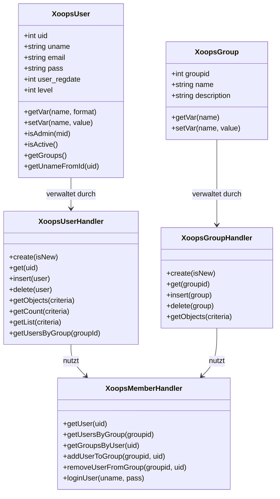
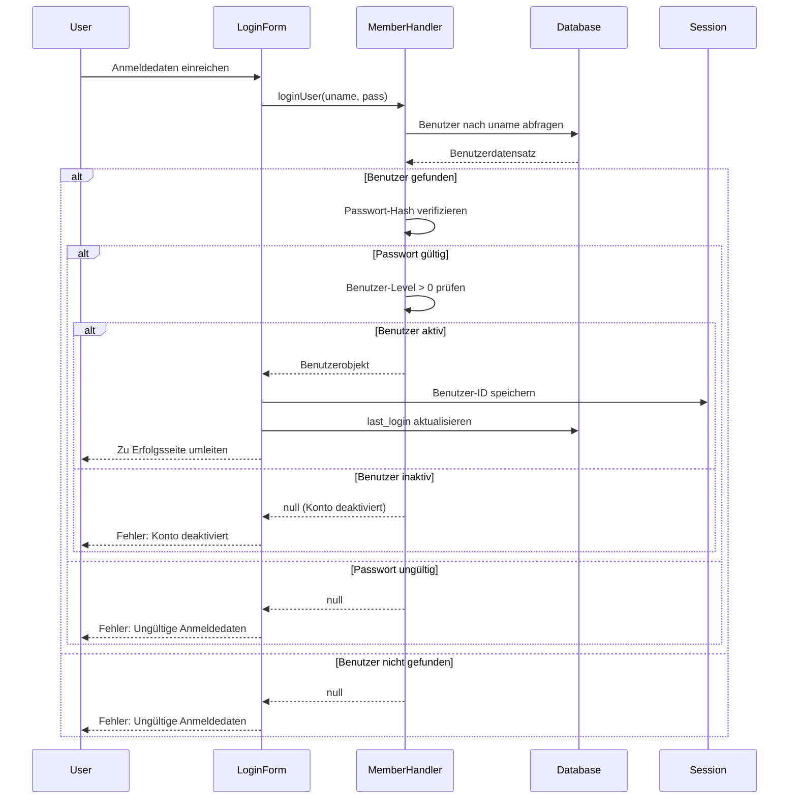
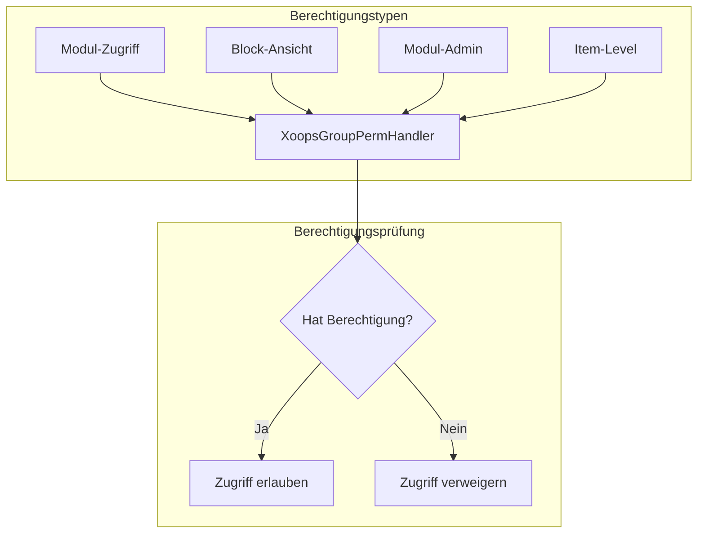
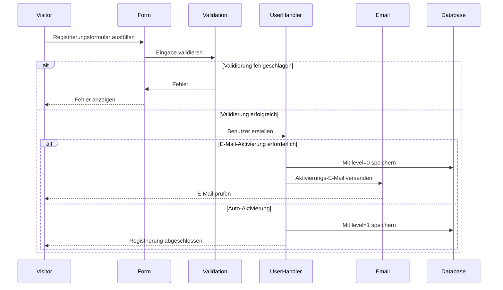

> Vollständige API-Dokumentation für das XOOPS-Benutzersystem.

---

## Benutzer-System-Architektur



---

## XoopsUser Klasse

### Eigenschaften

| Eigenschaft | Typ | Beschreibung |
|----------|------|-------------|
| `uid` | int | Benutzer-ID (Primary Key) |
| `uname` | string | Benutzername |
| `name` | string | Echter Name |
| `email` | string | E-Mail-Adresse |
| `pass` | string | Passwort-Hash |
| `url` | string | Website-URL |
| `user_avatar` | string | Avatar-Dateiname |
| `user_regdate` | int | Registierungs-Zeitstempel |
| `user_from` | string | Standort |
| `user_sig` | string | Signatur |
| `user_occ` | string | Beruf |
| `user_intrest` | string | Interessen |
| `bio` | string | Biographie |
| `posts` | int | Beitragszähler |
| `rank` | int | Benutzer-Rang |
| `level` | int | Benutzer-Level (0=inaktiv, 1=aktiv) |
| `theme` | string | Bevorzugtes Design |
| `timezone` | float | Zeitzonenoffset |
| `last_login` | int | Zeitstempel der letzten Anmeldung |

### Kern-Methoden

```php
// Aktuellen Benutzer abrufen
global $xoopsUser;

// Prüfen ob angemeldet
if (is_object($xoopsUser)) {
    // Benutzer ist angemeldet
    $uid = $xoopsUser->getVar('uid');
    $username = $xoopsUser->getVar('uname');
}

// Formatierte Werte abrufen
$uname = $xoopsUser->getVar('uname');           // Rohwert
$unameDisplay = $xoopsUser->getVar('uname', 's'); // Bereinigt für Anzeige
$unameEdit = $xoopsUser->getVar('uname', 'e');    // Für Formular-Bearbeitung

// Prüfen ob Admin
$isAdmin = $xoopsUser->isAdmin();              // Site-Admin
$isModuleAdmin = $xoopsUser->isAdmin($mid);    // Modul-Admin

// Benutzergruppen abrufen
$groups = $xoopsUser->getGroups();             // Array von Gruppen-IDs

// Prüfen ob aktiv
$isActive = $xoopsUser->isActive();
```

---

## XoopsUserHandler

### Benutzer CRUD-Operationen

```php
// Handler abrufen
$userHandler = xoops_getHandler('user');

// Neuen Benutzer erstellen
$user = $userHandler->create();
$user->setVar('uname', 'newuser');
$user->setVar('email', 'user@example.com');
$user->setVar('pass', password_hash('password123', PASSWORD_DEFAULT));
$user->setVar('user_regdate', time());
$user->setVar('level', 1);

if ($userHandler->insert($user)) {
    $newUid = $user->getVar('uid');
}

// Benutzer nach ID abrufen
$user = $userHandler->get(123);

// Benutzer aktualisieren
$user->setVar('email', 'newemail@example.com');
$userHandler->insert($user);

// Benutzer löschen
$userHandler->delete($user);
```

### Benutzer abfragen

```php
// Alle aktiven Benutzer abrufen
$criteria = new Criteria('level', 1);
$users = $userHandler->getObjects($criteria);

// Benutzer nach Kriterien abrufen
$criteria = new CriteriaCompo();
$criteria->add(new Criteria('level', 1));
$criteria->add(new Criteria('posts', 10, '>='));
$criteria->setSort('posts');
$criteria->setOrder('DESC');
$criteria->setLimit(10);
$activePosters = $userHandler->getObjects($criteria);

// Benutzeranzahl abrufen
$count = $userHandler->getCount($criteria);

// Benutzerliste abrufen (uid => uname)
$userList = $userHandler->getList($criteria);

// Benutzer durchsuchen
$criteria = new CriteriaCompo();
$criteria->add(new Criteria('uname', '%john%', 'LIKE'));
$criteria->add(new Criteria('email', '%john%', 'LIKE'), 'OR');
$searchResults = $userHandler->getObjects($criteria);
```

---

## XoopsMemberHandler

### Gruppenverwaltung

```php
$memberHandler = xoops_getHandler('member');

// Benutzer mit Gruppen abrufen
$user = $memberHandler->getUser($uid);
$groups = $memberHandler->getGroupsByUser($uid);

// Benutzer in Gruppe abrufen
$users = $memberHandler->getUsersByGroup($groupId);
$users = $memberHandler->getUsersByGroup($groupId, true); // Objekte
$users = $memberHandler->getUsersByGroup($groupId, false); // Nur UIDs

// Benutzer zu Gruppe hinzufügen
$memberHandler->addUserToGroup($groupId, $uid);

// Benutzer aus Gruppe entfernen
$memberHandler->removeUserFromGroup($groupId, $uid);
```

### Authentifizierung

```php
// Benutzer anmelden
$user = $memberHandler->loginUser($username, $password);

if ($user) {
    // Anmeldung erfolgreich
    $_SESSION['xoopsUserId'] = $user->getVar('uid');
    $user->setVar('last_login', time());
    $userHandler->insert($user);
} else {
    // Anmeldung fehlgeschlagen
}

// Abmelden
$_SESSION = [];
session_destroy();
redirect_header(XOOPS_URL, 3, 'Abgemeldet');
```

---

## Authentifizierungs-Ablauf



---

## Gruppen-System

### Standard-Gruppen

| Gruppen-ID | Name | Beschreibung |
|----------|------|-------------|
| 1 | Webmasters | Vollständiger administrativer Zugriff |
| 2 | Registered Users | Standard-registrierte Benutzer |
| 3 | Anonymous | Nicht angemeldete Besucher |

### Gruppenberechtigungen



### Berechtigungen prüfen

```php
$gpermHandler = xoops_getHandler('groupperm');

// Modul-Zugriff prüfen
$groups = is_object($xoopsUser) ? $xoopsUser->getGroups() : [XOOPS_GROUP_ANONYMOUS];
$hasAccess = $gpermHandler->checkRight('module_read', $moduleId, $groups);

// Modul-Admin prüfen
$isAdmin = $gpermHandler->checkRight('module_admin', $moduleId, $groups);

// Benutzerdefinierte Berechtigung prüfen
$hasPermission = $gpermHandler->checkRight(
    'item_view',      // Berechtigungsname
    $itemId,          // Item-ID
    $groups,          // Gruppen-IDs
    $moduleId         // Modul-ID
);

// Items die Benutzer zugreifen kann abrufen
$itemIds = $gpermHandler->getItemIds('item_view', $groups, $moduleId);
```

---

## Benutzer-Registrierungs-Ablauf



---

## Vollständiges Beispiel

```php
<?php
require_once __DIR__ . '/mainfile.php';

use Xmf\Request;

$memberHandler = xoops_getHandler('member');
$userHandler = xoops_getHandler('user');

// Registrierungs-Handler
if (Request::hasVar('register', 'POST')) {
    // CSRF verifizieren
    if (!$GLOBALS['xoopsSecurity']->check()) {
        redirect_header('register.php', 3, 'Sicherheitsfehler');
    }

    $uname = Request::getString('uname', '', 'POST');
    $email = Request::getEmail('email', '', 'POST');
    $pass = Request::getString('pass', '', 'POST');
    $passConfirm = Request::getString('pass_confirm', '', 'POST');

    $errors = [];

    // Benutzernamen validieren
    if (strlen($uname) < 3 || strlen($uname) > 25) {
        $errors[] = 'Benutzername muss 3-25 Zeichen lang sein';
    }

    // Prüfen ob Benutzername existiert
    $criteria = new Criteria('uname', $uname);
    if ($userHandler->getCount($criteria) > 0) {
        $errors[] = 'Benutzername bereits vergeben';
    }

    // E-Mail validieren
    if (!filter_var($email, FILTER_VALIDATE_EMAIL)) {
        $errors[] = 'Ungültige E-Mail-Adresse';
    }

    // Prüfen ob E-Mail existiert
    $criteria = new Criteria('email', $email);
    if ($userHandler->getCount($criteria) > 0) {
        $errors[] = 'E-Mail bereits registriert';
    }

    // Passwort validieren
    if (strlen($pass) < 8) {
        $errors[] = 'Passwort muss mindestens 8 Zeichen lang sein';
    }

    if ($pass !== $passConfirm) {
        $errors[] = 'Passwörter stimmen nicht überein';
    }

    if (empty($errors)) {
        // Benutzer erstellen
        $user = $userHandler->create();
        $user->setVar('uname', $uname);
        $user->setVar('email', $email);
        $user->setVar('pass', password_hash($pass, PASSWORD_DEFAULT));
        $user->setVar('user_regdate', time());
        $user->setVar('level', 1); // Auto-Aktivierung

        if ($userHandler->insert($user)) {
            // Zu Registered Users Gruppe hinzufügen
            $memberHandler->addUserToGroup(XOOPS_GROUP_USERS, $user->getVar('uid'));

            redirect_header('index.php', 3, 'Registrierung erfolgreich!');
        } else {
            $errors[] = 'Fehler beim Erstellen des Kontos';
        }
    }
}

// Registrierungsformular anzeigen
require_once XOOPS_ROOT_PATH . '/header.php';

if (!empty($errors)) {
    foreach ($errors as $error) {
        echo "<div class='errorMsg'>$error</div>";
    }
}

// Registrierungsformular hier...

require_once XOOPS_ROOT_PATH . '/footer.php';
```

---

## Zugehörige Dokumentation

- Benutzerverwaltungs-Anleitung
- Berechtigungssystem
- Authentifizierung

---

#xoops #api #user #authentication #referenz
