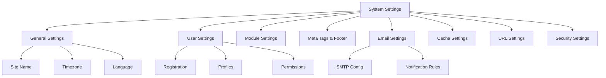

# XOOPS-Systemeinstellungen

Dieser Leitfaden behandelt die vollständigen Systemeinstellungen im XOOPS-Admin-Panel, organisiert nach Kategorie.

## Architektur der Systemeinstellungen



## Zugriff auf Systemeinstellungen

### Speicherort

**Admin-Panel > System > Preferences**

Oder navigieren Sie direkt:

```
http://your-domain.com/xoops/admin/index.php?fct=preferences
```

### Berechtigungsanforderungen

- Nur Administratoren (Webmaster) können auf Systemeinstellungen zugreifen
- Änderungen wirken sich auf die gesamte Website aus
- Die meisten Änderungen werden sofort wirksam

## Allgemeine Einstellungen

Die grundlegende Konfiguration für Ihre XOOPS-Installation.

### Grundlegende Informationen

```
Site Name: [Your Site Name]
Default Description: [Brief description of your site]
Site Slogan: [Catchy slogan]
Admin Email: admin@your-domain.com
Webmaster Name: Administrator Name
Webmaster Email: admin@your-domain.com
```

### Erscheinungseinstellungen

```
Default Theme: [Select theme]
Default Language: English (or preferred language)
Items Per Page: 15 (typically 10-25)
Words in Snippet: 25 (for search results)
Theme Upload Permission: Disabled (security)
```

### Regionale Einstellungen

```
Default Timezone: [Your timezone]
Date Format: %Y-%m-%d (YYYY-MM-DD format)
Time Format: %H:%M:%S (HH:MM:SS format)
Daylight Saving Time: [Auto/Manual/None]
```

**Zeitzonen-Format-Tabelle:**

| Region | Zeitzone | UTC-Versatz |
|---|---|---|
| US Eastern | America/New_York | -5 / -4 |
| US Central | America/Chicago | -6 / -5 |
| US Mountain | America/Denver | -7 / -6 |
| US Pacific | America/Los_Angeles | -8 / -7 |
| UK/London | Europe/London | 0 / +1 |
| France/Germany | Europe/Paris | +1 / +2 |
| Japan | Asia/Tokyo | +9 |
| China | Asia/Shanghai | +8 |
| Australia/Sydney | Australia/Sydney | +10 / +11 |

### Suchkonfiguration

```
Enable Search: Yes
Search Admin Pages: Yes/No
Search Archives: Yes
Default Search Type: All / Pages only
Words Excluded from Search: [Comma-separated list]
```

**Häufig ausgeschlossene Wörter:** the, a, an, and, or, but, in, on, at, by, to, from

## Benutzereinstellungen

Kontrollieren Sie Benutzerkonten-Verhalten und Registrierungsprozess.

### Benutzerregistrierung

```
Allow User Registration: Yes/No
Registration Type:
  ☐ Auto-activate (Instant access)
  ☐ Admin approval (Admin must approve)
  ☐ Email verification (User must verify email)

Notification to Users: Yes/No
User Email Verification: Required/Optional
```

### Neue Benutzerkonfiguration

```
Auto-login New Users: Yes/No
Assign Default User Group: Yes
Default User Group: [Select group]
Create User Avatar: Yes/No
Initial User Avatar: [Select default]
```

### Profileinstellungen für Benutzer

```
Allow User Profiles: Yes
Show Member List: Yes
Show User Statistics: Yes
Show Last Online Time: Yes
Allow User Avatar: Yes
Avatar Max File Size: 100KB
Avatar Dimensions: 100x100 pixels
```

### E-Mail-Einstellungen für Benutzer

```
Allow Users to Hide Email: Yes
Show Email on Profile: Yes
Notification Email Interval: Immediately/Daily/Weekly/Never
```

### Benutzeraktivitätsverfolgung

```
Track User Activity: Yes
Log User Logins: Yes
Log Failed Logins: Yes
Track IP Address: Yes
Clear Activity Logs Older Than: 90 days
```

### Kontobeschränkungen

```
Allow Duplicate Email: No
Minimum Username Length: 3 characters
Maximum Username Length: 15 characters
Minimum Password Length: 6 characters
Require Special Characters: Yes
Require Numbers: Yes
Password Expiration: 90 days (or Never)
Accounts Inactive Days to Delete: 365 days
```

## Moduleinstellungen

Konfigurieren Sie individuelles Modul-Verhalten.

### Häufige Moduloptionen

Für jedes installierte Modul können Sie Folgendes einstellen:

```
Module Status: Active/Inactive
Display in Menu: Yes/No
Module Weight: [1-999] (higher = lower in display)
Homepage Default: This module shows when visiting /
Admin Access: [Allowed user groups]
User Access: [Allowed user groups]
```

### Systemmodul-Einstellungen

```
Show Homepage as: Portal / Module / Static Page
Default Homepage Module: [Select module]
Show Footer Menu: Yes
Footer Color: [Color selector]
Show System Stats: Yes
Show Memory Usage: Yes
```

### Konfiguration pro Modul

Jedes Modul kann modul-spezifische Einstellungen haben:

**Beispiel - Page Module:**
```
Enable Comments: Yes/No
Moderate Comments: Yes/No
Comments Per Page: 10
Enable Ratings: Yes
Allow Anonymous Ratings: Yes
```

**Beispiel - User Module:**
```
Avatar Upload Folder: ./uploads/
Maximum Upload Size: 100KB
Allow File Upload: Yes
Allowed File Types: jpg, gif, png
```

Greifen Sie auf modul-spezifische Einstellungen zu:
- **Admin > Modules > [Module Name] > Preferences**

## Meta-Tags & SEO-Einstellungen

Konfigurieren Sie Meta-Tags für Suchmaschinen-Optimierung.

### Globale Meta-Tags

```
Meta Keywords: xoops, cms, content management system
Meta Description: A powerful content management system for building dynamic websites
Meta Author: Your Name
Meta Copyright: Copyright 2025, Your Company
Meta Robots: index, follow
Meta Revisit: 30 days
```

### Meta-Tag Best Practices

| Tag | Zweck | Empfehlung |
|---|---|---|
| Keywords | Suchbegriffe | 5-10 relevante Schlüsselwörter, kommagetrennt |
| Description | Sucheintrag | 150-160 Zeichen |
| Author | Seitenerstellung | Ihr Name oder Unternehmen |
| Copyright | Rechtlich | Ihr Copyright-Hinweis |
| Robots | Crawler-Anweisungen | index, follow (Indexierung erlauben) |

### Footer-Einstellungen

```
Show Footer: Yes
Footer Color: Dark/Light
Footer Background: [Color code]
Footer Text: [HTML allowed]
Additional Footer Links: [URL and text pairs]
```

**Beispiel-Footer-HTML:**
```html
<p>Copyright &copy; 2025 Your Company. All rights reserved.</p>
<p><a href="/privacy">Privacy Policy</a> | <a href="/terms">Terms of Use</a></p>
```

### Social Meta-Tags (Open Graph)

```
Enable Open Graph: Yes
Facebook App ID: [App ID]
Twitter Card Type: summary / summary_large_image / player
Default Share Image: [Image URL]
```

## E-Mail-Einstellungen

Konfigurieren Sie E-Mail-Zustellung und Benachrichtigungssystem.

### E-Mail-Zustellmethode

```
Use SMTP: Yes/No

If SMTP:
  SMTP Host: smtp.gmail.com
  SMTP Port: 587 (TLS) or 465 (SSL)
  SMTP Security: TLS / SSL / None
  SMTP Username: [email@example.com]
  SMTP Password: [password]
  SMTP Authentication: Yes/No
  SMTP Timeout: 10 seconds

If PHP mail():
  Sendmail Path: /usr/sbin/sendmail -t -i
```

### E-Mail-Konfiguration

```
From Address: noreply@your-domain.com
From Name: Your Site Name
Reply-To Address: support@your-domain.com
BCC Admin Emails: Yes/No
```

### Benachrichtigungseinstellungen

```
Send Welcome Email: Yes/No
Welcome Email Subject: Welcome to [Site Name]
Welcome Email Body: [Custom message]

Send Password Reset Email: Yes/No
Include Random Password: Yes/No
Token Expiration: 24 hours
```

### Admin-Benachrichtigungen

```
Notify Admin on Registration: Yes
Notify Admin on Comments: Yes
Notify Admin on Submissions: Yes
Notify Admin on Errors: Yes
```

### Benutzer-Benachrichtigungen

```
Notify User on Registration: Yes
Notify User on Comments: Yes
Notify User on Private Messages: Yes
Allow Users to Disable Notifications: Yes
Default Notification Frequency: Immediately
```

### E-Mail-Vorlagen

Passen Sie Benachrichtigungs-E-Mails im Admin-Panel an:

**Pfad:** System > Email Templates

Verfügbare Vorlagen:
- User Registration
- Password Reset
- Comment Notification
- Private Message
- System Alerts
- Module-specific emails

## Cache-Einstellungen

Optimieren Sie die Leistung durch Caching.

### Cache-Konfiguration

```
Enable Caching: Yes/No
Cache Type:
  ☐ File Cache
  ☐ APCu (Alternative PHP Cache)
  ☐ Memcache (Distributed caching)
  ☐ Redis (Advanced caching)

Cache Lifetime: 3600 seconds (1 hour)
```

### Cache-Optionen nach Typ

**File Cache:**
```
Cache Directory: /var/www/html/xoops/cache/
Clear Interval: Daily
Maximum Cache Files: 1000
```

**APCu Cache:**
```
Memory Allocation: 128MB
Fragmentation Level: Low
```

**Memcache/Redis:**
```
Server Host: localhost
Server Port: 11211 (Memcache) / 6379 (Redis)
Persistent Connection: Yes
```

### Was wird gecacht

```
Cache Module Lists: Yes
Cache Configuration Data: Yes
Cache Template Data: Yes
Cache User Session Data: Yes
Cache Search Results: Yes
Cache Database Queries: Yes
Cache RSS Feeds: Yes
Cache Images: Yes
```

## URL-Einstellungen

Konfigurieren Sie URL-Umschreiben und Formatierung.

### Einstellungen für freundliche URLs

```
Enable Friendly URLs: Yes/No
Friendly URL Type:
  ☐ Path Info: /page/about
  ☐ Query String: /index.php?p=about

Trailing Slash: Include / Omit
URL Case: Lower case / Case sensitive
```

### URL-Umschreib-Regeln

```
.htaccess Rules: [Display current]
Nginx Rules: [Display current if Nginx]
IIS Rules: [Display current if IIS]
```

## Sicherheitseinstellungen

Kontrollieren Sie sicherheitsbezogene Konfiguration.

### Passwort-Sicherheit

```
Password Policy:
  ☐ Require uppercase letters
  ☐ Require lowercase letters
  ☐ Require numbers
  ☐ Require special characters

Minimum Password Length: 8 characters
Password Expiration: 90 days
Password History: Remember last 5 passwords
Force Password Change: On next login
```

### Login-Sicherheit

```
Lock Account After Failed Attempts: 5 attempts
Lock Duration: 15 minutes
Log All Login Attempts: Yes
Log Failed Logins: Yes
Admin Login Alert: Send email on admin login
Two-Factor Authentication: Disabled/Enabled
```

### Sicherheit beim Datei-Upload

```
Allow File Uploads: Yes/No
Maximum File Size: 128MB
Allowed File Types: jpg, gif, png, pdf, zip, doc, docx
Scan Uploads for Malware: Yes (if available)
Quarantine Suspicious Files: Yes
```

### Sitzungssicherheit

```
Session Management: Database/Files
Session Timeout: 1800 seconds (30 min)
Session Cookie Lifetime: 0 (until browser closes)
Secure Cookie: Yes (HTTPS only)
HTTP Only Cookie: Yes (prevent JavaScript access)
```

### CORS-Einstellungen

```
Allow Cross-Origin Requests: No
Allowed Origins: [List domains]
Allow Credentials: No
Allowed Methods: GET, POST
```

## Erweiterte Einstellungen

Zusätzliche Konfigurationsoptionen für fortgeschrittene Benutzer.

### Debug-Modus

```
Debug Mode: Disabled/Enabled
Log Level: Error / Warning / Info / Debug
Debug Log File: /var/log/xoops_debug.log
Display Errors: Disabled (production)
```

### Leistungsoptimierung

```
Optimize Database Queries: Yes
Use Query Cache: Yes
Compress Output: Yes
Minify CSS/JavaScript: Yes
Lazy Load Images: Yes
```

### Inhaltseinstellungen

```
Allow HTML in Posts: Yes/No
Allowed HTML Tags: [Configure]
Strip Harmful Code: Yes
Allow Embed: Yes/No
Content Moderation: Automatic/Manual
Spam Detection: Yes
```

## Einstellungen Export/Import

### Backup-Einstellungen

Exportieren Sie aktuelle Einstellungen:

**Admin-Panel > System > Tools > Export Settings**

```bash
# Settings exported as JSON file
# Download and store securely
```

### Einstellungen wiederherstellen

Importieren Sie zuvor exportierte Einstellungen:

**Admin-Panel > System > Tools > Import Settings**

```bash
# Upload JSON file
# Verify changes before confirming
```

## Konfigurationshierarchie

XOOPS-Einstellungshierarchie (von oben nach unten - erste Übereinstimmung gewinnt):

```
1. mainfile.php (Constants)
2. Module-specific config
3. Admin System Settings
4. Theme configuration
5. User preferences (for user-specific settings)
```

## Backup-Skript für Einstellungen

Erstellen Sie ein Backup der aktuellen Einstellungen:

```php
<?php
// Backup script: /var/www/html/xoops/backup-settings.php
require_once __DIR__ . '/mainfile.php';

$config_handler = xoops_getHandler('config');
$configs = $config_handler->getConfigs();

$backup = [
    'exported_date' => date('Y-m-d H:i:s'),
    'xoops_version' => XOOPS_VERSION,
    'php_version' => PHP_VERSION,
    'settings' => []
];

foreach ($configs as $config) {
    $backup['settings'][$config->getVar('conf_name')] = [
        'value' => $config->getVar('conf_value'),
        'description' => $config->getVar('conf_desc'),
        'type' => $config->getVar('conf_type'),
    ];
}

// Save to JSON file
file_put_contents(
    '/backups/xoops_settings_' . date('YmdHis') . '.json',
    json_encode($backup, JSON_PRETTY_PRINT)
);

echo "Settings backed up successfully!";
?>
```

## Häufige Einstellungsänderungen

### Website-Namen ändern

1. Admin > System > Preferences > General Settings
2. Ändern Sie "Site Name"
3. Klicken Sie auf "Speichern"

### Registrierung aktivieren/deaktivieren

1. Admin > System > Preferences > User Settings
2. Schalten Sie "Allow User Registration" um
3. Wählen Sie Registrierungstyp
4. Klicken Sie auf "Speichern"

### Standard-Theme ändern

1. Admin > System > Preferences > General Settings
2. Wählen Sie "Default Theme"
3. Klicken Sie auf "Speichern"
4. Cache löschen, damit Änderungen wirksam werden

### Kontakt-E-Mail aktualisieren

1. Admin > System > Preferences > General Settings
2. Ändern Sie "Admin Email"
3. Ändern Sie "Webmaster Email"
4. Klicken Sie auf "Speichern"

## Verifizierungs-Checkliste

Nach der Konfiguration von Systemeinstellungen überprüfen Sie:

- [ ] Website-Name wird korrekt angezeigt
- [ ] Zeitzone zeigt die richtige Zeit
- [ ] E-Mail-Benachrichtigungen werden ordnungsgemäß versendet
- [ ] Benutzerregistrierung funktioniert wie konfiguriert
- [ ] Homepage zeigt ausgewählte Standard
- [ ] Suchfunktionalität funktioniert
- [ ] Cache verbessert die Seitenladezeit
- [ ] Freundliche URLs funktionieren (falls aktiviert)
- [ ] Meta-Tags werden in der Seite angezeigt
- [ ] Admin-Benachrichtigungen erhalten
- [ ] Sicherheitseinstellungen werden durchgesetzt

## Fehlerbehebung bei Einstellungen

### Einstellungen werden nicht gespeichert

**Lösung:**
```bash
# Check file permissions on config directory
chmod 755 /var/www/html/xoops/var/

# Verify database writable
# Try saving again in admin panel
```

### Änderungen werden nicht wirksam

**Lösung:**
```bash
# Clear cache
rm -rf /var/www/html/xoops/cache/*
rm -rf /var/www/html/xoops/templates_c/*

# If still not working, restart web server
systemctl restart apache2
```

### E-Mail wird nicht versendet

**Lösung:**
1. Überprüfen Sie SMTP-Anmeldedaten in E-Mail-Einstellungen
2. Testen Sie mit Schaltfläche "Send Test Email"
3. Überprüfen Sie Fehlerprotokolle
4. Versuchen Sie, PHP mail() statt SMTP zu verwenden

## Nächste Schritte

Nach der Konfiguration der Systemeinstellungen:

1. Konfigurieren Sie Sicherheitseinstellungen
2. Optimieren Sie die Leistung
3. Erkunden Sie die Admin-Panel-Funktionen
4. Richten Sie Benutzerverwaltung auf

---

**Tags:** #system-settings #configuration #preferences #admin-panel

**Related Articles:**
- ../../06-Publisher-Module/User-Guide/Basic-Configuration
- Security-Configuration
- Performance-Optimization
- ../First-Steps/Admin-Panel-Overview
