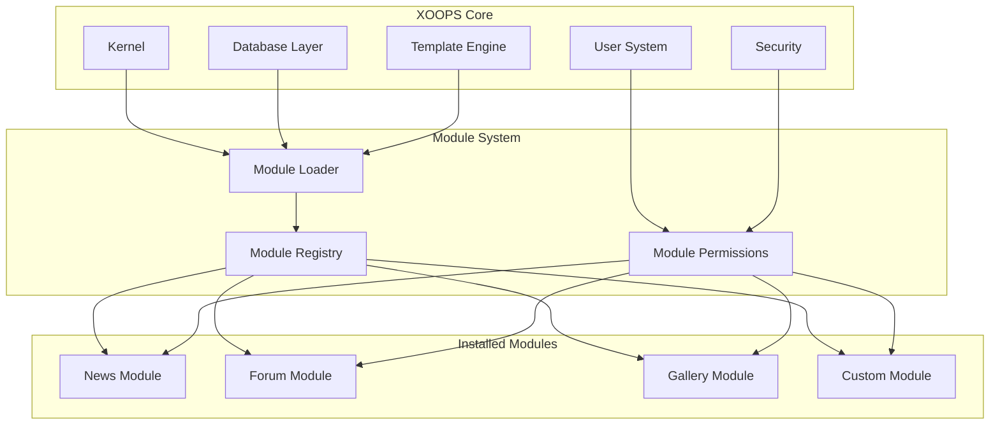
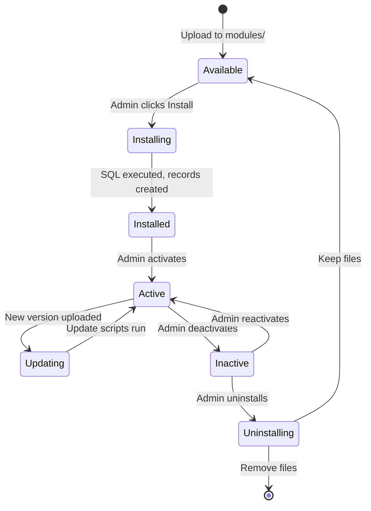

# ADR-001: Modulare Architektur

> Architecture Decision Record für XOOPS's Kernphilosophie des modularen Designs.

---

## Status

**Akzeptiert** - Grundlegende Entscheidung seit XOOPS-Anfang

---

## Context

XOOPS (eXtensible Object-Oriented Portal System) benötigte eine Architektur, die folgendes ermöglichte:

1. Ermöglichen Sie Drittentwicklern, die Funktionalität zu erweitern
2. Ermöglichen Sie Site-Administratoren, ohne Codierung anzupassen
3. Unterstützen Sie unabhängige Entwicklung und Updates
4. Bieten Sie Isolation zwischen verschiedenen Features
5. Skalieren Sie von einfachen Blogs bis zu komplexen Portalen

Die CMS-Landschaft der frühen 2000er Jahre bot monolithische Systeme, die schwer zu kustomieren und zu erweitern waren.

---

## Decision Diagram



---

## Decision

Wir werden eine **modulare Architektur** implementieren, bei der:

### 1. Kernkomponenten bieten Infrastruktur
- Datenbankabstraktion
- Benutzerauthentifizierung und Berechtigungen
- Template-Rendering (Smarty)
- Sicherheitsdienstprogramme
- Formulargenerierung
- Gemeinsame Dienstprogramme

### 2. Module sind in sich geschlossen
Jedes Modul:
- Hat seine eigene Verzeichnisstruktur
- Enthält seine eigenen Klassen, Templates, SQL
- Definiert seine eigene Konfiguration
- Kann unabhängig installiert/deinstalliert werden
- Hat Versionsverfolgung

### 3. Standardmodulstruktur
```
modules/modulename/
├── admin/                  # Admin interface
│   ├── index.php
│   └── menu.php
├── class/                  # PHP classes
├── include/                # Include files
├── language/               # Translations
├── sql/                    # Database schema
├── templates/              # Smarty templates
├── blocks/                 # Block definitions
├── xoops_version.php       # Module manifest
├── index.php               # Entry point
└── header.php              # Module bootstrap
```

### 4. Modulmanifest (xoops_version.php)
```php
<?php
$modversion['name']        = 'Module Name';
$modversion['version']     = '1.0.0';
$modversion['description'] = 'Module description';
$modversion['dirname']     = basename(__DIR__);
$modversion['hasMain']     = 1;
$modversion['hasAdmin']    = 1;
$modversion['sqlfile']['mysql'] = 'sql/mysql.sql';
$modversion['tables']      = ['modulename_table1'];
$modversion['templates']   = [...];
$modversion['config']      = [...];
$modversion['blocks']      = [...];
```

### 5. Modul-Kommunikation
- Über Core-APIs (Handler, Events)
- Datenbankbeziehungen
- Preload-Hooks
- Gemeinsame Dienste

---

## Modul-Lebenszyklus



---

## Consequences

### Positiv

1. **Erweiterbarkeit**: Tausende von Modulen von der Community erstellt
2. **Unabhängigkeit**: Module können separat entwickelt werden
3. **Flexibilität**: Sites können Features mischen und anpassen
4. **Wartbarkeit**: Updates beeinflussen andere Module nicht
5. **Marketplace**: Ein Modul-Ökosystem entstand
6. **Lernkurve**: Entwickler lernen ein Muster

### Negativ

1. **Overhead**: Jedes Modul hat Bootstrap-Kosten
2. **Duplication**: Gemeinsamer Code kann wiederholt werden
3. **Integration**: Cross-Module-Features benötigen sorgfältiges Design
4. **Versionierung**: Modul-Kompatibilitätsverwaltung erforderlich
5. **Qualitätsvarianz**: Drittanbieter-Modulqualität variiert

### Neutral

1. **Datenbank**: Jedes Modul verwaltet seine eigenen Tabellen
2. **Templates**: Theme muss verschiedene Module unterstützen
3. **Updates**: Kern und Module werden unabhängig aktualisiert

---

## Alternatives Considered

### 1. Monolithische Architektur
**Abgelehnt** - Zu steif, schwer zu kustomieren

### 2. Plugin-Architektur (WordPress-Stil)
**Teilweise übernommen** - Blöcke und Preloads bieten Plugin-ähnliche Hooks innerhalb von Modulen

### 3. Komponenten-Architektur (Joomla-Stil)
**Abgelehnt** - Komplexer, weniger entwicklerfreundlich

### 4. Microservices
**Nicht anwendbar** - Zu komplex für Shared-Hosting-Ära

---

## Related Decisions

- ADR-002: Object-Oriented Database Access
- ADR-003: Smarty Template Engine
- ADR-005: Permission System

---

## References

- XOOPS Project History
- PHP Application Architecture Patterns
- CMS Comparison Studies (2001-2005)

---

#xoops #architecture #adr #modules #design-decision
