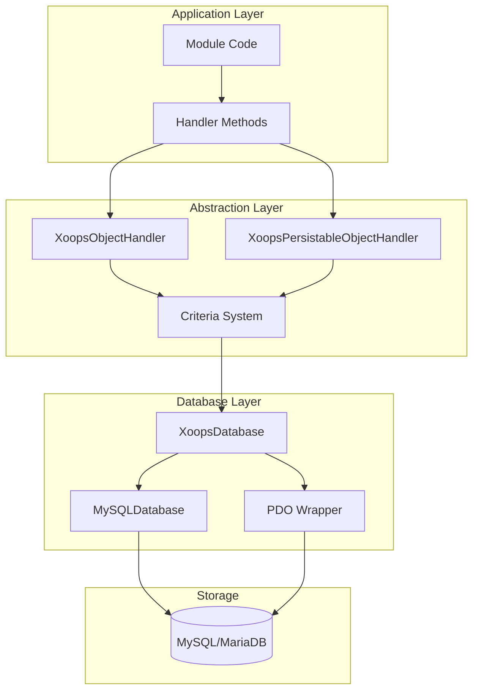
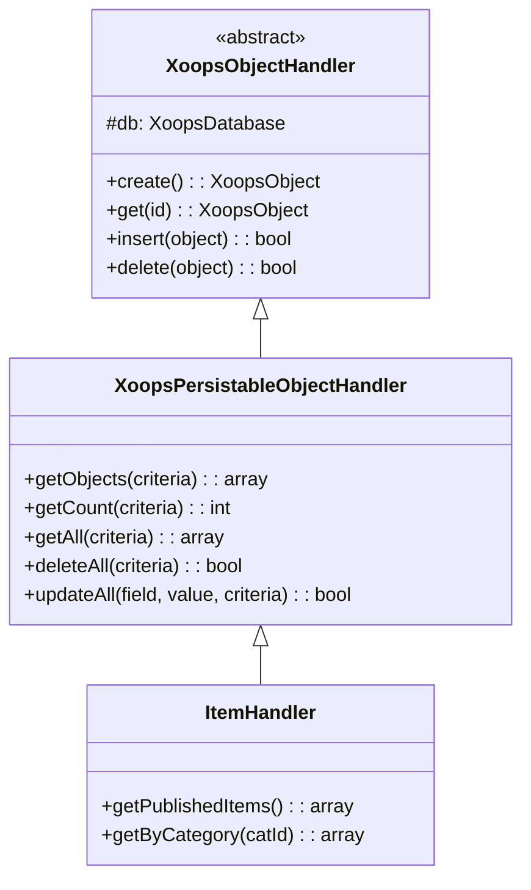
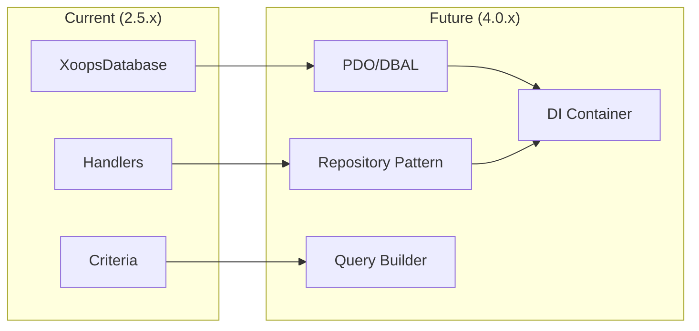

# ADR-002: Datenbankabstraktion

> Architecture Decision Record für XOOPS's objekt-orientiertes Datenbankzugriffssmuster.

---

## Status

**Akzeptiert** - Kernmuster seit XOOPS 2.0

---

## Context

XOOPS benötigte eine Datenbank-Interaktionsstrategie, die folgende Anforderungen erfüllte:

1. Datenbank-spezifische SQL-Syntax abstrahieren
2. Konsistente CRUD-Operationen für alle Module bieten
3. Automatische Datenbereinigungs- und Escape-Operationen aktivieren
4. Zukünftige Datenbankengineänderungen unterstützen
5. Häufige Operationen für Entwickler vereinfachen

Die Alternativen waren:
- Raw SQL durchgehend im Codebase
- Vollständige ORM (Doctrine, Eloquent)
- Benutzerdefinierte leichte Abstraktion

---

## Decision Diagram



---

## Decision

Wir werden ein **Handler-Muster** mit folgendem implementieren:

### 1. XoopsObject - Datencontainer

Jede Datenentität erweitert XoopsObject:

```php
<?php
class Item extends XoopsObject
{
    public function __construct()
    {
        $this->initVar('id', XOBJ_DTYPE_INT, null, false);
        $this->initVar('title', XOBJ_DTYPE_TXTBOX, '', true, 255);
        $this->initVar('content', XOBJ_DTYPE_TXTAREA, '', false);
        $this->initVar('status', XOBJ_DTYPE_INT, 0, false);
    }
}
```

### 2. Handler - Operationen-Manager

Jedes Objekt hat einen entsprechenden Handler:

```php
<?php
class ItemHandler extends XoopsPersistableObjectHandler
{
    public function __construct($db)
    {
        parent::__construct($db, 'mymodule_items', Item::class, 'id', 'title');
    }

    // CRUD methods inherited:
    // - create(), get(), insert(), delete()
    // - getObjects(), getCount(), getAll()
}
```

### 3. Criteria - Abfrage-Builder

Objekt-orientierte Abfragebedingungen:

```php
<?php
$criteria = new CriteriaCompo();
$criteria->add(new Criteria('status', 1));
$criteria->add(new Criteria('created', time() - 86400, '>='));
$criteria->setSort('created');
$criteria->setOrder('DESC');
$criteria->setLimit(10);

$items = $handler->getObjects($criteria);
```

---

## Datentyp-Konstanten

```php
// Variable types with automatic sanitization
XOBJ_DTYPE_INT       // Integer
XOBJ_DTYPE_TXTBOX    // Single-line text (escaped)
XOBJ_DTYPE_TXTAREA   // Multi-line text (escaped)
XOBJ_DTYPE_EMAIL     // Email validation
XOBJ_DTYPE_URL       // URL validation
XOBJ_DTYPE_ARRAY     // Serialized array
XOBJ_DTYPE_OTHER     // No processing
XOBJ_DTYPE_FLOAT     // Floating point
```

---

## Handler-Vererbung



---

## Consequences

### Positiv

1. **Konsistenz**: Alle Module verwenden gleiche Muster
2. **Sicherheit**: Automatisches Escaping verhindert SQL-Injection
3. **Einfachheit**: Häufige Operationen erfordern minimalen Code
4. **Wartbarkeit**: Datenbankschichtänderungen beeinflussen Module nicht
5. **Testbarkeit**: Handler können für Tests gemockt werden

### Negativ

1. **Leistung**: Zusätzlicher Abstraktions-Overhead
2. **Komplexität**: Lernkurve für neue Entwickler
3. **Limitierungen**: Komplexe Abfragen benötigen möglicherweise Raw-SQL
4. **N+1 Problem**: Kein eingebautes Eager Loading

### Mitigationen

- **Leistung**: Häufig zugegriffene Objekte zwischenspeichern
- **Komplexe Abfragen**: Raw-SQL zulassen, wenn nötig
- **N+1**: getAll() mit ordentlichen Criteria verwenden

---

## Evolution zu XOOPS 4.0



XOOPS 4.0 plant:
- Doctrine DBAL für Datenbankabstraktion
- Repository-Muster ersetzt Handler
- Query Builder für komplexe Abfragen
- Vollständige PSR-11-Container-Integration

---

## Code-Beispiele

### Basic CRUD

```php
<?php
$helper = Helper::getInstance();
$handler = $helper->getHandler('Item');

// Create
$item = $handler->create();
$item->setVar('title', 'New Item');
$handler->insert($item);

// Read
$item = $handler->get($id);
$title = $item->getVar('title');

// Update
$item->setVar('title', 'Updated Title');
$handler->insert($item);

// Delete
$handler->delete($item);
```

### Complex Query

```php
<?php
$criteria = new CriteriaCompo();
$criteria->add(new Criteria('status', 'published'));
$criteria->add(new Criteria('category_id', '(1,2,3)', 'IN'));
$criteria->add(new Criteria('created', strtotime('-30 days'), '>='));
$criteria->setSort('views');
$criteria->setOrder('DESC');
$criteria->setLimit(10);
$criteria->setStart(0);

$items = $handler->getObjects($criteria);
$total = $handler->getCount($criteria);
```

---

## Related Decisions

- ADR-001: Modular Architecture
- ADR-003: Smarty Template Engine

---

## References

- Martin Fowler - Patterns of Enterprise Application Architecture
- Domain-Driven Design concepts
- Active Record vs Data Mapper patterns

---

#xoops #architecture #adr #database #handler #design-decision
