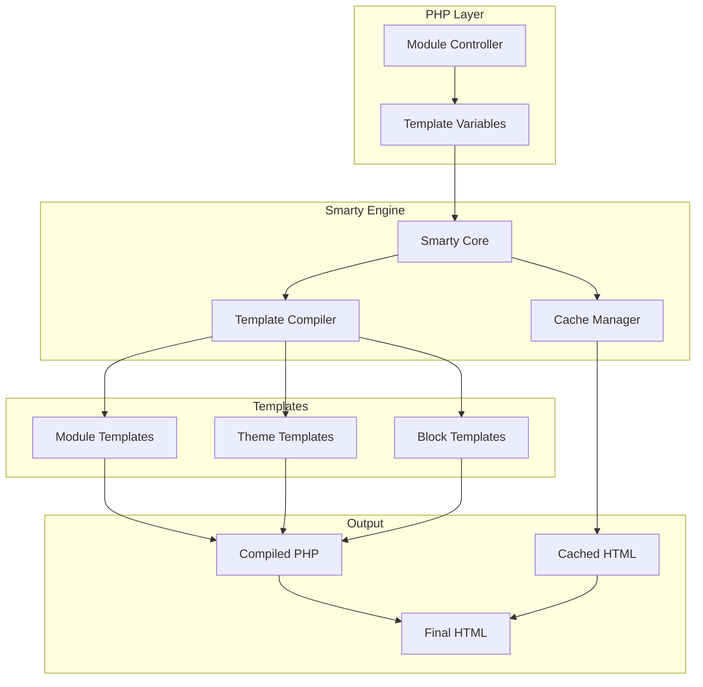
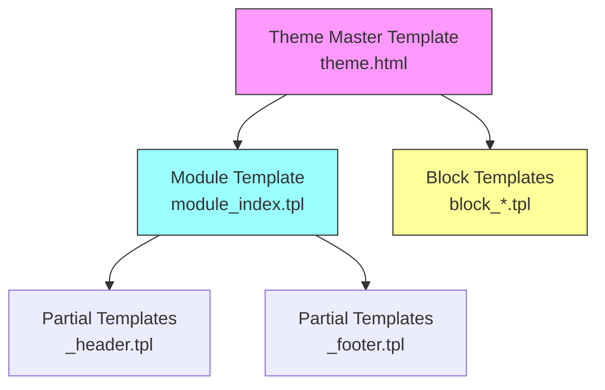
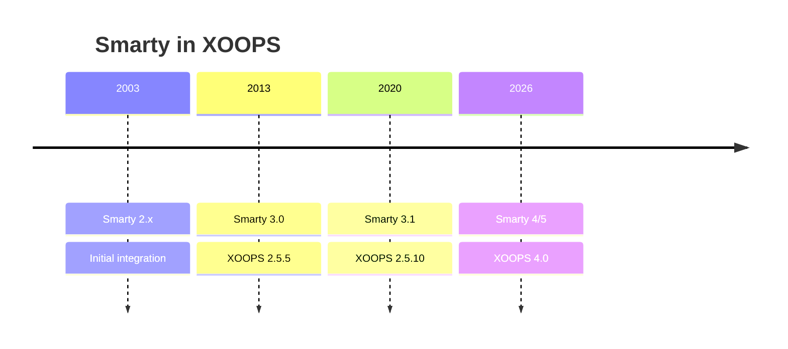

# ADR-003: Template-Engine (Smarty)

> Architecture Decision Record für XOOPS's Übernahme der Smarty Template-Engine.

---

## Status

**Akzeptiert** - Kernentscheidung seit XOOPS 2.0

**Evolving** - Migration zu Smarty 4/5 geplant für XOOPS 4.0

---

## Context

XOOPS benötigte eine Templating-Lösung, die folgende Anforderungen erfüllte:

1. Trennen Sie Präsentation von Geschäftslogik
2. Ermöglichen Sie Theme-Designern die Arbeit ohne PHP-Kenntnisse
3. Unterstützen Sie Template-Vererbung und Includes
4. Bieten Sie Caching für Leistung
5. Ermöglichen Sie benutzerdefinierte Templates
6. Unterstützen Sie Internationalisierung

---

## Decision Diagram



---

## Decision

Wir werden **Smarty** als Template-Engine verwenden, weil:

### 1. Separation of Concerns

```php
// PHP (Controller) - Business logic
$items = $itemHandler->getPublishedItems();
$xoopsTpl->assign('items', $items);

// Smarty (View) - Presentation
// templates/items.tpl
```

```smarty
{* Smarty template - No PHP logic *}
<{foreach item=item from=$items}>
    <article>
        <h2><{$item.title}></h2>
        <p><{$item.summary}></p>
    </article>
<{/foreach}>
```

### 2. XOOPS-Begrenzer

XOOPS verwendet `<{` und `}>` statt Standard `{` `}`:

```smarty
{* Standard Smarty *}
{$variable}

{* XOOPS Smarty - Avoids JavaScript conflicts *}
<{$variable}>
```

### 3. Template-Hierarchie



### 4. Template-Speicherung

- **Datenbank**: Angepasste Templates speichern für Rückbelegfähigkeit
- **Dateisystem**: Ursprüngliche Templates in Modulverzeichnissen
- **Cache**: Kompilierte Templates für Leistung

---

## Smarty-Konfiguration

```php
// XOOPS Smarty initialization
$xoopsTpl = new XoopsTpl();

// Custom delimiters
$xoopsTpl->left_delim = '<{';
$xoopsTpl->right_delim = '}>';

// Caching
$xoopsTpl->caching = XOOPS_TEMPLATE_CACHE;
$xoopsTpl->cache_lifetime = 3600;

// Security
$xoopsTpl->security_policy = new Smarty_Security($xoopsTpl);
$xoopsTpl->security_policy->php_functions = [];
$xoopsTpl->security_policy->php_modifiers = ['escape', 'count'];
```

---

## Template-Features verwendet

### Variables

```smarty
{* Simple variable *}
<{$title}>

{* Object property *}
<{$item.title}>

{* With modifier *}
<{$content|truncate:200:'...'}>

{* Escaped output *}
<{$userInput|escape:'html'}>
```

### Kontrollstrukturen

```smarty
{* Conditional *}
<{if $isAdmin}>
    <a href="admin.php">Admin</a>
<{elseif $isUser}>
    <a href="profile.php">Profile</a>
<{else}>
    <a href="login.php">Login</a>
<{/if}>

{* Loop *}
<{foreach item=item from=$items name=itemloop}>
    <{$smarty.foreach.itemloop.index}>: <{$item.title}>
<{/foreach}>
```

### Includes

```smarty
{* Include another template *}
<{include file="db:mymodule_header.tpl"}>

{* Include with variables *}
<{include file="db:mymodule_item.tpl" item=$currentItem}>

{* Include from theme *}
<{include file="file:$theme_path/partials/sidebar.tpl"}>
```

---

## Consequences

### Positiv

1. **Designer-freundlich**: HTML-ähnliche Syntax
2. **Caching**: Eingebautes Template-Caching
3. **Sicherheit**: PHP-Code-Isolation
4. **Flexibilität**: Modifizierer, Funktionen, Plugins
5. **Kustomisierung**: Benutzer können Templates ändern
6. **Community**: Großes Smarty-Ökosystem

### Negativ

1. **Lernkurve**: Smarty-spezifische Syntax
2. **Overhead**: Compilierungsschritt erforderlich
3. **Debugging**: Template-Fehler können kryptisch sein
4. **Versions-Probleme**: Breaking Changes zwischen Versionen

### Mitigations

- **Learning**: Umfassende Dokumentation
- **Performance**: Aggressives Caching
- **Debugging**: Debug-Konsole, klare Fehlermeldungen
- **Versions**: Kompatibilitätsebene in XOOPS

---

## Versionsgeschichte



---

## Migration: Smarty 3 zu 4/5

### Breaking Changes

```smarty
{* Smarty 3 - Deprecated *}
<{php}>echo date('Y');<{/php}>

{* Smarty 4+ - Use modifiers or assign from PHP *}
<{$current_year}>

{* Smarty 3 - {section} deprecated *}
<{section name=i loop=$items}>
    <{$items[i].title}>
<{/section}>

{* Smarty 4+ - Use {foreach} *}
<{foreach $items as $item}>
    <{$item.title}>
<{/foreach}>
```

### Kompatibilitätsebene

XOOPS bietet eine Kompatibilitätsebene für reibungslose Übergänge:

```php
// XoopsTpl extends Smarty with compatibility methods
class XoopsTpl extends Smarty
{
    public function assign($tpl_var, $value = null)
    {
        // Handles both Smarty 3 and 4 syntax
        return parent::assign($tpl_var, $value);
    }
}
```

---

## Alternatives Considered

### 1. Twig
**Pros**: Modern, Symfony ecosystem
**Cons**: Different syntax, migration effort
**Decision**: Possible future option for XOOPS 3.x

### 2. Blade (Laravel)
**Pros**: Clean syntax, popular
**Cons**: Laravel-specific
**Decision**: Not suitable for standalone use

### 3. Native PHP Templates
**Pros**: No learning curve, fast
**Cons**: Security risks, no separation
**Decision**: Rejected for maintainability

---

## Related Decisions

- ADR-001: Modular Architecture
- ADR-002: Database Abstraction

---

## References

- Smarty Documentation: https://www.smarty.net/docs/en/
- XOOPS Template System Guide
- MVC Pattern in Web Applications

---

#xoops #architecture #adr #smarty #templates #design-decision
