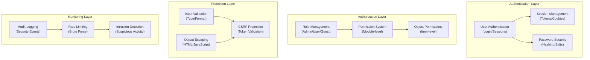

# ADR-004: Sicherheitssystem-Architektur

> Umfassende Sicherheitsarchitektur für XOOPS CMS zum Schutz vor modernen Bedrohungen.

---

## Status

**Akzeptiert** - Kern-Sicherheitsebene seit XOOPS 2.5

---

## Context

### Problem-Aussage

XOOPS benötigt ein robustes Sicherheitssystem, das:

1. **Schützen gegen häufige Web-Sicherheitslücken** (OWASP Top 10)
2. **Bietet granulare Berechtigung** über Module
3. **Ermöglicht sichere Benutzerauthentifizierung** mit modernen Standards
4. **Verhindert Datenbrechs** und nicht autorisierte Zugriff
5. **Unterstützt Multi-Level-Zugriffskontrolle** (Admin, Moderator, User, Guest)
6. **Integriert mit allen Modulen** nahtlos

### Aktuelle Bedrohungen

Moderne Web-Angriffe umfassen:

- **SQL-Injection** - Bösartige SQL in Benutzereingaben
- **XSS (Cross-Site Scripting)** - Injiziertes JavaScript in Seiten
- **CSRF (Cross-Site Request Forgery)** - Nicht autorisierte Formularübermittlungen
- **Authentifizierungs-Umgehung** - Schwache Session/Passwort-Handling
- **Autorisierungs-Umgehung** - Privileg-Eskalation
- **Daten-Exposition** - Sensible Daten in URLs, Protokollen oder Caches

### XOOPS-Sicherheitsanforderungen

1. Benutzerauthentifizierung und Session-Management
2. Rollenbasierte Zugriffskontrolle (RBAC)
3. Permission-System für Module und Objekte
4. Eingabe-Validierung und Output-Escaping
5. Schutz gegen häufige Angriffe
6. Audit-Protokollierung von Sicherheitsereignissen
7. Sichere Passwort-Handling
8. CSRF-Token-Schutz

---

## Decision

### Kern-Sicherheitsarchitektur



---

## Sicherheits-Komponenten

### 1. Authentifizierungs-System

**Benutzer-Login-Prozess:**

```php
<?php
// 1. Validate credentials
$user = $userHandler->findByLogin($username);
if (!$user || !password_verify($password, $user->getVar('pass'))) {
    throw new AuthenticationException('Invalid credentials');
}

// 2. Check if account is active
if (!$user->getVar('uactive')) {
    throw new AuthenticationException('Account inactive');
}

// 3. Create secure session
session_regenerate_id(true);
$_SESSION['uid'] = $user->getVar('uid');
$_SESSION['token'] = bin2hex(random_bytes(32));
$_SESSION['created'] = time();

// 4. Log the login
$this->auditLog('USER_LOGIN', $user->getVar('uid'));
```

**Passwort-Sicherheit:**

```php
<?php
// Use password_hash (not MD5 or SHA1)
$hashed = password_hash($password, PASSWORD_BCRYPT, [
    'cost' => 12, // High cost = slow brute force
]);

// Verify password
if (!password_verify($inputPassword, $hashed)) {
    throw new Exception('Invalid password');
}

// Rehash if algorithm or cost changed
if (password_needs_rehash($hashed, PASSWORD_BCRYPT, ['cost' => 12])) {
    $newHash = password_hash($password, PASSWORD_BCRYPT, ['cost' => 12]);
    $user->setVar('pass', $newHash);
    $userHandler->insert($user);
}
```

### 2. Session-Management

**Sichere Session-Handling:**

```php
<?php
// Session configuration
ini_set('session.cookie_httponly', true);  // No JS access
ini_set('session.cookie_secure', true);     // HTTPS only
ini_set('session.cookie_samesite', 'Strict'); // CSRF protection
ini_set('session.gc_maxlifetime', 3600);   // 1 hour timeout
ini_set('session.sid_length', 64);         // 64-char session ID

// Validate session
function validateSession() {
    // Check timeout
    if (time() - $_SESSION['created'] > 3600) {
        session_destroy();
        throw new SessionExpiredException();
    }

    // Validate user agent (prevent session hijacking)
    if ($_SESSION['user_agent'] !== $_SERVER['HTTP_USER_AGENT']) {
        throw new SessionInvalidException();
    }

    // Validate IP (optional, can be too strict)
    if (!in_array($_SERVER['REMOTE_ADDR'], $_SESSION['ips'])) {
        $_SESSION['ips'][] = $_SERVER['REMOTE_ADDR'];
    }
}
```

### 3. Autorisierung (RBAC)

**Rollenbasierte Zugriffskontrolle:**

```php
<?php
class XoopsUser {
    public function hasPermission(string $permissionName): bool
    {
        // Get user groups
        $groups = $this->getGroups();

        // Check if any group has permission
        foreach ($groups as $groupId) {
            if ($this->checkGroupPermission($groupId, $permissionName)) {
                return true;
            }
        }

        return false;
    }

    /**
     * User groups and their permissions
     * Admin: Full access
     * Moderator: Content management
     * User: Create own content
     * Guest: Read-only access
     */
    private function checkGroupPermission(int $groupId, string $permission): bool
    {
        $permissions = [
            1 => ['admin_access'],                 // Admin group
            2 => ['moderate_content', 'edit_own'], // Moderator group
            3 => ['create_content', 'edit_own'],   // User group
            4 => [],                               // Guest group (no permissions)
        ];

        return in_array($permission, $permissions[$groupId] ?? []);
    }
}
```

### 4. Eingabe-Validierung

**Verhindern Sie SQL-Injection und Typ-Fehler:**

```php
<?php
// Always use prepared statements
$sql = 'SELECT * FROM users WHERE id = ?';
$result = $db->query($sql, [$userId]); // ✅ Safe

// Input validation
function validateUserInput(array $data): array
{
    return [
        'email' => filter_var($data['email'] ?? '', FILTER_VALIDATE_EMAIL),
        'age' => filter_var($data['age'] ?? 0, FILTER_VALIDATE_INT),
        'website' => filter_var($data['website'] ?? '', FILTER_VALIDATE_URL),
        'title' => substr(trim($data['title'] ?? ''), 0, 255),
    ];
}

// XOOPS Safe Input class
$safe = \Xmf\Request::getHtmlRequest('var_name', '');
$int = \Xmf\Request::getInt('page', 1);
```

### 5. Output-Escaping

**Verhindern Sie XSS-Angriffe:**

```php
<?php
// In PHP templates
echo htmlspecialchars($userInput, ENT_QUOTES, 'UTF-8');

// In Smarty templates (automatic escaping)
<{$user_input}>  {* Escaped by default *}
<{$html|escape:false}>  {* Only when needed *}

// JavaScript context
<script>
var message = "<{$userMessage|escape:'javascript'}>";
</script>

// URL context
<a href="<{$url|escape:'url'}>">Link</a>
```

### 6. CSRF-Schutz

**Cross-Site Request Forgery-Prävention:**

```php
<?php
// Generate CSRF token
session_start();
if (empty($_SESSION['csrf_token'])) {
    $_SESSION['csrf_token'] = bin2hex(random_bytes(32));
}

// In forms
<form method="POST">
    <input type="hidden" name="csrf_token" value="<{$csrf_token}>">
    <button type="submit">Submit</button>
</form>

// Validate token
if ($_SERVER['REQUEST_METHOD'] === 'POST') {
    if (hash_equals($_SESSION['csrf_token'], $_POST['csrf_token'] ?? '')) {
        // Process form
    } else {
        throw new InvalidTokenException('CSRF token invalid');
    }
}
```

---

## Consequences

### Positive Auswirkungen

1. **Umfassender Schutz** - Deckt große Verwundungklassen ab
2. **Geschichtete Sicherheit** - Mehrere Verteidigungsschichten
3. **Flexible RBAC** - Präzise Berechtigung-Kontrolle
4. **Audit-Trail** - Verfolgen Sie Sicherheitsereignisse
5. **Industrie-Standard** - Richtet sich nach OWASP-Empfehlungen
6. **Modul-Integration** - Einfach für Module zum Einsatz von Sicherheits-APIs

### Negative Auswirkungen

1. **Komplexität** - Mehr Code und Konfiguration notwendig
2. **Leistung** - Hashing und Validierung fügen Overhead hinzu
3. **Benutzererlebnis** - Sicherheit ist manchmal unbequem
4. **Wartung** - Erfordert laufende Sicherheits-Updates
5. **Schulung erforderlich** - Entwickler müssen Praktiken befolgen

### Risiken und Mitigationen

| Risiko | Severity | Mitigation |
|------|----------|-----------|
| Developer ignores security | High | Code review, security training |
| New vulnerabilities discovered | Medium | Regular security audits, updates |
| Performance impact | Low | Optimize hot paths, caching |
| Overly complex permissions | Medium | Clear documentation, examples |

---

## Sicherheits-Best-Practices

### Für Modul-Entwickler

```php
<?php
// ✅ DO: Use prepared statements
$result = $db->prepare('SELECT * FROM table WHERE id = ?')->execute([$id]);

// ❌ DON'T: Concatenate queries
$result = $db->query("SELECT * FROM table WHERE id = $id");

// ✅ DO: Escape output
echo htmlspecialchars($user_input, ENT_QUOTES, 'UTF-8');

// ❌ DON'T: Output raw user data
echo $user_input;

// ✅ DO: Check permissions
if (!$user->hasPermission('edit_content')) {
    throw new PermissionException();
}

// ❌ DON'T: Trust user roles directly
if ($_POST['is_admin']) {
    // Make user admin - SECURITY HOLE!
}

// ✅ DO: Validate input types
$page = (int)$_GET['page'];

// ❌ DON'T: Use untrusted values directly
$sql .= " LIMIT " . $_GET['limit'];
```

---

## Alternativen Considered

### OAuth/OpenID Connect

**Warum nicht gewählt:**  Zu komplex für Shared-Hosting-Umgebung, aber gut für zukünftige Integration mit externen Auth-Systemen.

### Two-Factor Authentication (2FA)

**Status:** Akzeptiert als Erweiterung, nicht Kernnotwendigkeit, siehe ADR-006

### HTTP-only Session Cookies

**Status:** Implementiert - verhindert JavaScript-Zugriff auf Session-Daten

---

## Related Decisions

- ADR-001: Modular Architecture - Module implementieren Sicherheit
- ADR-005: Module Permission System
- ADR-006: Two-Factor Authentication (future)

---

## References

### Sicherheits-Standards

- [OWASP Top 10](https://owasp.org/www-project-top-ten/)
- [NIST Cybersecurity Framework](https://www.nist.gov/cyberframework)
- [CWE Top 25](https://cwe.mitre.org/top25/)

### PHP-Sicherheit

- [PHP Security Manual](https://www.php.net/manual/en/security.php)
- [password_hash() Documentation](https://www.php.net/manual/en/function.password-hash.php)
- [Session Security](https://www.php.net/manual/en/session.security.php)

### Tools

- [OWASP ZAP](https://www.zaproxy.org/) - Security testing
- [Snyk](https://snyk.io/) - Vulnerability scanning
- [SonarQube](https://www.sonarqube.org/) - Code quality

---

## Implementation Checklist

- [ ] User authentication system
- [ ] Session management
- [ ] Password hashing (bcrypt)
- [ ] Role-based access control
- [ ] Module permissions
- [ ] Input validation framework
- [ ] Output escaping (PHP + Smarty)
- [ ] CSRF token protection
- [ ] Security audit logging
- [ ] Rate limiting
- [ ] Security headers

---

## Versions-Geschichte

| Version | Date | Changes |
|---------|------|---------|
| 1.0.0 | 2024-01-28 | Initial document |

---

#xoops #adr #security #architecture #authentication #authorization #rbac
