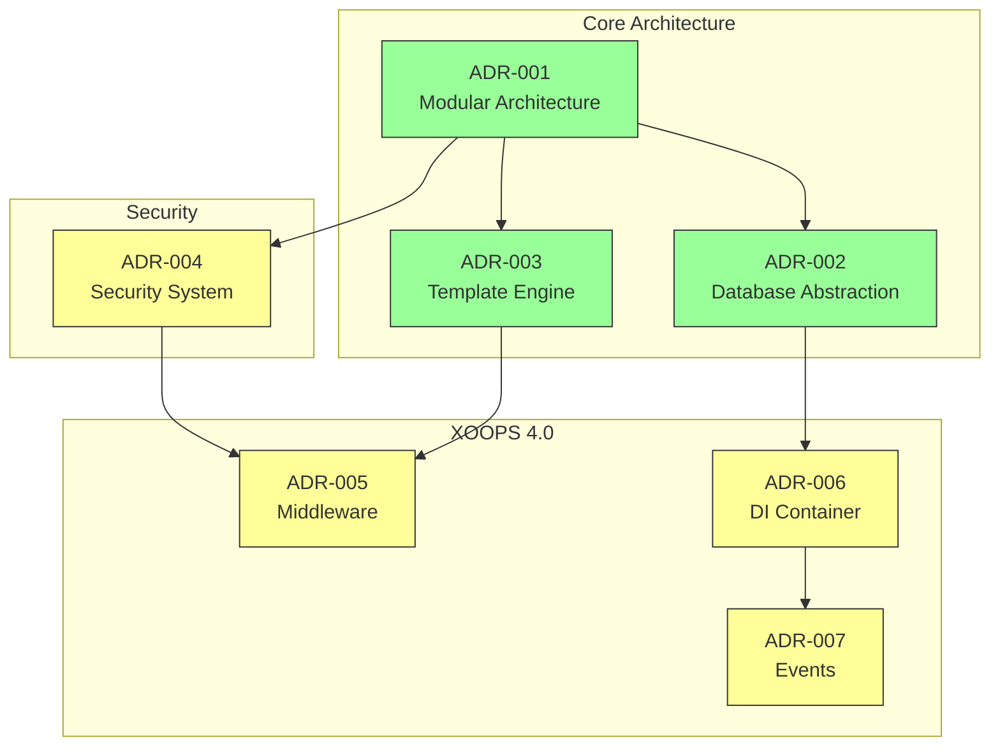
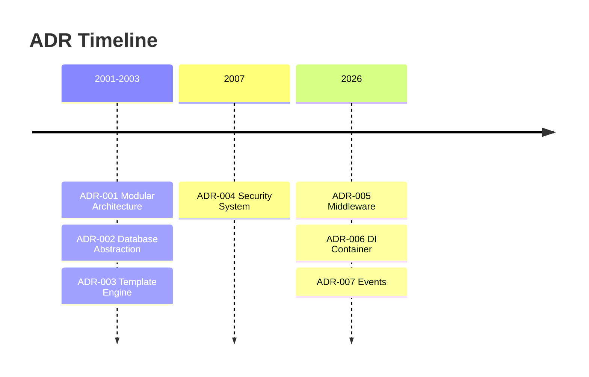

# Architektur Decision Records Index

> Umfassender Index architektonischer Entscheidungen, die XOOPS CMS geprägt haben.

---

## Was sind ADRs?

Architecture Decision Records (ADRs) dokumentieren bedeutsame architektonische Entscheidungen während der XOOPS-Entwicklung. Sie erfassen Kontext, Entscheidung und Konsequenzen jeder Wahl und bieten wertvollen historischen Kontext für Betreuer und Mitwirkende.

---

## ADR Status-Legend

| Status | Meaning |
|--------|---------|
| **Proposed** | Unter Diskussion, noch nicht akzeptiert |
| **Accepted** | Entscheidung wurde angenommen |
| **Deprecated** | Nicht mehr empfohlen |
| **Superseded** | Ersetzt durch ein anderes ADR |

---

## Aktuelle ADRs

### Grundlegende Entscheidungen

| ADR | Title | Status | Impact |
|-----|-------|--------|--------|
| ADR-001 | Modular Architecture | Accepted | Core |
| ADR-002 | Object-Oriented Database Access | Accepted | Core |
| ADR-003 | Smarty Template Engine | Accepted | Core |

### Geplante ADRs (XOOPS 4.0)

| ADR | Title | Status | Impact |
|-----|-------|--------|--------|
| ADR-004 | Security System Design | Proposed | Security |
| ADR-005 | PSR-15 Middleware | Proposed | Architecture |
| ADR-006 | Dependency Injection Container | Proposed | Architecture |
| ADR-007 | Event System Redesign | Proposed | Architecture |

---

## ADR-Beziehungen



---

## Timeline



---

## Erstellen neuer ADRs

Beim Vorschlag einer neuen architektonischen Entscheidung:

1. Kopieren Sie die ADR-Vorlage
2. Füllen Sie alle Abschnitte aus
3. Reichen Sie als Pull Request ein
4. Diskutieren Sie in GitHub Issues
5. Aktualisieren Sie Status nach Entscheidung

### ADR-Template-Struktur

```markdown
# ADR-XXX: Title

## Status
Proposed | Accepted | Deprecated | Superseded

## Context
What is the issue motivating this decision?

## Decision
What is the change that we're proposing?

## Consequences
What becomes easier or harder as a result?

## Alternatives Considered
What other options were evaluated?
```

---

## Verwandte Dokumentation

- Core Concepts
- Contributing Guidelines
- XOOPS 4.0 Roadmap

---

#xoops #adr #architecture #index #decisions
