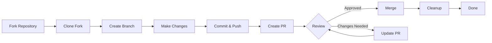

> Dieser Leitfaden führt dich durch den gesamten Prozess eines Beitrags zu XOOPS, von der initialen Einrichtung bis zum zusammengeführten Pull Request.

---

## Voraussetzungen

Bevor du mit dem Beitragen anfängst, stelle sicher, dass du folgendes hast:

- **Git** installiert und konfiguriert
- **GitHub Account** (kostenlos)
- **PHP 7.4+** für XOOPS Entwicklung
- **Composer** für Dependency Management
- Grundkenntnisse von Git Workflows
- Vertrautheit mit Code of Conduct

---

## Schritt 1: Repository forken

### Auf GitHub Web Interface

1. Navigiere zum Repository (z.B. `XOOPS/XoopsCore27`)
2. Klicke den **Fork** Button in der oberen rechten Ecke
3. Wähle wo zu forken (dein persönliches Konto)
4. Warte auf Fork Abschluss

### Warum Forken?

- Du bekommst deine eigene Kopie zum Arbeiten
- Verwalter brauchen nicht viele Branches zu verwalten
- Du hast vollständige Kontrolle über deinen Fork
- Pull Requests referenzieren deinen Fork und das upstream Repo

---

## Schritt 2: Deinen Fork lokal klonen

```bash
# Clone your fork (replace YOUR_USERNAME)
git clone https://github.com/YOUR_USERNAME/XoopsCore27.git
cd XoopsCore27

# Add upstream remote to track original repository
git remote add upstream https://github.com/XOOPS/XoopsCore27.git

# Verify remotes are set correctly
git remote -v
# origin    https://github.com/YOUR_USERNAME/XoopsCore27.git (fetch)
# origin    https://github.com/YOUR_USERNAME/XoopsCore27.git (push)
# upstream  https://github.com/XOOPS/XoopsCore27.git (fetch)
# upstream  https://github.com/XOOPS/XoopsCore27.git (nofetch)
```

---

## Schritt 3: Entwicklungsumgebung einrichten

### Dependencies installieren

```bash
# Install Composer dependencies
composer install

# Install development dependencies
composer install --dev

# For module development
cd modules/mymodule
composer install
```

### Git konfigurieren

```bash
# Set your Git identity
git config user.name "Your Name"
git config user.email "your.email@example.com"

# Optional: Set global Git config
git config --global user.name "Your Name"
git config --global user.email "your.email@example.com"
```

### Tests ausführen

```bash
# Make sure tests pass in clean state
./vendor/bin/phpunit

# Run specific test suite
./vendor/bin/phpunit --testsuite unit
```

---

## Schritt 4: Feature Branch erstellen

### Branch Benennungskonvention

Folge diesem Muster: `<type>/<description>`

**Types:**
- `feature/` - Neue Funktion
- `fix/` - Fehlerbehebung
- `docs/` - Nur Dokumentation
- `refactor/` - Code Umstrukturierung
- `test/` - Test Additions
- `chore/` - Wartung, Tooling

**Beispiele:**
```bash
# Feature branch
git checkout -b feature/add-two-factor-auth

# Bug fix branch
git checkout -b fix/prevent-xss-in-forms

# Documentation branch
git checkout -b docs/update-api-guide

# Always branch from upstream/main (or develop)
git checkout -b feature/my-feature upstream/main
```

### Branch aktualisiert halten

```bash
# Before you start work, sync with upstream
git fetch upstream
git merge upstream/main

# Later, if upstream has changed
git fetch upstream
git rebase upstream/main
```

---

## Schritt 5: Deine Änderungen vornehmen

### Entwicklungs-Praktiken

1. **Schreibe Code** nach PHP Standards
2. **Schreibe Tests** für neue Funktionalität
3. **Aktualisiere Dokumentation** falls nötig
4. **Führe Linter aus** und Code Formatter

### Code Quality Checks

```bash
# Run all tests
./vendor/bin/phpunit

# Run with coverage
./vendor/bin/phpunit --coverage-html coverage/

# Run PHP CS Fixer
./vendor/bin/php-cs-fixer fix --dry-run

# Run PHPStan static analysis
./vendor/bin/phpstan analyse class/ src/
```

### Gute Änderungen committen

```bash
# Check what you changed
git status
git diff

# Stage specific files
git add class/MyClass.php
git add tests/MyClassTest.php

# Or stage all changes
git add .

# Commit with descriptive message
git commit -m "feat(auth): add two-factor authentication support"
```

---

## Schritt 6: Branch in Sync halten

Während du an deiner Funktion arbeitest, kann der Main Branch voranschreiten:

```bash
# Fetch latest changes from upstream
git fetch upstream

# Option A: Rebase (preferred for clean history)
git rebase upstream/main

# Option B: Merge (simpler but adds merge commits)
git merge upstream/main

# If conflicts occur, resolve them then:
git add .
git rebase --continue  # or git merge --continue
```

---

## Schritt 7: Zu deinem Fork pushen

```bash
# Push your branch to your fork
git push origin feature/my-feature

# On subsequent pushes
git push

# If you rebased, you might need force push (use carefully!)
git push --force-with-lease origin feature/my-feature
```

---

## Schritt 8: Pull Request erstellen

### Auf GitHub Web Interface

1. Gehe zu deinem Fork auf GitHub
2. Du wirst eine Benachrichtigung sehen, einen PR von deinem Branch zu erstellen
3. Klicke **"Compare & pull request"**
4. Oder klicke manuell **"New pull request"** und wähle deinen Branch

### PR Titel und Beschreibung

**Titel Format:**
```
<type>(<scope>): <subject>
```

Beispiele:
```
feat(auth): add two-factor authentication
fix(forms): prevent XSS in text input
docs: update installation guide
refactor(core): improve performance
```

**Beschreibungs-Vorlage:**

```markdown
## Beschreibung
Kurze Erklärung, was dieser PR tut.

## Änderungen
- Änderte X von A zu B
- Fügte Funktion Y hinzu
- Behob Fehler Z

## Änderungstyp
- [ ] Neue Funktion (fügt Funktionalität hinzu)
- [ ] Fehlerbehebung (behebt ein Thema)
- [ ] Breaking Change (API/Verhaltens Änderung)
- [ ] Dokumentation Update

## Testen
- [ ] Tests für neue Funktionalität hinzugefügt
- [ ] Alle bestehenden Tests bestehen
- [ ] Manuelles Testen durchgeführt

## Screenshots (falls zutreffend)
Schließe Before/After Screenshots für UI Änderungen ein.

## Verwandte Probleme
Closes #123
Related to #456

## Checkliste
- [ ] Code folgt Style-Richtlinien
- [ ] Selbst-Review durchgeführt
- [ ] Komplexen Code kommentiert
- [ ] Dokumentation aktualisiert
- [ ] Keine neuen Warnings generiert
- [ ] Tests bestehen lokal
```

### PR Review Checkliste

Vor dem Einreichen, stelle sicher:

- [ ] Code folgt PHP Standards
- [ ] Tests sind enthalten und bestehen
- [ ] Dokumentation aktualisiert (falls nötig)
- [ ] Keine Merge Konflikte
- [ ] Commit Messages sind klar
- [ ] Verwandte Probleme sind referenziert
- [ ] PR Beschreibung ist detailliert
- [ ] Keine Debug Code oder Console Logs

---

## Schritt 9: Auf Feedback reagieren

### Während Code Review

1. **Lies Kommentare sorgfältig** - Verstehe das Feedback
2. **Stelle Fragen** - Wenn unklar, frag um Klarstellung
3. **Diskutiere Alternativen** - Respektvoll debattiere Ansätze
4. **Mache angeforderte Änderungen** - Aktualisiere deinen Branch
5. **Force-push aktualisierte Commits** - Falls History umgeschrieben wird

```bash
# Make changes
git add .
git commit --amend  # Modify last commit
git push --force-with-lease origin feature/my-feature

# Or add new commits
git commit -m "Address feedback on PR review"
git push origin feature/my-feature
```

### Erwarte Iteration

- Die meisten PRs erfordern mehrere Review Runden
- Sei geduldig und konstruktiv
- Sehe Feedback als Lernmöglichkeit
- Verwalter könnten Umstrukturierungen vorschlagen

---

## Schritt 10: Merge und Aufräumen

### Nach Genehmigung

Sobald Verwalter genehmigen und mergen:

1. **GitHub auto-merges** oder Verwalter klickt Merge
2. **Dein Branch wird gelöscht** (normalerweise automatisch)
3. **Änderungen sind im Upstream**

### Lokales Aufräumen

```bash
# Switch to main branch
git checkout main

# Update main with merged changes
git fetch upstream
git merge upstream/main

# Delete local feature branch
git branch -d feature/my-feature

# Delete from your fork (if not auto-deleted)
git push origin --delete feature/my-feature
```

---

## Workflow Diagramm



---

## Häufige Szenarien

### Vor dem Start synchronisieren

```bash
# Always start fresh
git fetch upstream
git checkout -b feature/new-thing upstream/main
```

### Mehr Commits hinzufügen

```bash
# Just push again
git add .
git commit -m "feat: additional changes"
git push origin feature/new-thing
```

### Fehler beheben

```bash
# Last commit has wrong message
git commit --amend -m "Correct message"
git push --force-with-lease

# Revert to previous state (careful!)
git reset --soft HEAD~1  # Keep changes
git reset --hard HEAD~1  # Discard changes
```

### Merge Konflikte handhaben

```bash
# Rebase and resolve conflicts
git fetch upstream
git rebase upstream/main

# Edit conflicted files to resolve
# Then continue
git add .
git rebase --continue
git push --force-with-lease
```

---

## Best Practices

### Zu tun

- Branches auf einzelne Themen fokussieren
- Kleine, logische Commits machen
- Aussagekräftige Commit Messages schreiben
- Deinen Branch häufig aktualisieren
- Vor dem Push testen
- Änderungen dokumentieren
- Schnell auf Feedback reagieren

### Nicht tun

- Direkt auf Main/Master Branch arbeiten
- Unverwandte Änderungen in einem PR mischen
- Generierte Dateien oder node_modules committen
- Force Push nach PR öffentlich (--force-with-lease verwenden)
- Code Review Feedback ignorieren
- Riesige PRs erstellen (in kleinere aufteilen)
- Sensitive Daten committen (API Keys, Passwords)

---

## Tipps für Erfolg

### Kommuniziere

- Stelle Fragen in Problemen, bevor du arbeitest
- Frag um Anleitung bei komplexen Änderungen
- Diskutiere Ansatz in PR Beschreibung
- Reagiere schnell auf Feedback

### Folge Standards

- Überprüfe PHP Standards
- Überprüfe Issue Reporting Richtlinien
- Lies Contributing Overview
- Folge Pull Request Guidelines

### Lerne das Codebase

- Lese bestehenden Code
- Studiere ähnliche Implementierungen
- Verstehe die Architektur
- Überprüfe Core Concepts

---

## Verwandte Dokumentation

- Code of Conduct
- Pull Request Guidelines
- Issue Reporting
- PHP Coding Standards
- Contributing Overview

---

#xoops #git #github #contributing #workflow #pull-request
