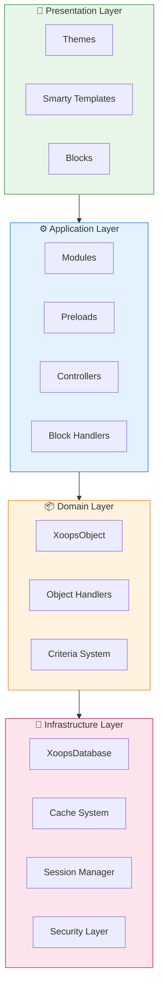
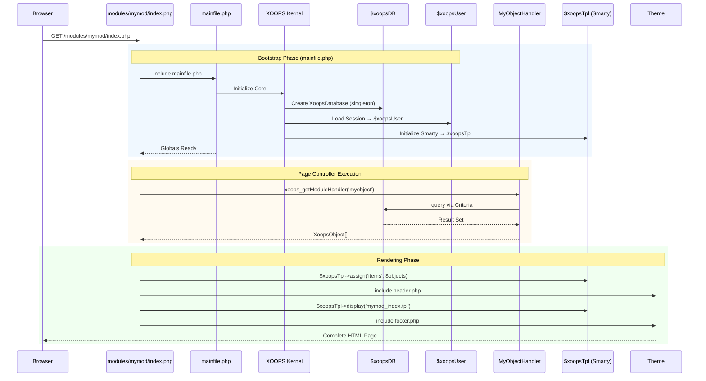

:::note[Über dieses Dokument]
Diese Seite beschreibt die **konzeptionelle Architektur** von XOOPS, die für die aktuelle Version (2.5.x) und zukünftige Version (4.0.x) relevant ist. Einige Diagramme zeigen die schichtweise Designvision.

**Für versionsspezifische Details:**
- **XOOPS 2.5.x Heute:** Nutzt `mainfile.php`, Globals (`$xoopsDB`, `$xoopsUser`), Preloads und Handler-Pattern
- **XOOPS 4.0 Ziel:** PSR-15 Middleware, DI Container, Router - siehe [Roadmap](../../07-XOOPS-4.0/XOOPS-4.0-Roadmap.md)
:::

Dieses Dokument bietet einen umfassenden Überblick über die XOOPS-Systemarchitektur und erläutert, wie die verschiedenen Komponenten zusammenarbeiten, um ein flexibles und erweiterbares Content-Management-System zu schaffen.

## Übersicht

XOOPS folgt einer modularen Architektur, die Funktionen in verschiedene Schichten unterteilt. Das System basiert auf mehreren Kernprinzipien:

- **Modularität**: Funktionalität ist in unabhängige, installierbare Module organisiert
- **Erweiterbarkeit**: Das System kann ohne Änderung von Core-Code erweitert werden
- **Abstraktion**: Datenbank- und Präsentationsschichten sind von der Geschäftslogik abstrahiert
- **Sicherheit**: Integrierte Sicherheitsmechanismen schützen vor häufigen Schwachstellen

## Systemschichten



### 1. Präsentationsschicht

Die Präsentationsschicht behandelt die Benutzeroberflächen-Darstellung unter Verwendung der Smarty-Template-Engine.

**Schlüsselkomponenten:**
- **Themes**: Visuelles Styling und Layout
- **Smarty Templates**: Dynamische Content-Rendering
- **Blocks**: Wiederverwendbare Content-Widgets

### 2. Anwendungsschicht

Die Anwendungsschicht enthält Geschäftslogik, Controller und Modulfunktionalität.

**Schlüsselkomponenten:**
- **Module**: In sich geschlossene Funktionalitätspakete
- **Handler**: Datenmanipulationsklassen
- **Preloads**: Event-Listener und Hooks

### 3. Domain-Schicht

Die Domain-Schicht enthält Kerngeschäftsobjekte und -regeln.

**Schlüsselkomponenten:**
- **XoopsObject**: Basisklasse für alle Domain-Objekte
- **Handler**: CRUD-Operationen für Domain-Objekte

### 4. Infrastruktur-Schicht

Die Infrastruktur-Schicht stellt Kerndienste wie Datenbankzugriff und Caching bereit.

## Request-Lebenszyklus

Das Verständnis des Request-Lebenszyklus ist entscheidend für effektive XOOPS-Entwicklung.

### XOOPS 2.5.x Page Controller Flow

Das aktuelle XOOPS 2.5.x nutzt ein **Page Controller** Pattern, wobei jede PHP-Datei ihren eigenen Request verarbeitet. Globals (`$xoopsDB`, `$xoopsUser`, `$xoopsTpl` usw.) werden während des Bootstrap initialisiert und sind während der gesamten Ausführung verfügbar.



### Wichtige Globals in 2.5.x

| Global | Typ | Initialisiert | Zweck |
|--------|------|-------------|---------|
| `$xoopsDB` | `XoopsDatabase` | Bootstrap | Datenbankverbindung (Singleton) |
| `$xoopsUser` | `XoopsUser\|null` | Session-Laden | Aktuell angemeldeter Benutzer |
| `$xoopsTpl` | `XoopsTpl` | Template-Init | Smarty-Template-Engine |
| `$xoopsModule` | `XoopsModule` | Module-Laden | Aktueller Modulkontext |
| `$xoopsConfig` | `array` | Config-Laden | Systemkonfiguration |

:::note[XOOPS 4.0 Vergleich]
In XOOPS 4.0 wird das Page Controller Pattern durch eine **PSR-15 Middleware Pipeline** und Router-basierte Verteilung ersetzt. Globals werden durch Dependency Injection ersetzt. Siehe [Hybrid Mode Contract](../../07-XOOPS-4.0/Specifications/Hybrid-Mode-Contract.md) für Kompatibilitätsgarantien während der Migration.
:::

### 1. Bootstrap-Phase

```php
// mainfile.php ist der Einstiegspunkt
include_once XOOPS_ROOT_PATH . '/mainfile.php';

// Kern-Initialisierung
$xoops = Xoops::getInstance();
$xoops->boot();
```

**Schritte:**
1. Konfiguration laden (`mainfile.php`)
2. Autoloader initialisieren
3. Error Handling einrichten
4. Datenbankverbindung etablieren
5. Benutzersession laden
6. Smarty-Template-Engine initialisieren

### 2. Routing-Phase

```php
// Request-Routing zu entsprechendem Modul
$module = $GLOBALS['xoopsModule'];
$controller = $module->getController();
$controller->dispatch($request);
```

**Schritte:**
1. Request-URL analysieren
2. Zielmodul identifizieren
3. Modulkonfiguration laden
4. Berechtigungen prüfen
5. Zu entsprechendem Handler routen

### 3. Ausführungsphase

```php
// Controller-Ausführung
$data = $handler->getObjects($criteria);
$xoopsTpl->assign('items', $data);
```

**Schritte:**
1. Controller-Logik ausführen
2. Mit Datenschicht interagieren
3. Geschäftsregeln verarbeiten
4. View-Daten vorbereiten

### 4. Rendering-Phase

```php
// Template-Rendering
include XOOPS_ROOT_PATH . '/header.php';
$xoopsTpl->display('db:module_template.tpl');
include XOOPS_ROOT_PATH . '/footer.php';
```

**Schritte:**
1. Theme-Layout anwenden
2. Modul-Template rendern
3. Blocks verarbeiten
4. Response ausgeben

## Kernkomponenten

### XoopsObject

Die Basisklasse für alle Datenobjekte in XOOPS.

```php
<?php
class MyModuleItem extends XoopsObject
{
    public function __construct()
    {
        $this->initVar('id', XOBJ_DTYPE_INT, null, false);
        $this->initVar('title', XOBJ_DTYPE_TXTBOX, '', true, 255);
        $this->initVar('content', XOBJ_DTYPE_TXTAREA, '', false);
        $this->initVar('created', XOBJ_DTYPE_INT, time(), false);
    }
}
```

**Wichtige Methoden:**
- `initVar()` - Objekteigenschaften definieren
- `getVar()` - Eigenschaftswerte abrufen
- `setVar()` - Eigenschaftswerte setzen
- `assignVars()` - Massenweise aus Array zuweisen

### XoopsPersistableObjectHandler

Verwaltet CRUD-Operationen für XoopsObject-Instanzen.

```php
<?php
class MyModuleItemHandler extends XoopsPersistableObjectHandler
{
    public function __construct(\XoopsDatabase $db)
    {
        parent::__construct($db, 'mymodule_items', 'MyModuleItem', 'id', 'title');
    }

    public function getActiveItems($limit = 10)
    {
        $criteria = new CriteriaCompo();
        $criteria->add(new Criteria('status', 1));
        $criteria->setSort('created');
        $criteria->setOrder('DESC');
        $criteria->setLimit($limit);

        return $this->getObjects($criteria);
    }
}
```

**Wichtige Methoden:**
- `create()` - Neue Objektinstanz erstellen
- `get()` - Objekt nach ID abrufen
- `insert()` - Objekt in Datenbank speichern
- `delete()` - Objekt aus Datenbank entfernen
- `getObjects()` - Mehrere Objekte abrufen
- `getCount()` - Passendes Objekt zählen

### Modul-Struktur

Jedes XOOPS-Modul folgt einer Standard-Verzeichnisstruktur:

```
modules/mymodule/
├── class/                  # PHP-Klassen
│   ├── MyModuleItem.php
│   └── MyModuleItemHandler.php
├── include/                # Include-Dateien
│   ├── common.php
│   └── functions.php
├── templates/              # Smarty-Templates
│   ├── mymodule_index.tpl
│   └── mymodule_item.tpl
├── admin/                  # Admin-Bereich
│   ├── index.php
│   └── menu.php
├── language/               # Übersetzungen
│   └── english/
│       ├── main.php
│       └── modinfo.php
├── sql/                    # Datenbankschema
│   └── mysql.sql
├── xoops_version.php       # Modul-Info
├── index.php               # Modul-Einstieg
└── header.php              # Modul-Header
```

## Dependency Injection Container

Moderne XOOPS-Entwicklung kann Dependency Injection für bessere Testbarkeit nutzen.

### Basis Container Implementation

```php
<?php
class XoopsDependencyContainer
{
    private array $services = [];

    public function register(string $name, callable $factory): void
    {
        $this->services[$name] = $factory;
    }

    public function resolve(string $name): mixed
    {
        if (!isset($this->services[$name])) {
            throw new \InvalidArgumentException("Service not found: $name");
        }

        $factory = $this->services[$name];

        if (is_callable($factory)) {
            return $factory($this);
        }

        return $factory;
    }

    public function has(string $name): bool
    {
        return isset($this->services[$name]);
    }
}
```

### PSR-11 kompatibler Container

```php
<?php
namespace Xmf\Di;

use Psr\Container\ContainerInterface;

class BasicContainer implements ContainerInterface
{
    protected array $definitions = [];

    public function set(string $id, mixed $value): void
    {
        $this->definitions[$id] = $value;
    }

    public function get(string $id): mixed
    {
        if (!$this->has($id)) {
            throw new \InvalidArgumentException("Service not found: $id");
        }

        $entry = $this->definitions[$id];

        if (is_callable($entry)) {
            return $entry($this);
        }

        return $entry;
    }

    public function has(string $id): bool
    {
        return isset($this->definitions[$id]);
    }
}
```

### Verwendungsbeispiel

```php
<?php
// Service-Registrierung
$container = new XoopsDependencyContainer();

$container->register('database', function () {
    return XoopsDatabaseFactory::getDatabaseConnection();
});

$container->register('userHandler', function ($c) {
    return new XoopsUserHandler($c->resolve('database'));
});

// Service-Auflösung
$userHandler = $container->resolve('userHandler');
$user = $userHandler->get($userId);
```

## Erweiterungspunkte

XOOPS bietet mehrere Erweiterungsmechanismen:

### 1. Preloads

Preloads ermöglichen es Modulen, sich in Core-Events einzuklinken.

```php
<?php
// modules/mymodule/preloads/core.php
class MymoduleCorePreload extends XoopsPreloadItem
{
    public static function eventCoreHeaderEnd($args)
    {
        // Ausführen, wenn die Header-Verarbeitung endet
    }

    public static function eventCoreFooterStart($args)
    {
        // Ausführen, wenn die Footer-Verarbeitung startet
    }
}
```

### 2. Plugins

Plugins erweitern spezifische Funktionalität innerhalb von Modulen.

```php
<?php
// modules/mymodule/plugins/notify.php
class MymoduleNotifyPlugin
{
    public function onItemCreate($item)
    {
        // Benachrichtigung senden, wenn Item erstellt wird
    }
}
```

### 3. Filter

Filter ändern Daten, während sie das System durchlaufen.

```php
<?php
// Content-Filter-Beispiel
$myts = MyTextSanitizer::getInstance();
$content = $myts->displayTarea($rawContent, 1, 1, 1);
```

## Best Practices

### Code-Organisation

1. **Verwenden Sie Namespaces** für neue Code:
   ```php
   namespace XoopsModules\MyModule;

   class Item extends \XoopsObject
   {
       // Implementierung
   }
   ```

2. **Folgen Sie PSR-4 Autoloading**:
   ```json
   {
       "autoload": {
           "psr-4": {
               "XoopsModules\\MyModule\\": "class/"
           }
       }
   }
   ```

3. **Trennen Sie Belange**:
   - Domain-Logik in `class/`
   - Präsentation in `templates/`
   - Controller im Modul-Root

### Performance

1. **Verwenden Sie Caching** für teure Operationen
2. **Lazy Load** Ressourcen wenn möglich
3. **Minimieren Sie Datenbankabfragen** durch Criteria-Batching
4. **Optimieren Sie Templates** durch Vermeidung komplexer Logik

### Sicherheit

1. **Validieren Sie alle Eingaben** mit `Xmf\Request`
2. **Escapen Sie Ausgabe** in Templates
3. **Verwenden Sie Prepared Statements** für Datenbankabfragen
4. **Prüfen Sie Berechtigungen** vor sensiblen Operationen

## Verwandte Dokumentation

- [Design-Patterns](Design-Patterns.md) - Design Patterns in XOOPS
- [Database Layer](../Database/Database-Layer.md) - Datenbankabstraktions-Details
- [Smarty Basics](../Templates/Smarty-Basics.md) - Template-System-Dokumentation
- [Security Best Practices](../Security/Security-Best-Practices.md) - Sicherheitsrichtlinien

---

#xoops #architecture #core #design #system-design
