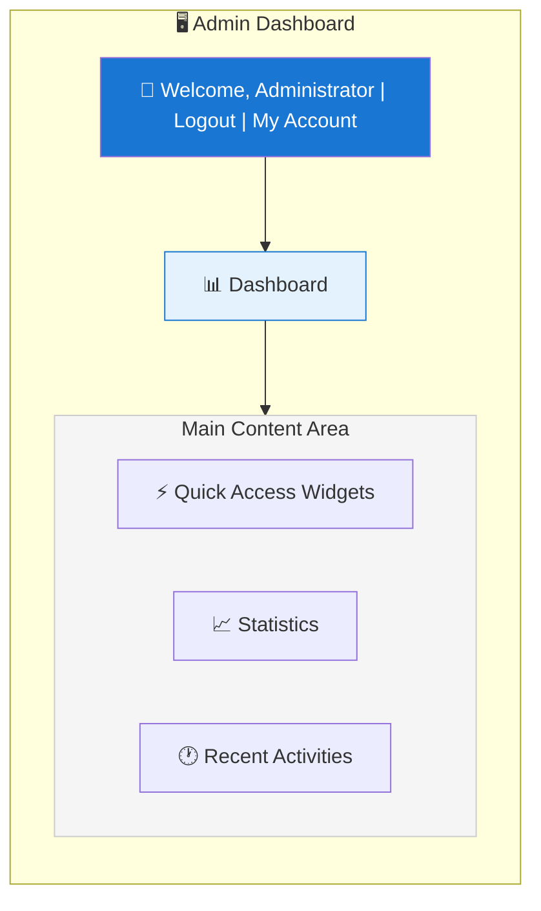
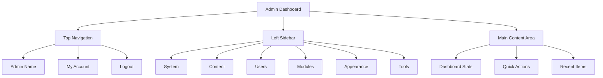

# XOOPS Admin-Panel Übersicht

Vollständiger Leitfaden zur Navigation und Verwendung des XOOPS-Administratordashboards.

## Zugriff auf das Admin-Panel

### Admin-Anmeldung

Öffnen Sie Ihren Browser und navigieren Sie zu:

```
http://your-domain.com/xoops/admin/
```

Oder wenn XOOPS im Root-Verzeichnis ist:

```
http://your-domain.com/admin/
```

Geben Sie Ihre Administrator-Anmeldedaten ein:

```
Username: [Your admin username]
Password: [Your admin password]
```

### Nach der Anmeldung

Sie sehen das Hauptadministrator-Dashboard:



## Admin-Panel Layout



## Dashboard-Komponenten

### Oberste Leiste

Die obere Leiste enthält wichtige Steuerelemente:

| Element | Zweck |
|---|---|
| **Admin-Logo** | Klicken Sie hier, um zum Dashboard zurückzukehren |
| **Willkommensnachricht** | Zeigt den Namen des angemeldeten Administrators |
| **Mein Konto** | Admin-Profil und Passwort bearbeiten |
| **Hilfe** | Zugriff auf Dokumentation |
| **Abmelden** | Vom Admin-Panel abmelden |

### Linke Navigationsleiste

Hauptmenü nach Funktion organisiert:

```
├── System
│   ├── Dashboard
│   ├── Preferences
│   ├── Admin Users
│   ├── Groups
│   ├── Permissions
│   ├── Modules
│   └── Tools
├── Content
│   ├── Pages
│   ├── Categories
│   ├── Comments
│   └── Media Manager
├── Users
│   ├── Users
│   ├── User Requests
│   ├── Online Users
│   └── User Groups
├── Modules
│   ├── Modules
│   ├── Module Settings
│   └── Module Updates
├── Appearance
│   ├── Themes
│   ├── Templates
│   ├── Blocks
│   └── Images
└── Tools
    ├── Maintenance
    ├── Email
    ├── Statistics
    ├── Logs
    └── Backups
```

### Hauptinhaltsbereich

Zeigt Informationen und Steuerelemente für den ausgewählten Abschnitt an:

- Formulare zur Konfiguration
- Datentabellen mit Listen
- Diagramme und Statistiken
- Schnellaktionstaster
- Hilfetexte und Tooltips

### Dashboard-Widgets

Schnellzugriff auf wichtige Informationen:

- **Systeminformationen:** PHP-Version, MySQL-Version, XOOPS-Version
- **Schnellstatistiken:** Benutzeranzahl, Gesamtbeiträge, installierte Module
- **Letzte Aktivität:** Letzte Anmeldungen, Inhaltsänderungen, Fehler
- **Serverstatus:** CPU, Speicher, Festplattennutzung
- **Benachrichtigungen:** Systemwarnungen, ausstehende Updates

## Grundlegende Admin-Funktionen

### Systemverwaltung

**Ort:** System > [Verschiedene Optionen]

#### Einstellungen

Konfigurieren Sie grundlegende Systemeinstellungen:

```
System > Preferences > [Settings Category]
```

Kategorien:
- Allgemeine Einstellungen (Seitenname, Zeitzone)
- Benutzereinstellungen (Registrierung, Profile)
- E-Mail-Einstellungen (SMTP-Konfiguration)
- Cache-Einstellungen (Caching-Optionen)
- URL-Einstellungen (benutzerfreundliche URLs)
- Meta-Tags (SEO-Einstellungen)

Siehe Grundkonfiguration und Systemeinstellungen.

#### Admin-Benutzer

Verwalten Sie Administrator-Konten:

```
System > Admin Users
```

Funktionen:
- Neue Administratoren hinzufügen
- Admin-Profile bearbeiten
- Admin-Passwörter ändern
- Admin-Konten löschen
- Admin-Berechtigungen festlegen

### Inhaltsverwaltung

**Ort:** Content > [Verschiedene Optionen]

#### Seiten/Artikel

Verwalten Sie Website-Inhalte:

```
Content > Pages (or your module)
```

Funktionen:
- Neue Seiten erstellen
- Vorhandene Inhalte bearbeiten
- Seiten löschen
- Veröffentlichen/Veröffentlichung aufheben
- Kategorien festlegen
- Versionen verwalten

#### Kategorien

Organisieren Sie Inhalte:

```
Content > Categories
```

Funktionen:
- Kategoriehierarchie erstellen
- Kategorien bearbeiten
- Kategorien löschen
- Seiten zuweisen

#### Kommentare

Moderieren Sie Benutzerkommentare:

```
Content > Comments
```

Funktionen:
- Alle Kommentare anzeigen
- Kommentare genehmigen
- Kommentare bearbeiten
- Spam löschen
- Kommentatoren blockieren

### Benutzerverwaltung

**Ort:** Users > [Verschiedene Optionen]

#### Benutzer

Verwalten Sie Benutzerkonten:

```
Users > Users
```

Funktionen:
- Alle Benutzer anzeigen
- Neue Benutzer erstellen
- Benutzerprofile bearbeiten
- Konten löschen
- Passwörter zurücksetzen
- Benutzerstatus ändern
- Zu Gruppen zuweisen

#### Online-Benutzer

Überwachen Sie aktive Benutzer:

```
Users > Online Users
```

Zeigt:
- Aktuell online Benutzer
- Letzte Aktivitätszeit
- IP-Adresse
- Benutzerstandort (falls konfiguriert)

#### Benutzergruppen

Verwalten Sie Benutzerrollen und Berechtigungen:

```
Users > Groups
```

Funktionen:
- Benutzerdefinierte Gruppen erstellen
- Gruppenberechtigung festlegen
- Benutzer zu Gruppen zuweisen
- Gruppen löschen

### Modulverwaltung

**Ort:** Modules > [Verschiedene Optionen]

#### Module

Installieren und konfigurieren Sie Module:

```
Modules > Modules
```

Funktionen:
- Installierte Module anzeigen
- Module aktivieren/deaktivieren
- Module aktualisieren
- Moduleinstellungen konfigurieren
- Neue Module installieren
- Moduldetails anzeigen

#### Nach Updates suchen

```
Modules > Modules > Check for Updates
```

Anzeigt:
- Verfügbare Modul-Updates
- Änderungsprotokoll
- Download- und Installationsoptionen

### Verwaltung des Erscheinungsbildes

**Ort:** Appearance > [Verschiedene Optionen]

#### Designs

Verwalten Sie Website-Designs:

```
Appearance > Themes
```

Funktionen:
- Installierte Designs anzeigen
- Standarddesign festlegen
- Neue Designs hochladen
- Designs löschen
- Design-Vorschau
- Design-Konfiguration

#### Blöcke

Verwalten Sie Inhaltsblöcke:

```
Appearance > Blocks
```

Funktionen:
- Benutzerdefinierte Blöcke erstellen
- Blockinhalt bearbeiten
- Blöcke auf der Seite anordnen
- Blocksichtbarkeit festlegen
- Blöcke löschen
- Block-Caching konfigurieren

#### Vorlagen

Verwalten Sie Vorlagen (fortgeschritten):

```
Appearance > Templates
```

Für fortgeschrittene Benutzer und Entwickler.

### System-Tools

**Ort:** System > Tools

#### Wartungsmodus

Verhindern Sie den Benutzerzugriff während der Wartung:

```
System > Maintenance Mode
```

Konfigurieren Sie:
- Aktivieren/Deaktivieren der Wartung
- Benutzerdefinierte Wartungsmeldung
- Zulässige IP-Adressen (zum Testen)

#### Datenbankverwaltung

```
System > Database
```

Funktionen:
- Datenbankkonsistenz überprüfen
- Datenbankaktualisierungen ausführen
- Tabellen reparieren
- Datenbank optimieren
- Datenbankstruktur exportieren

#### Aktivitätsprotokolle

```
System > Logs
```

Überwachen Sie:
- Benutzeraktivität
- Verwaltungsmaßnahmen
- Systemereignisse
- Fehlerprotokolle

## Schnellaktionen

Häufig verwendete Aufgaben, auf die vom Dashboard aus zugegriffen werden kann:

```
Quick Links:
├── Create New Page
├── Add New User
├── Create Content Block
├── Upload Image
├── Send Mass Email
├── Update All Modules
└── Clear Cache
```

## Admin-Panel-Tastenkombinationen

Schnelle Navigation:

| Tastenkombination | Aktion |
|---|---|
| `Ctrl+H` | Zu Hilfe gehen |
| `Ctrl+D` | Zum Dashboard gehen |
| `Ctrl+Q` | Schnellsuche |
| `Ctrl+L` | Abmelden |

## Benutzerkontoverwaltung

### Mein Konto

Greifen Sie auf Ihr Administrator-Profil zu:

1. Klicken Sie oben rechts auf „Mein Konto"
2. Bearbeiten Sie Profilinformationen:
   - E-Mail-Adresse
   - Echter Name
   - Benutzerinformationen
   - Avatar

### Passwort ändern

Ändern Sie Ihr Admin-Passwort:

1. Gehen Sie zu **Mein Konto**
2. Klicken Sie auf „Passwort ändern"
3. Aktuelles Passwort eingeben
4. Neues Passwort zweimal eingeben
5. Klicken Sie auf „Speichern"

**Sicherheitstipps:**
- Verwenden Sie sichere Passwörter (16+ Zeichen)
- Großbuchstaben, Kleinbuchstaben, Zahlen, Symbole einschließen
- Passwort alle 90 Tage ändern
- Admin-Anmeldedaten niemals weitergeben

### Abmelden

Melden Sie sich vom Admin-Panel ab:

1. Klicken Sie oben rechts auf „Abmelden"
2. Sie werden auf die Anmeldeseite weitergeleitet

## Admin-Panel-Statistiken

### Dashboard-Statistiken

Schnelle Übersicht über Website-Metriken:

| Messwert | Wert |
|--------|-------|
| Benutzer Online | 12 |
| Gesamtbenutzer | 256 |
| Gesamtbeiträge | 1.234 |
| Gesamtkommentare | 5.678 |
| Gesamtmodule | 8 |

### Systemstatus

Server- und Leistungsinformationen:

| Komponente | Version/Wert |
|-----------|---------------|
| XOOPS-Version | 2.5.11 |
| PHP-Version | 8.2.x |
| MySQL-Version | 8.0.x |
| Serverbelastung | 0,45, 0,42 |
| Betriebszeit | 45 Tage |

### Letzte Aktivität

Zeitleiste der letzten Ereignisse:

```
12:45 - Admin login
12:30 - New user registered
12:15 - Page published
12:00 - Comment posted
11:45 - Module updated
```

## Benachrichtigungssystem

### Admin-Warnungen

Erhalten Sie Benachrichtigungen für:

- Neue Benutzerregistrierungen
- Kommentare, die auf Genehmigung warten
- Fehlgeschlagene Anmeldeversuche
- Systemfehler
- Verfügbare Modulaktualisierungen
- Datenbankprobleme
- Festplattenspeicherwarnungen

Konfigurieren Sie Warnungen:

**System > Preferences > Email Settings**

```
Notify Admin on Registration: Yes
Notify Admin on Comments: Yes
Notify Admin on Errors: Yes
Alert Email: admin@your-domain.com
```

## Häufig verwendete Admin-Aufgaben

### Eine neue Seite erstellen

1. Gehen Sie zu **Content > Pages** (oder relevantes Modul)
2. Klicken Sie auf „Neue Seite hinzufügen"
3. Füllen Sie aus:
   - Titel
   - Inhalt
   - Beschreibung
   - Kategorie
   - Metadaten
4. Klicken Sie auf „Veröffentlichen"

### Benutzer verwalten

1. Gehen Sie zu **Users > Users**
2. Benutzerliste anzeigen mit:
   - Benutzername
   - E-Mail
   - Registrierungsdatum
   - Letzte Anmeldung
   - Status

3. Klicken Sie auf den Benutzernamen, um:
   - Profil bearbeiten
   - Passwort ändern
   - Gruppen bearbeiten
   - Benutzer blockieren/entsperren

### Modul konfigurieren

1. Gehen Sie zu **Modules > Modules**
2. Suchen Sie das Modul in der Liste
3. Klicken Sie auf den Modulnamen
4. Klicken Sie auf „Preferences" oder „Settings"
5. Konfigurieren Sie Moduloptionen
6. Speichern Sie Änderungen

### Einen neuen Block erstellen

1. Gehen Sie zu **Appearance > Blocks**
2. Klicken Sie auf „Neuen Block hinzufügen"
3. Geben Sie ein:
   - Blocktitel
   - Blockinhalt (HTML erlaubt)
   - Position auf der Seite
   - Sichtbarkeit (alle Seiten oder spezifisch)
   - Modul (falls zutreffend)
4. Klicken Sie auf „Absenden"

## Admin-Panel-Hilfe

### Integrierte Dokumentation

Greifen Sie aus dem Admin-Panel auf Hilfe zu:

1. Klicken Sie auf die Schaltfläche „Hilfe" in der oberen Leiste
2. Kontextsensitive Hilfe für die aktuelle Seite
3. Links zur Dokumentation
4. Häufig gestellte Fragen

### Externe Ressourcen

- XOOPS Official Site: https://xoops.org/
- Community Forum: https://xoops.org/modules/newbb/
- Module Repository: https://xoops.org/modules/repository/
- Bugs/Issues: https://github.com/XOOPS/XoopsCore/issues

## Admin-Panel anpassen

### Admin-Design

Wählen Sie das Design der Admin-Oberfläche:

**System > Preferences > General Settings**

```
Admin Theme: [Select theme]
```

Verfügbare Designs:
- Standard (hell)
- Dunkler Modus
- Benutzerdefinierte Designs

### Dashboard-Anpassung

Wählen Sie, welche Widgets angezeigt werden sollen:

**Dashboard > Customize**

Wählen Sie:
- Systeminformationen
- Statistiken
- Letzte Aktivität
- Schnelllinks
- Benutzerdefinierte Widgets

## Admin-Panel-Berechtigungen

Verschiedene Admin-Ebenen haben unterschiedliche Berechtigungen:

| Rolle | Fähigkeiten |
|---|---|
| **Webmaster** | Vollständiger Zugriff auf alle Admin-Funktionen |
| **Admin** | Begrenzte Admin-Funktionen |
| **Moderator** | Nur Inhaltsmoderation |
| **Editor** | Inhaltserstellung und -bearbeitung |

Verwalten Sie Berechtigungen:

**System > Permissions**

## Sicherheit Best Practices für Admin-Panel

1. **Starkes Passwort:** Verwenden Sie ein 16+ Zeichen langes Passwort
2. **Regelmäßige Änderungen:** Passwort alle 90 Tage ändern
3. **Zugriff überwachen:** Überprüfen Sie regelmäßig die Protokolle „Admin Users"
4. **Zugriff begrenzen:** Benennen Sie den Admin-Ordner zur zusätzlichen Sicherheit um
5. **HTTPS verwenden:** Greifen Sie immer über HTTPS auf Admin zu
6. **IP-Whitelist:** Beschränken Sie den Admin-Zugriff auf bestimmte IPs
7. **Regelmäßig abmelden:** Melden Sie sich ab, wenn Sie fertig sind
8. **Browsersicherheit:** Leeren Sie den Browser-Cache regelmäßig

Siehe Sicherheitskonfiguration.

## Fehlerbehebung beim Admin-Panel

### Kann nicht auf Admin-Panel zugreifen

**Lösung:**
1. Überprüfen Sie die Anmeldedaten
2. Leeren Sie den Browser-Cache und Cookies
3. Versuchen Sie einen anderen Browser
4. Überprüfen Sie, ob der Admin-Ordner-Pfad korrekt ist
5. Überprüfen Sie die Dateiberechtigungen im Admin-Ordner
6. Überprüfen Sie die Datenbankverbindung in mainfile.php

### Leere Admin-Seite

**Lösung:**
```bash
# Check PHP errors
tail -f /var/log/apache2/error.log

# Enable debug mode temporarily
sed -i "s/define('XOOPS_DEBUG', 0)/define('XOOPS_DEBUG', 1)/" /var/www/html/xoops/mainfile.php

# Check file permissions
ls -la /var/www/html/xoops/admin/
```

### Langsames Admin-Panel

**Lösung:**
1. Cache löschen: **System > Tools > Clear Cache**
2. Datenbank optimieren: **System > Database > Optimize**
3. Serverressourcen überprüfen: `htop`
4. Langsame Abfragen in MySQL überprüfen

### Modul wird nicht angezeigt

**Lösung:**
1. Verifies Modul installiert: **Modules > Modules**
2. Überprüfen Sie, ob das Modul aktiviert ist
3. Berechtigungen zugewiesen überprüfen
4. Überprüfen Sie, ob Moduldateien vorhanden sind
5. Fehlerprotokolle überprüfen

## Nächste Schritte

Nach dem Vertrautmachen mit dem Admin-Panel:

1. Erstellen Sie Ihre erste Seite
2. Richten Sie Benutzergruppen ein
3. Installieren Sie zusätzliche Module
4. Konfigurieren Sie grundlegende Einstellungen
5. Implementieren Sie Sicherheit

---

**Tags:** #admin-panel #dashboard #navigation #getting-started

**Related Articles:**
- ../Configuration/Basic-Configuration
- ../Configuration/System-Settings
- Creating-Your-First-Page
- Managing-Users
- Installing-Modules
