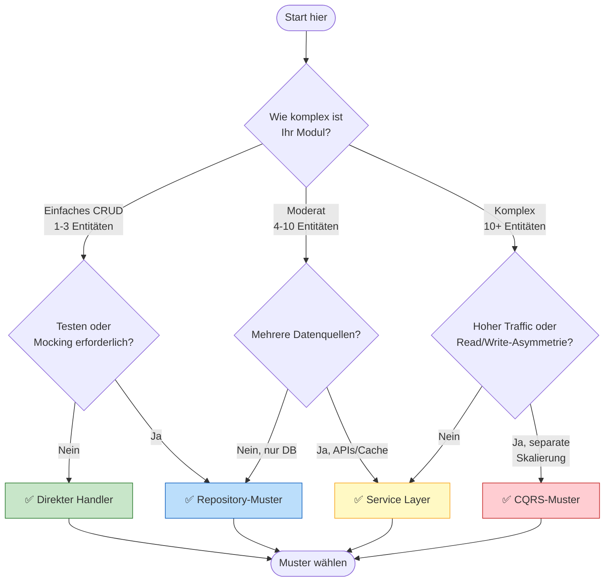
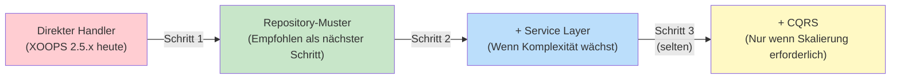

<span class="version-badge version-25x">2.5.x ✅</span> <span class="version-badge version-40x">4.0.x ✅</span>

> **Welches Muster sollte ich verwenden?** Dieser Entscheidungsbaum hilft Ihnen, zwischen direkten Handlerin, Repository-Muster, Service Layer und CQRS zu wählen.

---

## Schneller Entscheidungsbaum



---

## Vergleich der Muster

| Kriterium | Direkter Handler | Repository | Service Layer | CQRS |
|----------|---------------|------------|---------------|------|
| **Komplexität** | ⭐ | ⭐⭐ | ⭐⭐⭐ | ⭐⭐⭐⭐⭐ |
| **Testbarkeit** | ❌ Schwierig | ✅ Gut | ✅ Hervorragend | ✅ Hervorragend |
| **Flexibilität** | ❌ Niedrig | ✅ Mittel | ✅ Hoch | ✅ Sehr hoch |
| **XOOPS 2.5.x** | ✅ Nativ | ✅ Funktioniert | ✅ Funktioniert | ⚠️ Komplex |
| **XOOPS 4.0** | ⚠️ Veraltet | ✅ Empfohlen | ✅ Empfohlen | ✅ Für Skalierung |
| **Team-Größe** | 1 Dev | 1-3 Devs | 2-5 Devs | 5+ Devs |
| **Wartung** | ❌ Höher | ✅ Moderat | ✅ Niedriger | ⚠️ Expertise erforderlich |

---

## Wann Sie jedes Muster verwenden

### ✅ Direkter Handler (`XoopsPersistableObjectHandler`)

**Beste für:** Einfache Module, schnelle Prototypen, XOOPS-Lernen

```php
// Einfach und direkt - gut für kleine Module
$handler = xoops_getModuleHandler('article', 'news');
$articles = $handler->getObjects(new Criteria('status', 1));
```

**Wählen Sie dies, wenn:**
- Sie ein einfaches Modul mit 1-3 Datenbanktabellen erstellen
- Sie einen schnellen Prototyp erstellen
- Sie der einzige Entwickler sind und keine Tests benötigen
- Das Modul wird nicht bedeutend wachsen

**Einschränkungen:**
- Schwer zu Unit-Test (globale Abhängigkeit)
- Enge Kopplung an XOOPS-Datenbankschicht
- Geschäftslogik neigt dazu, in Controller zu fließen

---

### ✅ Repository-Muster

**Beste für:** Die meisten Module, Teams, die Testbarkeit wünschen

```php
// Abstraktion ermöglicht Mocking für Tests
interface ArticleRepositoryInterface {
    public function findPublished(): array;
    public function save(Article $article): void;
}

class XoopsArticleRepository implements ArticleRepositoryInterface {
    private $handler;

    public function __construct() {
        $this->handler = xoops_getModuleHandler('article', 'news');
    }

    public function findPublished(): array {
        return $this->handler->getObjects(new Criteria('status', 1));
    }
}
```

**Wählen Sie dies, wenn:**
- Sie Unit-Tests schreiben möchten
- Sie möglicherweise später Datenquellen ändern (DB → API)
- Mit 2+ Entwicklern arbeiten
- Module für Verteilung erstellen

**Upgrade-Pfad:** Dies ist das empfohlene Muster für die XOOPS 4.0-Vorbereitung.

---

### ✅ Service Layer

**Beste für:** Module mit komplexer Geschäftslogik

```php
// Service koordiniert mehrere Repositories und enthält Geschäftsregeln
class ArticlePublicationService {
    public function __construct(
        private ArticleRepositoryInterface $articles,
        private NotificationServiceInterface $notifications,
        private CacheInterface $cache
    ) {}

    public function publish(int $articleId): void {
        $article = $this->articles->find($articleId);
        $article->setStatus('published');
        $article->setPublishedAt(new DateTime());

        $this->articles->save($article);
        $this->notifications->notifySubscribers($article);
        $this->cache->invalidate("article:{$articleId}");
    }
}
```

**Wählen Sie dies, wenn:**
- Operationen mehrere Datenquellen umfassen
- Geschäftsregeln komplex sind
- Sie Transaktionsverwaltung benötigen
- Mehrere Teile der App tun dasselbe

**Upgrade-Pfad:** Mit Repository für eine robuste Architektur kombinieren.

---

### ⚠️ CQRS (Command Query Responsibility Segregation)

**Beste für:** Module mit hohem Skalierungsbedarf und Read/Write-Asymmetrie

```php
// Commands ändern Zustand
class PublishArticleCommand {
    public function __construct(
        public readonly int $articleId,
        public readonly int $publisherId
    ) {}
}

// Queries lesen Zustand (können denormalisierte Read-Modelle verwenden)
class GetPublishedArticlesQuery {
    public function __construct(
        public readonly int $limit = 10
    ) {}
}
```

**Wählen Sie dies, wenn:**
- Lesevorgänge überwiegen Schreibvorgänge deutlich (100:1 oder mehr)
- Sie unterschiedliche Skalierung für Lesevorgänge vs. Schreibvorgänge benötigen
- Komplexe Berichts-/Analyseanforderungen
- Event Sourcing würde Ihrer Domäne zugute kommen

**Warnung:** CQRS fügt erhebliche Komplexität hinzu. Die meisten XOOPS-Module benötigen dies nicht.

---

## Empfohlener Upgrade-Pfad



### Schritt 1: Handler in Repositories wrappen (2-4 Stunden)

1. Erstellen Sie ein Interface für Ihre Datenzugriffsanforderungen
2. Implementieren Sie es unter Verwendung des vorhandenen Handlers
3. Injizieren Sie das Repository statt `xoops_getModuleHandler()` direkt zu aufrufen

### Schritt 2: Service Layer hinzufügen, wenn nötig (1-2 Tage)

1. Wenn Geschäftslogik in Controllern auftritt, extrahieren Sie sie in einen Service
2. Service verwendet Repositories, nicht Handler direkt
3. Controller werden dünn (Route → Service → Response)

### Schritt 3: Erwägen Sie CQRS nur, wenn (selten)

1. Sie haben Millionen von Lesevorgängen pro Tag
2. Read- und Write-Modelle unterscheiden sich erheblich
3. Sie benötigen Event Sourcing für Audit-Trails
4. Sie haben ein Team mit CQRS-Erfahrung

---

## Schnellreferenzkarte

| Frage | Antwort |
|----------|--------|
| **"Ich muss nur Daten speichern/laden"** | Direkter Handler |
| **"Ich möchte Tests schreiben"** | Repository-Muster |
| **"Ich habe komplexe Geschäftsregeln"** | Service Layer |
| **"Ich muss Lesevorgänge separat skalieren"** | CQRS |
| **"Ich bereite mich auf XOOPS 4.0 vor"** | Repository + Service Layer |

---

## Verwandte Dokumentation

- [Repository-Muster-Leitfaden](Patterns/Repository-Pattern.md)
- [Service Layer-Muster-Leitfaden](Patterns/Service-Layer-Pattern.md)
- [CQRS-Muster-Leitfaden](../07-XOOPS-4.0/Implementation-Guides/CQRS-Pattern-Guide.md) *(fortgeschritten)*
- [Hybrid Mode Contract](../07-XOOPS-4.0/Specifications/Hybrid-Mode-Contract.md)

---

#patterns #data-access #decision-tree #best-practices #xoops
