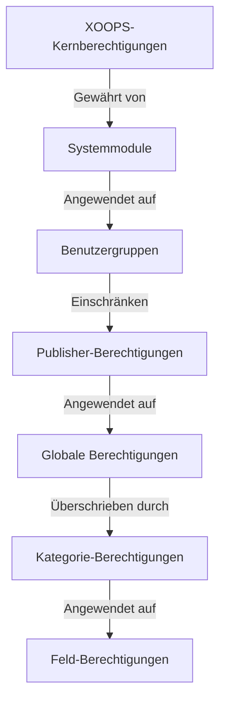

# Publisher Berechtigungseinrichtung

> Vollständige Anleitung zum Konfigurieren von Gruppenberechtigungen, Zugriffskontrolle und Verwaltung des Benutzerzugriffs im Publisher.

---

## Grundlagen der Berechtigungen

### Was sind Berechtigungen?

Berechtigungen steuern, was verschiedene Benutzergruppen im Publisher tun können:

```
Wer kann:
  - Artikel anzeigen
  - Artikel einreichen
  - Artikel bearbeiten
  - Artikel genehmigen
  - Kategorien verwalten
  - Einstellungen konfigurieren
```

### Berechtigungsstufen

```
Anonym
  └── Nur veröffentlichte Artikel anzeigen

Registrierte Benutzer
  ├── Artikel anzeigen
  ├── Artikel einreichen (ausstehende Genehmigung)
  └── Eigene Artikel bearbeiten

Redakteure/Moderatoren
  ├── Alle Berechtigungen für registrierte Benutzer
  ├── Artikel genehmigen
  ├── Alle Artikel bearbeiten
  └── Einige Kategorien verwalten

Administratoren
  └── Vollständiger Zugriff auf alles
```

---

## Verwaltung von Zugriffsgenehmigungen

### Navigation zu Berechtigungen

```
Admin-Panel
└── Module
    └── Publisher
        ├── Berechtigungen
        ├── Kategorie-Berechtigungen
        └── Gruppenverwaltung
```

### Schnellzugriff

1. Melden Sie sich als **Administrator** an
2. Gehen Sie zu **Admin → Module**
3. Klicken Sie auf **Publisher → Admin**
4. Klicken Sie auf **Berechtigungen** im linken Menü

---

## Globale Berechtigungen

### Berechtigungen auf Modulebene

Steuern Sie den Zugriff auf das Publisher-Modul und dessen Funktionen:

```
Ansicht der Berechtigungskonfiguration:
┌─────────────────────────────────────┐
│ Berechtigung           │ Anon │ Reg │ Redakteur │ Admin │
├────────────────────────┼──────┼─────┼────────┼───────┤
│ Artikel anzeigen       │  ✓   │  ✓  │   ✓    │  ✓   │
│ Artikel einreichen     │  ✗   │  ✓  │   ✓    │  ✓   │
│ Eigene Artikel bearb.  │  ✗   │  ✓  │   ✓    │  ✓   │
│ Alle Artikel bearb.    │  ✗   │  ✗  │   ✓    │  ✓   │
│ Artikel genehmigen     │  ✗   │  ✗  │   ✓    │  ✓   │
│ Kategorien verwalten   │  ✗   │  ✗  │   ✗    │  ✓   │
│ Admin-Panel-Zugriff    │  ✗   │  ✗  │   ✓    │  ✓   │
└─────────────────────────────────────┘
```

### Beschreibungen von Berechtigungen

| Berechtigung | Benutzer | Effekt |
|------------|-------|--------|
| **Artikel anzeigen** | Alle Gruppen | Kann veröffentlichte Artikel im Frontend sehen |
| **Artikel einreichen** | Registriert+ | Kann neue Artikel erstellen (ausstehende Genehmigung) |
| **Eigene Artikel bearbeiten** | Registriert+ | Kann ihre eigenen Artikel bearbeiten/löschen |
| **Alle Artikel bearbeiten** | Redakteure+ | Kann Artikel eines beliebigen Benutzers bearbeiten |
| **Eigene Artikel löschen** | Registriert+ | Kann ihre eigenen unveröffentlichten Artikel löschen |
| **Alle Artikel löschen** | Redakteure+ | Kann jeden Artikel löschen |
| **Artikel genehmigen** | Redakteure+ | Kann ausstehende Artikel veröffentlichen |
| **Kategorien verwalten** | Admins | Kategorien erstellen, bearbeiten, löschen |
| **Admin-Zugriff** | Redakteure+ | Zugriff auf Admin-Schnittstelle |

---

## Globale Berechtigungen konfigurieren

### Schritt 1: Auf Berechtigungseinstellungen zugreifen

1. Gehen Sie zu **Admin → Module**
2. Suchen Sie **Publisher**
3. Klicken Sie auf **Berechtigungen** (oder Admin-Link und dann Berechtigungen)
4. Sie sehen die Berechtigungsmatrix

### Schritt 2: Gruppenberechtigungen festlegen

Konfigurieren Sie für jede Gruppe, was sie tun kann:

#### Anonyme Benutzer

```yaml
Berechtigungen der anonymen Gruppe:
  Artikel anzeigen: ✓ JA
  Artikel einreichen: ✗ NEIN
  Artikel bearbeiten: ✗ NEIN
  Artikel löschen: ✗ NEIN
  Artikel genehmigen: ✗ NEIN
  Kategorien verwalten: ✗ NEIN
  Admin-Zugriff: ✗ NEIN

Ergebnis: Anonyme Benutzer können nur veröffentlichte Inhalte anzeigen
```

#### Registrierte Benutzer

```yaml
Berechtigungen der registrierten Gruppe:
  Artikel anzeigen: ✓ JA
  Artikel einreichen: ✓ JA (Genehmigung erforderlich)
  Eigene Artikel bearbeiten: ✓ JA
  Alle Artikel bearbeiten: ✗ NEIN
  Eigene Artikel löschen: ✓ JA (nur Entwürfe)
  Alle Artikel löschen: ✗ NEIN
  Artikel genehmigen: ✗ NEIN
  Kategorien verwalten: ✗ NEIN
  Admin-Zugriff: ✗ NEIN

Ergebnis: Registrierte Benutzer können nach Genehmigung Inhalte beitragen
```

#### Redakteure-Gruppe

```yaml
Berechtigungen der Redakteurs-Gruppe:
  Artikel anzeigen: ✓ JA
  Artikel einreichen: ✓ JA
  Eigene Artikel bearbeiten: ✓ JA
  Alle Artikel bearbeiten: ✓ JA
  Eigene Artikel löschen: ✓ JA
  Alle Artikel löschen: ✓ JA
  Artikel genehmigen: ✓ JA
  Kategorien verwalten: ✓ BEGRENZT
  Admin-Zugriff: ✓ JA
  Einstellungen konfigurieren: ✗ NEIN

Ergebnis: Redakteure verwalten Inhalte, aber nicht Einstellungen
```

#### Administratoren

```yaml
Berechtigungen der Admin-Gruppe:
  ✓ VOLLSTÄNDIGER ZUGRIFF auf alle Funktionen

  - Alle Berechtigungen des Redakteurs
  - Verwalte alle Kategorien
  - Konfiguriere alle Einstellungen
  - Verwalte Berechtigungen
  - Installieren/Deinstallieren
```

### Schritt 3: Berechtigungen speichern

1. Konfigurieren Sie die Berechtigungen für jede Gruppe
2. Aktivieren Sie Kontrollkästchen für zulässige Aktionen
3. Deaktivieren Sie Kontrollkästchen für abgelehnte Aktionen
4. Klicken Sie auf **Berechtigungen speichern**
5. Eine Bestätigungsmeldung wird angezeigt

---

## Berechtigungen auf Kategorieebene

### Kategorienzugriff festlegen

Steuern Sie, wer bestimmte Kategorien anzeigen/darauf einreichen kann:

```
Admin → Publisher → Kategorien
→ Kategorie auswählen → Berechtigungen
```

### Kategorie-Berechtigungsmatrix

```
                   Anonym  Registriert  Redakteur  Admin
Kategorie anzeigen    ✓         ✓         ✓        ✓
In Kategorie einreich ✗         ✓         ✓        ✓
Eigen in Kat. bearb.  ✗         ✓         ✓        ✓
Alle in Kat. bearb.   ✗         ✗         ✓        ✓
In Kategorie genehm.  ✗         ✗         ✓        ✓
Kategorie verwalten   ✗         ✗         ✗        ✓
```

### Kategorie-Berechtigungen konfigurieren

1. Gehen Sie zu **Kategorien**-Admin
2. Finden Sie die Kategorie
3. Klicken Sie auf die Schaltfläche **Berechtigungen**
4. Wählen Sie für jede Gruppe:
   - [ ] Diese Kategorie anzeigen
   - [ ] Artikel einreichen
   - [ ] Eigene Artikel bearbeiten
   - [ ] Alle Artikel bearbeiten
   - [ ] Artikel genehmigen
   - [ ] Kategorie verwalten
5. Klicken Sie auf **Speichern**

### Beispiele für Kategorie-Berechtigungen

#### Öffentliche Nachrichtenkategorie

```
Anonym: Nur anzeigen
Registriert: Anzeigen + Einreichen (ausstehende Genehmigung)
Redakteure: Genehmigen + Bearbeiten
Admins: Vollständige Kontrolle
```

#### Interne Updates-Kategorie

```
Anonym: Kein Zugriff
Registriert: Nur anzeigen
Redakteure: Einreichen + Genehmigen
Admins: Vollständige Kontrolle
```

#### Gast-Blog-Kategorie

```
Anonym: Nur anzeigen
Registriert: Einreichen (ausstehende Genehmigung)
Redakteure: Genehmigen
Admins: Vollständige Kontrolle
```

---

## Berechtigungen auf Feldebene

### Sichtbarkeit von Formularfeldern steuern

Beschränken Sie, welche Formularfelder Benutzer sehen/bearbeiten können:

```
Admin → Publisher → Berechtigungen → Felder
```

### Feldoptionen

```yaml
Sichtbare Felder für registrierte Benutzer:
  ✓ Titel
  ✓ Beschreibung
  ✓ Inhalt (Körper)
  ✓ Hervorgehobenes Bild
  ✓ Kategorie
  ✓ Tags
  ✗ Autor (automatisch gesetzt)
  ✗ Veröffentlichungsdatum (nur Redakteure)
  ✗ Geplantes Datum (nur Redakteure)
  ✗ Hervorgehobenes Flag (nur Redakteure)
  ✗ Berechtigungen (nur Admins)
```

### Beispiele

#### Begrenzte Einreichung für Registrierte

Registrierte Benutzer sehen weniger Optionen:

```
Verfügbare Felder:
  - Titel ✓
  - Beschreibung ✓
  - Inhalt ✓
  - Hervorgehobenes Bild ✓
  - Kategorie ✓

Versteckte Felder:
  - Autor (automatisch aktueller Benutzer)
  - Veröffentlichungsdatum (Redakteure entscheiden)
  - Geplantes Datum (nur Admins)
  - Hervorgehobener Status (Redakteure wählen)
```

#### Vollständiges Formular für Redakteure

Redakteure sehen alle Optionen:

```
Verfügbare Felder:
  - Alle grundlegenden Felder
  - Alle Metadaten
  - Autor-Auswahl ✓
  - Veröffentlichungsdatum/-zeit ✓
  - Geplantes Datum ✓
  - Hervorgehobener Status ✓
  - Ablaufdatum ✓
  - Berechtigungen ✓
```

---

## Benutzergruppenkonfiguration

### Benutzerdefinierte Gruppe erstellen

1. Gehen Sie zu **Admin → Benutzer → Gruppen**
2. Klicken Sie auf **Gruppe erstellen**
3. Geben Sie Gruppendetails ein:

```
Gruppenname: "Community-Blogger"
Gruppenbeschreibung: "Benutzer, die Blog-Inhalte beitragen"
Typ: Reguläre Gruppe
```

4. Klicken Sie auf **Gruppe speichern**
5. Gehen Sie zurück zu Publisher-Berechtigungen
6. Legen Sie Berechtigungen für die neue Gruppe fest

### Gruppenbeispiele

```
Empfohlene Gruppen für Publisher:

Gruppe: Mitwirkende
  - Reguläre Mitglieder, die Artikel einreichen
  - Können eigene Artikel bearbeiten
  - Können keine Artikel genehmigen

Gruppe: Reviewer
  - Können eingereichte Artikel sehen
  - Können Artikel genehmigen/ablehnen
  - Können die Artikel anderer nicht löschen

Gruppe: Redakteure
  - Können jeden Artikel bearbeiten
  - Können Artikel genehmigen
  - Können Kommentare moderieren
  - Können einige Kategorien verwalten

Gruppe: Verleger
  - Können jeden Artikel bearbeiten
  - Können direkt veröffentlichen (keine Genehmigung)
  - Können alle Kategorien verwalten
  - Können Einstellungen konfigurieren
```

---

## Berechtigungshierarchien

### Berechtigungsfluss



### Berechtigungsvererbung

```
Basis: Globale Modulberechtigungen
  ↓
Kategorie: Überschreibungen für bestimmte Kategorien
  ↓
Feld: Weitere Einschränkung verfügbarer Felder
  ↓
Benutzer: Hat Berechtigung, wenn ALLE Ebenen erlauben
```

**Beispiel:**

```
Benutzer möchte Artikel bearbeiten:
1. Benutzergruppe muss die Berechtigung "Artikel bearbeiten" haben (global)
2. Kategorie muss Bearbeiten erlauben (Kategorieebene)
3. Feldbeschränkungen müssen erlauben (falls zutreffend)
4. Benutzer muss Autor ODER Redakteur sein (für eigene vs. alle)

Wenn eine Ebene ablehnt → Berechtigung verweigert
```

---

## Berechtigungen für Genehmigungsworkflow

### Einreichungsgenehmigung konfigurieren

Steuern Sie, ob Artikel einer Genehmigung bedürfen:

```
Admin → Publisher → Einstellungen → Workflow
```

#### Genehmigungsoptionen

```yaml
Einreichungs-Workflow:
  Genehmigung erforderlich: Ja

  Für registrierte Benutzer:
    - Neue Artikel: Entwurf (ausstehende Genehmigung)
    - Redakteure müssen genehmigen
    - Benutzer können während des Ausstands bearbeiten
    - Nach Genehmigung: Benutzer können immer noch bearbeiten

  Für Redakteure:
    - Neue Artikel: Direkt veröffentlichen (optional)
    - Genehmigungswarteschlange überspringen
    - Oder Genehmigung immer erforderlich
```

#### Pro Gruppe konfigurieren

1. Gehen Sie zu Einstellungen
2. Suchen Sie "Einreichungs-Workflow"
3. Legen Sie für jede Gruppe fest:

```
Gruppe: Registrierte Benutzer
  Genehmigung erforderlich: ✓ JA
  Standardstatus: Entwurf
  Während des Ausstands änderbar: ✓ JA

Gruppe: Redakteure
  Genehmigung erforderlich: ✗ NEIN
  Standardstatus: Veröffentlicht
  Veröffentlichtes änderbar: ✓ JA
```

4. Klicken Sie auf **Speichern**

---

## Artikel moderieren

### Ausstehende Artikel genehmigen

Für Benutzer mit der Berechtigung "Artikel genehmigen":

1. Gehen Sie zu **Admin → Publisher → Artikel**
2. Filtern Sie nach **Status**: Ausstehend
3. Klicken Sie auf den Artikel zur Überprüfung
4. Überprüfen Sie die Inhaltsqualität
5. Legen Sie **Status** fest: Veröffentlicht
6. Optional: Redaktionelle Notizen hinzufügen
7. Klicken Sie auf **Speichern**

### Artikel ablehnen

Wenn der Artikel die Standards nicht erfüllt:

1. Öffnen Sie den Artikel
2. Legen Sie **Status** fest: Entwurf
3. Fügen Sie Ablehnungsgrund hinzu (in Kommentar oder E-Mail)
4. Klicken Sie auf **Speichern**
5. Senden Sie eine Nachricht an den Autor mit einer Erklärung der Ablehnung

### Kommentare moderieren

Wenn Sie Kommentare moderieren:

1. Gehen Sie zu **Admin → Publisher → Kommentare**
2. Filtern Sie nach **Status**: Ausstehend
3. Überprüfen Sie den Kommentar
4. Optionen:
   - Genehmigen: Klicken Sie auf **Genehmigen**
   - Ablehnen: Klicken Sie auf **Löschen**
   - Bearbeiten: Klicken Sie auf **Bearbeiten**, korrigieren, speichern
5. Klicken Sie auf **Speichern**

---

## Benutzerzugriff verwalten

### Benutzergruppen anzeigen

Sehen Sie, welche Benutzer zu Gruppen gehören:

```
Admin → Benutzer → Benutzergruppen

Für jeden Benutzer:
  - Primäre Gruppe (eine)
  - Sekundäre Gruppen (mehrere)

Berechtigungen gelten für alle Gruppen (Vereinigung)
```

### Benutzer zu Gruppe hinzufügen

1. Gehen Sie zu **Admin → Benutzer**
2. Suchen Sie den Benutzer
3. Klicken Sie auf **Bearbeiten**
4. Unter **Gruppen** aktivieren Sie hinzuzufügende Gruppen
5. Klicken Sie auf **Speichern**

### Benutzerberechtigungen ändern

Für einzelne Benutzer (falls unterstützt):

1. Gehen Sie zu Benutzer-Admin
2. Suchen Sie den Benutzer
3. Klicken Sie auf **Bearbeiten**
4. Suchen Sie nach Überschreibung einzelner Berechtigungen
5. Konfigurieren Sie nach Bedarf
6. Klicken Sie auf **Speichern**

---

## Allgemeine Berechtigungsszenarien

### Szenario 1: Offener Blog

Ermöglichen Sie jedem, einzureichen:

```
Anonym: Anzeigen
Registriert: Einreichen, eigene bearbeiten, eigene löschen
Redakteure: Genehmigen, alle bearbeiten, alle löschen
Admins: Vollständige Kontrolle

Ergebnis: Offener Community-Blog
```

### Szenario 2: Moderierte Nachrichtenseite

Strikter Genehmigungsprozess:

```
Anonym: Nur anzeigen
Registriert: Kann nicht einreichen
Redakteure: Einreichen, andere genehmigen
Admins: Vollständige Kontrolle

Ergebnis: Nur genehmigte Fachleute veröffentlichen
```

### Szenario 3: Mitarbeiter-Blog

Mitarbeiter können beitragen:

```
Gruppe erstellen: "Mitarbeiter"
Anonym: Anzeigen
Registriert: Nur anzeigen (Nicht-Mitarbeiter)
Mitarbeiter: Einreichen, eigene bearbeiten, direkt veröffentlichen
Admins: Vollständige Kontrolle

Ergebnis: Von Mitarbeitern verfasster Blog
```

### Szenario 4: Multi-Kategorie mit verschiedenen Redakteuren

Verschiedene Redakteure für verschiedene Kategorien:

```
Nachrichtenkategorie:
  Redakteurs-Gruppe A: Vollständige Kontrolle

Bewertungskategorie:
  Redakteurs-Gruppe B: Vollständige Kontrolle

Tutorials-Kategorie:
  Redakteurs-Gruppe C: Vollständige Kontrolle

Ergebnis: Dezentralisierte redaktionelle Kontrolle
```

---

## Berechtigungstests

### Überprüfen Sie, ob Berechtigungen funktionieren

1. Erstellen Sie einen Testbenutzer in jeder Gruppe
2. Melden Sie sich als jeden Testbenutzer an
3. Versuchen Sie:
   - Artikel anzeigen
   - Artikel einreichen (sollte Entwurf erstellen, falls zulässig)
   - Artikel bearbeiten (eigene und andere)
   - Artikel löschen
   - Auf Admin-Panel zugreifen
   - Auf Kategorien zugreifen

4. Überprüfen Sie, ob die Ergebnisse den erwarteten Berechtigungen entsprechen

### Allgemeine Testfälle

```
Testfall 1: Anonymer Benutzer
  [ ] Kann veröffentlichte Artikel anzeigen: ✓
  [ ] Kann keine Artikel einreichen: ✓
  [ ] Kann nicht auf Admin zugreifen: ✓

Testfall 2: Registrierter Benutzer
  [ ] Kann Artikel einreichen: ✓
  [ ] Artikel werden Entwurf: ✓
  [ ] Kann eigenen Artikel bearbeiten: ✓
  [ ] Kann andere nicht bearbeiten: ✓
  [ ] Kann nicht auf Admin zugreifen: ✓

Testfall 3: Redakteur
  [ ] Kann Artikel genehmigen: ✓
  [ ] Kann jeden Artikel bearbeiten: ✓
  [ ] Kann auf Admin zugreifen: ✓
  [ ] Kann nicht alle löschen: ✓ (oder ✓ falls zulässig)

Testfall 4: Admin
  [ ] Kann alles tun: ✓
```

---

## Fehlerbehebung für Berechtigungen

### Problem: Benutzer kann keine Artikel einreichen

**Überprüfen:**
```
1. Benutzergruppe hat die Berechtigung "Artikel einreichen"
   Admin → Publisher → Berechtigungen

2. Benutzer gehört zu einer zulässigen Gruppe
   Admin → Benutzer → Benutzer bearbeiten → Gruppen

3. Kategorie erlaubt Einreichung von Benutzergruppe
   Admin → Publisher → Kategorien → Berechtigungen

4. Benutzer ist registriert (nicht anonym)
```

**Lösung:**
```bash
1. Überprüfen Sie, ob die registrierte Benutzergruppe die Einreichungsberechtigung hat
2. Benutzer zur entsprechenden Gruppe hinzufügen
3. Kategorie-Berechtigungen überprüfen
4. Benutzersession-Cache löschen
```

### Problem: Redakteur kann Artikel nicht genehmigen

**Überprüfen:**
```
1. Redakteurs-Gruppe hat die Berechtigung "Artikel genehmigen"
2. Artikel mit Status "Ausstehend" existieren
3. Redakteur ist in korrekter Gruppe
4. Kategorie erlaubt Genehmigung durch Redakteurs-Gruppe
```

**Lösung:**
```bash
1. Gehen Sie zu Berechtigungen, überprüfen Sie "Artikel genehmigen" für Redakteurs-Gruppe
2. Erstellen Sie Test-Artikel, setzen Sie auf Entwurf
3. Versuchen Sie als Redakteur genehmigt zu werden
4. Überprüfen Sie Fehlermeldungen im Systemprotokoll
```

### Problem: Kann Artikel sehen, aber kann nicht auf Kategorie zugreifen

**Überprüfen:**
```
1. Kategorie ist nicht deaktiviert/versteckt
2. Kategorie-Berechtigungen erlauben Anzeige
3. Benutzergruppe ist berechtigt, Kategorie anzuzeigen
4. Kategorie ist veröffentlicht
```

**Lösung:**
```bash
1. Gehen Sie zu Kategorien, überprüfen Sie, ob Kategoriestatus "Aktiviert" ist
2. Überprüfen Sie, ob Kategorie-Berechtigungen gesetzt sind
3. Fügen Sie Benutzergruppe zur Kategorie-Ansichtsberechtigung hinzu
```

### Problem: Berechtigungen geändert, aber nicht in Kraft getreten

**Lösung:**
```bash
1. Cache löschen: Admin → Werkzeuge → Cache leeren
2. Session löschen: Abmelden und erneut anmelden
3. Systemprotokoll auf Fehler überprüfen
4. Überprüfen Sie, ob Berechtigungen tatsächlich gespeichert sind
5. Versuchen Sie einen anderen Browser/Inkognito-Fenster
```

---

## Berechtigungs-Sicherung und Export

### Berechtigungen exportieren

Einige Systeme ermöglichen den Export:

1. Gehen Sie zu **Admin → Publisher → Werkzeuge**
2. Klicken Sie auf **Berechtigungen exportieren**
3. Speichern Sie `.xml`- oder `.json`-Datei
4. Behalten Sie als Sicherung

### Berechtigungen importieren

Aus Sicherung wiederherstellen:

1. Gehen Sie zu **Admin → Publisher → Werkzeuge**
2. Klicken Sie auf **Berechtigungen importieren**
3. Wählen Sie Sicherungsdatei
4. Überprüfen Sie Änderungen
5. Klicken Sie auf **Importieren**

---

## Best Practices

### Checkliste zur Berechtigungskonfiguration

- [ ] Entscheiden Sie sich für Benutzergruppen
- [ ] Geben Sie Gruppen klare Namen
- [ ] Legen Sie Grundberechtigungen für jede Gruppe fest
- [ ] Testen Sie jede Berechtigungsstufe
- [ ] Dokumentieren Sie die Berechtigungsstruktur
- [ ] Erstellen Sie einen Genehmigungsworkflow
- [ ] Schulen Sie Redakteure in der Moderation
- [ ] Überwachen Sie die Berechtigungsnutzung
- [ ] Überprüfen Sie Berechtigungen vierteljährlich
- [ ] Sicherungs-Berechtigungseinstellungen

### Best Practices für die Sicherheit

```
✓ Prinzip der geringsten Berechtigung
  - Gewähren Sie nur die notwendigsten Berechtigungen

✓ Rollenbasierter Zugriff
  - Verwenden Sie Gruppen für Rollen (Redakteur, Moderator, etc.)

✓ Überprüfen Sie Berechtigungen
  - Überprüfen Sie, wer welchen Zugriff hat

✓ Trennung der Aufgaben
  - Einreicher, Genehmiger, Verleger sind unterschiedlich

✓ Regelmäßige Überprüfung
  - Berechtigungen vierteljährlich überprüfen
  - Zugriff entfernen, wenn Benutzer gehen
  - Für neue Anforderungen aktualisieren
```

---

## Verwandte Leitfäden

- Artikel erstellen
- Kategorien verwalten
- Grundkonfiguration
- Installation

---

## Nächste Schritte

- Berechtigungen für Ihren Workflow einrichten
- Artikel mit den richtigen Berechtigungen erstellen
- Kategorien mit Berechtigungen konfigurieren
- Benutzer in der Artikel-Erstellung schulen

---

#publisher #berechtigungen #gruppen #zugriffskontrolle #sicherheit #moderation #xoops
