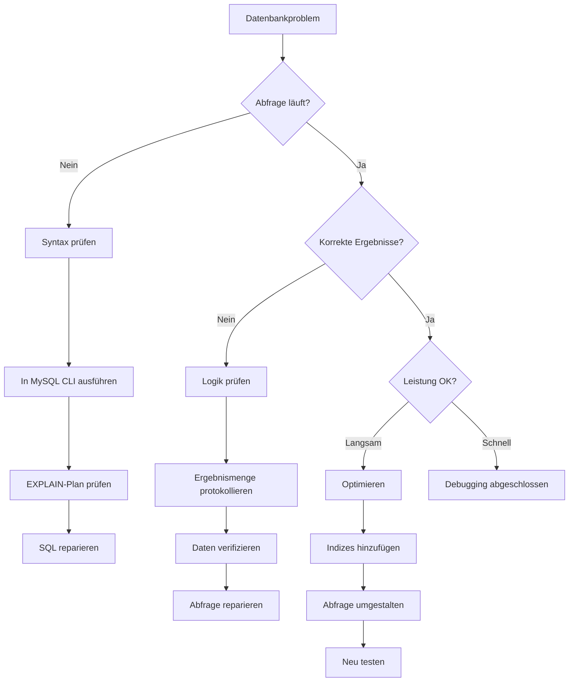
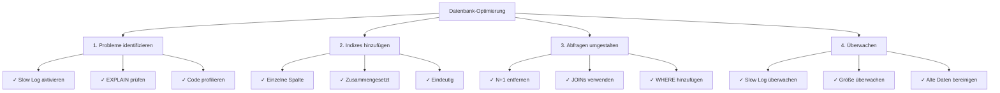

# Datenbankdebugging-Techniken

> Methoden und Werkzeuge zum Debuggen von SQL-Abfragen und Datenbankproblemen in XOOPS-Anwendungen.

---

## Diagnose-Flowchart



---

## Abfrageprotokollierung aktivieren

### Methode 1: XOOPS Debug-Modus

```php
<?php
// In mainfile.php
define('XOOPS_DEBUG_LEVEL', 2);

// Now all queries appear in xoops_log table
// Or in files: xoops_data/logs/
?>
```

Ergebnisse überprüfen:
```bash
# Protokolle anzeigen
tail -100 xoops_data/logs/*.log

# Oder Datenbank abfragen
SELECT * FROM xoops_log ORDER BY created DESC LIMIT 20;
```

---

### Methode 2: MySQL Slow Query Log

Aktivieren Sie in `/etc/mysql/my.cnf`:

```ini
[mysqld]
# Slow Query Logging aktivieren
slow_query_log = 1
slow_query_log_file = /var/log/mysql/slow.log
long_query_time = 1          # Abfragen > 1 Sekunde protokollieren
log_queries_not_using_indexes = 1
```

MySQL neu starten:
```bash
sudo systemctl restart mysql
# oder
sudo systemctl restart mariadb
```

Protokoll anzeigen:
```bash
tail -100 /var/log/mysql/slow.log

# Oder mit mysqldumpslow analysieren
mysqldumpslow -s t -t 10 /var/log/mysql/slow.log
```

---

### Methode 3: Allgemeines Abfrageprotokoll

Aktivieren Sie für alle Abfragen (Achtung: große Protokolldateien):

```sql
-- Aktivieren
SET GLOBAL general_log = 'ON';
SET GLOBAL log_output = 'FILE';
SET GLOBAL general_log_file = '/var/log/mysql/general.log';

-- Deaktivieren
SET GLOBAL general_log = 'OFF';

-- Anzeigen
SHOW VARIABLES LIKE 'general_log%';
```

---

## Debug SQL in Code

### Abfrageausführung protokollieren

```php
<?php
require_once 'mainfile.php';

$ray = ray();  // If using Ray debugger

// Execute query
$query = "SELECT u.uid, u.uname, COUNT(a.id) as total_articles
          FROM xoops_users u
          LEFT JOIN xoops_articles a ON u.uid = a.author_id
          GROUP BY u.uid
          ORDER BY total_articles DESC";

$ray->label('Query')->info($query);

$result = $GLOBALS['xoopsDB']->query($query);

if (!$result) {
    $ray->error("SQL Error: " . $GLOBALS['xoopsDB']->error);
    exit;
}

// Log results
$data = [];
while ($row = $result->fetch_assoc()) {
    $data[] = $row;
}

$ray->label('Results')->dump($data);
$ray->info("Found " . count($data) . " rows");
?>
```

---

### Abfrageleistung messen

```php
<?php
$db = $GLOBALS['xoopsDB'];
$ray = ray();

// Measure execution time
$start = microtime(true);

$query = "SELECT * FROM xoops_articles LIMIT 1000";
$result = $db->query($query);

$exec_time = (microtime(true) - $start) * 1000;  // milliseconds

$ray->info("Query executed in: {$exec_time}ms");

// Log slow queries
if ($exec_time > 100) {  // Alert if > 100ms
    $ray->warning("Slow query detected: {$exec_time}ms");
    $ray->info($query);
}
?>
```

---

### Abfrageergebnisse überprüfen

```php
<?php
$db = $GLOBALS['xoopsDB'];
$ray = ray();

$query = "SELECT * FROM xoops_articles WHERE author_id = 5";
$result = $db->query($query);

// Check if query succeeded
if (!$result) {
    $ray->error("Query failed: " . $db->error);
    exit;
}

// Get row count
$count = $result->num_rows;
$ray->info("Query returned: $count rows");

// Fetch results
$articles = [];
while ($row = $result->fetch_assoc()) {
    $articles[] = $row;
}

// Verify data
if (empty($articles)) {
    $ray->warning("No articles found for author 5");
} else {
    $ray->success("Found " . count($articles) . " articles");
    $ray->dump($articles);
}
?>
```

---

## Abfrageleistung analysieren

### EXPLAIN-Befehl

Verwenden Sie EXPLAIN zur Analyse der Abfrageausführung:

```sql
-- Analyze a query
EXPLAIN SELECT * FROM xoops_articles WHERE author_id = 5;

-- With extended information
EXPLAIN EXTENDED SELECT * FROM xoops_articles WHERE author_id = 5;

-- JSON format (shows more details)
EXPLAIN FORMAT=JSON SELECT * FROM xoops_articles WHERE author_id = 5\G
```

**Zu überprüfende Schlüsselfelder:**

```
type: ALL           (schlecht) - Vollständiger Tabellenscan
      INDEX         (ok) - Indexscan
      ref/const     (gut) - Direkte Index-Suche
      range         (ok) - Bereichsscan mit Index

possible_keys:      Verfügbare Indizes
key:                Verwendeter Index
key_len:            Länge des verwendeten Index
rows:               Geschätzte untersuchte Zeilen
Extra:              Zusätzliche Informationen (Using where, Using index, etc.)
```

### Beispielanalyse

```sql
-- Slow query without index
EXPLAIN SELECT * FROM xoops_articles WHERE author_id = 5;

+----+-------------+----------+------+---------------+------+---------+------+-------+-------------+
| id | select_type | table    | type | possible_keys | key  | key_len | rows | Extra |
+----+-------------+----------+------+---------------+------+---------+------+-------+-------------+
|  1 | SIMPLE      | articles | ALL  | NULL          | NULL | NULL    | 1000 | Using where |
+----+-------------+----------+------+---------------+------+-------+------+-------+-------------+
                                      ↑
                          Kein Index verfügbar!

-- Nach dem Hinzufügen des Index
ALTER TABLE xoops_articles ADD INDEX (author_id);

EXPLAIN SELECT * FROM xoops_articles WHERE author_id = 5;

+----+-------------+----------+------+---------------+-----------+---------+-------+------+
| id | select_type | table    | type | possible_keys | key       | key_len | rows  | Extra|
+----+-------------+----------+------+---------------+-----------+---------+-------+------+
|  1 | SIMPLE      | articles | ref  | author_id     | author_id | 4       | 10    |
+----+-------------+----------+------+---------------+-----------+---------+-------+------+
                                                              ↑
                                      Index verwenden - viel schneller!
```

---

## Häufige SQL-Probleme

### 1. N+1-Abfrage-Problem

**Problem:**
```php
<?php
// FALSCH: Mehrere Abfragen in Schleife
$authors = $db->query("SELECT uid FROM xoops_users LIMIT 100");
while ($author = $authors->fetch_assoc()) {
    // Dies wird 100 Mal ausgeführt!
    $articles = $db->query(
        "SELECT COUNT(*) FROM xoops_articles WHERE author_id = " . $author['uid']
    );
    echo $articles->fetch_row()[0];
}
?>
```

**Lösung: JOIN verwenden**
```php
<?php
// KORREKT: Eine Abfrage
$result = $db->query("
    SELECT u.uid, u.uname, COUNT(a.id) as total
    FROM xoops_users u
    LEFT JOIN xoops_articles a ON u.uid = a.author_id
    GROUP BY u.uid
    LIMIT 100
");

while ($row = $result->fetch_assoc()) {
    echo $row['total'];
}
?>
```

---

### 2. Fehlende Indizes

**Identifizieren:**
```sql
-- Abfragen finden, die alle Zeilen scannen
SELECT * FROM xoops_log
WHERE info LIKE '%type: ALL%'
ORDER BY created DESC;
```

**Indizes hinzufügen:**
```sql
-- Einzelspalten-Index
ALTER TABLE xoops_articles ADD INDEX (author_id);
ALTER TABLE xoops_articles ADD INDEX (created);

-- Composite Index
ALTER TABLE xoops_articles ADD INDEX (author_id, created);

-- Eindeutiger Index
ALTER TABLE xoops_articles ADD UNIQUE INDEX (slug);
```

---

### 3. Ineffiziente WHERE-Bedingungen

**Problem:**
```sql
-- Falsch: Funktionen verhindern Index-Nutzung
SELECT * FROM xoops_articles
WHERE YEAR(created) = 2024;

-- Falsch: OR mit verschiedenen Spalten
SELECT * FROM xoops_articles
WHERE category = 'tech' OR author_id = 5;
```

**Lösung:**
```sql
-- Korrekt: Bereich verwenden
SELECT * FROM xoops_articles
WHERE created >= '2024-01-01' AND created < '2025-01-01';

-- Korrekt: UNION für verschiedene Spalten verwenden
SELECT * FROM xoops_articles WHERE category = 'tech'
UNION
SELECT * FROM xoops_articles WHERE author_id = 5;
```

---

## Spezifische Probleme debuggen

### Problem: Abfrage gibt falsche Ergebnisse zurück

```php
<?php
$ray = ray();

// Test with sample data
$author_id = 5;
$ray->info("Searching for author_id = $author_id");

$query = "SELECT * FROM xoops_articles WHERE author_id = ?";
$stmt = $db->prepare($query);
$stmt->bind_param("i", $author_id);
$stmt->execute();

$result = $stmt->get_result();
$count = $result->num_rows;

$ray->info("Found: $count articles");

// Check if parameterized query helps
if ($count == 0) {
    // Try without parameter to debug
    $debug_query = "SELECT * FROM xoops_articles WHERE author_id = $author_id";
    $ray->warning("Debug query: $debug_query");
}

// Dump first result
if ($row = $result->fetch_assoc()) {
    $ray->label('First Result')->dump($row);
}
?>
```

---

### Problem: Langsame JOIN-Abfrage

```php
<?php
$ray = ray();

$query = "
    SELECT a.id, a.title, u.uname, u.email
    FROM xoops_articles a
    LEFT JOIN xoops_users u ON a.author_id = u.uid
    WHERE a.status = 1
    ORDER BY a.created DESC
    LIMIT 50
";

$ray->info("Running join query");
$ray->measure(function() use ($query) {
    $result = $GLOBALS['xoopsDB']->query($query);
    return $result;
});

// Analyze with EXPLAIN
$ray->label('Query Analysis')->info($query);
?>
```

Führen Sie EXPLAIN aus:
```sql
EXPLAIN SELECT a.id, a.title, u.uname, u.email
FROM xoops_articles a
LEFT JOIN xoops_users u ON a.author_id = u.uid
WHERE a.status = 1
ORDER BY a.created DESC
LIMIT 50\G

-- Suchen Sie nach:
-- - type: ALL (Index erforderlich)
-- - Extra: Using temporary; Using filesort (ineffizient)
-- Behebung: Composite Index hinzufügen
ALTER TABLE xoops_articles ADD INDEX (status, created);
```

---

## Debug Query Log erstellen

```php
<?php
// modules/yourmodule/QueryLogger.php erstellen

class QueryLogger {
    private static $queries = [];
    private static $times = [];

    public static function log($query) {
        self::$queries[] = $query;
        self::$times[] = microtime(true);
    }

    public static function execute($query) {
        $start = microtime(true);
        $result = $GLOBALS['xoopsDB']->query($query);
        $time = (microtime(true) - $start) * 1000;

        self::log($query);
        self::$times[count(self::$times) - 1] = $time;

        return $result;
    }

    public static function report() {
        echo "<h1>Abfrage-Bericht</h1>";
        echo "<table>";
        echo "<tr><th>Abfrage</th><th>Zeit (ms)</th></tr>";

        foreach (self::$queries as $i => $query) {
            $time = self::$times[$i] ?? 0;
            echo "<tr>";
            echo "<td><pre>" . htmlspecialchars(substr($query, 0, 100)) . "</pre></td>";
            echo "<td>" . number_format($time, 2) . "</td>";
            echo "</tr>";
        }

        echo "</table>";
    }

    public static function getTotalQueries() {
        return count(self::$queries);
    }

    public static function getTotalTime() {
        return array_sum(self::$times);
    }
}
?>
```

Verwendung:
```php
<?php
require_once 'QueryLogger.php';

$result = QueryLogger::execute("SELECT * FROM xoops_articles");

// Später...
echo "Gesamt Abfragen: " . QueryLogger::getTotalQueries();
echo "Gesamtzeit: " . QueryLogger::getTotalTime() . "ms";
QueryLogger::report();
?>
```

---

## Datenbank-Optimierungs-Checkliste



---

## Nützliche MySQL-Abfragen

```sql
-- Langsame Tabellen finden
SELECT * FROM xoops_log
WHERE info LIKE '%type: ALL%'
ORDER BY created DESC LIMIT 20;

-- Alle Indizes auflisten
SHOW INDEX FROM xoops_articles;

-- Doppelte Indizes finden
SELECT a.table_name, a.index_name, a.seq_in_index, a.column_name
FROM information_schema.statistics a
JOIN information_schema.statistics b
  ON a.table_name = b.table_name
  AND a.seq_in_index = b.seq_in_index
  AND a.column_name = b.column_name
  AND a.index_name != b.index_name
WHERE a.table_name LIKE 'xoops_%';

-- Tabellengrößen
SELECT table_name,
       ROUND(((data_length + index_length) / 1024 / 1024), 2) AS size_mb
FROM information_schema.tables
WHERE table_schema = 'xoops_db'
ORDER BY size_mb DESC;

-- Ungenutzte Indizes finden
SELECT * FROM performance_schema.table_io_waits_summary_by_index_usage
WHERE object_schema != 'mysql'
AND count_star = 0
ORDER BY object_name;
```

---

## Verwandte Dokumentation

- Debug-Modus aktivieren
- Ray Debugger verwenden
- Performance-FAQ
- Datenbankgrundlagen

---

#xoops #database #debugging #sql #optimization #mysql
