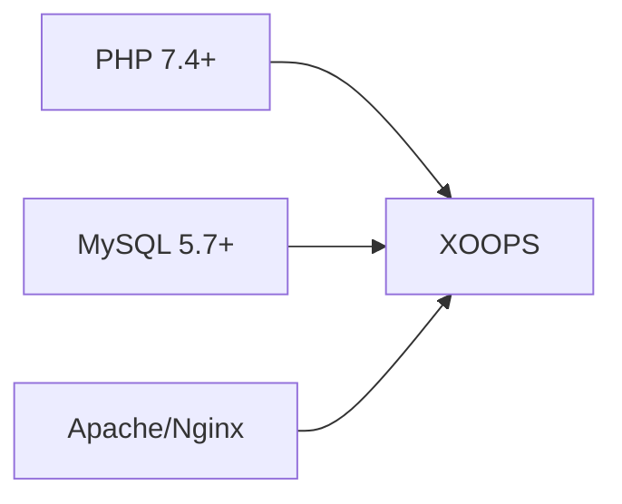
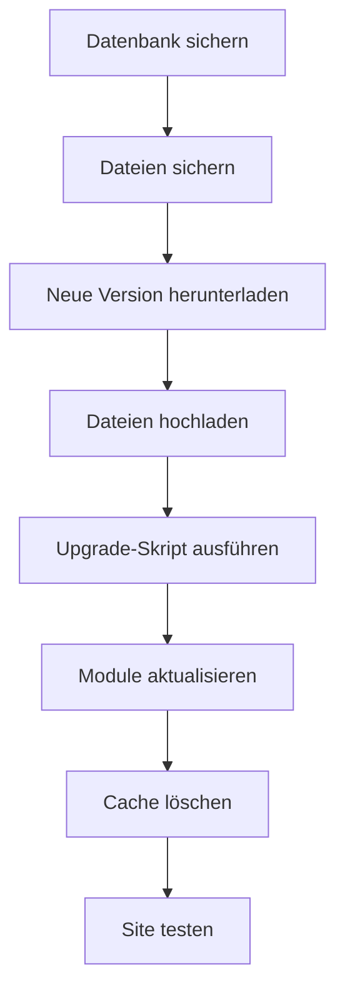

> Allgemeine Fragen und Antworten zur Installation von XOOPS.

---

## Vor der Installation

### F: Was sind die Mindestanforderungen für den Server?

**A:** XOOPS 2.5.x erfordert:
- PHP 7.4 oder höher (PHP 8.x empfohlen)
- MySQL 5.7+ oder MariaDB 10.3+
- Apache mit mod_rewrite oder Nginx
- Mindestens 64 MB PHP-Speicherlimit (128 MB+ empfohlen)



### F: Kann ich XOOPS auf shared Hosting installieren?

**A:** Ja, XOOPS funktioniert gut bei den meisten Shared-Hosting-Anbietern, die die Anforderungen erfüllen. Überprüfen Sie, dass Ihr Host bietet:
- PHP mit erforderlichen Erweiterungen (mysqli, gd, curl, json, mbstring)
- MySQL-Datenbankzugriff
- Datei-Upload-Funktion
- .htaccess-Unterstützung (für Apache)

### F: Welche PHP-Erweiterungen sind erforderlich?

**A:** Erforderliche Erweiterungen:
- `mysqli` - Datenbankverbindung
- `gd` - Bildverarbeitung
- `json` - JSON-Verarbeitung
- `mbstring` - Multibyte-String-Unterstützung

Empfohlen:
- `curl` - Externe API-Aufrufe
- `zip` - Modulinstallation
- `intl` - Internationalisierung

---

## Installationsprozess

### F: Der Installationsassistent zeigt eine leere Seite

**A:** Dies ist normalerweise ein PHP-Fehler. Versuchen Sie:

1. Fehleranzeige vorübergehend aktivieren:
```php
// An den Anfang von htdocs/install/index.php hinzufügen
error_reporting(E_ALL);
ini_set('display_errors', 1);
```

2. PHP-Fehlerprotokoll überprüfen
3. PHP-Versionskompatibilität überprüfen
4. Sicherstellen, dass alle erforderlichen Erweiterungen geladen sind

### F: Ich erhalte "Kann mainfile.php nicht schreiben"

**A:** Legen Sie Schreibberechtigungen vor der Installation fest:

```bash
chmod 666 mainfile.php
# Nach der Installation sichern:
chmod 444 mainfile.php
```

### F: Datenbanktabellen werden nicht erstellt

**A:** Überprüfen Sie:

1. MySQL-Benutzer hat CREATE TABLE-Berechtigungen:
```sql
GRANT ALL PRIVILEGES ON xoopsdb.* TO 'xoopsuser'@'localhost';
FLUSH PRIVILEGES;
```

2. Datenbank existiert:
```sql
CREATE DATABASE xoopsdb CHARACTER SET utf8mb4 COLLATE utf8mb4_unicode_ci;
```

3. Anmeldedaten im Assistenten stimmen mit Datenbankeinstellungen überein

### F: Installation ist abgeschlossen, aber Site zeigt Fehler

**A:** Häufige Lösungen nach der Installation:

1. Installationsverzeichnis entfernen oder umbenennen:
```bash
mv htdocs/install htdocs/install.bak
```

2. Richtige Berechtigungen festlegen:
```bash
chmod -R 755 htdocs/
chmod -R 777 xoops_data/
chmod 444 mainfile.php
```

3. Cache löschen:
```bash
rm -rf xoops_data/caches/smarty_cache/*
rm -rf xoops_data/caches/smarty_compile/*
```

---

## Konfiguration

### F: Wo ist die Konfigurationsdatei?

**A:** Die Hauptkonfiguration befindet sich in `mainfile.php` im XOOPS-Root. Wichtige Einstellungen:

```php
define('XOOPS_ROOT_PATH', '/path/to/htdocs');
define('XOOPS_VAR_PATH', '/path/to/xoops_data');
define('XOOPS_URL', 'https://yoursite.com');
define('XOOPS_DB_HOST', 'localhost');
define('XOOPS_DB_USER', 'username');
define('XOOPS_DB_PASS', 'password');
define('XOOPS_DB_NAME', 'database');
define('XOOPS_DB_PREFIX', 'xoops');
```

### F: Wie ändere ich die Site-URL?

**A:** Bearbeiten Sie `mainfile.php`:

```php
define('XOOPS_URL', 'https://newdomain.com');
```

Löschen Sie dann den Cache und aktualisieren Sie alle fest codierten URLs in der Datenbank.

### F: Wie verschiebe ich XOOPS in ein anderes Verzeichnis?

**A:**

1. Dateien an neuen Ort verschieben
2. Pfade in `mainfile.php` aktualisieren:
```php
define('XOOPS_ROOT_PATH', '/new/path/to/htdocs');
define('XOOPS_VAR_PATH', '/new/path/to/xoops_data');
```
3. Datenbank bei Bedarf aktualisieren
4. Alle Caches löschen

---

## Upgrades

### F: Wie upgrade ich XOOPS?

**A:**



1. **Alles sichern** (Datenbank + Dateien)
2. Neue XOOPS-Version herunterladen
3. Dateien hochladen (nicht `mainfile.php` überschreiben)
4. `htdocs/upgrade/` ausführen, falls vorhanden
5. Module über Admin-Panel aktualisieren
6. Alle Caches löschen
7. Gründlich testen

### F: Kann ich beim Upgrade Versionen überspringen?

**A:** Im Allgemeinen nein. Führen Sie ein schrittweises Upgrade durch Hauptversionen durch, um sicherzustellen, dass Datenbankmigrationen korrekt ausgeführt werden. Lesen Sie die Versionshinweise für spezifische Anleitung.

### F: Meine Module funktionieren nach dem Upgrade nicht mehr

**A:**

1. Modulkompatibilität mit neuer XOOPS-Version überprüfen
2. Module auf neueste Versionen aktualisieren
3. Templates neu generieren: Admin → System → Wartung → Templates
4. Alle Caches löschen
5. PHP-Fehlerprotokolle auf spezifische Fehler überprüfen

---

## Fehlerbehebung

### F: Ich habe das Admin-Passwort vergessen

**A:** Über Datenbank zurücksetzen:

```sql
-- Neuen Passwort-Hash generieren
UPDATE xoops_users
SET pass = MD5('newpassword')
WHERE uname = 'admin';
```

Oder verwenden Sie die Funktion zum Zurücksetzen des Passworts, wenn E-Mail konfiguriert ist.

### F: Site ist nach der Installation sehr langsam

**A:**

1. Caching in Admin → System → Einstellungen aktivieren
2. Datenbank optimieren:
```sql
OPTIMIZE TABLE xoops_session;
OPTIMIZE TABLE xoops_online;
```
3. Nach langsamen Abfragen im Debug-Modus suchen
4. PHP OpCache aktivieren

### F: Bilder/CSS werden nicht geladen

**A:**

1. Dateiberechtigungen überprüfen (644 für Dateien, 755 für Verzeichnisse)
2. Verifizieren, dass `XOOPS_URL` in `mainfile.php` korrekt ist
3. .htaccess auf Rewrite-Konflikte überprüfen
4. Browser-Konsole auf 404-Fehler überprüfen

---

## Verwandte Dokumentation

- Installationsanleitung
- Grundlegende Konfiguration
- Weißer Bildschirm des Todes

---

#xoops #faq #installation #troubleshooting
